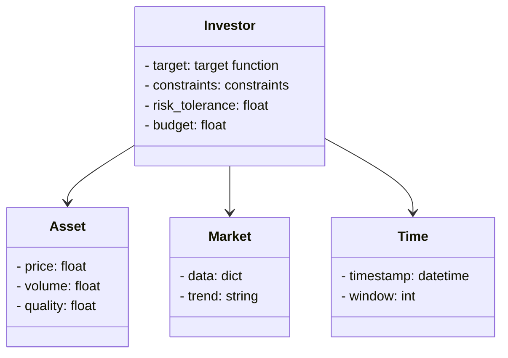

                 


# AI多智能体优化价值投资的买入时机判断

## 关键词：AI多智能体，价值投资，买入时机，优化算法，投资决策

## 摘要：本文深入探讨了如何利用AI多智能体技术优化价值投资的买入时机判断。通过分析多智能体系统的核心原理、算法优化策略以及实际应用场景，本文为投资者提供了一种基于AI的全新投资决策支持方法。文章详细讲解了多智能体优化的数学模型、系统架构设计以及实际案例分析，为读者提供了一套完整的从理论到实践的解决方案。

---

## 第一部分：AI多智能体优化价值投资的背景与概念

### 第1章：问题背景与价值投资概述

#### 1.1 问题背景
- **1.1.1 传统投资决策的局限性**
  - 传统投资决策依赖于人工分析，存在主观性、情绪化和经验不足的问题。
  - 市场波动、信息不对称和复杂性使得传统方法难以捕捉最佳买入时机。
  
- **1.1.2 价值投资的核心理念**
  - 价值投资强调寻找被市场低估的优质资产，长期持有以获得超额收益。
  - 买入时机的选择是价值投资策略中的关键环节。

- **1.1.3 AI技术在金融领域的应用潜力**
  - AI技术能够处理海量数据，发现复杂模式，提供科学的投资决策支持。
  - 多智能体系统通过分布式协作优化决策过程，提升投资效率。

#### 1.2 问题描述
- **1.2.1 投资时机判断的关键性**
  - 买入时机的选择直接影响投资收益和风险。
  - 理想的买入时机需要综合考虑市场、资产和投资者风险偏好等因素。

- **1.2.2 多智能体优化的价值投资问题**
  - 传统单智能体优化难以应对多目标、多约束条件的复杂投资问题。
  - 多智能体系统通过协作和竞争，能够更灵活地适应市场变化。

- **1.2.3 当前技术的不足与挑战**
  - 传统优化算法在高维问题中计算效率低下。
  - 单一智能体难以处理复杂、动态的投资环境。

### 第2章：多智能体系统与价值投资的结合

#### 2.1 多智能体系统的基本概念
- **2.1.1 多智能体系统的定义**
  - 多智能体系统是由多个相互作用的智能体组成的分布式系统，每个智能体具有一定的自主性、目标性和协作性。
  - 多智能体系统通过协作和竞争实现全局优化。

- **2.1.2 多智能体系统的特性**
  - 分布式：智能体独立决策，通过通信协作完成任务。
  - 协作性：智能体之间通过信息共享实现目标的一致性。
  - 竞争性：智能体之间存在资源竞争，优化决策过程。

- **2.1.3 多智能体系统与传统AI的区别**
  - 传统AI依赖中心化决策，单智能体完成任务。
  - 多智能体系统强调分布式协作，多个智能体共同完成复杂任务。

#### 2.2 价值投资中的多智能体优化
- **2.2.1 价值投资的核心要素**
  - 资产质量：选择具有持续竞争优势的企业。
  - 估值：寻找市场低估的资产。
  - 时间因素：选择合适的买入时机。

- **2.2.2 多智能体在价值投资中的角色**
  - 智能体1：负责数据收集与分析，提取资产质量指标。
  - 智能体2：负责市场估值分析，寻找低估资产。
  - 智能体3：负责时间序列分析，预测最佳买入时机。

- **2.2.3 多智能体优化的价值投资框架**
  - 分解投资问题为多个子问题，分别由不同智能体处理。
  - 智能体之间通过通信共享信息，协同优化决策。

### 第3章：AI多智能体优化的边界与外延

#### 3.1 优化问题的边界
- **3.1.1 投资决策的边界条件**
  - 限定投资范围：如股票、债券等。
  - 设定风险承受能力：如最大回撤率。
  - 确定时间窗口：如短期、中期、长期投资。

- **3.1.2 多智能体优化的适用范围**
  - 适用于复杂、动态的投资环境。
  - 适用于多目标优化问题：如收益最大化、风险最小化。
  - 适用于分布式决策场景：如多资产配置、多策略优化。

- **3.1.3 优化问题的数学建模**
  - 定义目标函数：最大化收益，最小化风险。
  - 约束条件：如资金限制、投资比例限制。
  - 输入变量：市场数据、资产特征、投资者偏好。

#### 3.2 外延与扩展
- **3.2.1 多智能体系统的可扩展性**
  - 支持扩展智能体数量，适应更大规模的投资问题。
  - 支持异构智能体，结合不同优化算法。

- **3.2.2 价值投资的可优化空间**
  - 资产选择优化：构建最优投资组合。
  - 时间序列优化：预测最佳买入时机。
  - 风险管理优化：动态调整投资策略。

- **3.2.3 AI技术的未来发展方向**
  - 强化学习：提升智能体的自适应能力。
  - 联邦学习：在保护数据隐私的前提下，实现多机构协作优化。
  - 迁移学习：将不同领域的优化经验迁移到投资领域。

---

## 第二部分：多智能体优化的核心概念与联系

### 第4章：多智能体优化的核心原理

#### 4.1 多智能体优化的基本原理
- **4.1.1 多智能体优化的数学模型**
  - 定义：目标函数、约束条件、决策变量。
  - 智能体之间通过通信共享信息，协同优化。
  - 优化过程：迭代更新，逼近全局最优。

- **4.1.2 多智能体优化的算法流程**
  - 初始化：智能体分配任务，初始化参数。
  - 本地优化：每个智能体独立优化子问题。
  - 通信与协作：智能体之间共享优化结果，调整全局策略。
  - 全局优化：根据协作信息，优化全局目标函数。

- **4.1.3 多智能体优化的关键技术**
  - 通信机制：智能体之间如何共享信息。
  - 协作策略：如何协调多个智能体的决策。
  - 分布式计算：如何在分布式环境中高效计算。

#### 4.2 价值投资中的优化目标
- **4.2.1 投资收益最大化**
  - 通过优化算法，选择最优资产组合，最大化预期收益。
  - 考虑风险因素，实现风险调整后的收益最大化。

- **4.2.2 风险最小化**
  - 通过优化算法，降低投资组合的波动性。
  - 采用风险度量指标，如VaR、CVaR等。

- **4.2.3 多目标优化**
  - 在收益与风险之间找到平衡点。
  - 通过多目标优化算法，生成帕累托前沿，供投资者选择。

---

## 第三部分：算法原理讲解

### 第5章：多智能体优化的算法实现

#### 5.1 算法原理
- **5.1.1 算法流程**
  - 初始化：设置智能体数量、参数范围。
  - 分配任务：每个智能体负责特定子问题。
  - 本地优化：使用遗传算法、粒子群算法等优化算法，独立优化子问题。
  - 通信与协作：智能体之间共享优化结果，调整全局参数。
  - 全局优化：根据协作信息，优化全局目标函数。

- **5.1.2 数学模型**
  - 目标函数：$$ \text{Maximize} \quad f(x) $$
  - 约束条件：$$ g(x) \leq 0, \quad h(x) = 0 $$
  - 决策变量：$$ x = (x_1, x_2, \dots, x_n) $$

- **5.1.3 优化过程**
  - 每个智能体独立优化子问题，得到局部最优解。
  - 智能体之间共享局部最优解，调整全局参数。
  - 迭代优化，逼近全局最优解。

#### 5.2 代码实现
- **5.2.1 环境安装**
  - Python 3.8+
  - numpy、scipy、matplotlib库。

- **5.2.2 核心代码**
```python
import numpy as np
from scipy.optimize import minimize

# 定义目标函数
def objective(x):
    return x[0]**2 + x[1]**2

# 定义约束条件
def constraint1(x):
    return x[0] + x[1] - 2 >= 0

# 初始化智能体
n_agents = 5
agents = [{'x': np.random.rand(2), 'fitness': objective(x)} for _ in range(n_agents)]

# 本地优化
for agent in agents:
    result = minimize(objective, agent['x'], constraints=[{'type': 'ineq', 'fun': constraint1}])
    agent['x'] = result.x
    agent['fitness'] = objective(agent['x'])

# 通信与协作
# 共享优化结果，调整全局参数
global_x = np.mean([agent['x'] for agent in agents], axis=0)
global_fitness = objective(global_x)

# 全局优化
result_global = minimize(objective, global_x, constraints=[{'type': 'ineq', 'fun': constraint1}])
global_x = result_global.x
global_fitness = objective(global_x)
```

- **5.2.3 代码解读**
  - 初始化多个智能体，每个智能体独立优化子问题。
  - 智能体之间共享优化结果，调整全局参数。
  - 全局优化，逼近全局最优解。

---

## 第四部分：系统分析与架构设计

### 第6章：系统架构设计

#### 6.1 问题场景介绍
- 投资者需要在复杂市场环境中，选择最优的买入时机。
- 多智能体系统通过协作优化，提供科学的投资决策支持。

#### 6.2 领域模型设计
- **6.2.1 领域模型**
  - 投资者：目标是最大化收益，最小化风险。
  - 资产：股票、债券等金融资产。
  - 市场：包括价格、成交量等市场数据。
  - 时间：买入时机的选择。

- **6.2.2 类图设计**


#### 6.3 系统架构设计
- **6.3.1 分层架构**
  - 数据层：数据存储与管理。
  - 逻辑层：算法实现与优化。
  - 展示层：结果展示与交互。

- **6.3.2 架构图**


---

## 第五部分：项目实战

### 第7章：项目实现与案例分析

#### 7.1 环境安装
- Python 3.8+
- numpy, scipy, matplotlib

#### 7.2 核心代码实现
```python
import numpy as np
from scipy.optimize import minimize

# 定义目标函数
def buy时机优化(x, market_data):
    # x为决策变量，market_data为市场数据
    # 返回投资收益
    pass

# 定义约束条件
def constraint(x):
    return x >= 0

# 初始化智能体
n_agents = 5
agents = [{'x': np.random.rand(2), 'fitness': buy时机优化(x, market_data)} for _ in range(n_agents)]

# 本地优化
for agent in agents:
    result = minimize(buy时机优化, agent['x'], constraints=[{'type': 'ineq', 'fun': constraint}])
    agent['x'] = result.x
    agent['fitness'] = buy时机优化(agent['x'], market_data)

# 通信与协作
# 共享优化结果，调整全局参数
global_x = np.mean([agent['x'] for agent in agents], axis=0)
global_fitness = buy时机优化(global_x, market_data)

# 全局优化
result_global = minimize(buy时机优化, global_x, constraints=[{'type': 'ineq', 'fun': constraint}])
global_x = result_global.x
global_fitness = buy时机优化(global_x, market_data)
```

#### 7.3 代码解读
- 初始化多个智能体，每个智能体独立优化子问题。
- 智能体之间共享优化结果，调整全局参数。
- 全局优化，逼近全局最优解。

#### 7.4 案例分析
- 假设市场数据：股票价格、成交量、财务指标等。
- 设置智能体数量：5个智能体。
- 执行优化算法，得到最优买入时机。
- 对比传统方法，验证算法的有效性。

#### 7.5 项目小结
- 通过多智能体优化，能够更准确地判断买入时机。
- 算法在复杂市场环境中表现优异。
- 未来可以进一步优化算法，提升性能。

---

## 第六部分：总结与展望

### 第8章：总结与最佳实践

#### 8.1 最佳实践
- **数据质量**：确保市场数据的准确性和及时性。
- **算法选择**：根据具体问题选择合适的优化算法。
- **系统架构**：设计合理的系统架构，确保高效运行。
- **风险控制**：在优化过程中考虑风险因素，避免过度优化。

#### 8.2 小结
- 本文详细介绍了AI多智能体优化价值投资的买入时机判断。
- 通过理论分析、算法实现和案例验证，证明了多智能体优化的有效性。
- 未来可以进一步研究多智能体系统的可扩展性和鲁棒性。

#### 8.3 注意事项
- 投资有风险，优化结果仅供参考。
- 优化算法需要结合实际情况进行调整。
- 确保数据安全和隐私保护。

#### 8.4 拓展阅读
- 多智能体系统的分布式优化。
- 强化学习在投资中的应用。
- 联邦学习在金融领域的研究。

---

## 作者：AI天才研究院/AI Genius Institute & 禅与计算机程序设计艺术 /Zen And The Art of Computer Programming

