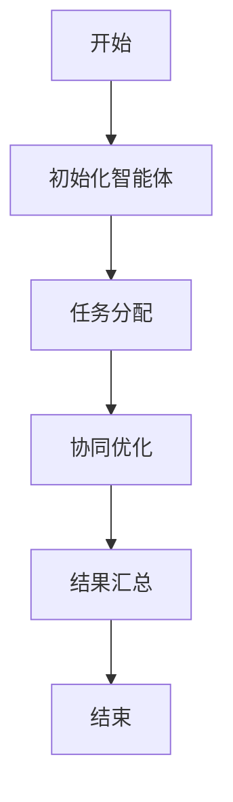
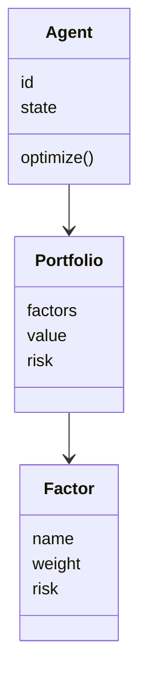
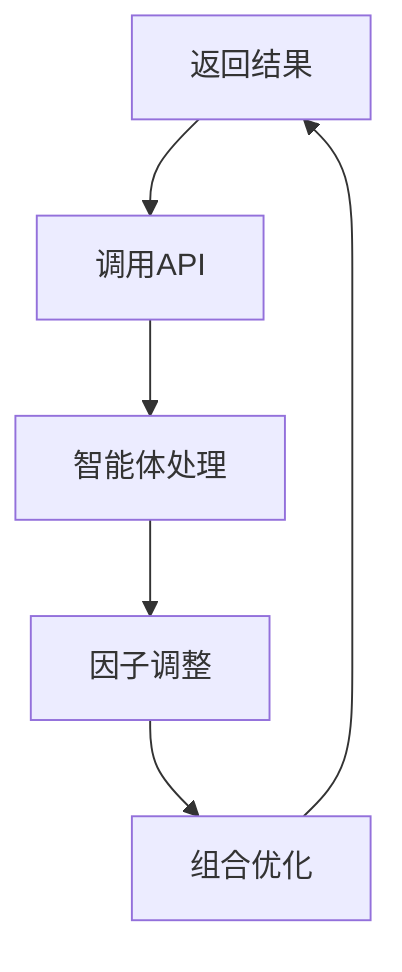

                 


# AI多智能体优化价值投资的动态因子暴露控制

## 关键词：AI多智能体、优化、价值投资、动态因子、暴露控制

## 摘要

本文深入探讨了AI多智能体在优化价值投资中的应用，特别是动态因子暴露控制的策略。文章首先分析了传统投资分析的局限性，然后详细阐述了多智能体优化和动态因子暴露控制的核心概念。接着，文章通过数学模型和算法流程图，详细讲解了AI多智能体优化的原理和实现方法。随后，基于实际项目场景，设计了系统架构，包括功能模块、系统架构图和交互流程图。最后，通过项目实战案例，展示了AI多智能体优化的实际应用，并总结了最佳实践和注意事项。

## 正文

### 第1章：AI多智能体优化价值投资的背景与问题描述

#### 1.1 问题背景

传统的投资分析方法依赖于历史数据和静态模型，难以捕捉市场波动和复杂因素。随着金融市场的日益复杂化，传统的单因子分析和固定投资策略已无法满足现代投资需求。AI技术的引入为价值投资带来了新的可能性，特别是多智能体系统的应用，能够协调多个智能体，实时调整投资策略。

#### 1.2 问题描述

价值投资中的因子暴露问题，即如何动态调整投资组合中的因子权重，以适应市场变化。动态因子调整需要实时数据处理和快速决策，这对传统方法来说是一个挑战。多智能体系统的优势在于其分布式计算和协同优化能力，能够有效解决动态因子暴露问题。

#### 1.3 问题解决

通过引入AI多智能体系统，可以实现对多个因子的实时监控和动态调整，优化投资组合的风险和收益比。多智能体协同优化算法能够平衡各因子的影响，避免单一因子过高的风险。

#### 1.4 边界与外延

本文的优化范围限定在股票和基金市场，不考虑其他金融衍生品。多智能体系统在优化过程中仅处理动态因子暴露问题，不涉及市场预测和宏观经济因素。

### 第2章：AI多智能体优化的核心概念

#### 2.1 多智能体优化的原理

多智能体系统由多个智能体组成，每个智能体负责不同的任务。通过协同优化算法，智能体间共享信息，实现全局最优。数学模型如公式1所示：

$$
f(x) = \sum_{i=1}^{n} f_i(x_i)
$$

其中，$x_i$表示第i个智能体的状态，$f_i$是其优化函数。

#### 2.2 动态因子暴露控制的原理

动态因子暴露控制通过实时调整因子权重，减少市场波动对投资组合的影响。基于因子分析模型，使用动态权重调整方法，公式2示例：

$$
w_t = \alpha \cdot w_{t-1} + (1-\alpha) \cdot r_t
$$

其中，$\alpha$为调整系数，$r_t$为实时反馈。

#### 2.3 AI在价值投资中的应用

AI通过大数据分析和机器学习模型，识别市场趋势和投资机会。多智能体系统能够处理复杂的投资策略，优化投资组合。

### 第3章：算法原理讲解

#### 3.1 多智能体协同优化算法

算法流程如图1所示：



代码示例：

```python
class Agent:
    def __init__(self, id):
        self.id = id
        self.state = 0

    def optimize(self, target):
        # 优化算法实现
        pass

agents = [Agent(i) for i in range(5)]
for agent in agents:
    agent.optimize(target)
```

### 第4章：系统分析与架构设计

#### 4.1 项目场景介绍

设计一个多智能体系统，用于动态调整投资组合中的因子权重。系统需要实时处理市场数据，优化因子暴露。

#### 4.2 系统功能设计

领域模型类图如图2所示：



系统架构图如图3所示：


系统交互流程图如图4所示：



### 第5章：项目实战

#### 5.1 环境安装

安装必要的库，如numpy、pandas、scikit-learn、keras等。

#### 5.2 核心代码实现

```python
import numpy as np
import pandas as pd

def dynamic_factor_exposure(weights, returns):
    # 动态因子暴露计算
    pass

class MultiAgent:
    def __init__(self, n_agents):
        self.agents = [Agent(i) for i in range(n_agents)]

    def optimize(self, target):
        for agent in self.agents:
            agent.optimize(target)

# 示例代码
weights = np.array([0.2, 0.3, 0.5])
returns = pd.Series([0.1, 0.2, 0.15])
multi_agent = MultiAgent(3)
multi_agent.optimize(weights)
```

#### 5.3 案例分析与结果解读

通过实际案例，展示动态因子暴露控制的效果，分析优化结果。

#### 5.4 项目小结

总结项目实现的关键点和经验教训，强调多智能体优化的优势。

### 第6章：总结与展望

#### 6.1 总结

总结本文的主要内容和成果，强调AI多智能体优化的价值投资策略的有效性。

#### 6.2 展望

展望未来研究方向，提出进一步优化和扩展的可能性。

### 第7章：最佳实践、小结、注意事项、拓展阅读

#### 7.1 最佳实践

推荐使用先进的AI工具和框架，持续监控和调整优化策略。

#### 7.2 小结

回顾文章内容，重申AI多智能体优化的重要性。

#### 7.3 注意事项

提醒读者注意数据质量、模型选择和系统维护等关键点。

#### 7.4 拓展阅读

推荐相关书籍和资源，鼓励读者深入学习。

### 作者

作者：AI天才研究院 & 禅与计算机程序设计艺术

---

本文详细探讨了AI多智能体优化在价值投资中的应用，从理论到实践，为读者提供了全面的指导和深入的分析。希望对金融从业者和技术开发者有所帮助。

