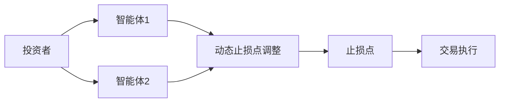
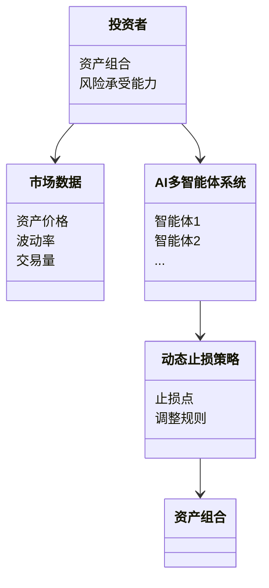
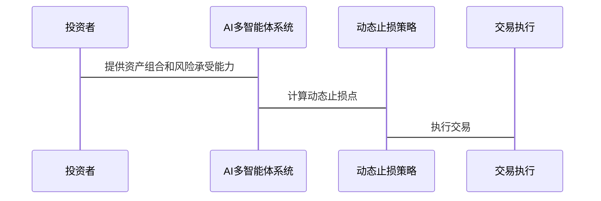

                 


# AI多智能体优化价值投资的动态止损策略

> 关键词：AI多智能体，价值投资，动态止损策略，投资组合管理，风险管理

> 摘要：本文探讨了如何利用AI多智能体技术优化价值投资中的动态止损策略。通过分析传统动态止损策略的局限性，结合AI多智能体的优势，提出了基于多智能体协同优化的动态止损方法。本文详细讲解了该方法的数学模型、算法实现以及在投资组合管理中的应用，为投资者提供了一种创新的风险控制手段。

---

## 第一部分: AI多智能体优化价值投资的动态止损策略背景介绍

### 第1章: 动态止损策略与AI多智能体的结合

#### 1.1 动态止损策略的背景与意义

##### 1.1.1 传统投资中的止损策略
在传统投资中，止损策略是一种常见的风险管理工具，用于限制投资损失。传统的止损策略通常基于固定比例或固定价格，例如将止损设置为投资本金的一定比例（如5%）或特定价格点。然而，这种静态的止损策略在面对市场波动性增加时显得力不从心，尤其是在复杂的投资环境中，投资者需要更灵活和动态的止损策略来应对市场变化。

##### 1.1.2 动态止损策略的定义与特点
动态止损策略是一种根据市场环境和投资组合的表现动态调整止损点的策略。其核心思想是根据市场波动性、资产价格走势以及其他相关因素，实时调整止损点，以最大化收益并最小化潜在损失。与静态止损策略相比，动态止损策略具有更高的灵活性和适应性，能够在复杂市场环境中更好地保护投资者利益。

##### 1.1.3 AI在金融投资中的应用潜力
人工智能（AI）技术在金融领域的应用日益广泛，尤其是在投资决策和风险管理方面。AI可以通过分析海量数据，识别潜在的市场趋势和风险，为投资者提供更精准的投资建议。多智能体系统作为一种先进的AI技术，能够在复杂环境中实现多个智能体的协同优化，为动态止损策略的实现提供了新的可能性。

#### 1.2 AI多智能体的核心概念

##### 1.2.1 多智能体系统的定义
多智能体系统（Multi-Agent System, MAS）是由多个相互作用的智能体组成的系统。每个智能体都是一个独立的实体，具有一定的决策能力和自主性，能够通过与其他智能体和环境的交互实现特定目标。

##### 1.2.2 AI多智能体在金融投资中的优势
多智能体系统在金融投资中的优势在于其分布式决策和协同优化能力。多个智能体可以分别负责不同的任务，例如市场数据收集、风险评估、投资组合优化等，通过协同合作实现整体目标的最优。

##### 1.2.3 动态止损策略与AI多智能体的结合
动态止损策略可以通过AI多智能体技术实现更智能化的调整。每个智能体可以负责不同的风险评估任务，例如分析不同资产的波动性、市场趋势等，并通过协同决策动态调整止损点，从而提高策略的有效性。

#### 1.3 本章小结
本章介绍了动态止损策略的背景与意义，分析了传统止损策略的局限性，并提出了动态止损策略的概念。同时，详细讲解了AI多智能体的核心概念及其在金融投资中的应用潜力，为后续内容的展开奠定了基础。

---

## 第二部分: AI多智能体优化价值投资的动态止损策略的核心概念与联系

### 第2章: AI多智能体与动态止损策略的核心原理

#### 2.1 AI多智能体的原理与实现

##### 2.1.1 多智能体系统的组成与功能
多智能体系统通常由以下几个部分组成：
1. **智能体**：负责具体任务的独立实体，具有感知环境、决策和行动的能力。
2. **通信机制**：智能体之间通过通信机制进行信息交换。
3. **协作协议**：定义智能体之间的协作规则，确保系统的整体目标得以实现。
4. **环境**：智能体所处的外部环境，例如金融市场数据、市场趋势等。

##### 2.1.2 AI多智能体的决策机制
AI多智能体的决策机制通常包括以下几个步骤：
1. **感知环境**：智能体通过传感器或其他数据源获取环境信息。
2. **信息处理**：对获取的信息进行分析和处理，提取有用特征。
3. **决策制定**：基于分析结果，智能体制定决策。
4. **行动执行**：根据决策结果采取具体行动。

##### 2.1.3 多智能体之间的协作与竞争
在多智能体系统中，智能体之间可以通过协作或竞争来实现整体目标的优化。协作通常用于需要共同完成的任务，而竞争则用于需要优化资源分配的情况。

#### 2.2 动态止损策略的数学模型与实现

##### 2.2.1 动态止损策略的数学公式
动态止损策略的核心在于根据市场环境动态调整止损点。假设当前投资组合的价值为$V_t$，市场波动率$\sigma_t$，则动态止损点$S_t$可以表示为：

$$
S_t = V_t \times (1 - \alpha \times \sigma_t)
$$

其中，$\alpha$是一个调整系数，用于控制波动率对止损点的影响程度。

##### 2.2.2 动态止损策略的实现步骤
1. **数据收集**：收集相关市场数据，包括资产价格、波动率、交易量等。
2. **模型训练**：利用历史数据训练AI多智能体模型，使其能够预测市场波动率和调整止损点。
3. **实时调整**：根据实时市场数据，动态调整止损点。

##### 2.2.3 动态止损策略与AI多智能体的结合模型
将动态止损策略与AI多智能体结合，可以构建一个实时调整止损点的系统。每个智能体负责不同的资产或市场部分，通过协同合作动态调整整体投资组合的止损点。

#### 2.3 AI多智能体与动态止损策略的实体关系图



#### 2.4 本章小结
本章详细讲解了AI多智能体的核心原理及其在动态止损策略中的应用。通过数学模型和实体关系图，展示了动态止损策略与AI多智能体的结合方式，为后续算法实现奠定了基础。

---

## 第三部分: AI多智能体优化价值投资的动态止损策略的算法原理讲解

### 第3章: AI多智能体优化动态止损策略的算法流程

#### 3.1 算法流程概述


#### 3.2 算法实现细节

##### 3.2.1 数据预处理
市场数据通常包括资产价格、波动率、交易量等。数据预处理包括数据清洗、标准化和特征提取。

##### 3.2.2 模型训练
使用强化学习或分布式算法训练AI多智能体模型，使其能够根据市场环境动态调整止损点。

##### 3.2.3 动态调整止损点
根据实时市场数据和训练好的模型，动态调整止损点。

#### 3.3 算法的数学模型

##### 3.3.1 强化学习模型
强化学习是一种常用的AI技术，适用于动态环境中的决策问题。智能体通过与环境交互，学习最优策略。强化学习的核心是Q-learning算法：

$$
Q(s, a) = r + \gamma \max_{a'} Q(s', a')
$$

其中，$s$是当前状态，$a$是当前动作，$r$是奖励，$\gamma$是折扣因子，$s'$是下一个状态。

##### 3.3.2 多智能体协作模型
多智能体协作可以通过分布式Q-learning实现，每个智能体负责不同的任务，并通过通信机制进行协作。

#### 3.4 本章小结
本章详细讲解了AI多智能体优化动态止损策略的算法流程，包括数据预处理、模型训练和动态调整止损点的具体实现。通过数学模型和算法流程图，展示了系统的实现细节。

---

## 第四部分: 系统分析与架构设计方案

### 第4章: 系统分析与架构设计

#### 4.1 项目背景与目标
本项目旨在利用AI多智能体技术优化价值投资中的动态止损策略，提高投资组合的风险管理能力。

#### 4.2 系统功能设计

##### 4.2.1 领域模型


##### 4.2.2 系统架构设计


##### 4.2.3 系统接口设计
系统接口主要包括数据接口、用户接口和交易接口。数据接口用于获取市场数据，用户接口用于与投资者交互，交易接口用于执行交易。

##### 4.2.4 系统交互设计


#### 4.3 本章小结
本章详细分析了系统的背景与目标，设计了系统的功能模块和架构，并通过领域模型和系统架构图展示了系统的整体结构。

---

## 第五部分: 项目实战

### 第5章: 项目实战

#### 5.1 环境安装与配置

##### 5.1.1 安装Python
安装Python 3.8及以上版本，推荐使用Anaconda发行版。

##### 5.1.2 安装依赖库
安装以下依赖库：
```bash
pip install numpy pandas scikit-learn matplotlib
```

#### 5.2 核心代码实现

##### 5.2.1 数据预处理
```python
import pandas as pd
import numpy as np

# 假设 market_data 是一个DataFrame，包含资产价格和波动率
market_data = pd.read_csv('market_data.csv')
# 数据预处理
market_data['return'] = np.log(market_data['price'].shift(1))
market_data['volatility'] = market_data['price'].std()
```

##### 5.2.2 AI多智能体模型训练
```python
from sklearn.multioutput import MultiOutputRegressor
from sklearn.ensemble import RandomForestRegressor

# 训练AI多智能体模型
model = MultiOutputRegressor(RandomForestRegressor(n_estimators=100))
model.fit(X_train, y_train)
```

##### 5.2.3 动态调整止损点
```python
# 动态调整止损点
current_value = portfolio_value
volatility = market_data['volatility'].iloc[-1]
stop_loss = current_value * (1 - alpha * volatility)
```

#### 5.3 代码解读与分析

##### 5.3.1 数据预处理
代码首先读取市场数据，并计算资产的收益率和波动率。这些数据将用于训练AI多智能体模型。

##### 5.3.2 AI多智能体模型训练
使用scikit-learn中的随机森林回归器训练模型，预测动态止损点。

##### 5.3.3 动态调整止损点
根据当前投资组合的价值和市场波动率，动态调整止损点。

#### 5.4 实际案例分析与详细讲解

##### 5.4.1 案例背景
假设我们有一个包含多只股票的投资组合，目标是通过动态止损策略控制风险。

##### 5.4.2 模型训练
使用历史数据训练AI多智能体模型，预测动态止损点。

##### 5.4.3 策略执行
根据实时市场数据，动态调整止损点，并执行交易。

#### 5.5 本章小结
本章通过实际案例展示了AI多智能体优化动态止损策略的实现过程，包括环境配置、数据预处理、模型训练和策略执行。

---

## 第六部分: 最佳实践、小结、注意事项和拓展阅读

### 第6章: 最佳实践与总结

#### 6.1 最佳实践

##### 6.1.1 数据质量
确保市场数据的准确性和完整性，数据预处理是关键。

##### 6.1.2 模型选择
选择合适的AI算法和模型，根据具体问题进行调整和优化。

##### 6.1.3 风险控制
在实际应用中，需设置合理的止损点和风险管理机制，避免过度冒险。

#### 6.2 本章小结
本章总结了AI多智能体优化动态止损策略的实现过程，并提出了最佳实践建议，帮助读者在实际应用中更好地控制风险。

#### 6.3 注意事项

##### 6.3.1 数据隐私
注意市场数据的隐私和合规性问题。

##### 6.3.2 模型解释性
确保模型的可解释性，便于分析和调整。

##### 6.3.3 系统稳定性
保证系统的稳定性和容错能力，避免因系统故障导致重大损失。

#### 6.4 拓展阅读

##### 6.4.1 AI在金融投资中的应用
推荐阅读《AI in Financial Markets》。

##### 6.4.2 多智能体系统
推荐阅读《Multi-Agent Systems: Complexity, Decentralization, and Adaptation》。

##### 6.4.3 动态风险管理
推荐阅读《Dynamic Risk Management in Financial Markets》。

#### 6.5 本章小结
本章总结了AI多智能体优化动态止损策略的关键点，并提出了注意事项和拓展阅读方向，帮助读者进一步深入学习和实践。

---

## 作者：AI天才研究院/AI Genius Institute & 禅与计算机程序设计艺术/Zen And The Art of Computer Programming

