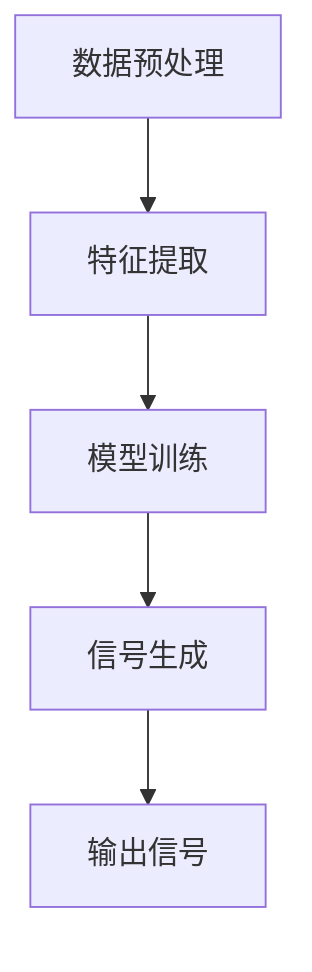
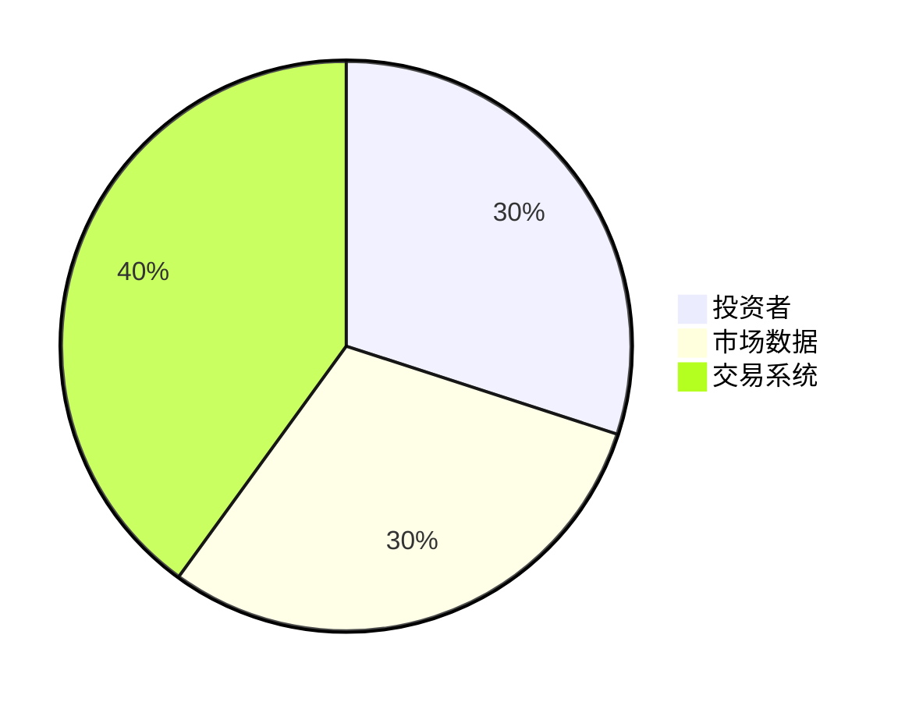
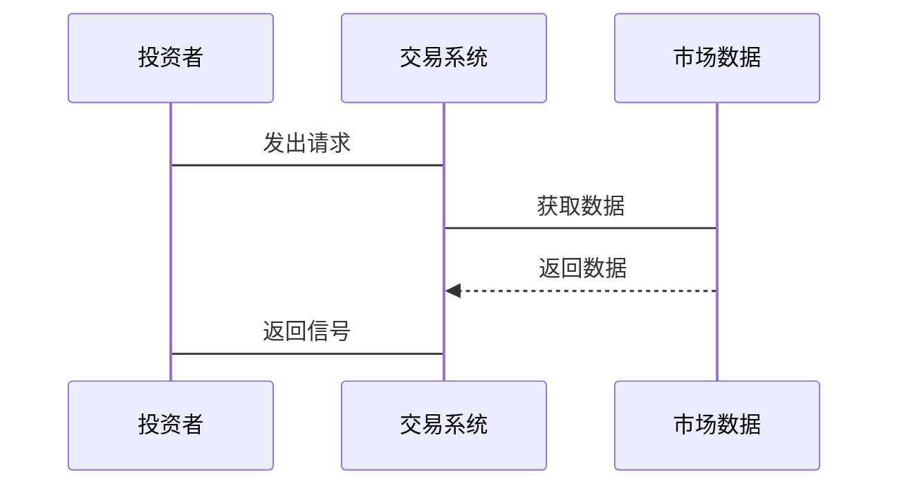

                 


# AI多智能体优化价值投资的动态行业轮动信号生成

> 关键词：AI多智能体，价值投资，动态行业轮动，信号生成，优化算法

> 摘要：本文探讨了如何利用AI多智能体技术优化价值投资，并生成动态的行业轮动信号。通过分析多智能体系统在金融投资中的应用，详细讲解了动态行业轮动的实现原理、算法优化策略、系统架构设计以及实际案例分析。文章旨在为投资者和技术开发者提供理论与实践相结合的指导，帮助他们在复杂的金融市场中做出更明智的投资决策。

---

## 第1章: AI多智能体与价值投资概述

### 1.1 问题背景与描述

#### 1.1.1 传统投资分析的局限性
传统的价值投资依赖于人工分析和经验判断，存在主观性强、效率低、覆盖面窄等问题。金融市场数据的复杂性和实时性使得传统方法难以捕捉快速变化的市场趋势。

#### 1.1.2 多智能体系统的优势
多智能体系统（MAS）通过多个协作或竞争的智能体共同完成任务，能够有效处理金融市场中的不确定性、动态性和复杂性。AI多智能体可以实时分析大量数据，发现潜在的投资机会。

#### 1.1.3 动态行业轮动的必要性
行业轮动是指根据市场变化调整投资组合中的行业权重。动态行业轮动能够捕捉市场趋势，优化投资收益，降低风险。

### 1.2 核心概念与问题解决

#### 1.2.1 多智能体系统的定义
多智能体系统是由多个智能体组成的分布式系统，每个智能体具有一定的自主性、反应性和协作能力，能够通过信息交换完成复杂任务。

#### 1.2.2 动态行业轮动的机制
动态行业轮动是根据市场环境的变化，动态调整投资组合中的行业配置。AI多智能体通过实时数据分析和预测，生成轮动信号。

#### 1.2.3 优化价值投资的目标
通过多智能体协作，优化投资组合的收益与风险比，实现长期稳定的超额收益。

### 1.3 概念结构与核心要素

#### 1.3.1 多智能体系统的组成
- **智能体**：负责数据采集、分析和决策。
- **协作机制**：智能体之间的通信与协作。
- **环境**：金融市场数据和市场状态。

#### 1.3.2 行业轮动信号的特征
- **实时性**：及时反映市场变化。
- **准确性**：基于可靠的数据和算法。
- **适应性**：根据不同市场环境自动调整。

#### 1.3.3 价值投资的数学模型
价值投资模型基于资产的内在价值，通过多因素分析评估其合理价格。数学模型包括资产定价模型和风险评估模型。

---

## 第2章: AI多智能体优化价值投资的核心概念

### 2.1 多智能体优化的原理

#### 2.1.1 分布式决策机制
每个智能体根据自身信息做出决策，并通过通信协议与其它智能体协作。

#### 2.1.2 协作与竞争关系
智能体之间既协作又竞争，共同优化投资组合。协作用于共享信息，竞争用于提高决策质量。

#### 2.1.3 自适应学习能力
多智能体系统通过机器学习算法，不断优化决策模型，适应市场变化。

### 2.2 动态行业轮动的实现

#### 2.2.1 数据流分析
从市场数据中提取关键指标，如收益、波动率、市盈率等，用于生成轮动信号。

#### 2.2.2 信号生成模型
基于统计分析和机器学习模型，预测行业表现，生成轮动信号。

#### 2.2.3 风险控制策略
通过风险评估模型，优化投资组合，控制市场风险和模型风险。

### 2.3 核心概念的ER实体关系图

```mermaid
er
  actor 投资者
  actor 市场数据
  actor 交易系统
  entity 资产
  entity 信号
  entity 投资组合
  entity 风险
  entity 收益
  entity 时间序列
  relation 实现
  relation 生成
  relation 监控
  re
```

---

## 第3章: 动态行业轮动信号生成的算法原理

### 3.1 算法原理概述

#### 3.1.1 数据预处理
清洗和标准化市场数据，提取特征。

#### 3.1.2 模型训练
使用机器学习算法训练预测模型，生成行业轮动信号。

#### 3.1.3 信号生成
根据模型预测结果，生成动态轮动信号。

### 3.2 算法实现步骤



### 3.3 数学模型与公式

#### 3.3.1 资产收益预测模型
$$ R_i = \beta_i R_m + \alpha_i + \epsilon_i $$

#### 3.3.2 风险评估模型
$$ \sigma_i^2 = \lambda \sigma_m^2 + (1-\lambda) \sigma_s^2 $$

#### 3.3.3 多智能体协作优化
$$ V = \sum_{i=1}^n \max(\pi_i) $$

---

## 第4章: 系统分析与架构设计

### 4.1 系统架构图



### 4.2 系统功能设计

#### 4.2.1 领域模型

```mermaid
classDiagram
    class 投资者 {
        +资金: float
        +投资组合: list
        +风险偏好: int
    }
    class 市场数据 {
        +价格: dict
        +指标: dict
        +事件: list
    }
    class 交易系统 {
        +订单: list
        +状态: string
    }
   抽屉关系：投资者 --> 交易系统
   抽屉关系：市场数据 --> 交易系统
```

### 4.3 接口设计与交互流程



---

## 第5章: 项目实战

### 5.1 环境安装

```bash
pip install numpy pandas scikit-learn
```

### 5.2 核心实现

```python
def generate_signal(data):
    # 数据预处理
    processed_data = preprocess(data)
    # 模型训练
    model = train_model(processed_data)
    # 生成信号
    signal = predict(model)
    return signal
```

### 5.3 案例分析

#### 5.3.1 数据分析
分析历史数据，验证模型的有效性。

#### 5.3.2 代码解读
解读关键代码，解释其功能和作用。

#### 5.3.3 实际应用
展示实际应用中的效果，对比传统方法和AI方法的差异。

---

## 第6章: 最佳实践与扩展

### 6.1 最佳实践

- **数据质量**：确保数据准确性和完整性。
- **模型优化**：定期更新模型，适应市场变化。
- **风险管理**：严格控制投资风险，避免重大损失。

### 6.2 小结

本文详细介绍了AI多智能体在价值投资中的应用，从理论到实践，为投资者提供了全面的指导。

### 6.3 注意事项

- **市场波动**：注意市场波动对模型的影响。
- **数据隐私**：确保数据安全和隐私保护。
- **算法选择**：根据具体情况选择合适的算法。

### 6.4 拓展阅读

- 《机器学习在金融中的应用》
- 《多智能体系统与分布式计算》
- 《动态资产配置策略》

---

## 作者

作者：AI天才研究院/AI Genius Institute & 禅与计算机程序设计艺术/Zen And The Art of Computer Programming

---

这篇文章系统地介绍了AI多智能体在优化价值投资中的应用，从理论基础到实际案例，为读者提供了深入的指导。

