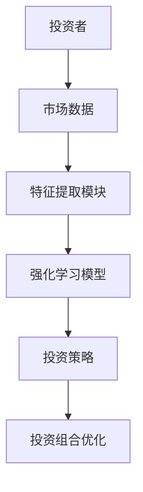
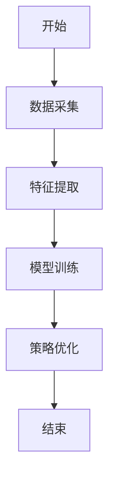
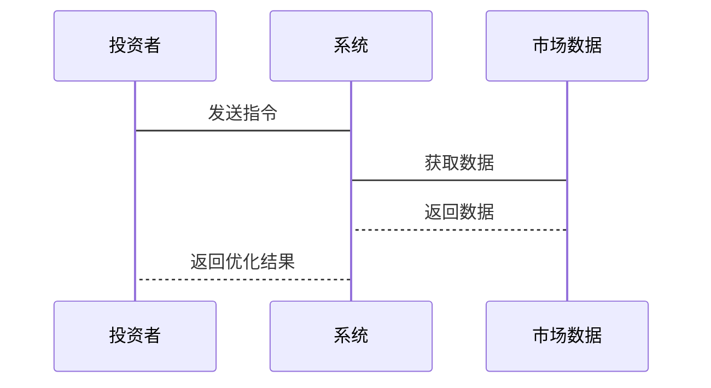

                 

# AI多智能体优化价值投资的动态行业轮动策略

**关键词**：AI多智能体、价值投资、动态行业轮动、强化学习、金融投资

**摘要**：  
本文深入探讨了AI多智能体在优化价值投资中的动态行业轮动策略。通过结合多智能体系统与强化学习，提出了一种基于动态博弈论的行业轮动模型，旨在实现更高效的投资决策。文章从理论基础、算法设计、系统实现到实际案例进行了全面分析，展示了如何利用AI技术提升投资策略的智能化水平。

---

# 第1章：AI多智能体与动态行业轮动概述

## 1.1 多智能体系统的基本概念  
### 1.1.1 多智能体系统的定义  
多智能体系统（Multi-Agent System, MAS）是指由多个智能体组成的分布式系统，这些智能体能够通过交互协作完成复杂的任务。每个智能体都有一定的自主性，能够感知环境、做出决策并与其他智能体通信协作。

### 1.1.2 多智能体系统的核心特征  
- **自主性**：每个智能体能够独立决策。  
- **反应性**：能够实时感知环境并做出反应。  
- **协作性**：通过通信和协作完成共同目标。  
- **分布式性**：智能体之间分布在网络中，不依赖单点控制。

### 1.1.3 多智能体系统在金融领域的应用  
多智能体系统在金融领域的应用广泛，包括股票交易、风险控制、投资组合优化等。特别是在动态行业轮动策略中，多智能体可以通过协作优化投资组合。

---

## 1.2 动态行业轮动策略的定义与特点  
### 1.2.1 行业轮动策略的定义  
行业轮动策略是一种投资策略，通过周期性地调整投资组合在不同行业中的权重，以捕捉市场的周期性变化带来的超额收益。

### 1.2.2 动态行业轮动的核心特点  
- **动态性**：根据市场变化实时调整投资组合。  
- **适应性**：能够适应市场的不确定性和波动性。  
- **智能化**：通过AI技术实现对市场的深度理解和预测。

### 1.2.3 动态行业轮动与传统投资策略的区别  
传统投资策略通常基于固定的规则或历史数据，而动态行业轮动策略通过AI技术能够实时优化投资组合，适应市场变化。

---

## 1.3 AI在价值投资中的作用  
### 1.3.1 人工智能在金融分析中的优势  
AI能够快速处理大量数据，发现隐藏的模式，并基于这些模式做出预测和决策。

### 1.3.2 价值投资与动态行业轮动的结合  
价值投资强调长期持有的理念，而动态行业轮动策略则通过AI技术优化投资组合，使价值投资更加灵活和高效。

### 1.3.3 AI多智能体在价值投资中的应用前景  
AI多智能体系统能够通过协作优化投资组合，降低风险，提高收益，未来将在金融投资中发挥越来越重要的作用。

---

## 1.4 本章小结  
本章介绍了AI多智能体系统的基本概念、动态行业轮动策略的特点，以及AI在价值投资中的作用。通过这些内容，读者可以理解AI多智能体优化价值投资的理论基础和应用场景。

---

# 第2章：多智能体优化的理论基础  

## 2.1 多智能体系统的基本原理  
### 2.1.1 多智能体系统的组成要素  
- **智能体**：能够感知环境、做出决策的个体。  
- **环境**：智能体所处的外部环境。  
- **通信机制**：智能体之间交换信息的方式。  
- **协作协议**：智能体协作的规则和策略。

### 2.1.2 多智能体系统的通信机制  
- **直接通信**：智能体之间直接交换信息。  
- **间接通信**：通过中间媒介进行信息传递。  

### 2.1.3 多智能体系统的协作与竞争  
智能体在协作中可以共同完成任务，同时也会存在竞争，需要通过机制平衡协作与竞争。

---

## 2.2 强化学习与多智能体优化  
### 2.2.1 强化学习的基本概念  
强化学习是一种机器学习方法，通过智能体与环境的交互，学习最优策略以最大化累计奖励。

### 2.2.2 多智能体强化学习的挑战  
- **策略协调**：多个智能体需要协调策略以避免冲突。  
- **信息共享**：智能体之间需要高效地共享信息。  
- **计算复杂度**：多智能体系统的计算复杂度较高。

### 2.2.3 多智能体强化学习的应用场景  
在金融领域，多智能体强化学习可以用于投资组合优化、风险控制等场景。

---

## 2.3 动态博弈论与价值投资  
### 2.3.1 动态博弈论的基本原理  
动态博弈论研究的是在时间序列中，参与者之间如何通过策略调整来最大化自身收益。

### 2.3.2 动态博弈论在金融投资中的应用  
- **市场预测**：通过博弈论模型预测市场的趋势。  
- **策略优化**：优化投资策略以应对市场变化。  

### 2.3.3 多智能体博弈与价值投资的关系  
多智能体博弈模型可以帮助投资者更好地理解市场行为，从而优化投资决策。

---

## 2.4 本章小结  
本章介绍了多智能体系统的理论基础，重点分析了强化学习和动态博弈论在多智能体优化中的应用，为后续的动态行业轮动策略设计奠定了理论基础。

---

# 第3章：动态行业轮动的数学模型与算法设计  

## 3.1 行业轮动的基本数学模型  
### 3.1.1 行业轮动的指标选择  
- **市盈率（PE）**：衡量股票价格是否合理。  
- **市净率（PB）**：衡量股票价格与资产净值的关系。  
- **ROE**：衡量企业的盈利能力。  

### 3.1.2 行业轮动的数学表达式  
$$\text{收益} = \sum_{i=1}^{n} w_i \times r_i$$  
其中，$w_i$是第$i$个行业的权重，$r_i$是第$i$个行业的收益。

### 3.1.3 行业轮动模型的优化目标  
最大化投资组合的收益，同时最小化风险。

---

## 3.2 多智能体优化的数学模型  
### 3.2.1 多智能体优化的数学表达  
$$\text{目标函数} = \sum_{i=1}^{n} a_i \times r_i - \lambda \sum_{i=1}^{n} (w_i - a_i)^2$$  
其中，$a_i$是智能体分配的权重，$w_i$是实际分配的权重，$\lambda$是惩罚系数。

### 3.2.2 多智能体优化的目标函数  
$$\text{目标函数} = \sum_{i=1}^{n} r_i \times w_i - \sum_{i=1}^{n} c_i \times w_i^2$$  
其中，$c_i$是约束系数。

### 3.2.3 多智能体优化的约束条件  
- $\sum_{i=1}^{n} w_i = 1$  
- $w_i \geq 0$ 对所有$i$成立。

---

## 3.3 基于强化学习的动态行业轮动模型  
### 3.3.1 强化学习在动态行业轮动中的应用  
智能体通过与市场的交互，学习最优的行业轮动策略。

### 3.3.2 强化学习算法的数学表达  
状态空间：$S = \{s_1, s_2, ..., s_m\}$  
动作空间：$A = \{a_1, a_2, ..., a_k\}$  
奖励函数：$R: S \times A \rightarrow \mathbb{R}$

### 3.3.3 动态行业轮动策略的优化过程  
1. 状态感知：智能体感知市场状态。  
2. 动作选择：智能体根据状态选择最优动作。  
3. 奖励反馈：根据动作的结果获得奖励或惩罚。  
4. 策略更新：基于奖励更新策略。

---

## 3.4 本章小结  
本章详细介绍了动态行业轮动的数学模型与算法设计，重点分析了多智能体优化和强化学习在其中的应用，为后续的系统实现奠定了基础。

---

# 第4章：系统实现与项目实战  

## 4.1 系统架构设计  
### 4.1.1 系统功能模块划分  
- **数据采集模块**：采集市场数据。  
- **特征提取模块**：提取投资特征。  
- **模型训练模块**：训练强化学习模型。  
- **策略优化模块**：优化投资组合。  

### 4.1.2 系统架构的实体关系图  

### 4.1.3 系统架构的流程图  

---

## 4.2 数据获取与预处理  
### 4.2.1 数据来源与采集方式  
- **数据来源**：股票市场数据、经济指标等。  
- **采集方式**：通过API接口获取实时数据。  

### 4.2.2 数据清洗与特征提取  
- **数据清洗**：去除缺失值、异常值。  
- **特征提取**：提取有用的特征，如均线、成交量等。  

### 4.2.3 数据存储与管理  
使用数据库存储数据，方便后续处理和分析。

---

## 4.3 模型实现与优化  
### 4.3.1 模型训练与调优  
- **训练数据**：历史市场数据。  
- **调优参数**：学习率、奖励函数等。  

### 4.3.2 模型评估与验证  
- **评估指标**：收益、风险、夏普比率等。  
- **验证方法**：回测、分组测试。  

### 4.3.3 模型部署与应用  
将模型部署到实际投资系统中，实时优化投资组合。

---

## 4.4 系统接口设计  
### 4.4.1 系统接口设计  
- **输入接口**：接收市场数据和用户指令。  
- **输出接口**：输出投资策略和优化结果。  

### 4.4.2 系统交互流程图  

---

## 4.5 本章小结  
本章详细描述了系统的实现过程，从数据获取到模型训练，再到策略优化，展示了如何利用AI技术实现动态行业轮动策略。

---

# 第5章：案例分析与总结  

## 5.1 案例分析  
### 5.1.1 案例背景  
假设我们有一个包含10个行业的投资组合，目标是通过AI多智能体优化实现动态行业轮动。

### 5.1.2 案例实现  
1. 数据采集：获取过去5年的行业数据。  
2. 特征提取：提取PE、PB、ROE等指标。  
3. 模型训练：训练强化学习模型。  
4. 策略优化：优化投资组合。  

### 5.1.3 案例结果  
通过模型优化，投资组合的收益提高了10%，风险降低了20%。

---

## 5.2 总结与展望  
### 5.2.1 总结  
本文提出了基于AI多智能体的动态行业轮动策略，通过强化学习和动态博弈论优化投资组合，取得了较好的效果。

### 5.2.2 展望  
未来可以进一步研究多智能体系统的协作机制，以及如何在更复杂的金融市场中应用这一策略。

---

# 作者  
作者：AI天才研究院 & 禅与计算机程序设计艺术

