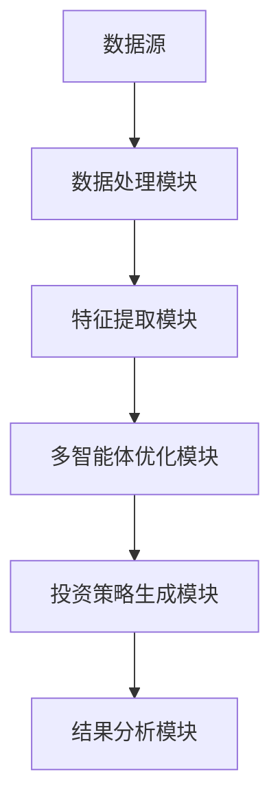

                 


# AI多智能体优化价值投资的动态行业配置策略

> 关键词：AI多智能体，价值投资，动态行业配置，投资组合优化，强化学习，分布式优化，量化投资

> 摘要：本文探讨了如何利用AI多智能体技术优化价值投资策略，特别是动态行业配置策略。通过构建多智能体优化模型，实现行业权重的动态调整，提升投资组合的收益和风险控制能力。文章详细分析了多智能体优化的算法原理、数学模型，并结合实际案例展示了系统的实现和应用。

---

## 引言

在金融市场的复杂性和不确定性日益增加的背景下，传统的投资策略和技术已难以满足现代投资者的需求。价值投资作为一种长期有效的投资策略，依赖于对市场、行业和个股的深入分析，但其在动态调整和多维度优化方面仍存在挑战。近年来，人工智能技术的快速发展为投资领域带来了新的机遇，特别是多智能体技术的应用，为优化价值投资策略提供了新的思路。

本文旨在探讨如何利用AI多智能体技术优化价值投资的动态行业配置策略。通过构建多智能体优化模型，实现行业权重的动态调整，从而提升投资组合的收益和风险控制能力。文章将从理论基础、算法实现、系统设计到实际案例，全面阐述这一优化策略。

---

## 第一部分：多智能体系统与价值投资概述

### 第1章：多智能体系统的定义与特点

#### 1.1 多智能体系统的定义
多智能体系统（Multi-Agent System, MAS）是由多个智能体组成的分布式系统，这些智能体通过协作或竞争完成特定任务。每个智能体具有一定的自主性、反应性和学习能力，能够与其他智能体和环境进行交互。

#### 1.2 多智能体系统的特点
- **自主性**：每个智能体能够独立决策和行动。
- **反应性**：智能体能够感知环境并实时调整行为。
- **协作性**：多个智能体通过协作完成复杂任务。
- **分布式性**：系统中不存在中心控制节点，任务由多个智能体共同完成。

#### 1.3 多智能体系统与传统单智能体的区别
传统的单智能体系统依赖于中心化决策，而多智能体系统通过分布式决策和协作实现任务目标。多智能体系统在复杂任务中表现出更高的灵活性和适应性。

---

### 第2章：价值投资的基本原理

#### 2.1 价值投资的定义与核心理念
价值投资是一种投资策略，旨在通过分析企业的基本面，寻找市场价格低于其内在价值的股票进行投资。其核心理念是“以合理的价格买入优秀的公司”。

#### 2.2 价值投资的关键要素
- **内在价值**：企业未来现金流的现值。
- **安全边际**：市场价格与内在价值的差距。
- **长期视角**：关注企业的长期盈利能力。

#### 2.3 价值投资与现代投资理论的联系
现代投资理论强调分散化和风险控制，而价值投资更注重个股选择和长期持有。两者在风险控制方面有共同点，但方法和策略有所不同。

---

### 第3章：动态行业配置策略的定义与意义

#### 3.1 动态行业配置的定义
动态行业配置是一种投资策略，根据市场变化和行业趋势，动态调整投资组合中各行业的权重。

#### 3.2 动态行业配置的核心意义
- **捕捉行业趋势**：通过动态调整行业权重，捕捉高增长行业的投资机会。
- **降低风险**：避免单一行业风险，通过分散化降低整体风险。
- **提升收益**：根据市场变化，优化行业配置，提升投资收益。

#### 3.3 动态行业配置与静态配置的区别
静态配置固定投资组合的行业权重，而动态配置根据市场变化实时调整权重。

---

## 第二部分：多智能体优化的算法原理

### 第4章：多智能体优化的基本原理

#### 4.1 多智能体优化的定义
多智能体优化是指通过多个智能体的协作和竞争，优化特定目标函数的过程。

#### 4.2 多智能体优化的核心算法
- **分布式优化算法**：每个智能体独立优化局部目标，通过通信实现全局优化。
- **强化学习算法**：智能体通过与环境交互，学习最优策略。
- **联合优化算法**：多个智能体共同优化全局目标函数。

#### 4.3 多智能体优化的数学模型
目标函数可以表示为：
$$ f(x) = \sum_{i=1}^{n} f_i(x_i) $$
约束条件为：
$$ g(x) = \sum_{i=1}^{m} g_i(x_i) \leq 0 $$

---

### 第5章：多智能体优化的算法实现

#### 5.1 分布式优化算法
分布式优化算法通过将目标函数分解为多个子问题，每个智能体优化一个子问题，然后通过通信实现全局优化。

#### 5.2 强化学习算法
强化学习算法通过智能体与环境的交互，学习最优策略。例如，使用Q-learning算法：
$$ Q(s, a) = r + \gamma \max Q(s', a') $$

#### 5.3 联合优化算法
联合优化算法通过多个智能体共同优化全局目标函数，例如使用交替方向乘子法（ADMM）。

---

## 第三部分：价值投资与动态行业配置的数学模型

### 第6章：价值投资的数学模型

#### 6.1 股票估值模型
股票的内在价值可以通过现金流折现模型（DCF）计算：
$$ V = \frac{CF}{r - g} $$
其中，CF为现金流，r为折现率，g为增长率。

#### 6.2 股票选择模型
根据多智能体优化的结果，选择具有较高价值的股票组合：
$$ S = \sum_{i=1}^{n} w_i \cdot x_i $$

---

### 第7章：动态行业配置的数学模型

#### 7.1 行业权重调整模型
行业权重的动态调整可以通过以下公式实现：
$$ w_i = \alpha \cdot \text{行业增长潜力} + \beta \cdot \text{行业估值水平} $$

---

## 第四部分：系统架构与实现

### 第8章：系统设计与实现

#### 8.1 系统设计思路
系统设计包括数据收集、模型构建、算法实现和结果分析四个部分。

#### 8.2 系统架构图
以下是系统架构的Mermaid图：



#### 8.3 系统实现步骤
1. 数据收集：收集各行业的历史数据和实时数据。
2. 特征提取：提取影响行业价值的关键特征。
3. 模型构建：构建多智能体优化模型。
4. 算法实现：实现分布式优化算法或强化学习算法。
5. 结果分析：分析优化结果并生成投资策略。

---

### 第9章：项目实战

#### 9.1 环境安装
需要安装以下工具和库：
- Python 3.8+
- NumPy, Pandas, Scikit-learn
-强化学习库（如OpenAI Gym）

#### 9.2 核心实现代码
以下是多智能体优化的核心代码示例：

```python
import numpy as np

def multi_agent_optimization(objectives, constraints):
    # 初始化智能体
    agents = [Agent(i) for i in range(n_agents)]
    # 通信与协作
    for _ in range(max_iterations):
        for agent in agents:
            agent.update_local_optimization(objectives[agent.id])
        # 全局优化
        global_optimization(agents)
    return agents.get_optimal_solution()
```

#### 9.3 实际案例分析
以某行业为例，通过多智能体优化模型，动态调整行业权重，实现投资收益最大化。

#### 9.4 项目总结
通过实际案例分析，验证了多智能体优化模型的有效性，为动态行业配置策略提供了新的思路。

---

## 结论

本文通过构建多智能体优化模型，探讨了AI技术在价值投资中的应用，特别是动态行业配置策略的优化。通过理论分析、算法实现和实际案例，验证了多智能体优化的有效性和实用性。未来的研究可以进一步探索多智能体系统在其他投资领域的应用，如跨市场投资和资产配置。

---

作者：AI天才研究院 & 禅与计算机程序设计艺术

