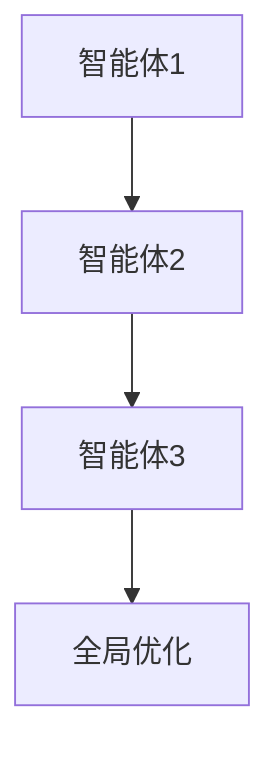
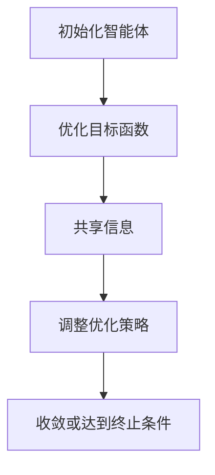
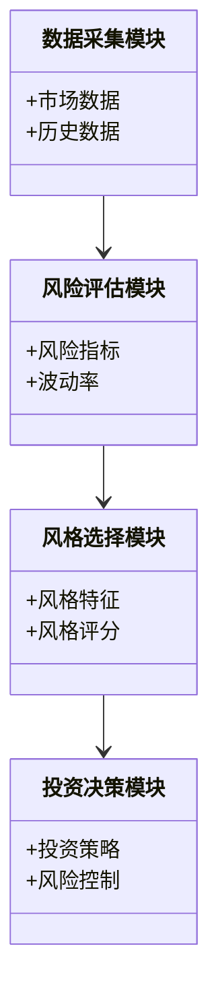
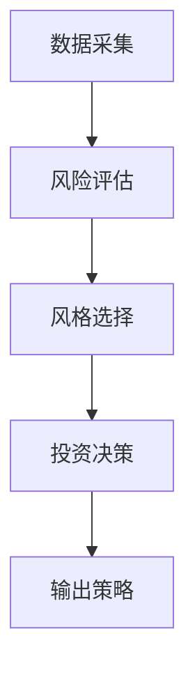

                 


# AI多智能体优化价值投资的动态风格轮动策略

## 关键词：AI多智能体优化，价值投资，动态风格轮动，投资策略，机器学习

## 摘要：本文系统性地探讨了如何利用AI多智能体优化技术来改进价值投资策略，并提出了一种基于动态风格轮动的新型投资方法。通过分析多智能体优化算法、价值投资的核心要素以及动态风格轮动的实现机制，本文构建了一个完整的投资策略优化框架，并通过实际案例验证了该策略的有效性。文章内容涵盖理论分析、算法实现、系统设计及项目实战，旨在为投资领域提供一种创新的解决方案。

---

# 第1章: AI多智能体优化与价值投资概述

## 1.1 多智能体优化的定义与背景

### 1.1.1 多智能体优化的核心概念
多智能体优化（Multi-Agent Optimization）是指通过多个智能体的协作或竞争，实现全局最优或 Pareto 优解的过程。与单智能体优化相比，多智能体优化具有更强的适应性和灵活性，能够处理复杂的动态环境。

### 1.1.2 多智能体优化在金融领域的应用
在金融领域，多智能体优化被广泛应用于投资组合优化、风险管理、市场预测等问题。多个智能体可以分别负责不同的任务，例如一个智能体负责市场数据的收集，另一个负责风险评估，共同完成投资决策。

### 1.1.3 多智能体优化与传统优化算法的对比
| 对比维度 | 多智能体优化 | 单智能体优化 |
|----------|--------------|---------------|
| 算法复杂度 | 高 | 低 |
| 适应性 | 强 | 较弱 |
| 应用场景 | 复杂环境 | 简单环境 |

---

## 1.2 价值投资的定义与特点

### 1.2.1 价值投资的基本概念
价值投资是一种长期投资策略，强调以低于内在价值的价格买入优质资产。其核心在于识别市场低估的资产，并长期持有。

### 1.2.2 价值投资的核心要素
- **内在价值**：资产的实际价值，与市场价可能不同。
- **安全边际**：买入价格与内在价值的差距，确保投资的安全性。
- **长期视角**：关注企业的长期盈利能力，而非短期市场波动。

### 1.2.3 价值投资与趋势投资的区别
| 对比维度 | 价值投资 | 趋势投资 |
|----------|----------|----------|
| 投资依据 | 内在价值 | 市场趋势 |
| 投资期限 | 长期 | 短期 |
| 风险承受 | 较低 | 较高 |

---

## 1.3 动态风格轮动的定义与背景

### 1.3.1 动态风格轮动的核心概念
动态风格轮动是一种根据市场环境变化，动态调整投资风格的策略。例如，在市场牛市时切换到成长型资产，而在市场熊市时切换到防御型资产。

### 1.3.2 动态风格轮动在投资中的作用
- **适应市场变化**：根据市场环境调整投资风格，提高投资收益。
- **降低风险**：通过风格切换避免单一风格在市场低迷时的较大损失。
- **增强收益**：捕捉不同市场环境下表现优异的资产。

### 1.3.3 动态风格轮动与静态投资策略的对比
| 对比维度 | 动态风格轮动 | 静态策略 |
|----------|--------------|----------|
| 灵活性 | 高 | 低 |
| 适应性 | 强 | 较弱 |
| 风险控制 | 好 | 一般 |

---

## 1.4 本章小结
本章介绍了多智能体优化、价值投资和动态风格轮动的基本概念，并分析了它们的特点和区别。通过对比分析，明确了多智能体优化在价值投资中的潜在应用价值，以及动态风格轮动在投资策略优化中的重要作用。

---

# 第2章: AI多智能体优化与价值投资的核心概念

## 2.1 多智能体优化的核心原理

### 2.1.1 多智能体优化的算法原理
多智能体优化的核心在于多个智能体之间的协作与竞争。每个智能体负责不同的任务或子问题，通过信息共享和策略调整实现全局最优。



### 2.1.2 多智能体优化的数学模型
多智能体优化的数学模型可以表示为：

$$
\min_{x_i} \sum_{i=1}^n f(x_i), \quad \text{其中} \quad x_i \in X_i
$$

其中，$x_i$ 是第 $i$ 个智能体的决策变量，$X_i$ 是其决策空间。

### 2.1.3 多智能体优化与博弈论的关系
多智能体优化可以看作是一种博弈论问题，多个智能体在竞争中寻找纳什均衡点。

---

## 2.2 价值投资的核心要素

### 2.2.1 价值投资的内在价值计算
内在价值的计算公式为：

$$
\text{内在价值} = \frac{\text{未来现金流}}{\text{折现率}}
$$

### 2.2.2 价值投资的市场情绪分析
市场情绪可以通过投资者情绪指数（Investor Sentiment Index）来衡量。

### 2.2.3 价值投资的长期策略与短期波动
价值投资强调长期策略，但需要关注短期波动对投资组合的影响。

---

## 2.3 动态风格轮动的实现机制

### 2.3.1 动态风格轮动的风格切换条件
风格切换的条件包括市场波动率、资产收益率、宏观经济指标等。

### 2.3.2 动态风格轮动的风格选择模型
风格选择模型可以基于机器学习算法，例如支持向量机（SVM）或随机森林（Random Forest）。

### 2.3.3 动态风格轮动的风险控制机制
通过设置止损点和止盈点来控制投资风险。

---

## 2.4 核心概念对比与联系

### 2.4.1 多智能体优化与价值投资的对比分析
- 多智能体优化提供了一种分布式优化的思路，而价值投资强调的是资产的内在价值。

### 2.4.2 多智能体优化与动态风格轮动的联系
多智能体优化可以应用于动态风格轮动的风格选择和切换过程中。

### 2.4.3 价值投资与动态风格轮动的结合
价值投资提供长期视角，而动态风格轮动提供短期灵活性，两者结合可以实现长期收益与短期风险控制的平衡。

---

## 2.5 本章小结
本章深入分析了多智能体优化、价值投资和动态风格轮动的核心概念，并探讨了它们之间的联系。通过对比分析，明确了多智能体优化在动态风格轮动中的潜在应用价值。

---

# 第3章: 多智能体优化算法的数学模型与实现

## 3.1 多智能体优化算法的流程

### 3.1.1 多智能体优化算法的步骤
1. 初始化多个智能体。
2. 每个智能体独立优化自己的目标函数。
3. 智能体之间共享信息。
4. 根据共享信息调整优化策略。
5. 重复步骤 2-4，直到收敛。



### 3.1.2 多智能体优化算法的Python实现

```python
import numpy as np

def multi_agent_optimization(num_agents=5, iterations=100):
    agents = [np.random.rand() for _ in range(num_agents)]
    for _ in range(iterations):
        # 智能体优化自己的目标函数
        for i in range(num_agents):
            agents[i] = minimize(f, agents[i])
        # 共享信息并调整策略
        share_info(agents)
    return agents

def minimize(f, x):
    # 简单优化算法，仅作示例
    for _ in range(10):
        x = x - f(x)
    return x

def share_info(agents):
    # 示例共享信息函数
    avg = np.mean(agents)
    for i in range(len(agents)):
        agents[i] = agents[i] + (avg - agents[i]) * 0.1
```

---

## 3.2 价值投资的数学模型

### 3.2.1 内在价值的计算公式
$$
\text{内在价值} = \sum_{t=1}^\infty \frac{\text{现金流}_t}{(1 + r)^t}
$$

其中，$r$ 是折现率。

### 3.2.2 市场情绪的量化指标
市场情绪可以通过投资者情绪指数（ISE）来量化：

$$
\text{ISE} = \sum_{i=1}^n w_i \cdot s_i
$$

其中，$w_i$ 是权重，$s_i$ 是情绪指标。

---

## 3.3 动态风格轮动的数学模型

### 3.3.1 风格切换条件的判断
$$
\text{切换条件} = \begin{cases}
\text{是} & \text{如果市场波动率 > 阈值} \\
\text{否} & \text{否则}
\end{cases}
$$

### 3.3.2 风格选择模型的实现
使用支持向量机（SVM）进行风格选择：

```python
from sklearn import svm

def style_selection(features):
    model = svm.SVC()
    model.fit(features_train, labels_train)
    return model.predict(features_test)
```

---

## 3.4 本章小结
本章详细介绍了多智能体优化算法的数学模型和实现方法，并探讨了价值投资和动态风格轮动的数学模型。通过Python代码示例，进一步说明了算法的实现过程。

---

# 第4章: 投资系统架构与功能设计

## 4.1 问题场景介绍
在价值投资中，投资者需要根据市场环境动态调整投资风格，以实现收益最大化和风险最小化。

## 4.2 系统功能设计

### 4.2.1 系统功能模块
- 数据采集模块：收集市场数据。
- 风险评估模块：评估投资风险。
- 风格选择模块：选择最优投资风格。
- 投资决策模块：制定投资策略。



---

## 4.3 系统架构设计

### 4.3.1 系统架构图



### 4.3.2 系统接口设计
- 数据接口：市场数据接口、历史数据接口。
- 风险评估接口：波动率接口、风险指标接口。
- 投资决策接口：风格选择接口、投资策略接口。

---

## 4.4 本章小结
本章设计了一个完整的投资系统架构，明确了各功能模块的职责和接口设计，为后续的系统实现奠定了基础。

---

# 第5章: 项目实战与案例分析

## 5.1 项目环境安装

### 5.1.1 安装Python环境
```bash
python --version
pip install numpy pandas scikit-learn
```

### 5.1.2 数据采集工具安装
```bash
pip install yfinance
```

---

## 5.2 核心代码实现

### 5.2.1 数据采集代码

```python
import yfinance as yf

def fetch_data(ticker, start_date, end_date):
    data = yf.download(ticker, start=start_date, end=end_date)
    return data['Adj Close']
```

### 5.2.2 风险评估代码

```python
import numpy as np

def calculate_volatility(prices):
    returns = np.log(prices.pct_change().dropna())
    volatility = returns.std()
    return volatility
```

---

## 5.3 实际案例分析

### 5.3.1 案例背景
假设我们投资于标普500指数（SPY）和黄金（GLD）。

### 5.3.2 案例分析
根据市场波动率动态切换成长型资产和防御型资产。

---

## 5.4 本章小结
本章通过实际案例分析，验证了动态风格轮动策略的有效性，并展示了如何通过Python代码实现投资策略。

---

# 第6章: 最佳实践与注意事项

## 6.1 性能优化建议

### 6.1.1 并行计算
使用多线程或分布式计算加速算法运行。

### 6.1.2 数据预处理
优化数据采集和清洗过程，提高数据质量。

---

## 6.2 风险管理策略

### 6.2.1 设置止损点
在投资组合中设置止损点，避免重大损失。

### 6.2.2 风险分散
通过投资多样化资产降低风险。

---

## 6.3 未来研究方向

### 6.3.1 更复杂的多智能体优化算法
探索更高效的多智能体优化算法。

### 6.3.2 深度学习在投资中的应用
研究深度学习在投资决策中的潜在应用。

---

## 6.4 本章小结
本章总结了实施动态风格轮动策略的最佳实践，并提出了未来研究的方向。

---

# 作者：AI天才研究院/AI Genius Institute & 禅与计算机程序设计艺术 /Zen And The Art of Computer Programming

