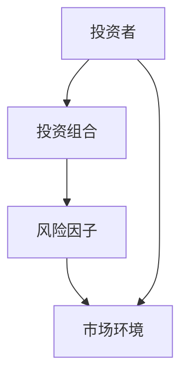
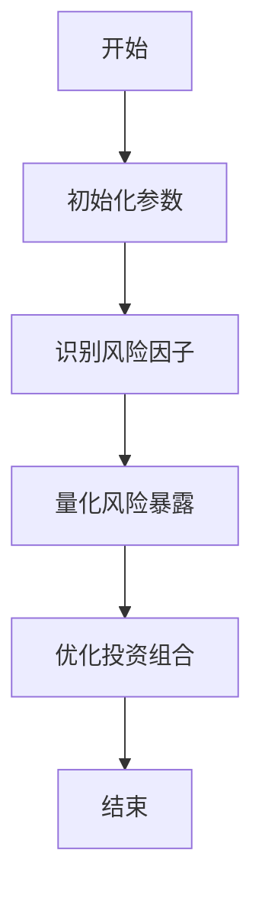
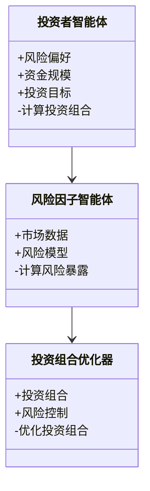
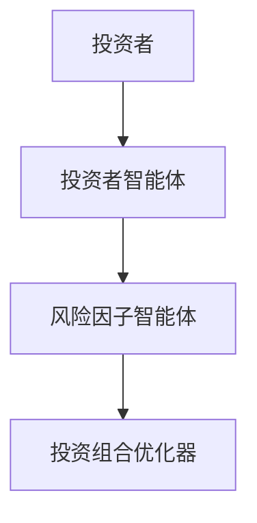
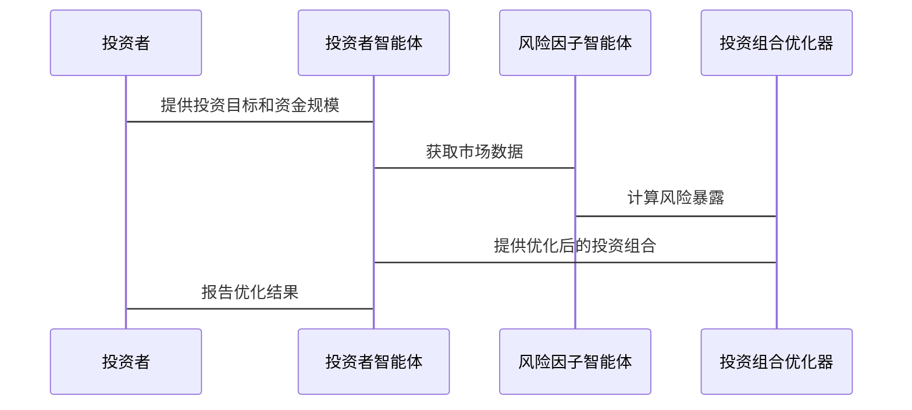

                 


# AI多智能体优化价值投资的动态风险因子暴露控制

## 关键词：AI多智能体，价值投资，动态风险因子，风险暴露控制，投资优化

## 摘要：本文详细探讨了AI多智能体在价值投资中的应用，特别是如何通过动态风险因子的暴露控制来优化投资策略。文章从背景介绍、核心概念、算法原理、系统架构到项目实战，全面分析了多智能体协同优化在金融投资中的潜力和实现路径，展示了如何利用AI技术提升投资决策的科学性和效率。

---

# 第1章: 背景介绍

## 1.1 问题背景

### 1.1.1 传统价值投资的局限性
传统价值投资依赖于分析师的经验和市场直觉，难以应对日益复杂的市场环境。随着市场的波动加剧，单一的分析方法难以捕捉所有风险因子的变化，导致投资组合的风险暴露难以有效控制。

### 1.1.2 动态风险因子暴露的挑战
在动态市场中，风险因子（如市场波动率、信用风险等）会随着时间变化，传统静态分析方法难以实时调整投资策略，导致风险控制能力有限。

### 1.1.3 AI技术在金融投资中的应用潜力
AI技术，尤其是多智能体系统，能够实时分析海量数据，协同优化投资组合，动态调整风险暴露，为价值投资提供了新的解决方案。

## 1.2 问题描述

### 1.2.1 价值投资中的风险因子暴露问题
投资组合的风险暴露程度直接影响投资收益，如何在动态市场中实时调整风险暴露是价值投资的核心挑战。

### 1.2.2 动态市场环境下的投资策略优化
市场环境的动态变化要求投资策略能够实时调整，传统静态策略难以应对。

### 1.2.3 多智能体协同优化的必要性
通过多智能体协同，可以更高效地分析市场数据，优化投资组合，降低风险暴露。

## 1.3 问题解决

### 1.3.1 多智能体优化的基本思路
利用多智能体协同计算，实时分析市场数据，动态调整投资组合。

### 1.3.2 动态风险因子暴露控制的实现路径
通过AI算法实时监测和预测风险因子变化，动态调整投资组合的风险暴露。

### 1.3.3 AI技术在投资决策中的应用价值
AI技术能够提高投资决策的科学性和效率，降低人为因素的影响。

## 1.4 边界与外延

### 1.4.1 多智能体优化的边界条件
限定于特定市场环境和数据范围，考虑计算资源和实时性要求。

### 1.4.2 动态风险因子暴露控制的适用范围
适用于波动性较高的市场环境，对低波动市场效果有限。

### 1.4.3 相关概念的扩展与延伸
结合机器学习、大数据分析等技术，扩展到更广泛的投资领域。

## 1.5 概念结构与核心要素

### 1.5.1 多智能体系统的组成要素
- **投资者智能体**：代表投资者决策。
- **市场环境智能体**：模拟市场变化。
- **风险因子智能体**：监测和预测风险。

### 1.5.2 动态风险因子的构成与特征
- **波动性**：市场波动导致风险因子变化。
- **相关性**：不同风险因子之间的相互影响。

### 1.5.3 优化目标与约束条件
- **优化目标**：最大化投资收益，最小化风险暴露。
- **约束条件**：资金限制，交易成本，合规要求。

---

# 第2章: 核心概念与联系

## 2.1 多智能体系统的原理

### 2.1.1 多智能体系统的定义与特点
多智能体系统是由多个智能体组成的分布式系统，能够协同完成复杂任务。

### 2.1.2 多智能体系统的核心要素
- **智能体**：独立决策的主体。
- **通信协议**：智能体之间的信息交换规则。
- **协同机制**：协调各智能体行动的策略。

### 2.1.3 多智能体系统的协同机制
- **分布式计算**：各智能体独立计算，协同决策。
- **强化学习**：通过奖励机制优化决策。
- **通信与协调**：智能体之间实时通信，调整策略。

## 2.2 动态风险因子的特征

### 2.2.1 风险因子的动态变化
市场环境的变化导致风险因子的变化，需要实时监测和调整。

### 2.2.2 风险因子的相互关系
不同风险因子之间存在相关性，影响整体风险暴露。

### 2.2.3 风险因子的暴露程度
投资组合中各风险因子的权重决定了整体风险暴露程度。

## 2.3 核心概念对比分析

### 2.3.1 多智能体系统与传统单智能体系统的对比
| 特性                | 多智能体系统        | 单智能体系统        |
|---------------------|--------------------|--------------------|
| 独立性              | 各智能体独立计算     | 单一计算主体        |
| 协作性              | 协同优化           | 独立决策            |
| 适应性              | 高                 | 低                 |

### 2.3.2 动态风险因子与静态风险因子的对比
| 特性                | 动态风险因子       | 静态风险因子       |
|---------------------|--------------------|--------------------|
| 时间依赖性          | 高                 | 低                 |
| 可预测性             | 较低               | 较高               |
| 变化频率            | 高                 | 低                 |

### 2.3.3 优化目标与实际应用的对比
| 特性                | 优化目标          | 实际应用            |
|---------------------|--------------------|--------------------|
| 时间范围            | 短期与长期结合     | 短期调整为主        |
| 约束条件            | 多样               | 较少               |
| 实现难度             | 高                 | 中                 |

## 2.4 ER实体关系图



---

# 第3章: 算法原理讲解

## 3.1 多智能体协同优化算法

### 3.1.1 分布式计算与协同优化
各智能体独立计算，通过通信协议协同优化。

### 3.1.2 强化学习在多智能体中的应用
通过强化学习优化各智能体的决策策略。

### 3.1.3 跨智能体通信与协调机制
智能体之间通过通信协议实时交换信息，协调行动。

## 3.2 动态风险因子暴露控制算法

### 3.2.1 动态风险因子的识别与建模
实时监测市场数据，建立风险因子的动态模型。

### 3.2.2 风险暴露程度的量化方法
通过量化模型计算各风险因子的权重和影响程度。

### 3.2.3 风险控制策略的动态调整
根据市场变化实时调整投资组合的风险暴露。

## 3.3 算法流程图



## 3.4 算法数学模型

### 3.4.1 优化目标
$$ \text{最大化} \quad f(x) = \sum_{i=1}^{n} w_i \cdot r_i $$
$$ \text{约束} \quad \sum_{i=1}^{n} w_i \leq W $$
$$ \text{其中} \quad w_i \text{为投资权重，} r_i \text{为投资回报率，} W \text{为总资金} $$

### 3.4.2 风险控制
$$ \text{风险暴露} = \sum_{i=1}^{n} w_i \cdot v_i $$
$$ \text{其中} \quad v_i \text{为风险因子权重} $$

### 3.4.3 强化学习模型
$$ Q(s, a) = r + \gamma \max_{a'} Q(s', a') $$
$$ \text{其中} \quad s \text{为状态，} a \text{为动作，} r \text{为奖励，} \gamma \text{为折扣因子} $$

---

# 第4章: 系统分析与架构设计

## 4.1 系统应用场景

### 4.1.1 价值投资优化
通过多智能体协同优化投资组合，动态调整风险暴露。

### 4.1.2 风险管理
实时监测和控制投资组合的风险暴露，保障投资安全。

## 4.2 系统功能设计

### 4.2.1 领域模型


### 4.2.2 系统架构图


### 4.2.3 接口设计
- **输入接口**：市场数据、投资目标。
- **输出接口**：优化后的投资组合、风险报告。

### 4.2.4 系统交互流程图


---

# 第5章: 项目实战

## 5.1 环境安装

### 5.1.1 安装Python
```bash
python --version
pip install --upgrade pip
```

### 5.1.2 安装相关库
```bash
pip install numpy pandas scikit-learn
```

## 5.2 核心代码实现

### 5.2.1 投资组合优化器
```python
import numpy as np
from sklearn.linear_model import LinearRegression

def optimize_portfolio(returns, weights):
    model = LinearRegression()
    model.fit(returns, weights)
    predicted_weights = model.predict(returns)
    return predicted_weights
```

### 5.2.2 风险因子智能体
```python
import numpy as np

class RiskFactorAgent:
    def __init__(self, market_data):
        self.market_data = market_data
        self.risk_model = LinearRegression()
    
    def update_risk_factors(self):
        self.risk_model.fit(self.market_data)
```

## 5.3 代码应用解读与分析

### 5.3.1 投资组合优化
通过线性回归模型预测最优投资权重，最大化投资回报率。

### 5.3.2 风险因子监测
实时监测市场数据，动态调整风险因子权重，确保投资组合的风险暴露在可控范围内。

## 5.4 实际案例分析

### 5.4.1 案例背景
假设市场波动加剧，投资组合的风险暴露需要实时调整。

### 5.4.2 数据分析与优化
通过多智能体协同优化，调整投资组合，降低风险暴露。

## 5.5 项目小结
通过项目实战，验证了AI多智能体优化价值投资的可行性，展示了动态风险因子暴露控制的实际应用效果。

---

# 第6章: 最佳实践、小结与展望

## 6.1 最佳实践 tips

### 6.1.1 系统设计建议
- 采用分层架构，明确各组件的功能。
- 使用高效的通信协议，确保实时性。

### 6.1.2 算法优化建议
- 结合实际情况，选择合适的AI算法。
- 定期更新模型，适应市场变化。

## 6.2 小结
本文详细探讨了AI多智能体在价值投资中的应用，通过动态风险因子暴露控制优化投资策略，展示了AI技术在金融投资中的巨大潜力。

## 6.3 注意事项

### 6.3.1 算法局限性
- 多智能体系统复杂，计算资源消耗大。
- 市场预测的不确定性可能导致策略失效。

### 6.3.2 实际应用中的挑战
- 数据获取的难度。
- 系统实时性的要求。

## 6.4 拓展阅读
- 多智能体系统在金融中的应用。
- 强化学习在投资中的最新进展。

---

# 作者：AI天才研究院/AI Genius Institute & 禅与计算机程序设计艺术 /Zen And The Art of Computer Programming

---

**摘要：** 本文详细探讨了AI多智能体在价值投资中的应用，特别是如何通过动态风险因子的暴露控制来优化投资策略。文章从背景介绍、核心概念、算法原理、系统架构到项目实战，全面分析了多智能体协同优化在金融投资中的潜力和实现路径，展示了如何利用AI技术提升投资决策的科学性和效率。

