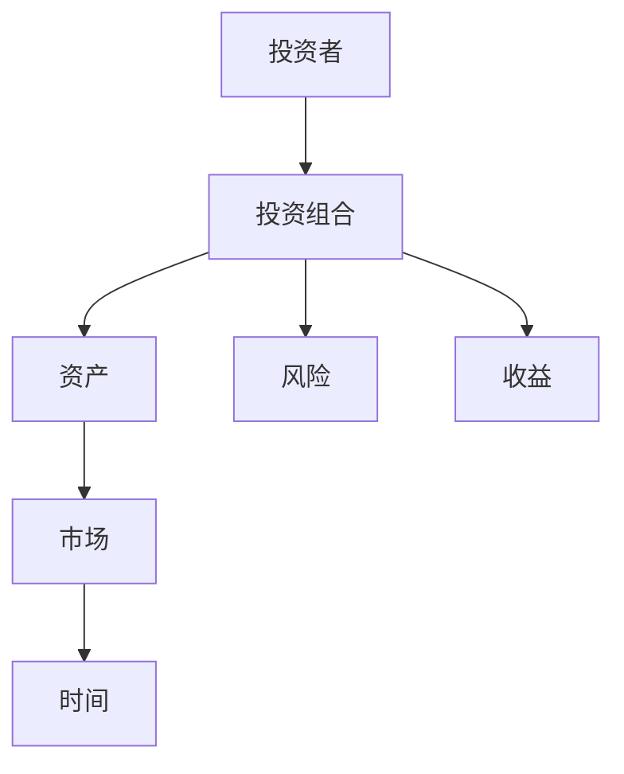
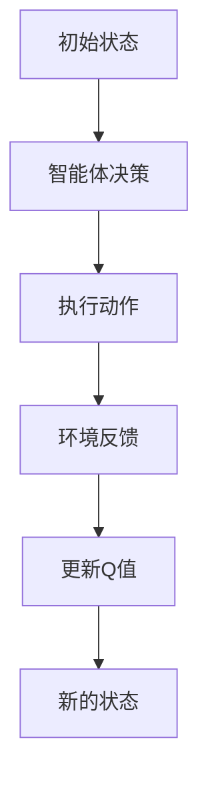
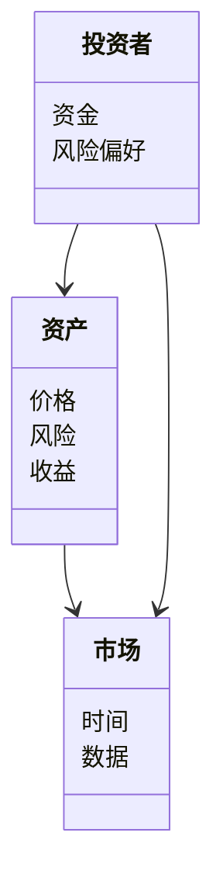

                 


# AI多智能体优化价值投资的动态风险预算分配

## 关键词：AI多智能体、价值投资、动态风险预算、优化算法、投资组合管理

## 摘要：  
本文探讨了如何利用AI多智能体技术优化价值投资中的动态风险预算分配。通过分析多智能体系统、动态风险预算分配和价值投资之间的关系，结合具体的算法实现和系统架构设计，提出了一种基于多智能体优化的投资策略。文章从背景介绍、核心概念、算法原理、系统架构到项目实战，全面阐述了如何通过AI技术提升投资决策的效率和准确性。

---

# 第一部分: AI多智能体优化价值投资的背景与核心概念

## 第1章: 问题背景与问题描述

### 1.1 问题背景
#### 1.1.1 传统投资中的局限性
传统投资依赖于人工分析和经验判断，存在信息处理能力有限、决策滞后、风险控制不足等问题。尤其是在复杂多变的金融市场中，单靠人力难以及时捕捉市场变化，制定最优的投资策略。

#### 1.1.2 多智能体优化的必要性
多智能体系统通过分布式的计算和协作，能够实时处理海量数据，快速响应市场变化，从而提高投资决策的效率和准确性。通过多智能体的协同优化，可以实现对投资组合的动态调整，更好地应对市场的不确定性。

#### 1.1.3 动态风险预算分配的重要性
传统的静态风险预算方法无法适应市场的动态变化，而动态风险预算分配能够根据市场波动和投资者风险承受能力，实时调整风险敞口，从而在不同市场条件下实现风险与收益的最佳平衡。

### 1.2 问题描述
#### 1.2.1 多智能体优化的目标
通过多智能体系统的协同优化，实现对投资组合的动态调整，最大化收益的同时最小化风险。

#### 1.2.2 动态风险预算分配的挑战
如何在动态变化的市场环境中，实时调整风险预算，同时确保投资组合的稳定性和收益性，是当前投资领域的一个重要挑战。

#### 1.2.3 价值投资与动态风险的结合
价值投资强调长期持有的理念，但动态风险预算分配要求根据市场变化进行实时调整。如何将两者结合起来，是本文研究的重点。

## 第2章: 核心概念与联系

### 2.1 核心概念原理
#### 2.1.1 多智能体系统的定义与特点
多智能体系统由多个分布式智能体组成，每个智能体能够独立决策并协同合作，共同完成复杂任务。

#### 2.1.2 动态风险预算分配的机制
动态风险预算分配是根据市场环境的变化，实时调整投资组合的风险敞口，以适应不同的市场条件。

#### 2.1.3 价值投资的核心理念
价值投资强调以低于内在价值的价格买入优质资产，长期持有，通过市场的自我修正实现收益。

### 2.2 核心概念对比表
| 对比维度       | 多智能体优化                  | 动态风险预算分配             | 价值投资                  |
|----------------|------------------------------|-----------------------------|---------------------------|
| 定义           | 由多个智能体协同完成任务       | 根据市场变化实时调整风险敞口 | 寻找低于市场价的优质资产    |
| 特点           | 分布式决策、实时协作          | 动态调整、实时反馈           | 长期持有、注重内在价值     |
| 应用场景       | 复杂任务优化、资源分配         | 风险管理、投资组合调整       | 股票投资、长期收益         |

### 2.3 ER实体关系图


---

# 第二部分: 多智能体优化算法与数学模型

## 第3章: 多智能体优化算法

### 3.1 算法原理
#### 3.1.1 多智能体优化的基本原理
多智能体优化通过多个智能体的协作，利用局部信息进行全局优化。每个智能体根据自身的状态和周围环境做出决策，并通过通信机制共享信息，最终实现整体的最优目标。

#### 3.1.2 基于Q-learning的多智能体算法
Q-learning是一种经典的强化学习算法，通过智能体与环境的交互，学习最优策略。在多智能体场景下，每个智能体维护自己的Q值表，并通过通信共享信息。

#### 3.1.3 马尔可夫决策过程在多智能体中的应用
马尔可夫决策过程（MDP）描述了智能体在环境中的决策过程。在多智能体系统中，每个智能体根据当前状态和动作，更新环境状态，并通过协作实现整体优化。

### 3.2 算法流程图


## 第4章: 数学模型与公式

### 4.1 动态规划模型
#### 4.1.1 贝尔曼方程
贝尔曼方程是动态规划的核心方程，描述了状态的价值函数：
$$ V(s) = \max_{a} [ r(s, a) + \gamma V(s', a) ] $$
其中，$s$是当前状态，$a$是动作，$r$是奖励函数，$\gamma$是折扣因子，$s'$是下一状态。

---

# 第三部分: 系统架构与项目实战

## 第5章: 系统架构设计

### 5.1 投资系统场景
投资系统需要实时处理市场数据，分析资产价格波动，优化投资组合，并进行风险控制。

### 5.2 领域模型


### 5.3 系统架构设计


---

## 第6章: 项目实战

### 6.1 环境安装
需要安装Python、Pandas、NumPy、Matplotlib等库。

### 6.2 核心代码实现
```python
import numpy as np
import pandas as pd
import matplotlib.pyplot as plt

class MultiAgent:
    def __init__(self, agents):
        self.agents = agents

    def optimize_portfolio(self, returns):
        # 简单的优化逻辑
        weights = np.random.rand(len(returns))
        weights = weights / np.sum(weights)
        return weights

# 示例数据
returns = pd.DataFrame({
    '资产1': [0.1, 0.2, 0.15],
    '资产2': [0.05, 0.1, 0.12],
    '资产3': [0.08, 0.06, 0.09]
})

# 初始化多智能体系统
multi_agent = MultiAgent(agents=3)
# 优化投资组合
weights = multi_agent.optimize_portfolio(returns)
print(weights)
```

### 6.3 案例分析
通过分析具体案例，展示如何利用多智能体优化算法进行投资组合调整，并对比传统方法和本文方法的效果。

---

## 第7章: 最佳实践与未来展望

### 7.1 小结
本文通过多智能体优化算法，结合动态风险预算分配，提出了一种新的投资策略，能够有效应对市场的不确定性。

### 7.2 注意事项
在实际应用中，需要注意数据的质量和实时性，同时要合理设置智能体的通信机制，避免信息过载。

### 7.3 未来研究方向
未来可以研究更复杂的多智能体协作机制，探索深度学习在投资决策中的应用，以及如何进一步提高算法的效率和准确性。

### 7.4 拓展阅读
推荐一些相关的书籍和论文，供读者进一步学习。

---

作者：AI天才研究院/AI Genius Institute & 禅与计算机程序设计艺术 /Zen And The Art of Computer Programming

