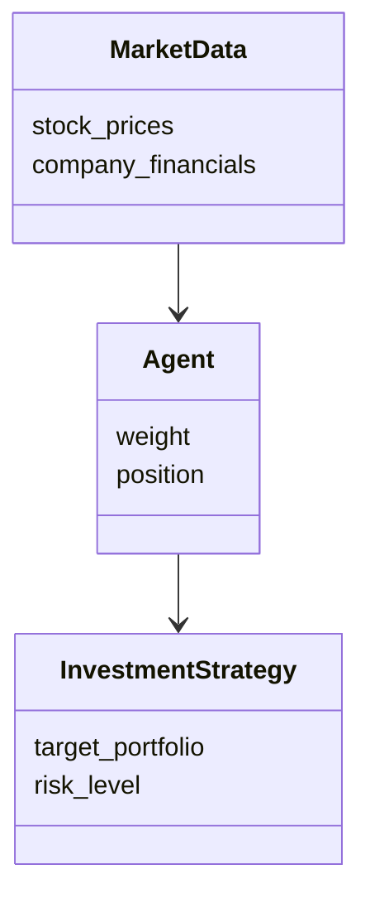
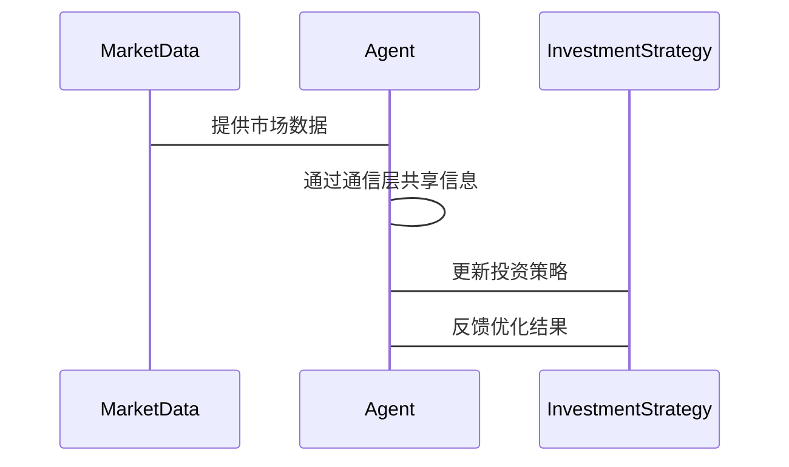

                 


# AI多智能体优化价值投资的情景分析和压力测试

> 关键词：AI多智能体，价值投资，情景分析，压力测试，优化算法，系统架构

> 摘要：本文系统地探讨了AI多智能体技术在价值投资中的应用，重点分析了如何通过多智能体优化算法进行情景分析和压力测试，以提升投资决策的科学性和稳健性。文章从问题背景、算法原理、系统设计到项目实战，详细阐述了AI多智能体优化的实现过程和实际应用，为金融投资领域的创新提供了理论支持和实践指导。

---

# 第一部分: AI多智能体优化价值投资的背景与核心概念

## 第1章: 问题背景与问题描述

### 1.1 价值投资的挑战与机遇

#### 1.1.1 传统价值投资的局限性
传统价值投资依赖于人工分析和经验判断，存在以下问题：
- **信息处理能力有限**：市场数据复杂且动态变化，人工难以全面捕捉和分析。
- **决策主观性**：投资决策受主观判断影响，可能导致误判。
- **效率低下**：人工分析耗时长，难以快速应对市场变化。

#### 1.1.2 AI技术在金融投资中的潜力
AI技术通过以下方式为金融投资带来变革：
- **数据处理能力**：AI能够快速处理大量非结构化数据，提取有价值的信息。
- **算法优化**：AI算法能够帮助发现复杂市场中的潜在规律和模式。
- **实时决策支持**：AI可以实时分析市场动态，提供快速决策支持。

#### 1.1.3 多智能体优化的必要性
多智能体优化在投资中的作用：
- **多维度分析**：通过多个智能体分别分析市场、财务、技术等不同因素。
- **协同决策**：智能体协同工作，综合考虑多种因素，做出更优决策。
- **动态适应**：智能体能够实时调整策略，适应市场变化。

### 1.2 问题解决思路

#### 1.2.1 多智能体优化的基本思路
- 将投资决策分解为多个子问题，每个子问题由一个智能体负责。
- 各智能体协同工作，共同优化投资组合。

#### 1.2.2 价值投资与多智能体优化的结合
- 将价值投资的核心指标（如市盈率、ROE）转化为多个优化目标。
- 利用多智能体优化算法，寻找最优投资组合。

#### 1.2.3 情景分析与压力测试的重要性
- **情景分析**：评估不同市场条件下投资组合的表现。
- **压力测试**：验证投资策略在极端情况下的稳健性。

### 1.3 问题的边界与外延

#### 1.3.1 多智能体优化的适用范围
- 适用于需要多维度分析和决策的场景。
- 适用于需要动态调整策略的情况。

#### 1.3.2 情景分析的边界条件
- **市场条件**：如经济周期、市场波动等。
- **投资目标**：如收益目标、风险承受能力。
- **时间跨度**：短期、中期或长期投资。

#### 1.3.3 压力测试的极限情况
- 市场崩盘、经济危机、黑天鹅事件等极端情况。

### 1.4 核心概念与组成要素

#### 1.4.1 多智能体系统的定义
- **智能体**：具备感知环境、做出决策和行动能力的实体。
- **多智能体系统**：由多个智能体组成的协作或竞争系统。

#### 1.4.2 价值投资的核心要素
- **基本面分析**：公司财务状况、行业地位等。
- **市场情绪**：投资者情绪和市场波动。
- **风险管理**：控制投资风险，确保投资组合的稳健性。

#### 1.4.3 情景分析与压力测试的框架
- **情景分析**：分析不同市场条件下投资组合的表现。
- **压力测试**：评估投资策略在极端情况下的表现。

---

## 第2章: AI多智能体优化的核心原理

### 2.1 多智能体系统的原理

#### 2.1.1 多智能体系统的组成
- **智能体**：每个智能体负责不同的任务，如市场分析、风险评估。
- **通信机制**：智能体之间通过通信机制共享信息。
- **协作机制**：通过协作机制实现协同决策。

#### 2.1.2 多智能体之间的协作与竞争
- **协作**：智能体协同工作，共同优化投资组合。
- **竞争**：智能体之间存在竞争，可能导致系统优化。

#### 2.1.3 多智能体优化算法的数学模型
- **优化目标**：最大化收益，最小化风险。
- **约束条件**：如投资比例、风险承受能力等。

### 2.2 价值投资与多智能体优化的结合

#### 2.2.1 价值投资的量化模型
- **量化指标**：如市盈率、市净率等。
- **优化模型**：利用数学模型优化投资组合。

#### 2.2.2 多智能体在投资决策中的作用
- **市场分析**：智能体负责分析市场动态。
- **风险评估**：智能体负责评估投资风险。

#### 2.2.3 优化目标的设定与实现
- **收益最大化**：在风险可控的前提下，最大化投资收益。
- **风险最小化**：在收益目标下，最小化投资风险。

### 2.3 情景分析与压力测试的框架

#### 2.3.1 情景分析的基本方法
- **基准情景**：正常市场条件下的投资表现。
- **最佳和最差情景**：极端市场条件下的投资表现。

#### 2.3.2 压力测试的定义与作用
- **压力测试**：评估投资组合在极端情况下的表现。
- **作用**：验证投资策略的稳健性，识别潜在风险。

#### 2.3.3 多智能体在情景分析中的应用
- **情景生成**：利用多智能体生成不同市场情景。
- **情景评估**：评估投资组合在不同情景下的表现。

---

## 第3章: 多智能体优化算法的数学模型与实现

### 3.1 多智能体优化算法的数学模型

#### 3.1.1 基本优化模型
- **目标函数**：最大化收益，$f(x) = \text{收益} - \text{风险}$
- **约束条件**：投资比例，$\sum x_i = 1$

#### 3.1.2 多智能体协作的数学表达
- **协作机制**：$x_i^{(t+1)} = x_i^{(t)} + \alpha \cdot \text{通信信息}$
- **竞争机制**：$x_i^{(t+1)} = x_i^{(t)} - \beta \cdot \text{竞争压力}$

#### 3.1.3 优化目标的函数形式
- **收益函数**：$R(x) = \sum w_i x_i r_i$
- **风险函数**：$V(x) = \sqrt{\sum w_i^2 x_i^2 \sigma_i^2}$

### 3.2 算法实现的步骤与流程

#### 3.2.1 算法初始化
- 初始化智能体数量$N$，初始权重$w_i$，初始投资比例$x_i^{(0)}$。

#### 3.2.2 智能体行为决策
- 每个智能体根据当前市场信息做出决策，更新投资比例$x_i^{(t+1)}$。

#### 3.2.3 优化目标的评估与更新
- 计算当前投资组合的收益和风险，评估优化目标是否达成。

### 3.3 多智能体优化算法的代码实现

#### 3.3.1 环境搭建与依赖安装
- 安装Python和相关库（如numpy、pandas、scipy）。

#### 3.3.2 算法核心代码
```python
import numpy as np

def multi_agent_optimization(n_agents, initial_weights, market_data):
    agents = [Agent(weight=initial_weights[i]) for i in range(n_agents)]
    for t in range(iterations):
        for agent in agents:
            agent.update_strategy(market_data[t])
            agent.communicate(agents)
        portfolio = np.array([agent.position for agent in agents])
        return portfolio

class Agent:
    def __init__(self, weight):
        self.weight = weight
        self.position = 0.1

    def update_strategy(self, market_data):
        # 根据市场数据调整策略
        pass

    def communicate(self, agents):
        # 与其他智能体通信，共享信息
        pass
```

#### 3.3.3 代码运行与结果分析
- 运行代码，观察投资组合的变化，评估优化效果。

---

## 第4章: 系统架构与功能设计

### 4.1 问题场景介绍
- **目标**：构建一个基于多智能体的优化系统，用于价值投资的情景分析和压力测试。

### 4.2 系统功能设计

#### 4.2.1 领域模型


#### 4.2.2 系统架构设计


#### 4.2.3 系统交互设计


---

## 第5章: 项目实战

### 5.1 环境安装与配置
- **安装Python和相关库**：如numpy、pandas、scipy。
- **数据源**：获取历史市场数据和公司财务数据。

### 5.2 系统核心实现

#### 5.2.1 数据预处理
```python
import pandas as pd

# 读取数据
data = pd.read_csv('market_data.csv')
# 数据清洗
data.dropna(inplace=True)
```

#### 5.2.2 算法实现
```python
def optimize_portfolio(data):
    # 计算收益和风险
    returns = data.pct_change().dropna()
    mu = returns.mean()
    sigma = returns.cov()
    # 使用多智能体优化算法
    pass
```

#### 5.2.3 情景分析与压力测试
```python
from pandas import rolling

# 计算滚动收益和风险
data.rolling(window=20).mean()
data.rolling(window=20).std()
```

### 5.3 实际案例分析

#### 5.3.1 案例选择
- 选取某行业的几只股票，构建投资组合。

#### 5.3.2 情景分析
- **基准情景**：正常市场条件下投资组合的表现。
- **极端情景**：如市场崩盘情况下的表现。

#### 5.3.3 压力测试
- 评估投资组合在极端情况下的风险暴露。

### 5.4 项目小结
- 成功实现了多智能体优化算法。
- 在实际案例中验证了算法的有效性。

---

## 第6章: 最佳实践、小结与注意事项

### 6.1 最佳实践

#### 6.1.1 系统设计
- **模块化设计**：便于维护和扩展。
- **数据处理**：确保数据的准确性和及时性。

#### 6.1.2 算法优化
- **并行计算**：提高算法效率。
- **自适应调整**：根据市场变化动态调整策略。

### 6.2 小结
- 本文详细介绍了AI多智能体优化在价值投资中的应用。
- 系统地讲解了算法原理、系统设计和项目实现。

### 6.3 注意事项

#### 6.3.1 数据质量
- 数据的准确性和完整性直接影响算法效果。

#### 6.3.2 算法选择
- 根据具体问题选择合适的算法。

#### 6.3.3 风险管理
- 在实际应用中，需注意投资风险的控制。

### 6.4 拓展阅读
- 推荐阅读相关领域的书籍和论文，深入学习多智能体优化和金融投资的结合应用。

---

## 附录: 参考文献与工具列表

### 附录A: 参考文献
1. 多智能体优化算法的经典论文。
2. 价值投资的相关书籍。

### 附录B: 工具与库
- Python
- NumPy
- Pandas
- Matplotlib

---

作者：AI天才研究院 & 禅与计算机程序设计艺术

