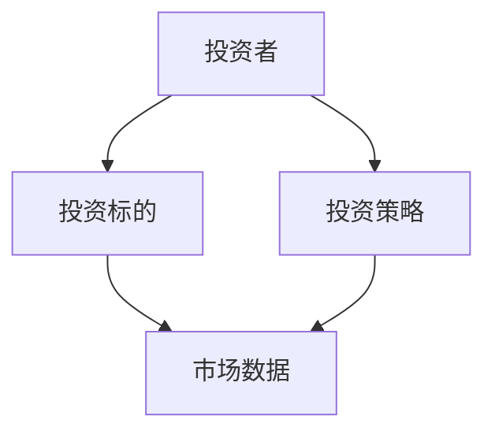

                 


# AI多智能体优化价值投资的资金流向分析

## 关键词：
AI多智能体、价值投资、资金流向、优化算法、系统架构、项目实战

## 摘要：
本文详细探讨了如何利用AI多智能体技术优化价值投资的资金流向分析。通过分析多智能体系统的原理、价值投资模型的构建、资金流向分析的算法实现，结合系统架构设计和实际项目案例，展示了AI技术在金融领域的创新应用。文章结合理论与实践，为金融投资领域提供了新的思路和方法。

---

## 第一部分: AI多智能体优化价值投资的背景与核心概念

### 第1章: 背景介绍

#### 1.1 问题背景
- **传统价值投资的局限性**：传统价值投资依赖人工分析，存在主观性强、效率低、数据处理能力有限等问题。
- **多智能体系统的优势**：多智能体系统能够通过分布式计算和协同优化，提高决策的准确性和效率。
- **价值投资与资金流向分析的结合**：通过AI多智能体技术，能够实时分析资金流向，优化投资策略。

#### 1.2 问题描述
- **资金流向分析的核心问题**：如何通过数据挖掘和算法优化，准确预测资金流向。
- **多智能体优化的目标**：通过多智能体协同，实现对资金流向的实时监控和优化。
- **问题解决的路径与方法**：利用AI多智能体技术，构建价值投资模型，优化资金流向分析。

#### 1.3 问题解决
- **多智能体优化的基本原理**：通过多个智能体协同工作，实现对复杂问题的优化。
- **价值投资模型的数学模型**：构建基于多智能体的优化模型，用于指导投资决策。
- **资金流向分析的实现方法**：通过数据预处理、特征提取和模型训练，实现对资金流向的准确预测。

#### 1.4 边界与外延
- **多智能体系统的边界条件**：系统的输入、输出和约束条件。
- **价值投资的适用范围**：适用于股票、基金等金融资产的投资决策。
- **资金流向分析的限制与扩展**：数据来源、模型精度等限制，以及未来的扩展方向。

#### 1.5 核心概念结构与组成
- **多智能体系统的组成要素**：智能体、环境、通信机制、协同策略。
- **价值投资模型的核心要素**：市场数据、投资策略、风险评估。
- **资金流向分析的关键指标**：资金流入量、资金流出量、资金净流量。

---

### 第2章: 多智能体系统与价值投资模型

#### 2.1 多智能体系统原理
- **多智能体系统的基本定义**：由多个智能体组成的分布式系统，能够协同完成复杂任务。
- **多智能体系统的特性分析**：分布式、自主性、协作性、动态性。
- **多智能体系统与价值投资的关系**：通过多智能体协同优化，提高投资决策的效率和准确性。

#### 2.2 价值投资模型的构建
- **价值投资模型的核心公式**：
  $$ V = \frac{E}{P} $$
  其中，\( V \) 表示投资价值，\( E \) 表示企业预期收益，\( P \) 表示当前市场价格。
- **价值投资模型的属性特征对比表**：
| 特性 | 传统价值投资 | 基于多智能体的价值投资 |
|------|----------------|-----------------------|
| 数据来源 | 财务报表、市场数据 | 多源异构数据，实时更新 |
| 决策方式 | 人工分析 | AI多智能体协同优化 |
| 决策效率 | 低效 | 高效，实时响应 |
- **价值投资模型的ER实体关系图**：


---

## 第二部分: AI多智能体优化的核心概念与联系

### 第3章: 资金流向分析的算法原理

#### 3.1 多智能体优化算法
- **强化学习算法的实现流程**：
  ```mermaid
  graph TD
      S[状态] --> A[动作]
      A --> R[奖励]
      R --> S'
  ```
- **博弈论模型在多智能体优化中的应用**：
  多智能体之间的博弈可以通过纳什均衡理论进行优化，公式为：
  $$ \text{纳什均衡} = \{a_i\}_{i=1}^n $$
  其中，\( a_i \) 表示第 \( i \) 个智能体的策略。
- **多智能体优化算法的数学模型**：
  通过分布式优化算法，如分布式梯度下降，实现多个智能体的协同优化：
  $$ \min_{x_i} \sum_{i=1}^n f_i(x_i, x_{-i}) $$

#### 3.2 价值投资模型的构建算法
- **数据预处理与特征提取**：
  对市场数据进行清洗、归一化处理，提取关键特征，如市盈率、市净率等。
- **模型训练与参数优化**：
  使用深度学习模型，如LSTM，进行训练，优化模型参数。
- **模型评估与验证**：
  通过回测和风险指标（如夏普比率）评估模型的性能。

---

## 第三部分: 系统分析与架构设计方案

### 第4章: 系统功能设计

#### 4.1 问题场景介绍
- **资金流向分析的典型场景**：实时监控资金流向，优化投资组合。
- **多智能体优化的应用场景**：高频交易、风险控制。

#### 4.2 系统功能模块
- **数据采集模块**：实时采集市场数据。
- **模型计算模块**：构建并优化价值投资模型。
- **结果展示模块**：可视化资金流向和投资建议。

#### 4.3 系统架构设计
- **领域模型**：
  ```mermaid
  classDiagram
      class 投资者 {
          资产
          投资策略
          资金流向
      }
      class 市场数据 {
          价格
          交易量
      }
      class 投资决策 {
          模型计算
          风险评估
      }
      投资者 --> 市场数据
      投资者 --> 投资决策
  ```
- **系统架构图**：
  ```mermaid
  graph TD
      S[投资者] --> D[数据采集]
      D --> M[模型计算]
      M --> R[结果展示]
  ```

#### 4.4 系统接口设计
- **API接口**：提供RESTful API，供其他系统调用。
- **交互流程**：
  ```mermaid
  sequenceDiagram
      participant 投资者
      participant 数据采集模块
      participant 模型计算模块
      participant 结果展示模块
      投资者 -> 数据采集模块: 获取市场数据
      数据采集模块 -> 模型计算模块: 提供数据
      模型计算模块 -> 结果展示模块: 返回投资建议
  ```

---

### 第5章: 项目实战

#### 5.1 环境安装
- 安装Python、TensorFlow、Keras等工具。
- 安装Jupyter Notebook用于数据分析和可视化。

#### 5.2 系统核心实现源代码
```python
import numpy as np
import pandas as pd
from tensorflow import keras
from sklearn.preprocessing import MinMaxScaler

# 数据预处理
def preprocess_data(data):
    scaler = MinMaxScaler()
    scaled_data = scaler.fit_transform(data)
    return scaled_data

# 模型构建
def build_model(input_shape):
    model = keras.Sequential()
    model.add(keras.layers.LSTM(64, input_shape=input_shape))
    model.add(keras.layers.Dense(1, activation='linear'))
    model.compile(loss='mean_squared_error', optimizer='adam')
    return model

# 模型训练
def train_model(model, X_train, y_train):
    model.fit(X_train, y_train, epochs=100, batch_size=32)

# 模型预测
def predict(model, X_test):
    return model.predict(X_test)
```

#### 5.3 代码应用解读与分析
- **数据预处理**：使用归一化处理市场数据，确保模型输入一致。
- **模型构建**：使用LSTM网络捕捉时间序列数据中的趋势。
- **模型训练**：通过反向传播优化模型参数。
- **模型预测**：根据模型输出的投资建议指导实际操作。

#### 5.4 实际案例分析
- **案例背景**：某股票的历史数据。
- **数据处理**：对价格、交易量等数据进行预处理。
- **模型训练与预测**：训练价值投资模型，预测未来的价格走势。
- **结果分析**：根据预测结果调整投资策略。

#### 5.5 项目小结
- **项目总结**：通过AI多智能体技术优化价值投资，提高了资金流向分析的效率和准确性。
- **项目经验**：数据质量、模型选择、计算资源对项目成功至关重要。

---

## 第四部分: 最佳实践

### 第6章: 最佳实践 tips

#### 6.1 小结
- **总结**：AI多智能体技术为价值投资提供了新的思路，资金流向分析的效率和精度显著提升。
- **经验分享**：在实际应用中，需注重数据质量和模型优化。

#### 6.2 注意事项
- **数据隐私**：注意保护投资者的隐私数据。
- **模型鲁棒性**：确保模型在极端市场条件下仍能正常运行。
- **计算资源**：需要足够的计算资源支持模型训练和推理。

#### 6.3 拓展阅读
- **推荐书籍**：《算法导论》、《深度学习》。
- **推荐论文**：相关领域的最新研究成果。
- **推荐工具**：TensorFlow、PyTorch等深度学习框架。

---

## 作者：AI天才研究院 & 禅与计算机程序设计艺术

---

本文通过系统化的分析和实践，展示了AI多智能体技术在价值投资中的应用潜力。通过理论与实践的结合，为金融投资领域提供了新的思路和方法。希望本文能够为相关领域的研究者和实践者提供有价值的参考。

