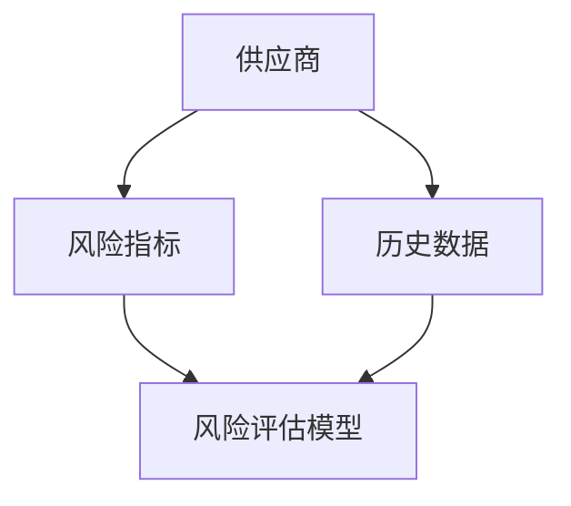
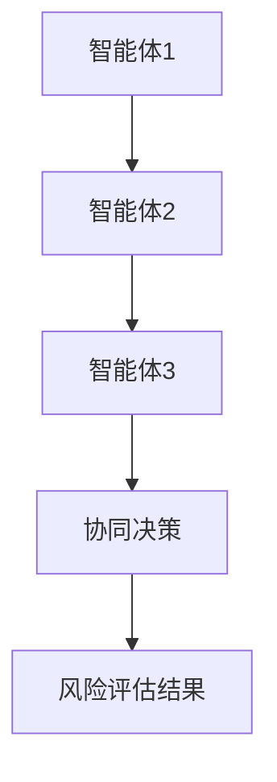
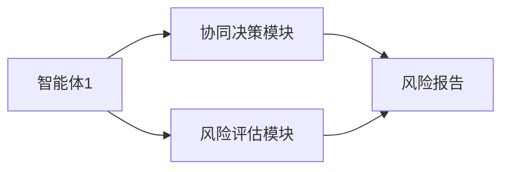
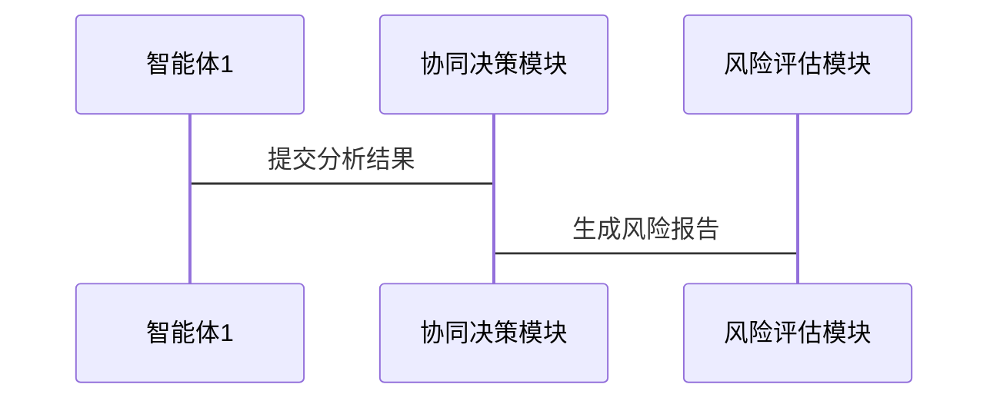

                 


# AI多智能体在价值投资中的供应商风险分析

## 关键词：AI多智能体、价值投资、供应商风险分析、协同算法、强化学习、系统架构设计

## 摘要：本文深入探讨了AI多智能体技术在价值投资中的应用，特别是如何利用多智能体系统进行供应商风险分析。通过分析多智能体系统的协同机制、算法原理以及实际应用场景，本文为投资者和数据科学家提供了一种创新的供应商风险评估方法。文章内容涵盖核心概念、算法模型、系统架构设计以及实际案例分析，旨在帮助读者全面理解并有效应用AI多智能体技术。

---

# 第一部分: AI多智能体在价值投资中的供应商风险分析基础

## 第1章: 引言

### 1.1 问题背景
- **1.1.1 价值投资与供应商风险分析的定义**
  - 价值投资：通过分析企业基本面，寻找被市场低估的投资标的。
  - 供应商风险分析：评估供应商的稳定性、信用风险和供应链风险。
  
- **1.1.2 传统供应商风险分析的局限性**
  - 数据量大、维度复杂，传统方法难以全面覆盖。
  - 风险因素动态变化，难以实时更新。

- **1.1.3 AI多智能体技术的应用潜力**
  - 利用多智能体协同计算，提高分析效率和准确性。
  - 实现实时数据处理和动态风险评估。

### 1.2 问题描述
- **1.2.1 供应商风险分析的核心挑战**
  - 数据异构性：供应商数据来源多样，格式不统一。
  - 风险关联性：供应商之间的风险相互影响，难以单独评估。

- **1.2.2 AI多智能体在价值投资中的角色**
  - 分散计算：多个智能体分别处理不同数据源。
  - 协同推理：智能体之间共享信息，共同评估整体风险。

- **1.2.3 问题解决的总体思路**
  - 构建多智能体系统，分别处理数据、分析风险。
  - 通过协同算法优化风险评估结果。

### 1.3 本章小结
- 介绍了供应商风险分析的背景和挑战。
- 阐述了AI多智能体技术在其中的应用潜力和总体思路。

---

## 第2章: AI多智能体系统概述

### 2.1 多智能体系统的基本概念
- **2.1.1 多智能体系统的定义**
  - 由多个智能体组成的分布式系统，每个智能体负责特定任务。
  
- **2.1.2 多智能体系统的组成要素**
  - 智能体：具备感知、决策和执行能力。
  - 通信机制：智能体之间的信息交互方式。
  - 协同算法：实现智能体协同工作的规则。

- **2.1.3 多智能体系统的特点**
  - 分布式计算：任务分解到多个智能体。
  - 协同性：智能体之间共享信息，共同完成目标。

### 2.2 价值投资中的多智能体应用场景
- **2.2.1 价值投资的核心要素**
  - 企业基本面分析、市场趋势预测、竞争对手分析。

- **2.2.2 多智能体在价值投资中的优势**
  - 并行处理：多个智能体同时分析不同数据源。
  - 高效协同：智能体协同优化分析结果。

- **2.2.3 供应商风险分析的多智能体实现路径**
  - 智能体1：收集供应商的历史数据。
  - 智能体2：分析供应商的信用记录。
  - 智能体3：评估供应商的供应链稳定性。

### 2.3 本章小结
- 介绍了多智能体系统的概念和特点。
- 阐述了多智能体技术在价值投资中的应用场景。

---

## 第3章: 供应商风险分析的核心概念与联系

### 3.1 核心概念原理
- **3.1.1 供应商风险分析的基本原理**
  - 通过分析供应商的历史数据、市场表现和行业趋势，评估其潜在风险。

- **3.1.2 AI多智能体在风险分析中的应用原理**
  - 多个智能体分别分析不同维度的数据，协同生成综合风险评估结果。

### 3.2 核心概念属性特征对比表格
| 概念       | 供应商A | 供应商B | 供应商C |
|------------|---------|---------|---------|
| 财务健康度 | 良好    | 一般    | 较差    |
| 供应链稳定性 | 稳定    | 不稳定  | 稳定    |
| 市场竞争力 | 高      | 中      | 低      |

### 3.3 ER实体关系图架构


### 3.4 本章小结
- 介绍了供应商风险分析的核心概念和原理。
- 通过对比表格和实体关系图展示了供应商风险分析的结构。

---

## 第4章: AI多智能体系统算法原理

### 4.1 算法原理概述
- **4.1.1 多智能体协同算法的基本原理**
  - 分布式计算：多个智能体分别处理数据。
  - 协同推理：智能体之间共享信息，优化决策。

- **4.1.2 基于强化学习的多智能体协同机制**
  - 每个智能体通过强化学习优化自己的决策。
  - 智能体之间的协同通过奖励机制实现。

### 4.2 算法流程图


### 4.3 算法数学模型
- **4.3.1 基于概率论的风险评估模型**
  $$P(风险) = \sum_{i=1}^{n} P(风险_i)$$

- **4.3.2 基于图论的供应商关系网络模型**
  $$G = (V, E)$$

### 4.4 通俗易懂的算法举例
- **4.4.1 示例1：简单供应商风险评估**
  - 智能体1分析供应商A的历史数据。
  - 智能体2分析供应商B的信用记录。
  - 协同决策生成综合风险评估结果。

### 4.5 本章小结
- 阐述了AI多智能体系统的算法原理。
- 通过流程图和数学模型展示了算法的实现过程。

---

## 第5章: 系统分析与架构设计方案

### 5.1 问题场景介绍
- 价值投资中的供应商风险分析是一个复杂的系统工程。
- 需要整合多个数据源，实时更新分析结果。

### 5.2 项目介绍
- **项目目标**：构建一个基于AI多智能体的供应商风险分析系统。
- **项目范围**：涵盖供应商数据收集、分析、评估和报告生成。

### 5.3 系统功能设计
- **领域模型（mermaid类图）**
  ```mermaid
  classDiagram
  class 智能体1 {
    +数据源：供应商A
    +方法：分析财务数据
  }
  class 智能体2 {
    +数据源：供应商B
    +方法：分析供应链稳定性
  }
  class 协同决策模块 {
    +方法：整合分析结果
  }
  class 风险评估模块 {
    +方法：生成综合风险报告
  }
  ```

### 5.4 系统架构设计（mermaid架构图）


### 5.5 系统接口设计
- **输入接口**：接收供应商的历史数据和实时数据。
- **输出接口**：生成风险评估报告。

### 5.6 系统交互（mermaid序列图）


### 5.7 本章小结
- 展示了系统的整体架构和功能设计。
- 通过类图和序列图详细描述了系统各部分的交互关系。

---

## 第6章: 项目实战

### 6.1 环境安装
- **所需工具**：Python、TensorFlow、Keras、Mermaid。
- **安装命令**：
  ```bash
  pip install mermaid
  pip install tensorflow
  ```

### 6.2 系统核心实现源代码
```python
# 协同决策模块
class Agent:
    def __init__(self, data_source):
        self.data_source = data_source

    def analyze(self):
        # 数据分析逻辑
        pass

# 风险评估模块
class RiskEvaluator:
    def __init__(self):
        self.agents = []

    def add_agent(self, agent):
        self.agents.append(agent)

    def evaluate(self):
        results = []
        for agent in self.agents:
            results.append(agent.analyze())
        return results

# 主程序
def main():
    agent1 = Agent("供应商A")
    agent2 = Agent("供应商B")
    evaluator = RiskEvaluator()
    evaluator.add_agent(agent1)
    evaluator.add_agent(agent2)
    result = evaluator.evaluate()
    print(result)

if __name__ == "__main__":
    main()
```

### 6.3 代码应用解读与分析
- **代码功能**：定义了智能体和风险评估模块，展示了协同决策的过程。
- **代码实现细节**：通过类和方法实现智能体的数据分析和风险评估。

### 6.4 实际案例分析
- **案例描述**：分析两个供应商的财务数据和供应链稳定性。
- **分析结果**：生成综合风险评估报告。

### 6.5 项目小结
- 展示了如何将AI多智能体技术应用于实际的供应商风险分析。
- 通过代码和案例分析展示了系统的实现过程。

---

## 第7章: 最佳实践与总结

### 7.1 最佳实践
- **数据质量**：确保数据的准确性和完整性。
- **模型优化**：定期更新模型，适应市场变化。
- **系统维护**：及时修复系统漏洞，保证运行稳定性。

### 7.2 小结
- 本文详细探讨了AI多智能体技术在价值投资中的应用。
- 展示了如何利用多智能体系统进行供应商风险分析。

### 7.3 注意事项
- 数据隐私和安全问题需要高度重视。
- 系统的可扩展性和可维护性需要提前设计。

### 7.4 拓展阅读
- 《多智能体系统与协同计算》
- 《强化学习在金融中的应用》

---

## 作者：AI天才研究院/AI Genius Institute & 禅与计算机程序设计艺术 /Zen And The Art of Computer Programming

