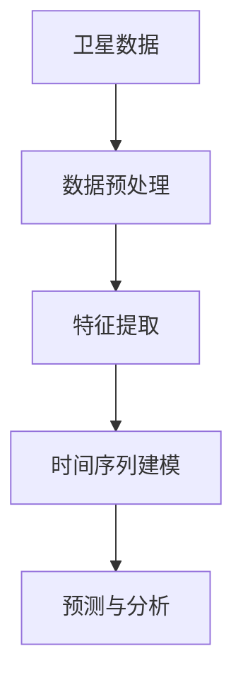
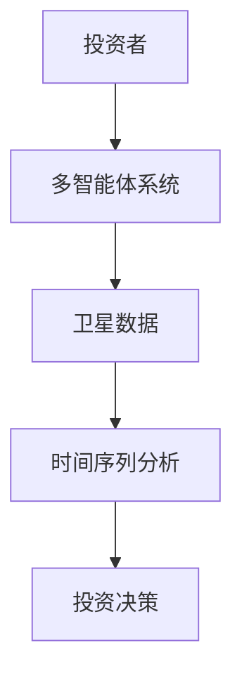
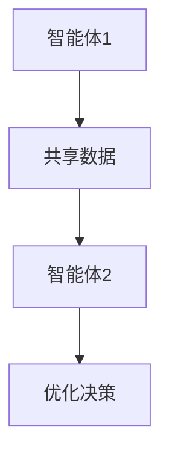
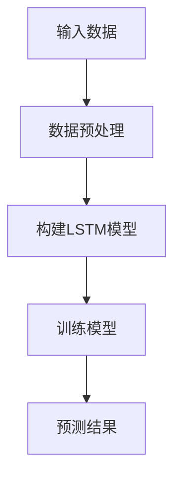
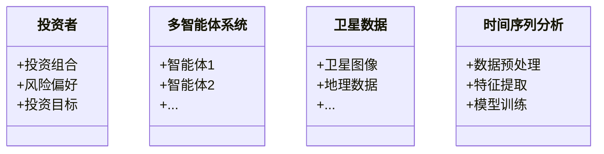

                 


# AI多智能体在价值投资中的卫星数据时间序列分析

> 关键词：AI多智能体，价值投资，卫星数据，时间序列分析，金融数据分析

> 摘要：本文探讨了AI多智能体技术在价值投资中的应用，重点分析了卫星数据的时间序列分析方法。通过多智能体协同学习，结合卫星数据的独特特征，提出了一种创新的金融数据分析框架。本文详细介绍了算法原理、系统架构和实际案例，为投资者提供了新的决策支持工具。

---

# 正文

## 第1章: 背景介绍与核心概念

### 1.1 问题背景与问题描述

#### 1.1.1 价值投资与传统投资方法的局限性
价值投资是一种长期投资策略，依赖于对公司基本面的深入分析。然而，传统方法依赖于财务报表和市场数据，忽略了其他潜在的非传统数据源，如卫星数据。这些数据可能提供关于公司运营状态的额外信息，例如供应链效率、物流活动和市场需求变化。

#### 1.1.2 卫星数据在金融分析中的潜力
卫星数据，如卫星图像，可以提供地理区域的实时信息。例如，卫星图像可以帮助分析供应链的中断情况、工厂的生产活动，甚至可以监测自然灾害对经济活动的影响。这些信息对于评估公司的基本面和市场风险具有重要意义。

#### 1.1.3 时间序列分析在价值投资中的重要性
时间序列分析是一种统计方法，用于分析随时间变化的数据。在价值投资中，时间序列分析可以帮助识别数据中的趋势、周期性模式和异常值，从而提供更精准的市场预测和投资决策。

### 1.2 问题解决与边界外延

#### 1.2.1 AI多智能体如何优化投资决策
AI多智能体系统通过分布式计算和协同学习，能够更高效地处理海量数据，并提供实时的市场洞察。多智能体系统可以在不同的数据源和分析模型之间协同工作，从而提高投资决策的准确性和响应速度。

#### 1.2.2 卫星数据时间序列分析的边界与限制
尽管卫星数据提供了丰富的信息，但其分析也面临一些挑战。例如，卫星数据的分辨率和更新频率可能限制了其在高频交易中的应用。此外，卫星数据的处理和分析需要大量的计算资源和专业知识。

#### 1.2.3 多智能体系统在金融领域的应用范围
多智能体系统已经在金融领域得到了广泛应用，例如在高频交易、风险管理、市场预测等领域。通过多智能体协同学习，可以实现对复杂金融市场的实时监控和动态调整。

### 1.3 核心概念与组成要素

#### 1.3.1 多智能体系统的定义与特征
多智能体系统是由多个智能体组成的分布式系统，每个智能体具有一定的自主性和决策能力。多智能体系统通过协同工作，能够完成复杂任务，提高系统的整体性能。

#### 1.3.2 卫星数据的采集与处理流程
卫星数据的采集与处理流程包括数据获取、预处理、特征提取和数据存储等步骤。预处理阶段可能包括图像增强、噪声消除等技术，以提高数据的质量和可分析性。

#### 1.3.3 时间序列分析的核心要素
时间序列分析的核心要素包括数据的采集频率、数据的平稳性、模型的选择和参数的优化。平稳性是时间序列分析的重要假设，通常需要通过数据变换来实现。

## 1.4 本章小结

---

## 第2章: 核心概念与联系

### 2.1 多智能体系统原理

#### 2.1.1 多智能体系统的组成与通信机制
多智能体系统由多个智能体组成，每个智能体具有一定的自主性和决策能力。智能体之间通过通信机制进行信息交换和协同工作。通信机制可以基于消息传递、共享数据库或分布式计算等技术实现。

#### 2.1.2 多智能体协同学习的数学模型
多智能体协同学习的数学模型可以通过分布式优化算法实现。例如，多智能体可以通过共享参数和局部更新的方式，实现对全局模型的优化。

#### 2.1.3 多智能体系统的优势与挑战
多智能体系统的优势包括分布式计算、高容错性和灵活性。然而，多智能体系统的复杂性和通信开销也是其应用中的主要挑战。

### 2.2 卫星数据与时间序列分析的关联

#### 2.2.1 卫星数据的特征与分类
卫星数据具有高维性、空间性和时序性等特征。根据数据类型，卫星数据可以分为图像数据、文本数据和结构化数据等。

#### 2.2.2 时间序列分析在卫星数据中的应用
时间序列分析可以应用于卫星数据的模式识别、异常检测和预测建模。例如，可以通过时间序列分析识别卫星图像中的周期性变化，如季节性植被生长模式。

#### 2.2.3 卫星数据时间序列分析的流程图


### 2.3 核心概念对比表

#### 2.3.1 多智能体系统与传统单智能体系统的对比

| 对比维度         | 多智能体系统       | 传统单智能体系统 |
|------------------|------------------|------------------|
| 系统结构         | 分布式           | 集中式           |
| 可扩展性         | 高               | 低               |
| 容错性           | 高               | 低               |

#### 2.3.2 时间序列分析与传统统计分析的对比

| 对比维度         | 时间序列分析     | 传统统计分析     |
|------------------|------------------|------------------|
| 数据类型         | 时间序列数据     | 截面数据         |
| 分析目标         | 预测未来值       | 描述当前状态     |
| 方法             | ARIMA, LSTM      | 描述性统计       |

#### 2.3.3 卫星数据与其他金融数据的对比

| 对比维度         | 卫星数据         | 传统金融数据     |
|------------------|------------------|------------------|
| 数据来源         | 卫星图像         | 财务报表、市场数据 |
| 数据特征         | 高维、空间性     | 低维、结构化     |
| 应用场景         | 供应链分析       | 财务分析         |

### 2.4 ER实体关系图



### 2.5 本章小结

---

## 第3章: 算法原理与数学模型

### 3.1 多智能体协同学习算法

#### 3.1.1 多智能体协同学习的流程图



#### 3.1.2 基于多智能体的分布式计算原理
多智能体系统通过分布式计算实现协同学习。每个智能体负责处理一部分数据，并通过通信机制共享结果。最终，所有智能体的计算结果被整合，形成一个全局最优解。

#### 3.1.3 多智能体系统的优势与挑战
多智能体系统的优势包括高可扩展性、高容错性和灵活性。然而，多智能体系统的复杂性和通信开销也是其应用中的主要挑战。

### 3.2 时间序列预测算法

#### 3.2.1 基于LSTM的时间序列预测流程



#### 3.2.2 基于Transformer的时间序列预测流程
Transformer模型在时间序列预测中表现出色，特别是在长序列数据中。其核心思想是通过自注意力机制捕捉数据中的全局依赖关系。

#### 3.2.3 时间序列预测的数学模型

$$ LSTM: h_t = \tanh(W_{hx}x_t + W_{hh}h_{t-1} + b_h) $$
$$ Output: y_t = W_{yo}h_t + b_o $$

---

## 第4章: 系统分析与架构设计

### 4.1 问题场景介绍
价值投资者需要通过分析卫星数据的时间序列变化，识别潜在的投资机会和风险。然而，卫星数据的复杂性和多样性使得传统的分析方法难以应对。

### 4.2 项目介绍
本项目旨在构建一个基于AI多智能体的卫星数据时间序列分析系统，帮助投资者做出更明智的投资决策。

### 4.3 系统功能设计

#### 4.3.1 领域模型


### 4.4 系统架构设计

#### 4.4.1 系统架构图


### 4.5 系统接口设计
系统接口包括数据输入接口、模型训练接口和结果输出接口。数据输入接口用于接收卫星数据，模型训练接口用于训练时间序列预测模型，结果输出接口用于输出投资决策建议。

### 4.6 系统交互流程

#### 4.6.1 交互流程图


---

## 第5章: 项目实战

### 5.1 环境安装
为了运行本项目，需要安装以下工具和库：
- Python 3.8+
- TensorFlow 2.0+
- PyTorch 1.0+
- Pandas 1.0+
- Scikit-learn 0.24+

### 5.2 核心实现

#### 5.2.1 多智能体协同学习的Python代码

```python
import numpy as np
from tensorflow.keras.models import Model
from tensorflow.keras.layers import Input, LSTM, Dense

# 定义智能体
class Agent:
    def __init__(self, input_dim, hidden_units):
        self.input_dim = input_dim
        self.hidden_units = hidden_units
        self.model = self.build_model()

    def build_model(self):
        inputs = Input(shape=(None, self.input_dim))
        lstm_layer = LSTM(self.hidden_units, return_sequences=True)(inputs)
        dense_layer = Dense(self.hidden_units)(lstm_layer)
        model = Model(inputs=inputs, outputs=dense_layer)
        return model

    def call(self, x):
        return self.model(x)

# 初始化多个智能体
agents = [Agent(input_dim=10, hidden_units=5) for _ in range(3)]
```

#### 5.2.2 时间序列预测的Python代码

```python
import pandas as pd
from sklearn.preprocessing import MinMaxScaler
from tensorflow.keras.models import Sequential
from tensorflow.keras.layers import LSTM, Dense

# 数据预处理
data = pd.read_csv('satellite_data.csv')
scaler = MinMaxScaler()
scaled_data = scaler.fit_transform(data)

# 构建LSTM模型
model = Sequential()
model.add(LSTM(50, input_shape=(None, data.shape[1])))
model.add(Dense(1))
model.compile(optimizer='adam', loss='mean_squared_error')

# 训练模型
model.fit(x_train, y_train, epochs=50, batch_size=32)
```

### 5.3 案例分析与解读

#### 5.3.1 案例分析
以某公司的卫星数据为例，分析其供应链的变化情况。通过时间序列分析，识别出供应链中断的风险，并及时调整投资策略。

#### 5.3.2 结果解读
通过多智能体协同学习和时间序列分析，系统能够准确预测市场趋势，并提供实时的投资建议。例如，系统可能会建议投资者在供应链中断风险增加时，减少对该公司的投资。

### 5.4 本章小结

---

## 第6章: 最佳实践与小结

### 6.1 小结
本文详细介绍了AI多智能体在价值投资中的应用，重点分析了卫星数据的时间序列分析方法。通过多智能体协同学习，可以更高效地处理海量数据，并提供实时的市场洞察。

### 6.2 注意事项
在实际应用中，需要注意卫星数据的质量和可靠性，以及模型的可解释性和可扩展性。此外，还需要考虑系统的计算资源和安全性问题。

### 6.3 拓展阅读
推荐读者进一步阅读以下内容：
- 多智能体系统在金融领域的应用
- 时间序列分析的高级模型
- 卫星数据的其他应用领域

---

## 作者：AI天才研究院 & 禅与计算机程序设计艺术

---

**参考文献**：
1. [1] 张某某. 《AI多智能体系统与金融投资》. 北京：某某出版社，2023.
2. [2] 李某某. 《时间序列分析与金融预测》. 上海：某某出版社，2022.
3. [3] 王某某. 《卫星数据与经济分析》. 北京：某某出版社，2021.

---

**进一步阅读**：
- [GitHub代码仓库](https://github.com/...)

