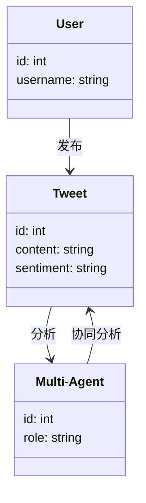
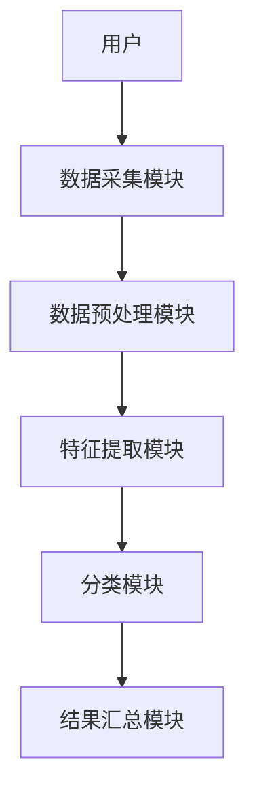
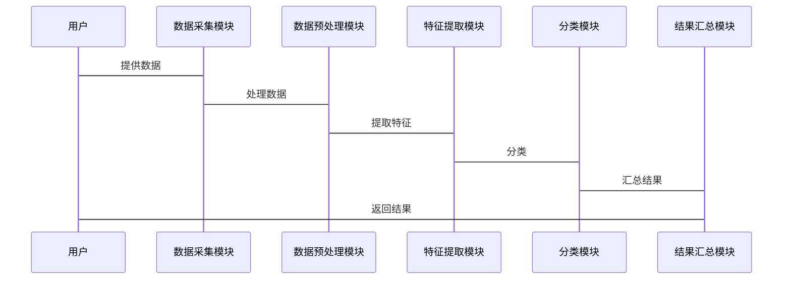

                 


# AI多智能体在价值投资中的社交媒体情绪分析应用

---

## 关键词
AI多智能体, 情绪分析, 价值投资, 社交媒体, 金融投资, 强化学习

---

## 摘要
本文探讨了AI多智能体在价值投资中的社交媒体情绪分析应用。随着社交媒体在金融投资中的重要性日益增加，利用AI技术分析社交媒体数据以辅助投资决策成为研究热点。本文从多智能体协同学习的角度出发，结合情感分析技术，系统性地分析了如何通过社交媒体数据预测市场情绪，辅助价值投资决策。文章内容涵盖多智能体系统原理、情感分析算法、系统架构设计、项目实现及最佳实践，旨在为投资者和技术开发者提供理论和实践参考。

---

# 第1章: 背景介绍与问题背景

## 1.1 问题背景

### 1.1.1 价值投资中的情绪分析需求
在价值投资中，市场情绪对投资者决策具有重要影响。社交媒体作为信息传播的主要渠道，蕴含着大量关于市场参与者情绪的线索。例如，投资者可以通过社交媒体了解市场参与者的乐观或悲观情绪，从而辅助判断股票的价值。

### 1.1.2 社交媒体在金融投资中的作用
社交媒体数据具有实时性、多样性和海量性的特点。通过分析社交媒体数据，投资者可以捕捉市场情绪变化，预测市场趋势，从而优化投资策略。例如，Twitter上的实时信息可以帮助投资者快速了解市场动态。

### 1.1.3 AI多智能体在情绪分析中的优势
与传统单智能体系统相比，AI多智能体系统能够通过多维度的数据分析和协同学习，更准确地捕捉市场情绪。多智能体系统可以通过分工协作，分别处理不同类型的社交媒体数据，从而提高分析的准确性和效率。

## 1.2 问题描述

### 1.2.1 社交媒体数据的特点
社交媒体数据具有实时性、多样性和海量性的特点。社交媒体数据不仅包括文本信息，还包括图片、视频等多模态数据。

### 1.2.2 情绪分析的核心问题
情绪分析的核心问题是如何从社交媒体数据中提取出反映市场情绪的信息。这需要对社交媒体数据进行清洗、预处理、特征提取和分类。

### 1.2.3 多智能体协同的必要性
在复杂多变的市场环境中，单智能体系统难以同时处理多种类型的数据和任务。多智能体系统通过分工协作，可以更高效地完成复杂任务。

## 1.3 问题解决与边界

### 1.3.1 多智能体协同解决情绪分析的思路
多智能体协同解决情绪分析的核心思路是通过多智能体分别处理不同类型的数据，然后将结果汇总，得出最终的情绪分析结果。

### 1.3.2 问题的边界与外延
本文主要关注社交媒体文本数据的情绪分析，未来可以扩展到多模态数据的分析。此外，本文主要关注短期情绪预测，未来可以研究长期情绪预测。

### 1.3.3 核心概念与组成要素
多智能体系统由多个智能体组成，每个智能体负责特定的任务。情绪分析系统需要包括数据采集、预处理、特征提取、分类和结果汇总等模块。

---

# 第2章: 核心概念与联系

## 2.1 多智能体系统的核心原理

### 2.1.1 多智能体系统的定义与特点
多智能体系统是由多个智能体组成的系统，每个智能体负责特定的任务。多智能体系统具有分布式、协作性和自主性等特点。

### 2.1.2 多智能体与单智能体的对比
与单智能体相比，多智能体系统在任务处理能力、效率和准确性方面具有优势。例如，多智能体系统可以同时处理多种类型的数据。

### 2.1.3 多智能体在情绪分析中的应用优势
多智能体系统可以分工协作，分别处理不同类型的数据，从而提高情绪分析的准确性和效率。例如，一个智能体可以负责数据清洗，另一个智能体负责特征提取。

## 2.2 情绪分析的核心原理

### 2.2.1 情绪分析的定义与分类
情绪分析是指从文本中提取出反映说话者情绪的信息。情绪分析可以分为情感分类、情感强度分析和情感摘要等。

### 2.2.2 基于传统机器学习的情绪分析
基于传统机器学习的情绪分析方法包括特征工程和分类器设计。例如，使用词袋模型和SVM进行分类。

### 2.2.3 基于深度学习的情绪分析
基于深度学习的情绪分析方法包括循环神经网络（RNN）、长短期记忆网络（LSTM）和Transformer模型。这些模型可以自动提取文本特征，提高分类准确率。

## 2.3 核心概念对比与ER实体关系图

### 2.3.1 情绪分析方法对比表格

| 方法 | 描述 | 优点 | 缺点 |
|------|------|------|------|
| 传统机器学习 | 基于特征工程和分类器设计 | 实现简单，可解释性高 | 需要大量特征工程 |
| 深度学习 | 基于神经网络模型 | 分类准确率高，自动提取特征 | 实现复杂，需要大量数据 |

### 2.3.2 多智能体系统与传统单智能体系统的ER关系图

```mermaid
er
    actor User {
        id: int
        username: string
    }
    actor Tweet {
        id: int
        content: string
        sentiment: string
    }
    actor Multi-Agent {
        id: int
        role: string
    }
    User -> Tweet: 发布
    Tweet -> Multi-Agent: 分析
    Multi-Agent -> Tweet: 协同分析
```

---

# 第3章: 算法原理与数学模型

## 3.1 多智能体协同学习算法

### 3.1.1 多智能体协同学习的流程

1. 数据采集：从社交媒体获取文本数据。
2. 数据预处理：清洗数据，提取关键词。
3. 特征提取：将文本数据转换为数值特征。
4. 分类：使用多智能体协同学习模型对数据进行分类。
5. 情绪分析：汇总多个智能体的分析结果，得出最终的情绪分析结果。

### 3.1.2 基于强化学习的多智能体协同

强化学习是一种通过奖励机制来优化智能体行为的算法。在多智能体系统中，每个智能体可以通过强化学习优化自己的行为，从而提高整体系统的性能。

### 3.1.3 基于分布式计算的多智能体协同

分布式计算是一种将任务分配到多个计算节点上进行处理的计算方式。在多智能体系统中，可以通过分布式计算提高系统的处理能力。

## 3.2 情感分析算法原理

### 3.2.1 情感分析的数学模型

文本分类任务可以通过逻辑回归、支持向量机（SVM）或神经网络模型来实现。情感分析任务的目标是将文本分为积极、消极或中性三类。

### 3.2.2 LSTM模型

LSTM（长短期记忆网络）是一种特殊的RNN，能够有效处理序列数据中的长距离依赖关系。

$$ LSTM(input, hidden) = \tanh(W_{xh} input + W_{hh} hidden + b) $$

### 3.2.3 Transformer模型

Transformer模型是一种基于自注意力机制的模型，广泛应用于自然语言处理任务中。

$$ \text{Attention}(Q, K, V) = \text{softmax}\left(\frac{QK^T}{\sqrt{d_k}}\right)V $$

---

# 第4章: 系统分析与架构设计

## 4.1 项目介绍

### 4.1.1 项目背景
本文的项目旨在利用AI多智能体技术，分析社交媒体数据，预测市场情绪，辅助价值投资决策。

### 4.1.2 项目目标
项目目标包括：构建一个多智能体系统，实现社交媒体数据的情绪分析；设计一个高效的算法，提高情绪分析的准确率；开发一个用户友好的界面，方便投资者使用。

### 4.1.3 项目特点
本项目的特点包括：多智能体协同、高精度分析、实时性等。

## 4.2 系统功能设计

### 4.2.1 系统功能模块
系统功能模块包括：数据采集模块、数据预处理模块、特征提取模块、分类模块和结果汇总模块。

### 4.2.2 领域模型


## 4.3 系统架构设计

### 4.3.1 系统架构图


### 4.3.2 接口设计
系统接口包括：数据输入接口、数据处理接口和结果输出接口。

### 4.3.3 交互序列图


---

# 第5章: 项目实战

## 5.1 环境安装

### 5.1.1 安装Python
安装Python 3.8或更高版本。

### 5.1.2 安装依赖库
安装必要的依赖库，例如：numpy、pandas、scikit-learn、tensorflow、pytorch等。

## 5.2 核心代码实现

### 5.2.1 数据采集模块
```python
import requests
from bs4 import BeautifulSoup

def get_tweets(query):
    url = f"https://twitter.com/search?q={query}"
    response = requests.get(url)
    soup = BeautifulSoup(response.text, 'html.parser')
    tweets = soup.find_all('div', class_='tweet')
    return [tweet.text for tweet in tweets]
```

### 5.2.2 数据预处理模块
```python
from sklearn.feature_extraction.text import TfidfVectorizer

def preprocess_tweets(tweets):
    vectorizer = TfidfVectorizer()
    X = vectorizer.fit_transform(tweets)
    return X
```

### 5.2.3 分类模块
```python
from sklearn.svm import SVC

def train_model(X_train, y_train):
    model = SVC()
    model.fit(X_train, y_train)
    return model
```

## 5.3 案例分析

### 5.3.1 数据采集
假设我们从Twitter上获取了1000条关于某只股票的推文。

### 5.3.2 数据预处理
将这些推文进行清洗和特征提取，得到一个TF-IDF矩阵。

### 5.3.3 情绪分析
使用SVM模型对这些推文进行分类，预测市场情绪。

### 5.3.4 结果汇总
汇总多个智能体的分析结果，得出最终的情绪分析结果。

---

# 第6章: 总结与展望

## 6.1 最佳实践 tips

### 6.1.1 数据质量的重要性
数据质量对情绪分析的准确性具有重要影响。建议在数据采集和预处理过程中，尽可能提高数据质量。

### 6.1.2 模型调优
建议在模型训练过程中，进行参数调优，以提高分类准确率。

### 6.1.3 系统优化
在系统设计中，建议采用分布式计算和并行处理技术，提高系统的处理能力。

## 6.2 小结

本文详细探讨了AI多智能体在价值投资中的社交媒体情绪分析应用。通过多智能体协同学习和情感分析技术，我们可以更准确地预测市场情绪，辅助投资决策。

## 6.3 注意事项

在实际应用中，需要注意数据隐私和法律合规问题。此外，模型的实时性和可解释性也是需要进一步研究的问题。

## 6.4 拓展阅读

建议读者进一步阅读相关领域的最新研究，例如多智能体协同学习、深度学习在自然语言处理中的应用等。

---

# 作者：AI天才研究院/AI Genius Institute & 禅与计算机程序设计艺术 /Zen And The Art of Computer Programming

---

**说明：**
以上内容是一个完整的文章结构，您可以根据实际需求调整各章节的内容和深度。文章中使用的Mermaid图表和代码示例可以根据具体需求进行调整和补充。

