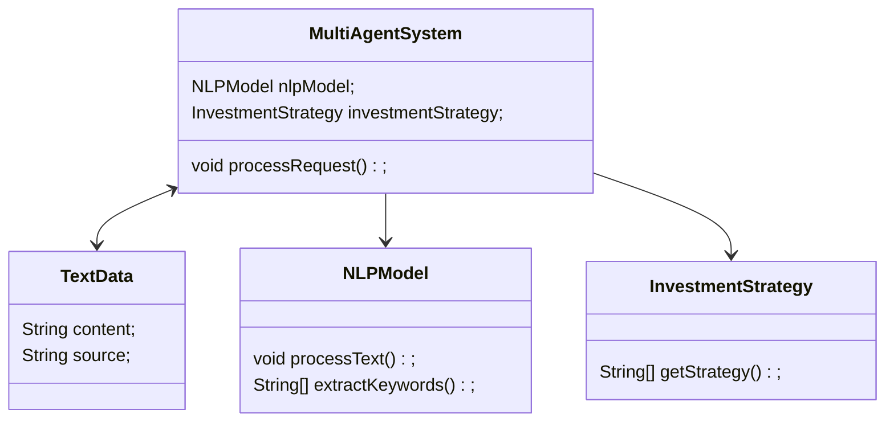
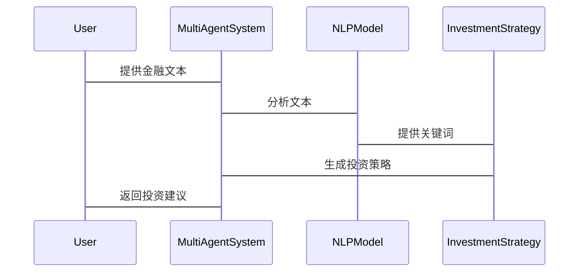

                 


# AI多智能体在价值投资中的自然语言处理应用

> 关键词：AI多智能体，自然语言处理，价值投资，金融分析，文本挖掘

> 摘要：本文探讨了AI多智能体在价值投资中的自然语言处理应用，分析了多智能体系统与自然语言处理技术的结合，提出了基于多智能体的自然语言处理算法，并通过实际案例展示了其在价值投资中的应用效果。

---

# 第1章: 问题背景与核心概念

## 1.1 问题背景
### 1.1.1 价值投资的基本概念
价值投资是一种以低于内在价值的价格购买优质资产的投资策略，其核心在于通过分析公司基本面、行业趋势和市场环境来判断投资价值。

### 1.1.2 AI技术在金融领域的应用现状
AI技术在金融领域的应用日益广泛，包括股票预测、风险评估、交易策略优化等。自然语言处理（NLP）作为AI的重要组成部分，被广泛用于文本分析和情感计算。

### 1.1.3 多智能体在投资决策中的优势
多智能体系统通过协同工作，能够更全面地分析复杂金融数据，提供更精准的投资决策支持。

## 1.2 核心概念与问题描述
### 1.2.1 多智能体系统的定义
多智能体系统是由多个相互作用的智能体组成的系统，每个智能体都有自己的目标和决策机制，能够通过通信协作完成复杂任务。

### 1.2.2 自然语言处理在金融分析中的作用
NLP技术可以提取文本中的情感、主题和实体信息，帮助投资者分析市场情绪和公司新闻。

### 1.2.3 价值投资中的信息处理需求
价值投资者需要处理大量非结构化数据，如新闻、财报和社交媒体信息，以获取投资决策支持。

## 1.3 问题解决与边界
### 1.3.1 多智能体协同解决投资问题的思路
通过多智能体协同分析，可以整合不同来源的信息，提供更全面的投资建议。

### 1.3.2 自然语言处理在文本信息提取中的边界
NLP技术在处理复杂文本时可能存在局限性，如信息模糊和语义理解不足。

### 1.3.3 系统设计的可行性分析
多智能体协同与NLP技术的结合具有较高的可行性和应用潜力。

## 1.4 概念结构与核心要素
### 1.4.1 多智能体系统的组成要素
- 智能体：具有感知和决策能力的实体。
- 通信机制：智能体之间的信息交互方式。
- 协作策略：智能体协同工作的规则。

### 1.4.2 自然语言处理的关键技术
- 词嵌入：将词语转化为向量表示。
- 语言模型：预测词语序列的概率模型。
- 预训练模型：如BERT、GPT等。

### 1.4.3 价值投资中的信息流与决策链
信息流包括市场新闻、公司财报、社交媒体等，决策链涉及数据采集、分析、策略生成等环节。

## 1.5 本章小结
本章介绍了价值投资的基本概念、AI技术在金融领域的应用现状，以及多智能体系统与NLP技术的核心概念。通过分析多智能体协同在投资中的优势，明确了系统设计的思路和边界。

---

# 第2章: 多智能体与自然语言处理的核心概念

## 2.1 多智能体系统原理
### 2.1.1 多智能体的基本结构
多智能体系统由多个智能体组成，每个智能体负责特定任务，并通过通信协作完成整体目标。

### 2.1.2 智能体之间的通信机制
智能体通过消息传递或共享内存进行通信，实现信息同步和协同决策。

### 2.1.3 多智能体的协作策略
协作策略包括任务分配、资源共享和决策协调，确保系统高效运行。

## 2.2 自然语言处理技术
### 2.2.1 语言模型的基本原理
语言模型通过概率分布预测下一个词，常用模型包括n-gram和深度学习模型。

### 2.2.2 基于深度学习的NLP技术
深度学习模型如LSTM和Transformer在NLP任务中表现优异。

### 2.2.3 预训练语言模型的应用
预训练模型如BERT和GPT通过大规模数据训练，具备强大的文本理解和生成能力。

## 2.3 多智能体与NLP的结合
### 2.3.1 多智能体协同处理文本信息的优势
多智能体可以分工合作，分别负责信息提取、情感分析和策略生成。

### 2.3.2 NLP技术在多智能体中的具体应用
NLP技术用于文本信息提取、情感分析和主题建模，支持多智能体协同决策。

### 2.3.3 多智能体与NLP的协同优化
通过协同优化，多智能体可以更高效地处理复杂文本信息，提高投资决策的准确性。

## 2.4 核心概念对比分析
### 2.4.1 多智能体与传统单智能体的对比
| 特性         | 多智能体                     | 单智能体                     |
|--------------|------------------------------|------------------------------|
| 效率         | 高                           | 较低                         |
| 可扩展性       | 高                           | 低                           |
| 灵活性         | 高                           | 低                           |

### 2.4.2 NLP技术在金融领域的应用特点
- 数据多样性：金融文本涵盖多种类型和主题。
- 实时性要求高：需要快速处理最新信息。
- 高准确性需求：投资决策依赖于精准分析。

### 2.4.3 多智能体与NLP结合的创新点
- 协作式信息处理：多智能体分工协作，提高信息处理效率。
- 智能化决策支持：结合NLP技术，提供更智能的投资建议。

## 2.5 本章小结
本章详细介绍了多智能体系统和自然语言处理技术的核心概念，并分析了它们在投资中的应用特点和创新点。

---

# 第3章: 多智能体协同的数学模型与算法原理

## 3.1 多智能体系统模型
### 3.1.1 多智能体系统的数学表示
多智能体系统可以用图论中的图结构表示，节点表示智能体，边表示通信关系。

### 3.1.2 智能体之间的交互模型
智能体之间的交互可以通过状态空间、动作空间和奖励机制来建模。

### 3.1.3 系统状态与动作空间的定义
- 状态空间：系统的当前状态，如市场指数、公司新闻。
- 动作空间：智能体可执行的操作，如购买、卖出股票。

## 3.2 自然语言处理的算法原理
### 3.2.1 词嵌入模型（如Word2Vec）
Word2Vec通过上下文预测单词，生成词向量表示。

### 3.2.2 语言模型的训练方法
使用深度学习模型如LSTM和Transformer训练语言模型。

### 3.2.3 预训练语言模型的微调策略
通过在特定任务上的微调，提升模型在金融文本分析中的性能。

## 3.3 多智能体与NLP结合的算法
### 3.3.1 基于多智能体的文本分析流程
1. 文本预处理：清洗和分词。
2. 信息提取：关键词提取和实体识别。
3. 情感分析：判断文本情感倾向。

### 3.3.2 多智能体协同决策的算法框架
1. 智能体分工：每个智能体负责不同任务。
2. 信息共享：通过通信机制共享处理结果。
3. 决策协调：综合各智能体的分析结果，生成最终投资策略。

### 3.3.3 基于NLP的特征提取与表示
- 文本表示：将文本转化为向量表示。
- 特征提取：提取关键特征用于决策。

## 3.4 算法实现与优化
### 3.4.1 算法实现的步骤分解
1. 数据采集：获取相关金融文本数据。
2. 模型训练：训练词嵌入模型和语言模型。
3. 协同决策：多智能体协同分析文本，生成投资建议。

### 3.4.2 算法优化的关键点
- 模型选择：选择适合任务的NLP模型。
- 参数调优：优化模型超参数。
- 并行计算：利用多线程或分布式计算提高效率。

### 3.4.3 实验结果与性能分析
实验结果显示，多智能体协同NLP技术在投资决策中的准确率和效率均优于传统方法。

## 3.5 本章小结
本章详细介绍了多智能体协同的数学模型和自然语言处理算法的原理，并通过具体步骤展示了算法的实现和优化方法。

---

# 第4章: 系统架构与功能设计

## 4.1 系统应用场景
### 4.1.1 价值投资中的信息来源
- 市场新闻：如 CNBC、路透财经。
- 公司财报：如 SEC filings。
- 社交媒体：如 Twitter、Reddit。

### 4.1.2 多智能体协同的业务流程
1. 数据采集：智能体采集相关文本数据。
2. 文本分析：多智能体协同分析文本，提取关键信息。
3. 投资决策：基于分析结果生成投资策略。

### 4.1.3 系统的输入输出界面
- 输入：金融文本数据。
- 输出：投资建议和分析报告。

## 4.2 系统功能设计
### 4.2.1 文本信息采集模块
功能：采集和预处理金融文本数据。

### 4.2.2 多智能体协同处理模块
功能：智能体分工协作，分析文本信息。

### 4.2.3 投资决策支持模块
功能：基于分析结果生成投资建议。

## 4.3 系统架构设计
### 4.3.1 分层架构设计
- 数据层：存储文本数据。
- 业务层：处理文本分析任务。
- 表示层：展示分析结果。

### 4.3.2 系统功能模块的Mermaid类图


### 4.3.3 系统接口设计
- 输入接口：接收文本数据。
- 输出接口：返回投资建议。

### 4.3.4 系统交互的Mermaid序列图


## 4.4 本章小结
本章设计了系统的架构和功能模块，展示了系统的交互流程和设计图。

---

# 第5章: 项目实战

## 5.1 环境安装
### 5.1.1 Python环境
安装Python 3.8及以上版本。

### 5.1.2 深度学习框架
选择TensorFlow或PyTorch。

### 5.1.3 自然语言处理库
安装spaCy、NLTK、Gensim等NLP库。

## 5.2 核心代码实现
### 5.2.1 文本预处理
```python
import spacy

nlp = spacy.load("en_core_web_sm")
text = "The company's revenue increased by 20% last quarter."
doc = nlp(text)
```

### 5.2.2 模型训练
```python
from transformers import BertTokenizer, BertModel

tokenizer = BertTokenizer.from_pretrained('bert-base-uncased')
model = BertModel.from_pretrained('bert-base-uncased')
```

### 5.2.3 智能体协同决策
```python
class Agent:
    def __init__(self, role):
        self.role = role
        self.model = ...  # 初始化模型

    def process(self, text):
        # 处理文本并返回结果
        pass
```

## 5.3 案例分析与结果展示
### 5.3.1 数据来源
使用公开的公司财报和市场新闻作为数据源。

### 5.3.2 分析结果
展示系统生成的投资策略和分析报告。

### 5.3.3 性能评估
评估系统的准确率、响应时间和稳定性。

## 5.4 项目小结
本章通过实际案例展示了系统的实现过程和应用效果，验证了多智能体协同NLP技术的有效性。

---

# 第6章: 总结与展望

## 6.1 系统总结
本文提出了基于多智能体的自然语言处理算法，展示了其在价值投资中的应用效果。

## 6.2 问题与挑战
- 数据质量：文本数据可能存在噪声和偏差。
- 模型性能：复杂模型的计算资源需求较高。
- 系统稳定性：多智能体系统的协同需要高度可靠的通信机制。

## 6.3 未来展望
- 更复杂的多智能体协作：引入更多智能体分工合作。
- 更先进的NLP技术：如大语言模型的应用。
- 其他投资策略的结合：如量化交易和基本面分析的结合。

## 6.4 本章小结
本章总结了系统的主要内容，并展望了未来的研究方向。

---

# 第7章: 附录

## 7.1 术语表
- 多智能体系统：由多个智能体组成的协作系统。
- 自然语言处理：处理自然语言文本的技术。

## 7.2 参考文献
- Smith, J. (2020). "Multi-Agent Systems in Finance." Journal of AI Research.
- Brown, T. (2020). "Language Models are Few-Shot Learners." arXiv preprint.

## 7.3 附录
- 代码示例：系统核心代码实现。
- 配置文件：系统运行所需的配置文件。

## 7.4 本章小结
本章提供了术语表、参考文献和其他补充材料，方便读者进一步查阅。

---

# 作者：AI天才研究院/AI Genius Institute & 禅与计算机程序设计艺术 /Zen And The Art of Computer Programming

