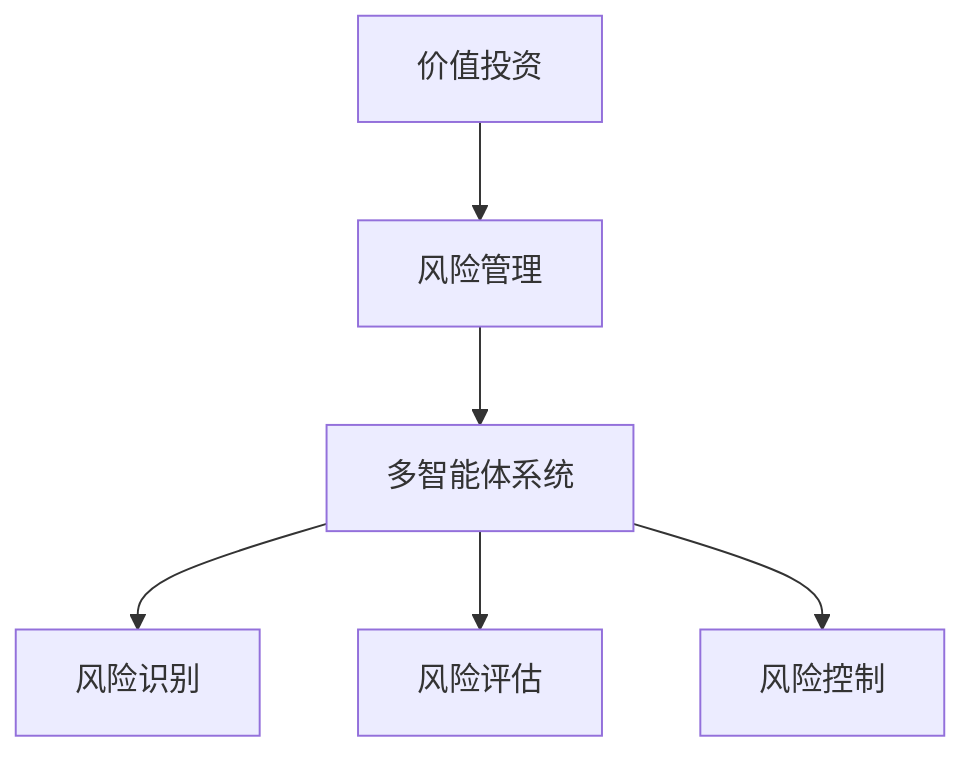
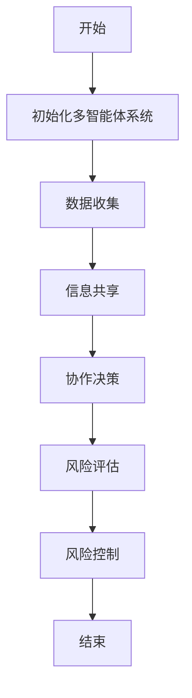
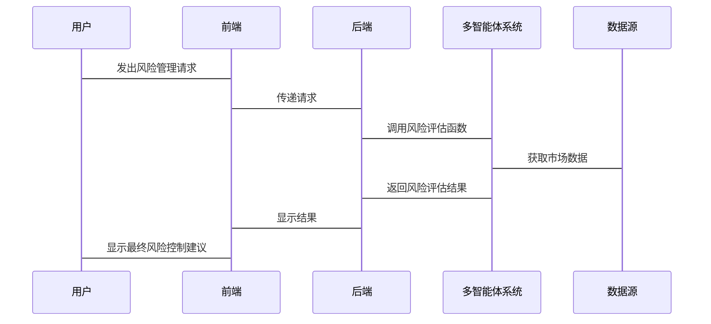

                 


# 目录大纲：《AI多智能体在价值投资中的风险管理和控制》

---

## 第一部分：引言

## 第1章：引言

### 1.1 本书的目的与意义
- **1.1.1 为什么研究AI多智能体在风险管理中的应用**  
  - 传统风险管理的局限性  
  - AI多智能体的优势  
- **1.1.2 本书的核心目标与价值**  
  - 提供理论与实践结合的解决方案  
  - 推动AI多智能体在金融领域的应用  

### 1.2 本书的结构与内容概述
- **1.2.1 各章节的核心内容**  
  - 背景介绍：价值投资与风险管理的基础  
  - 核心概念：AI多智能体的基本原理  
  - 算法原理：数学模型与实现方法  
  - 系统架构：设计与实现细节  
  - 项目实战：实际案例分析  
- **1.2.2 读者对象与学习路径**  
  - 适用于金融从业者、AI开发者和学术研究者  
  - 学习路径建议：从理论到实践  

### 1.3 本章小结
- 总结引言部分的主要内容，引出后续章节的主题  

---

## 第二部分：价值投资与风险管理的背景

## 第2章：价值投资与风险管理的背景

### 2.1 价值投资的基本概念
- **2.1.1 价值投资的定义与核心理念**  
  - 价值投资的定义  
  - 核心理念：寻找被市场低估的投资标的  
- **2.1.2 价值投资的关键要素**  
  - 财务分析  
  - 市场情绪  
  - 行业趋势  

### 2.2 风险管理在价值投资中的重要性
- **2.2.1 风险管理的基本概念**  
  - 风险的定义  
  - 风险管理的目标  
- **2.2.2 风险管理在投资中的作用**  
  - 控制损失  
  - 提高投资收益  

### 2.3 AI与多智能体技术的引入
- **2.3.1 AI在金融领域的应用现状**  
  - AI在金融分析中的应用  
  - AI在风险管理中的应用  
- **2.3.2 多智能体系统的基本概念**  
  - 多智能体系统的定义  
  - 多智能体系统的特性  

### 2.4 本章小结
- 总结价值投资与风险管理的基本概念，引出AI多智能体的应用  

---

## 第三部分：AI多智能体系统的核心概念

## 第3章：AI多智能体系统的核心概念

### 3.1 多智能体系统的定义与特点
- **3.1.1 多智能体系统的定义**  
  - 多智能体系统的定义  
  - 多智能体系统的组成部分  
- **3.1.2 多智能体系统的特性**  
  - 分布式协作  
  - 自适应性  
  - 可扩展性  

### 3.2 AI多智能体在风险管理中的作用
- **3.2.1 多智能体协作的基本原理**  
  - 协作机制  
  - 信息共享  
- **3.2.2 多智能体在风险识别与控制中的应用**  
  - 风险识别  
  - 风险评估  
  - 风险控制  

### 3.3 多智能体系统与其他风险管理方法的对比
- **3.3.1 基于传统模型的风险管理方法**  
  - 优缺点分析  
- **3.3.2 基于AI单智能体的方法**  
  - 优缺点分析  
- **3.3.3 多智能体系统的独特优势**  
  - 分布式协作  
  - 自适应性  

### 3.4 核心概念关系图（Mermaid流程图）


### 3.5 本章小结
- 总结多智能体系统的核心概念及其在风险管理中的作用  

---

## 第四部分：AI多智能体系统的算法原理与实现

## 第4章：AI多智能体系统的算法原理与实现

### 4.1 算法原理
- **4.1.1 多智能体协作的数学模型**  
  - 分布式优化模型  
  - 协作机制的数学表达  
- **4.1.2 风险管理的数学模型**  
  - 风险评估模型  
  - 风险控制策略  

### 4.2 算法实现
- **4.2.1 多智能体协作的实现步骤**  
  - 初始化  
  - 信息共享  
  - 协作决策  
- **4.2.2 风险管理的实现步骤**  
  - 数据收集  
  - 模型训练  
  - 风险控制  

### 4.3 算法实现的代码示例
```python
import numpy as np

class Agent:
    def __init__(self, id):
        self.id = id
        self.state = None
        self.action = None

    def receive_info(self, info):
        self.state = info

    def make_decision(self):
        # 具体决策逻辑
        pass

class MultiAgentSystem:
    def __init__(self, num_agents):
        self.agents = [Agent(i) for i in range(num_agents)]

    def run(self):
        for agent in self.agents:
            agent.receive_info("市场数据")
            agent.make_decision()
```

### 4.4 算法流程图（Mermaid流程图）


### 4.5 本章小结
- 总结算法原理与实现过程  

---

## 第五部分：系统架构与风险管理控制

## 第5章：系统架构与风险管理控制

### 5.1 系统架构设计
- **5.1.1 系统架构图（Mermaid架构图）**  
  ```mermaid
  graph LR
  A[用户界面] --> B[前端]
  B --> C[后端]
  C --> D[多智能体系统]
  D --> E[数据源]
  ```
- **5.1.2 系统功能设计**  
  - 数据处理模块  
  - 风险评估模块  
  - 风险控制模块  

### 5.2 系统接口设计
- **5.2.1 系统接口描述**  
  - API接口定义  
  - 接口调用流程  

### 5.3 系统交互流程（Mermaid序列图）


### 5.4 系统实现与测试
- **5.4.1 系统实现步骤**  
  - 环境搭建  
  - 代码实现  
  - 系统测试  

### 5.5 本章小结
- 总结系统架构设计与实现过程  

---

## 第六部分：项目实战与案例分析

## 第6章：项目实战与案例分析

### 6.1 项目背景
- **6.1.1 项目简介**  
  - 项目目标  
  - 项目范围  

### 6.2 项目环境安装
- **6.2.1 环境要求**  
  - 操作系统  
  - Python版本  
  - 依赖库安装  

### 6.3 系统核心实现
- **6.3.1 代码实现**  
  - 多智能体系统的实现  
  - 风险管理模块的实现  

### 6.4 案例分析
- **6.4.1 案例背景**  
  - 案例目标  
  - 数据来源  
- **6.4.2 案例分析**  
  - 数据分析  
  - 风险评估  
  - 风险控制  

### 6.5 项目总结
- **6.5.1 项目成果**  
  - 系统实现效果  
  - 投资收益分析  
- **6.5.2 经验与教训**  
  - 成功经验  
  - 改进方向  

### 6.6 本章小结
- 总结项目实战与案例分析  

---

## 第七部分：总结与展望

## 第7章：总结与展望

### 7.1 本书总结
- **7.1.1 核心内容回顾**  
  - AI多智能体在风险管理中的应用  
  - 系统架构与实现  

### 7.2 未来展望
- **7.2.1 技术发展**  
  - 多智能体技术的未来趋势  
  - AI在金融领域的潜力  
- **7.2.2 应用场景扩展**  
  - 新的金融场景应用  
  - 跨领域应用的可能性  

### 7.3 最佳实践与注意事项
- **7.3.1 最佳实践**  
  - 系统设计原则  
  - 开发与维护建议  
- **7.3.2 注意事项**  
  - 风险管理的局限性  
  - 技术实现的挑战  

### 7.4 本章小结
- 总结全文，展望未来  

---

## 作者信息

**作者：AI天才研究院/AI Genius Institute & 禅与计算机程序设计艺术 /Zen And The Art of Computer Programming**

---

通过以上大纲，我们可以系统地撰写一篇关于AI多智能体在价值投资中的风险管理和控制的高质量技术博客文章，内容详实、结构清晰，能够为读者提供深刻的技术洞察和实践指导。

