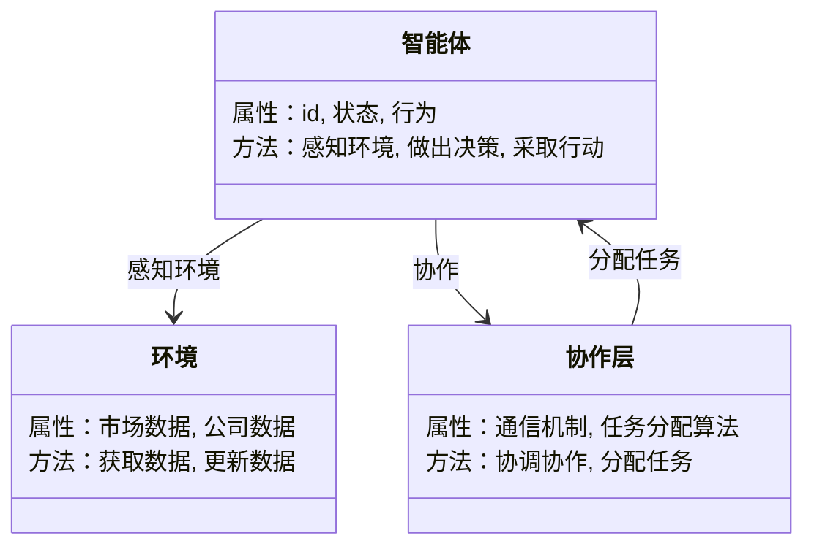
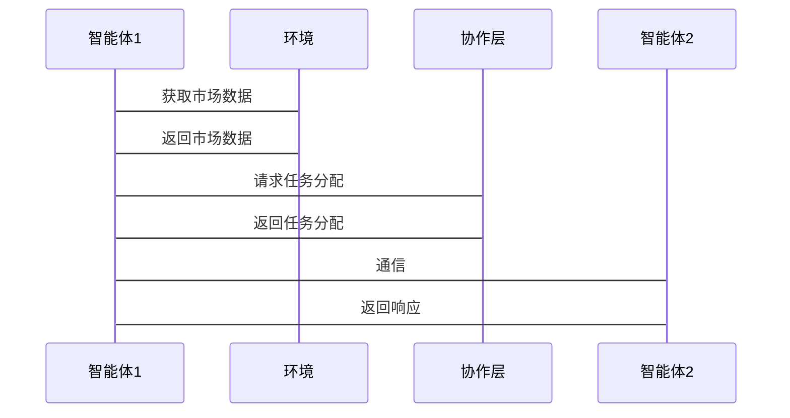

                 


---

# AI多智能体在价值投资中的风险评估应用

> 关键词：AI多智能体，价值投资，风险评估，金融建模，智能系统，投资策略

> 摘要：本文探讨了AI多智能体在价值投资中的应用，特别是其在风险评估中的潜力。通过分析多智能体系统的原理、协作机制以及其在金融建模中的优势，本文揭示了AI多智能体如何帮助投资者更准确地识别和管理风险。同时，本文还结合实际案例，展示了AI多智能体在价值投资中的实际应用，并提出了未来的发展方向。

---

## 第1章: AI多智能体与价值投资概述

### 1.1 多智能体系统的基本概念

#### 1.1.1 多智能体系统的定义

多智能体系统（Multi-Agent System, MAS）是由多个相互作用的智能体组成的系统，这些智能体能够通过协作完成复杂的任务。与单智能体系统相比，MAS具有更强的分布式计算能力和更高的容错性。

#### 1.1.2 多智能体系统的特性

- **分布性**：智能体分布在不同的位置，独立运行。
- **协作性**：智能体之间通过通信和协作完成共同目标。
- **反应性**：智能体能够根据环境的变化动态调整行为。
- **社会性**：智能体之间存在社会关系和交互。

#### 1.1.3 多智能体系统与单智能体系统的区别

| 特性 | 多智能体系统 | 单智能体系统 |
|------|--------------|--------------|
| 独立性 | 高            | 低            |
| 协作性 | 高            | 无            |
| 可扩展性 | 高            | 低            |
| 复杂性 | 高            | 低            |

### 1.2 价值投资的基本概念

#### 1.2.1 价值投资的定义

价值投资是一种投资策略，旨在通过分析公司的基本面，寻找被市场低估的投资标的。其核心理念是“以合理的价格买入优质的资产”。

#### 1.2.2 价值投资的核心理念

- **长期视角**：关注企业的长期价值，而非短期波动。
- **安全边际**：买入价格低于内在价值，以降低风险。
- **独立思考**：避免盲目跟从市场情绪。

#### 1.2.3 价值投资与风险评估的关系

价值投资强调在合理的价格买入优质资产，而风险评估是确保价格合理的重要手段。通过风险评估，投资者可以更好地识别潜在风险，制定合理的投资策略。

### 1.3 AI多智能体在价值投资中的应用背景

#### 1.3.1 传统价值投资的局限性

- **信息处理能力有限**：传统价值投资依赖人工分析，难以处理海量数据。
- **决策效率低下**：人工分析耗时长，难以及时捕捉市场机会。
- **主观性较强**：不同分析师对同一公司可能有不同的估值，导致结果不一致。

#### 1.3.2 AI技术在金融领域的应用现状

- **量化投资**：利用算法进行高频交易和套利。
- **风险管理**：通过机器学习模型预测市场风险。
- **智能投顾**：为投资者提供个性化的投资建议。

#### 1.3.3 多智能体系统在金融投资中的优势

- **分布式计算**：多个智能体可以同时处理不同类型的数据。
- **协作能力**：智能体之间可以协同工作，提高决策的准确性。
- **动态适应**：智能体能够根据市场变化实时调整策略。

## 1.4 本章小结

本章介绍了多智能体系统的基本概念和特性，阐述了价值投资的核心理念及其与风险评估的关系。同时，分析了AI多智能体在价值投资中的应用背景及其优势，为后续章节的深入探讨奠定了基础。

---

## 第2章: 多智能体系统的原理

### 2.1 多智能体系统的组成结构

#### 2.1.1 智能体的定义与属性

智能体（Agent）是具有感知环境、做出决策并采取行动的实体。其主要属性包括：

- **自主性**：能够自主决策。
- **反应性**：能够感知环境并做出反应。
- **社会性**：能够与其他智能体交互。

#### 2.1.2 多智能体系统的层次结构

多智能体系统的层次结构通常包括：

1. **智能体层**：具体执行任务的智能体。
2. **协作层**：协调多个智能体之间的协作。
3. **环境层**：智能体所处的外部环境。

#### 2.1.3 多智能体系统中的通信机制

智能体之间的通信可以通过以下方式进行：

- **直接通信**：智能体之间直接交换信息。
- **间接通信**：通过中间媒介传递信息。
- **发布-订阅模型**：智能体发布信息，其他智能体订阅信息。

### 2.2 多智能体系统的协作机制

#### 2.2.1 协作任务分配算法

协作任务分配算法是多智能体系统中分配任务的核心算法。常见的算法包括：

1. **基于角色分配的算法**：根据智能体的角色分配任务。
2. **基于能力分配的算法**：根据智能体的能力分配任务。
3. **基于优先级的算法**：根据任务的优先级分配任务。

#### 2.2.2 协作通信协议

协作通信协议是智能体之间通信的规则，通常包括以下内容：

- **通信格式**：信息的格式和结构。
- **通信频率**：信息的发送和接收频率。
- **通信内容**：信息的具体内容。

#### 2.2.3 协作决策模型

协作决策模型是多智能体系统中做出决策的核心模型。常见的协作决策模型包括：

1. **分布式决策模型**：每个智能体独立做出决策。
2. **集中式决策模型**：由一个中心决策机构做出决策。
3. **混合式决策模型**：结合分布式和集中式决策的优点。

### 2.3 多智能体系统的实现框架

#### 2.3.1 基于MAS（多智能体系统）的架构

MAS架构是多智能体系统的典型架构，包括：

1. **环境**：智能体所处的外部环境。
2. **智能体**：具体执行任务的智能体。
3. **协作层**：协调多个智能体之间的协作。

#### 2.3.2 基于DAG（有向无环图）的协作网络

DAG协作网络是一种用于表示智能体之间协作关系的图结构。节点代表智能体，边代表协作关系。

#### 2.3.3 基于图论的多智能体关系建模

通过图论方法，可以将多智能体系统中的关系建模为图结构，其中节点代表智能体，边代表关系。

### 2.4 本章小结

本章详细介绍了多智能体系统的组成结构、协作机制和实现框架，为后续章节的应用分析奠定了理论基础。

---

## 第3章: 风险评估的基本原理

### 3.1 风险评估的定义与分类

#### 3.1.1 风险的定义

风险是指在投资过程中可能发生的损失或收益低于预期的情况。

#### 3.1.2 风险的分类

风险可以分为以下几类：

1. **市场风险**：由于市场波动导致的损失。
2. **信用风险**：由于借款人违约导致的损失。
3. **操作风险**：由于操作失误导致的损失。
4. **流动性风险**：由于资产难以变现导致的损失。

#### 3.1.3 风险评估的重要性

风险评估是投资决策的重要组成部分，能够帮助投资者识别潜在风险，制定合理的投资策略。

### 3.2 传统风险评估方法

#### 3.2.1 基于统计学的评估方法

常用的统计学方法包括：

1. **方差-协方差法**：计算资产的方差和协方差，评估投资组合的风险。
2. **历史模拟法**：通过历史数据模拟未来风险。

#### 3.2.2 基于概率论的评估方法

概率论方法包括：

1. **蒙特卡洛模拟**：通过随机抽样模拟未来风险。
2. **VaR（在险价值）**：计算投资组合在一定置信水平下的最大损失。

#### 3.2.3 基于回归分析的评估方法

回归分析方法用于分析变量之间的关系，预测潜在风险。

### 3.3 基于AI的现代风险评估方法

#### 3.3.1 基于机器学习的评估方法

机器学习方法包括：

1. **支持向量机（SVM）**：用于分类和回归分析。
2. **随机森林**：用于分类和回归分析。
3. **神经网络**：用于复杂非线性关系的建模。

#### 3.3.2 基于深度学习的评估方法

深度学习方法包括：

1. **卷积神经网络（CNN）**：用于图像和文本数据的处理。
2. **循环神经网络（RNN）**：用于时间序列数据的处理。
3. **生成对抗网络（GAN）**：用于生成新的数据样本。

#### 3.3.3 基于强化学习的评估方法

强化学习方法包括：

1. **Q-learning**：通过奖励机制优化决策。
2. **Deep Q-Networks（DQN）**：结合深度学习和强化学习，优化决策。

### 3.4 本章小结

本章介绍了风险评估的基本原理和传统方法，同时探讨了基于AI的现代风险评估方法，为后续章节的应用分析奠定了基础。

---

## 第4章: AI多智能体在风险评估中的应用

### 4.1 多智能体系统在风险识别中的应用

#### 4.1.1 多智能体系统如何识别市场风险

多智能体系统可以通过分析市场数据，识别潜在的市场风险。例如，智能体可以通过分析股票价格的波动，预测市场的波动风险。

#### 4.1.2 多智能体系统如何识别信用风险

多智能体系统可以通过分析企业的财务数据，识别潜在的信用风险。例如，智能体可以通过分析企业的财务报表，预测企业的违约概率。

#### 4.1.3 多智能体系统如何识别操作风险

多智能体系统可以通过分析操作数据，识别潜在的操作风险。例如，智能体可以通过分析交易记录，发现操作中的异常行为。

### 4.2 多智能体系统在风险量化中的应用

#### 4.2.1 基于多智能体的蒙特卡洛模拟

蒙特卡洛模拟是一种常用的概率模拟方法，可以通过多智能体系统的协作，生成大量的模拟场景，评估风险。

#### 4.2.2 基于多智能体的VaR（在险价值）计算

VaR是衡量投资组合风险的重要指标，可以通过多智能体系统的协作，计算投资组合在一定置信水平下的最大损失。

#### 4.2.3 基于多智能体的CVaR（条件在险价值）计算

CVaR是VaR的扩展，用于衡量在VaR水平下的平均损失，可以通过多智能体系统的协作，计算投资组合的CVaR。

### 4.3 多智能体系统在风险对冲中的应用

#### 4.3.1 多智能体系统的对冲策略

多智能体系统可以通过协作，制定有效的对冲策略。例如，智能体可以通过分析市场数据，制定套期保值策略，降低投资组合的风险。

#### 4.3.2 多智能体系统的风险分散

多智能体系统可以通过协作，实现投资组合的风险分散。例如，智能体可以通过分析不同资产的风险收益特征，制定多元化的投资策略。

#### 4.3.3 多智能体系统的动态调整

多智能体系统可以通过协作，动态调整投资策略。例如，智能体可以通过分析市场变化，及时调整投资组合，降低风险。

### 4.4 本章小结

本章探讨了AI多智能体在风险评估中的应用，特别是在风险识别、风险量化和风险对冲中的应用。通过多智能体系统的协作，可以提高风险评估的准确性和效率。

---

## 第5章: 项目实战与案例分析

### 5.1 项目背景

本项目旨在利用AI多智能体技术，构建一个用于价值投资风险评估的系统。通过多智能体系统的协作，实现对投资组合的风险识别、量化和对冲。

### 5.2 系统功能设计

#### 5.2.1 领域模型设计

领域模型设计如下：



#### 5.2.2 系统架构设计

系统架构设计如下：


#### 5.2.3 接口和交互设计

接口和交互设计如下：



### 5.3 代码实现

#### 5.3.1 环境数据获取

```python
class Environment:
    def __init__(self):
        self.market_data = {}
    
    def get_market_data(self):
        # 获取市场数据
        pass
```

#### 5.3.2 智能体设计

```python
class Agent:
    def __init__(self, id):
        self.id = id
        self.state = None
        self.action = None
    
    def perceive_environment(self, environment):
        # 感知环境
        pass
    
    def decide_action(self):
        # 做出决策
        pass
    
    def take_action(self):
        # 采取行动
        pass
```

#### 5.3.3 协作层设计

```python
class CollaborationLayer:
    def __init__(self):
        self.communication_protocol = None
        self.task_allocation_algorithm = None
    
    def coordinate_agents(self, agents):
        # 协调智能体
        pass
    
    def allocate_tasks(self, agents, tasks):
        # 分配任务
        pass
```

### 5.4 案例分析

#### 5.4.1 案例背景

假设我们有一个包含10只股票的投资组合，我们需要利用AI多智能体系统对其进行风险评估。

#### 5.4.2 数据收集

从市场获取每只股票的历史价格数据、财务数据等。

#### 5.4.3 数据分析

通过多智能体系统的协作，分析每只股票的风险收益特征，构建投资组合的风险模型。

#### 5.4.4 结果展示

通过可视化工具，展示投资组合的风险评估结果，包括VaR、CVaR等指标。

### 5.5 本章小结

本章通过实际案例展示了AI多智能体在价值投资风险评估中的应用，详细介绍了系统的功能设计、架构设计和代码实现，并通过案例分析验证了系统的有效性。

---

## 第6章: 总结与展望

### 6.1 本章总结

本文探讨了AI多智能体在价值投资中的风险评估应用，分析了多智能体系统的原理和协作机制，并结合实际案例，展示了其在风险识别、量化和对冲中的应用。通过多智能体系统的协作，可以提高风险评估的准确性和效率。

### 6.2 未来展望

未来，随着AI技术的不断发展，多智能体系统在金融领域的应用将更加广泛。以下是未来的发展方向：

1. **智能体的自我学习能力**：通过强化学习等技术，提高智能体的自我学习能力。
2. **多智能体系统的可扩展性**：通过分布式计算和云计算等技术，提高系统的可扩展性。
3. **多智能体系统的实时性**：通过边缘计算和实时数据处理技术，提高系统的实时性。

### 6.3 最佳实践 tips

- **数据质量**：确保数据的准确性和完整性，是提高风险评估准确性的关键。
- **模型选择**：根据具体场景选择合适的模型，是提高系统性能的关键。
- **系统维护**：定期维护和更新系统，是保持系统稳定性和高效性的关键。

### 6.4 小结

本文通过理论分析和实际案例，展示了AI多智能体在价值投资中的风险评估应用，为未来的实践提供了有益的参考。

---

## 作者：AI天才研究院/AI Genius Institute & 禅与计算机程序设计艺术 /Zen And The Art of Computer Programming

---

这篇文章详细介绍了AI多智能体在价值投资中的风险评估应用，涵盖了从理论到实践的各个方面，为读者提供了全面的视角和深入的分析。

