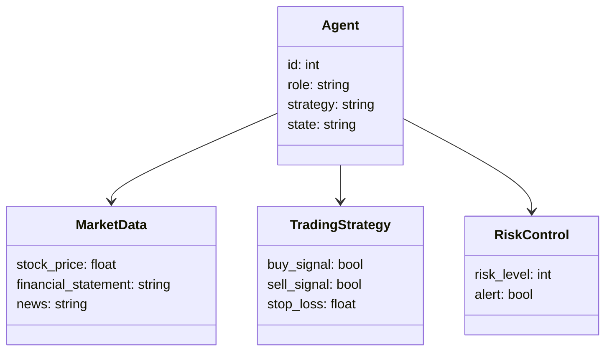

                 


# AI多智能体在价值陷阱识别中的应用

**关键词**：AI多智能体，价值陷阱识别，金融投资，协同算法，博弈论模型

**摘要**：  
本文探讨了AI多智能体在价值陷阱识别中的应用，详细分析了多智能体系统的核心概念、算法原理、系统架构及实际案例。通过结合博弈论模型和强化学习算法，本文展示了如何利用多智能体系统的优势来提高价值陷阱识别的准确性和效率。文章还提供了系统的数学模型和实现代码，为读者提供了理论与实践相结合的深度解析。

---

## 第一部分：AI多智能体与价值陷阱识别的背景与基础

### 第1章：多智能体系统概述

#### 1.1 多智能体系统的定义与特点
##### 1.1.1 多智能体系统的定义  
多智能体系统（Multi-Agent System, MAS）是由多个智能体（Agent）组成的分布式系统，每个智能体能够独立感知环境、做出决策并执行动作。智能体之间通过通信和协作完成复杂的任务。

##### 1.1.2 多智能体系统的核心特点
- **分布式性**：多个智能体协同工作，避免单点故障。
- **自主性**：智能体能够自主决策，无需外部干预。
- **协作性**：智能体之间通过通信和协作完成共同目标。
- **动态性**：系统能够适应环境的变化。

##### 1.1.3 多智能体与单智能体的区别
| 特性       | 单智能体                  | 多智能体                  |
|------------|--------------------------|--------------------------|
| 系统结构   | 单点控制                 | 分布式协作                |
| 故障容错   | 单点故障可能导致系统瘫痪 | 多点协作，容错能力强       |
| 任务处理   | 单任务处理                | 多任务协作                |

#### 1.2 多智能体系统的应用场景
##### 1.2.1 金融领域的多智能体应用
- 股票交易：智能体协同分析市场数据，优化交易策略。
- 风险控制：多个智能体实时监控市场风险，及时预警。

##### 1.2.2 其他领域的多智能体应用
- 智能交通：智能体协同优化交通流量。
- 游戏AI：多智能体协同完成复杂游戏任务。

##### 1.2.3 多智能体系统的潜力与挑战
- 潜力：提高系统效率，增强问题解决能力。
- 挑战：通信延迟、协作复杂性、资源分配优化。

#### 1.3 价值陷阱识别的背景与挑战
##### 1.3.1 价值陷阱的定义与特征
- **定义**：价值陷阱是指某些资产或公司看似具有投资价值，但实际上存在隐藏风险或根本无法实现预期收益的情况。
- **特征**：低流动性、高负债、盈利能力下降、行业周期性等。

##### 1.3.2 价值陷阱识别的难点
- 数据复杂性：涉及财务数据、市场数据、行业数据等。
- 动态变化：市场环境不断变化，价值陷阱的特征也在动态变化。
- 模型构建：需要结合多种因素构建复杂模型。

---

## 第二部分：多智能体系统的核心算法与数学模型

### 第4章：多智能体系统的核心算法

#### 4.1 多智能体系统中的通信与协作
##### 4.1.1 通信协议的设计
- 智能体之间需要通过消息传递实现通信。
- 消息格式：JSON、XML等，便于解析和处理。

##### 4.1.2 协作机制的实现
- 协作策略：基于任务优先级的协作策略。
- 协作协议：基于分布式共识算法（如RAFT）实现协作。

##### 4.1.3 信息共享的策略
- 分布式数据存储：使用区块链技术实现数据共享。
- 数据隐私保护：通过加密技术确保数据安全。

#### 4.2 多智能体系统中的博弈论模型
##### 4.2.1 博弈论基础
- **博弈论**：研究理性决策者之间的策略互动。
- **纳什均衡**：一种策略组合，使得每个参与者在给定其他参与者策略的情况下，无法通过单方面改变策略而获益。

##### 4.2.2 纳什均衡的概念
- **定义**：在纳什均衡中，每个参与者选择的策略都是最佳反应。
- **应用**：用于分析多智能体系统的策略互动。

##### 4.2.3 博弈论在多智能体中的应用
- **案例分析**：股票交易中的多方博弈。
- **模型构建**：基于博弈论的多智能体交易策略。

### 第5章：价值陷阱识别的数学模型

#### 5.1 价值评估模型
##### 5.1.1 基于财务指标的价值评估
- **市盈率（P/E）**：股价与每股收益的比率。
- **市净率（P/B）**：股价与每股净资产的比率。
- **ROE（净资产收益率）**：衡量公司盈利能力的指标。

##### 5.1.2 基于市场表现的价值评估
- **股价走势**：通过技术分析预测股价波动。
- **成交量分析**：分析成交量变化判断市场情绪。

##### 5.1.3 综合评估模型的设计
- **模型输入**：财务数据、市场数据、行业数据。
- **模型输出**：价值评估分数，分数越高，投资价值越大。

#### 5.2 价值陷阱识别的分类模型
##### 5.2.1 分类算法的选择
- **决策树**：适合处理多分类问题。
- **支持向量机（SVM）**：适合高维数据分类。
- **随机森林**：适合处理非线性关系。

##### 5.2.2 分类模型的训练
- **数据预处理**：缺失值处理、标准化、特征选择。
- **模型训练**：使用训练数据进行模型参数优化。
- **模型验证**：使用验证数据评估模型性能。

##### 5.2.3 模型评估与优化
- **评估指标**：准确率、召回率、F1分数。
- **优化方法**：交叉验证、网格搜索、超参数调优。

#### 5.3 多智能体协同算法的数学推导
##### 5.3.1 协同目标的定义
- **目标函数**：最大化整体收益，最小化个体风险。
- **约束条件**：资源限制、时间限制、信息共享限制。

##### 5.3.2 协同策略的数学模型
- **协同收益函数**：$R = \sum_{i=1}^{n} r_i$，其中$r_i$是第$i$个智能体的收益。
- **协同成本函数**：$C = \sum_{i=1}^{n} c_i$，其中$c_i$是第$i$个智能体的成本。
- **净收益函数**：$Net = R - C$。

---

## 第三部分：系统架构与项目实战

### 第6章：系统架构设计

#### 6.1 问题场景介绍
- **目标**：识别价值陷阱，优化投资组合。
- **需求**：实时数据处理、多智能体协作、高精度预测。

#### 6.2 系统功能设计
##### 6.2.1 领域模型（Mermaid 类图）


##### 6.2.2 系统架构设计（Mermaid 架构图）
```mermaid
archi
    高层模块 --> 中间模块 --> 底层模块
    中间模块 --> 数据库
    底层模块 --> 外部系统
```

#### 6.3 系统接口设计
##### 6.3.1 数据接口
- 数据输入：市场数据接口。
- 数据输出：预测结果接口。

##### 6.3.2 交互接口
- 用户界面：可视化界面，展示分析结果。
- API接口：提供外部调用接口。

#### 6.4 系统交互设计（Mermaid 序列图）
```mermaid
sequenceDiagram
    participant A: Agent 1
    participant B: Agent 2
    A -> B: 通信请求
    B -> A: 响应
    A -> MarketData: 获取数据
    MarketData -> A: 返回数据
    A -> TradingStrategy: 执行策略
    TradingStrategy -> A: 返回信号
    A -> RiskControl: 控制风险
    RiskControl -> A: 返回结果
```

### 第7章：项目实战

#### 7.1 环境安装
- **编程语言**：Python 3.8+
- **库依赖**：Pandas、NumPy、Scikit-learn、Plotly。

#### 7.2 核心实现代码
##### 7.2.1 数据预处理
```python
import pandas as pd
import numpy as np

# 读取数据
data = pd.read_csv('market_data.csv')

# 数据清洗
data.dropna()
data = data[~data['volume'].isin([0])]
data = data[~data['close'].isin([0])]
```

##### 7.2.2 模型训练
```python
from sklearn.ensemble import RandomForestClassifier
from sklearn.metrics import accuracy_score

# 特征选择
X = data[['open', 'high', 'low', 'close', 'volume']]
y = data['target']

# 训练模型
model = RandomForestClassifier()
model.fit(X, y)

# 验证模型
y_pred = model.predict(X)
print("Accuracy:", accuracy_score(y, y_pred))
```

##### 7.2.3 系统实现
```python
import json
import requests

# 智能体通信
def send_message(agent_id, message):
    payload = json.dumps({'agent_id': agent_id, 'message': message})
    response = requests.post('http://localhost:5000/api', data=payload)
    return response.json()

# 交易策略
def execute_trade(symbol, quantity):
    params = {'symbol': symbol, 'quantity': quantity}
    response = requests.get('http://localhost:5000/trade', params=params)
    return response.json()
```

#### 7.3 实际案例分析
- **案例背景**：某公司财务数据异常，市场表现不佳。
- **模型预测**：模型预测该股票存在价值陷阱。
- **系统决策**：多个智能体协同，建议投资者规避该股票。

#### 7.4 项目小结
- **优势**：提高识别精度，降低投资风险。
- **不足**：需要更多的数据支持，模型优化空间大。

---

## 第四部分：总结与展望

### 第8章：总结与展望

#### 8.1 核心内容回顾
- 多智能体系统的核心概念。
- 价值陷阱识别的算法与模型。
- 系统架构与项目实战。

#### 8.2 研究意义与未来展望
- **研究意义**：提高投资决策的科学性。
- **未来展望**：结合区块链技术，构建去中心化的价值陷阱识别系统。

#### 8.3 最佳实践 Tips
- 数据质量是关键，确保数据的完整性和准确性。
- 模型优化需要结合实际场景，进行针对性调整。
- 系统设计需要考虑可扩展性和可维护性。

---

## 作者信息

**作者：AI天才研究院 & 禅与计算机程序设计艺术**  
**简介**：专注于人工智能与计算机科学的交叉研究，致力于推动技术创新与应用实践。

---

通过以上结构，本文系统地探讨了AI多智能体在价值陷阱识别中的应用，从理论到实践，为读者提供了全面的技术解析。

