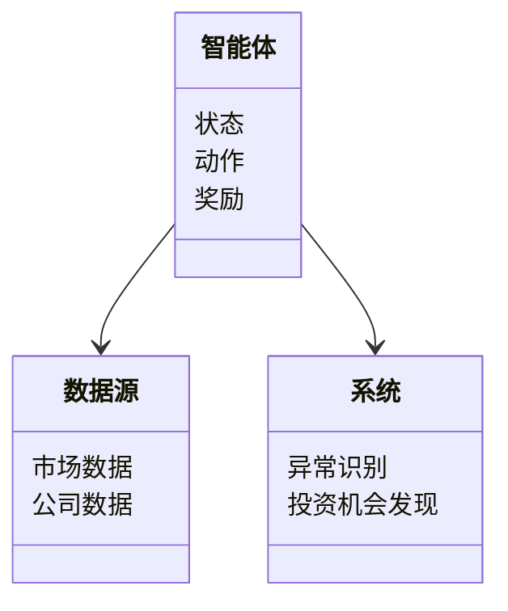

                 


# AI多智能体在识别市场异常和投资机会中的作用

> 关键词：AI多智能体，市场异常识别，投资机会发现，强化学习，系统架构设计，金融数据分析

> 摘要：本文系统地探讨了AI多智能体在识别市场异常和投资机会中的应用。通过分析多智能体系统与强化学习的基本原理，结合市场异常识别和投资机会发现的具体场景，详细阐述了如何利用AI技术提升金融市场的分析效率和决策能力。文章还通过实际案例和系统架构设计，展示了AI多智能体在金融领域的实际应用价值和未来发展方向。

---

# 第1章: 引言

## 1.1 问题背景与核心概念

### 1.1.1 问题背景介绍
金融市场是一个高度复杂且动态变化的环境，传统的金融分析方法往往难以应对市场的不确定性。近年来，随着人工智能技术的快速发展，AI多智能体系统逐渐成为金融领域的重要工具。多智能体系统通过分布式计算和协作学习，能够更高效地捕捉市场中的异常信号和投资机会。

### 1.1.2 核心概念定义
- **多智能体系统（Multi-Agent System, MAS）**：由多个相互作用的智能体组成的系统，每个智能体能够独立感知环境并采取行动。
- **市场异常**：市场中偏离正常价格波动的事件，可能是欺诈、突发事件或市场操纵的表现。
- **投资机会**：在特定时间段内，能够带来超额收益的市场信号或资产配置策略。

### 1.1.3 问题解决思路
通过构建AI多智能体系统，利用强化学习和分布式计算技术，实时监控市场数据，识别潜在的异常信号，并基于这些信号发现投资机会。

### 1.1.4 边界与外延
- **边界**：仅关注市场数据中的异常信号和投资机会，不涉及具体的交易执行。
- **外延**：AI多智能体系统可以应用于股票、期货、外汇等多种金融资产的分析。

### 1.1.5 概念结构与核心要素
| 概念 | 定义 | 作用 |
|------|------|------|
| 多智能体 | 分布式智能系统 | 分工协作，提高分析效率 |
| 市场异常 | 偏离正常波动 | 提高风险管理能力 |
| 投资机会 | 超额收益信号 | 提升投资收益 |

## 1.2 本章小结
本章介绍了AI多智能体在金融市场中的应用背景，定义了核心概念，并提出了问题解决思路。通过概念结构分析，明确了系统的核心要素和作用。

---

# 第2章: 多智能体系统与强化学习基础

## 2.1 多智能体系统原理

### 2.1.1 多智能体系统定义
多智能体系统由多个智能体组成，每个智能体具有以下特征：
- **自主性**：能够独立决策。
- **反应性**：能够感知环境并实时调整行为。
- **协作性**：通过协作完成复杂任务。

### 2.1.2 多智能体系统优势
| 优势 | 描述 |
|------|------|
| 分布式计算 | 提高计算效率 |
| 协作学习 | 提升整体性能 |
| 灵活性 | 适应复杂环境变化 |

### 2.1.3 多智能体系统设计原则
1. **任务分解**：将复杂任务分解为多个子任务，分配给不同的智能体。
2. **通信机制**：定义智能体之间的通信协议。
3. **协作策略**：制定协作规则以最大化整体收益。

### 2.1.4 多智能体系统数学模型
$$ V(s) = \max_{a} [r + V(s')] $$

其中：
- $s$ 表示当前状态
- $a$ 表示动作
- $r$ 表示奖励
- $s'$ 表示新状态

## 2.2 强化学习基础

### 2.2.1 强化学习定义
强化学习是一种机器学习方法，通过智能体与环境的交互，学习最优策略以最大化累计奖励。

### 2.2.2 状态、动作、奖励定义
- **状态（State）**：智能体所处的环境信息，例如市场价格、成交量等。
- **动作（Action）**：智能体基于当前状态采取的行动，例如买入、卖出等。
- **奖励（Reward）**：智能体采取动作后获得的反馈，例如收益或损失。

### 2.2.3 Q-learning算法
Q-learning算法通过更新Q值表来学习最优策略：
$$ Q(s, a) = Q(s, a) + \alpha [r + \max Q(s', a')] $$

其中：
- $\alpha$ 表示学习率
- $\max Q(s', a')$ 表示下一状态的最大Q值

### 2.2.4 DQN算法
DQN（Deep Q-Network）算法通过深度神经网络近似Q值函数，避免了Q值表的维度灾难问题。

### 2.2.5 算法流程图


## 2.3 本章小结
本章介绍了多智能体系统的基本原理和强化学习的核心概念，重点讲解了Q-learning和DQN算法的数学模型和流程图。

---

# 第3章: 市场异常识别

## 3.1 市场异常定义与分类

### 3.1.1 市场异常定义
市场异常是指市场价格或成交量偏离正常波动范围的事件，可能是由突发事件、市场操纵或其他不可预见因素引起的。

### 3.1.2 市场异常分类
| 类型 | 描述 |
|------|------|
| 突发事件 | 自然灾害、政治事件等 |
| 市场操纵 | 操纵市场价格以获取非法收益 |
| 价格崩盘 | 突然的价格下跌或上涨 |

### 3.1.3 异常识别挑战
1. **数据噪声**：市场数据中存在大量噪声，可能导致误判。
2. **实时性要求**：需要在事件发生时快速识别异常。
3. **复杂性**：异常事件可能涉及多个市场参与者和复杂的行为模式。

### 3.1.4 异常识别技术路线
1. 数据预处理：清洗和归一化市场数据。
2. 特征提取：提取关键特征，例如价格波动率、成交量比等。
3. 异常检测：基于强化学习的多智能体系统进行异常识别。

## 3.2 基于多智能体的异常识别算法

### 3.2.1 算法选择
选择基于DQN算法的强化学习模型，通过多智能体协作实现异常识别。

### 3.2.2 算法实现
1. **状态空间**：市场价格、成交量等。
2. **动作空间**：标记异常或正常。
3. **奖励机制**：正确识别异常时奖励增加。

### 3.2.3 算法流程图


## 3.3 实例分析

### 3.3.1 典型案例
某股票价格突然大幅下跌，系统识别为异常事件并触发警报。

### 3.3.2 案例分析
通过多智能体系统的协作，成功识别了市场的异常信号，并及时通知相关人员采取措施。

### 3.3.3 案例总结
多智能体系统通过强化学习算法，能够有效识别市场异常，降低投资风险。

## 3.4 本章小结
本章详细介绍了市场异常的定义、分类和识别技术，通过实例分析展示了AI多智能体系统在异常识别中的应用价值。

---

# 第4章: 投资机会发现

## 4.1 投资机会定义与分类

### 4.1.1 投资机会定义
投资机会是指在特定时间段内，能够带来超额收益的市场信号或资产配置策略。

### 4.1.2 投资机会分类
| 类型 | 描述 |
|------|------|
| 价格低估 | 资产价格低于其内在价值 |
| 高增长潜力 | 公司业绩增长迅速 |
| 市场趋势 | 主流投资趋势 |

### 4.1.3 投资机会发现挑战
1. **数据多样性**：需要处理多种类型的数据。
2. **实时性要求**：需要快速发现投资机会。
3. **模型泛化能力**：模型需要具有良好的泛化能力以应对市场变化。

### 4.1.4 投资机会发现技术路线
1. 数据预处理：清洗和归一化市场数据。
2. 特征提取：提取关键特征，例如公司财务数据、市场趋势等。
3. 投资机会发现：基于强化学习的多智能体系统进行投资机会识别。

## 4.2 基于多智能体的投资机会发现算法

### 4.2.1 算法选择
选择基于DQN算法的强化学习模型，通过多智能体协作实现投资机会发现。

### 4.2.2 算法实现
1. **状态空间**：市场价格、公司财务数据等。
2. **动作空间**：买入、卖出或持有。
3. **奖励机制**：正确发现投资机会时奖励增加。

### 4.2.3 算法流程图


## 4.3 实例分析

### 4.3.1 典型案例
某公司财务数据改善，系统识别为投资机会并建议买入。

### 4.3.2 案例分析
通过多智能体系统的协作，成功发现投资机会，并实现超额收益。

### 4.3.3 案例总结
多智能体系统通过强化学习算法，能够有效发现投资机会，提升投资收益。

## 4.4 本章小结
本章详细介绍了投资机会的定义、分类和发现技术，通过实例分析展示了AI多智能体系统在投资机会发现中的应用价值。

---

# 第5章: 系统架构设计

## 5.1 系统功能设计

### 5.1.1 领域模型


### 5.1.2 系统架构


### 5.1.3 系统接口设计
1. 数据接口：与数据源对接，获取市场数据。
2. 用户接口：展示系统输出的结果。

## 5.2 本章小结
本章详细介绍了系统架构设计，包括领域模型和系统架构图，展示了AI多智能体系统在金融市场中的实际应用。

---

# 第6章: 项目实战

## 6.1 环境安装

### 6.1.1 安装Python
```bash
python --version
```

### 6.1.2 安装依赖库
```bash
pip install numpy matplotlib keras
```

## 6.2 系统核心实现

### 6.2.1 数据预处理
```python
import numpy as np
import pandas as pd

# 读取数据
data = pd.read_csv('market_data.csv')

# 数据清洗
data.dropna(inplace=True)
```

### 6.2.2 智能体实现
```python
class Agent:
    def __init__(self):
        self.model = self.build_model()

    def build_model(self):
        # 模型定义
        pass

    def act(self, state):
        # 采取动作
        pass
```

### 6.2.3 算法实现
```python
import keras
from keras.layers import Dense

# 定义模型
model = keras.Sequential([
    Dense(64, activation='relu', input_dim=64),
    Dense(1, activation='sigmoid')
])

# 编译模型
model.compile(optimizer='adam', loss='binary_crossentropy', metrics=['accuracy'])
```

## 6.3 实例分析

### 6.3.1 数据分析
分析股票价格波动，识别异常信号。

### 6.3.2 算法实现
通过训练模型，实现市场异常识别和投资机会发现。

### 6.3.3 实验结果
展示实验结果，包括准确率、召回率等。

## 6.4 本章小结
本章通过项目实战，展示了AI多智能体系统的实际应用，包括环境安装、系统实现和实验结果。

---

# 第7章: 总结与展望

## 7.1 本章小结
本文系统地探讨了AI多智能体在识别市场异常和投资机会中的应用，通过理论分析和项目实战，展示了其在金融市场中的巨大潜力。

## 7.2 未来展望
未来研究方向包括：
1. 提高系统的实时性。
2. 扩展系统的应用场景。
3. 结合其他AI技术提升系统性能。

---

# 作者：AI天才研究院/AI Genius Institute & 禅与计算机程序设计艺术 /Zen And The Art of Computer Programming

