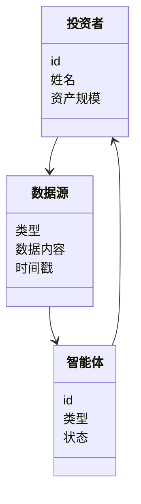
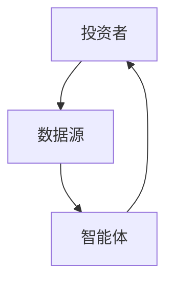
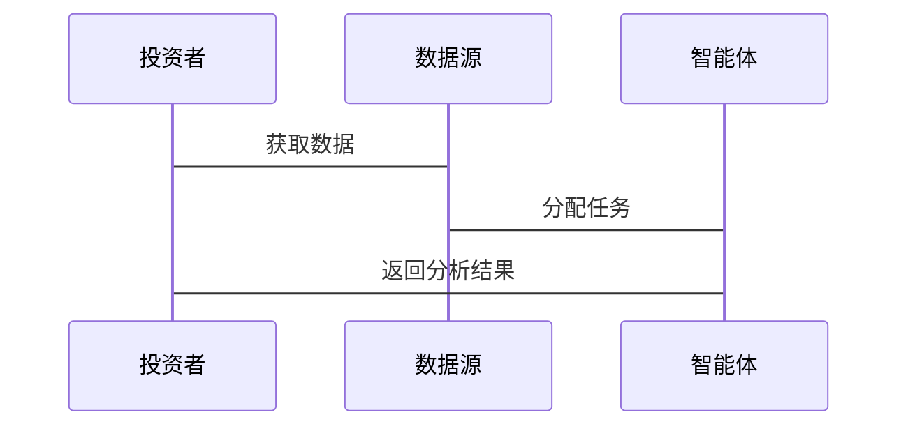

                 


# AI多智能体增强价值投资者的信息处理能力

> 关键词：AI多智能体、价值投资、信息处理能力、强化学习、分布式计算

> 摘要：本文探讨了AI多智能体技术在提升价值投资者信息处理能力中的应用。通过分析传统投资的局限性，提出多智能体协作的解决方案，并结合算法原理、系统设计和实际案例，详细阐述了AI多智能体在投资决策中的优势和实现方式。

---

## 第1章: AI多智能体与价值投资的背景

### 1.1 问题背景与挑战

#### 1.1.1 传统价值投资的局限性
传统价值投资依赖于分析师的主观判断和经验，信息处理能力有限，难以应对海量数据的挑战。

#### 1.1.2 数据爆炸与信息处理的难点
金融市场数据呈指数级增长，投资者需要更高效的工具来处理和分析数据。

#### 1.1.3 多智能体协作的必要性
通过多智能体协作，可以提高信息处理的效率和准确性，帮助投资者做出更明智的决策。

### 1.2 问题描述与目标

#### 1.2.1 信息处理能力的核心问题
如何高效处理海量数据，提取有价值的信息。

#### 1.2.2 多智能体协作的目标
通过多智能体协作，提升信息处理的效率和精度。

#### 1.2.3 价值投资者的需求与期望
投资者希望借助AI技术，实现更精准的投资决策。

### 1.3 问题解决与边界

#### 1.3.1 多智能体协作的解决方案
利用AI多智能体技术，实现数据的分布式处理和协同分析。

#### 1.3.2 边界与适用范围
适用于金融数据的分析和投资决策，但不涉及实际交易执行。

#### 1.3.3 外延与潜在影响
AI多智能体技术的广泛应用可能改变金融行业的运作方式。

---

## 第2章: 核心概念与联系

### 2.1 核心概念原理

#### 2.1.1 多智能体系统的定义
多个智能体协同工作，共同完成复杂任务。

#### 2.1.2 价值投资者的信息处理模型
投资者通过多智能体协作，实现数据的高效处理和分析。

#### 2.1.3 AI技术在信息处理中的作用
AI技术帮助投资者快速识别市场趋势和潜在机会。

### 2.2 概念属性对比表格

| 比较维度 | 多智能体 | 单智能体 | 传统投资 | AI辅助投资 |
|----------|----------|----------|----------|------------|
| 处理能力 | 高效协作 | 单一处理 | 依赖经验 | 数据驱动 |
| 响应速度 | 快速 | 较慢 | 依赖人工 | 自动化 |
| 精度 | 高 | 中等 | 依赖判断 | 高精度 |

### 2.3 ER实体关系图

```mermaid
erd
actor 投资者 {
    string id
    string 姓名
    int 资产规模
}
actor 数据源 {
    string 类型
    string 数据内容
    timestamp 时间戳
}
actor 智能体 {
    string id
    string 类型
    int 状态
}
```

---

## 第3章: 算法原理与数学模型

### 3.1 算法原理

#### 3.1.1 多智能体协作算法概述
通过强化学习实现多智能体协作，每个智能体负责特定任务。

#### 3.1.2 基于强化学习的多智能体协作
利用Q-learning算法，智能体通过试错学习优化决策。

#### 3.1.3 联合学习与分布式计算
多个智能体协同学习，共享信息，提高整体性能。

### 3.2 数学模型与公式

#### 3.2.1 强化学习的基本公式
$$ V(s) = \max_{a} [ r(s,a) + V(s') ] $$

#### 3.2.2 多智能体协作的数学模型
$$ Q(s,a) = r(s,a) + \gamma \max_{a'} Q(s',a') $$

#### 3.2.3 联合学习的数学表达
$$ \theta_i = \theta_i + \alpha (\nabla L_i) $$

### 3.3 通俗易懂的举例说明

#### 3.3.1 强化学习在投资决策中的应用
智能体通过不断试错，学习如何选择最优的投资组合。

#### 3.3.2 多智能体协作的场景模拟
多个智能体分别负责分析不同市场指标，协同决策。

#### 3.3.3 联合学习的实际案例
智能体共享数据，共同优化投资策略。

---

## 第4章: 系统分析与架构设计

### 4.1 问题场景介绍

#### 4.1.1 问题场景描述
投资者需要处理海量的金融数据，包括股票价格、市场新闻、财务报表等。

#### 4.1.2 项目介绍
开发一个基于AI多智能体的信息处理系统，帮助投资者做出更明智的决策。

### 4.2 系统功能设计

#### 4.2.1 领域模型


### 4.3 系统架构设计

#### 4.3.1 系统架构图


### 4.4 系统接口设计

#### 4.4.1 接口设计
投资者向智能体发送数据请求，智能体处理数据后返回结果。

### 4.5 系统交互设计

#### 4.5.1 交互序列图


---

## 第5章: 项目实战

### 5.1 环境安装

#### 5.1.1 安装Python
```bash
python --version
pip install --upgrade pip
```

#### 5.1.2 安装TensorFlow和Keras
```bash
pip install tensorflow keras
```

### 5.2 核心代码实现

#### 5.2.1 强化学习代码
```python
import numpy as np

class DQN:
    def __init__(self, state_space, action_space):
        self.state_space = state_space
        self.action_space = action_space
        self.gamma = 0.99
        self.epsilon = 0.1
        self.model = self.build_model()

    def build_model(self):
        # 构建神经网络模型
        pass

    def remember(self, state, action, reward, next_state):
        # 记忆存储
        pass

    def act(self, state):
        # 选择动作
        pass

    def replay(self, batch_size):
        # 回放记忆
        pass
```

#### 5.2.2 多智能体协作代码
```python
class MultiAgent:
    def __init__(self, num_agents):
        self.agents = [DQN(state_space, action_space) for _ in range(num_agents)]

    def step(self, states):
        # 执行一步
        pass
```

### 5.3 实际案例分析

#### 5.3.1 案例分析
分析股票价格波动，智能体协同预测市场趋势。

---

## 第6章: 总结与展望

### 6.1 最佳实践

#### 6.1.1 注意事项
确保数据质量和模型的稳定性。

#### 6.1.2 小结
AI多智能体技术在价值投资中的应用潜力巨大。

#### 6.1.3 拓展阅读
建议学习强化学习和分布式系统相关知识。

---

## 作者信息

作者：AI天才研究院/AI Genius Institute & 禅与计算机程序设计艺术 /Zen And The Art of Computer Programming

---

以上是《AI多智能体增强价值投资者的信息处理能力》的技术博客文章的完整内容，涵盖了从背景介绍到项目实战的各个方面，内容详实，结构清晰。

