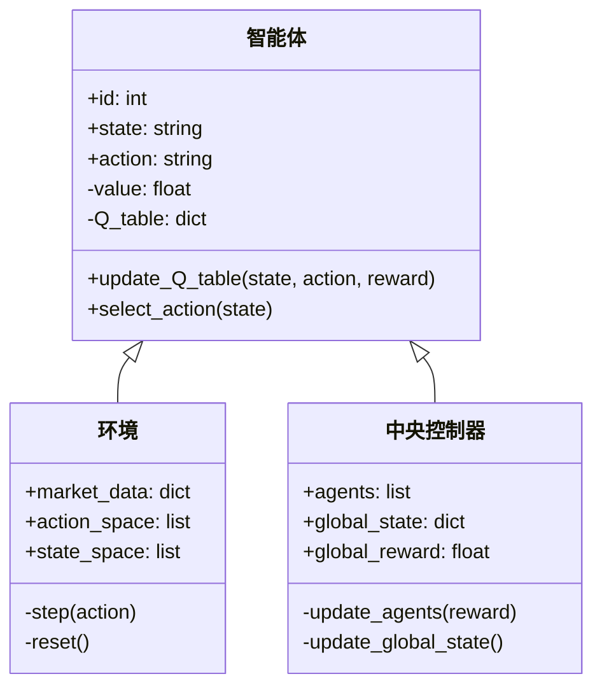
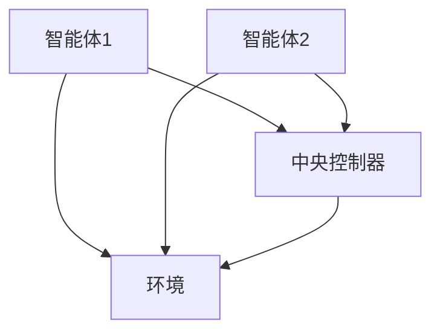
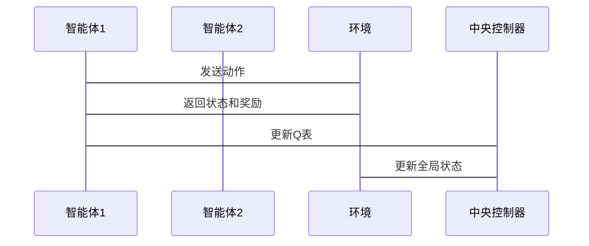

                 


# AI多智能体如何优化价值投资的全球资源配置策略

> 关键词：AI多智能体、价值投资、全球资源配置、分布式决策、协同优化

> 摘要：本文探讨了AI多智能体在优化价值投资中的全球资源配置策略。通过分析多智能体系统的核心概念、算法原理和系统架构，结合实际项目案例，展示了如何利用AI技术实现高效、智能的资源配置。本文还讨论了多智能体在复杂金融环境中的应用前景，为价值投资者和AI技术开发者提供了重要的参考。

---

## 目录

### 第一部分：AI多智能体与价值投资的理论基础

### 第二部分：多智能体系统的算法原理

### 第三部分：多智能体系统的系统架构设计

### 第四部分：基于多智能体的价值投资项目实战

### 第五部分：多智能体系统的高级主题

### 第六部分：总结与展望

---

## 第一部分：AI多智能体与价值投资的理论基础

### 1.1 多智能体系统与价值投资概述

#### 1.1.1 多智能体系统的定义与特点

多智能体系统（Multi-Agent System, MAS）是由多个相互作用的智能体组成的系统，每个智能体都是一个能够感知环境、做出决策并采取行动的实体。多智能体系统的特点包括分布性、协作性、反应性和适应性。与单智能体系统相比，多智能体系统能够更好地处理复杂问题，通过协作实现整体目标。

#### 1.1.2 多智能体系统的优点

1. **分布式决策**：每个智能体独立决策，减少单点故障。
2. **协同优化**：通过协作，系统整体性能优于个体性能。
3. **适应性**：智能体能够根据环境变化调整行为。

#### 1.1.3 多智能体系统的应用场景

多智能体系统广泛应用于机器人、交通控制、分布式计算、金融投资等领域。在金融投资中，多智能体可以用于资产配置、风险管理和交易决策。

#### 1.1.4 价值投资的定义与核心理念

价值投资是一种投资策略，旨在通过识别被市场低估的资产进行投资。其核心理念是寻找具有持续竞争优势和良好治理结构的企业，关注长期价值而非短期市场波动。

#### 1.1.5 多智能体与价值投资的结合

多智能体系统可以用于分析多个资产的价值，优化投资组合，提高资源配置效率。通过多个智能体分别分析不同的资产类别，协同优化整体投资策略。

---

### 1.2 多智能体系统的核心概念

#### 1.2.1 多智能体系统的核心要素

1. **智能体**：能够感知环境、做出决策并采取行动的实体。
2. **通信机制**：智能体之间的信息交换方式。
3. **协作机制**：智能体之间协同工作的规则。
4. **目标函数**：系统优化的目标，如最大化投资收益。

#### 1.2.2 价值函数的定义与数学表达

价值函数（Value Function）是衡量投资组合价值的函数。数学表达式为：

$$ V = f(x_1, x_2, ..., x_n) $$

其中，$x_i$ 表示第i个资产的价值，$f$ 是价值函数的具体形式。

#### 1.2.3 多智能体系统的通信机制

多智能体系统中的通信机制包括直接通信和间接通信。直接通信是智能体之间直接交换信息，间接通信是通过共享环境信息进行通信。

---

### 1.3 多智能体系统与价值投资的结合

#### 1.3.1 多智能体在投资中的优势

通过多个智能体分别分析不同的资产类别，协同优化整体投资策略。每个智能体专注于特定领域，提高分析的深度和广度。

#### 1.3.2 价值投资与多智能体的结合方式

1. **分布式分析**：多个智能体分别分析不同资产，协同得出整体投资策略。
2. **实时优化**：智能体实时更新市场数据，优化投资组合。
3. **风险控制**：通过智能体之间的协作，分散投资风险，优化资产配置。

---

## 第二部分：多智能体系统的算法原理

### 2.1 基于强化学习的多智能体算法

#### 2.1.1 强化学习的基本原理

强化学习是一种通过试错方式学习策略的方法，智能体通过与环境交互，学习最优策略。核心概念包括状态、动作、奖励和策略。

#### 2.1.2 多智能体强化学习的挑战

多智能体强化学习面临通信开销大、策略同步难、目标冲突等问题。

#### 2.1.3 基于Q-learning的多智能体算法

Q-learning是一种经典的强化学习算法，适用于多智能体场景。每个智能体维护一个Q表，记录状态-动作对的价值，通过异步更新优化策略。

---

### 2.2 价值函数的优化算法

#### 2.2.1 基于梯度的优化方法

梯度下降是一种常用的优化方法，通过计算损失函数的梯度，更新参数优化价值函数。

#### 2.2.2 近端策略优化方法

近端策略优化（Proximal Policy Optimization, PPO）是一种策略优化算法，通过限制策略更新的幅度，确保优化过程稳定。

#### 2.2.3 集中式价值函数优化

集中式价值函数优化（CVD）是一种多智能体优化方法，通过集中多个智能体的决策，优化整体价值函数。

---

### 2.3 分布式算法与协同优化

#### 2.3.1 分布式算法的定义

分布式算法是指在分布式系统中，多个智能体协作完成任务的算法。算法的设计需要考虑通信开销、同步问题和一致性保证。

#### 2.3.2 协同优化的原理

通过智能体之间的协作，优化整体目标函数，每个智能体专注于局部优化，最终实现全局最优。

#### 2.3.3 分布式算法的应用

在价值投资中，多个智能体分别分析不同资产类别，协同优化整体投资组合，实现风险可控、收益最大化的目标。

---

## 第三部分：多智能体系统的系统架构设计

### 3.1 系统功能设计

#### 3.1.1 领域模型设计

领域模型（Domain Model）描述了系统的功能模块和交互关系。通过mermaid类图展示系统的核心模块。



---

### 3.2 系统架构设计

#### 3.2.1 系统架构图

系统架构图展示了系统的整体结构，包括智能体、环境和中央控制器的交互关系。



---

### 3.3 系统接口设计

系统接口包括智能体与环境的交互接口、智能体与中央控制器的交互接口，以及中央控制器与环境的交互接口。每个接口定义了输入输出数据格式和调用方式。

---

### 3.4 系统交互设计

通过mermaid序列图展示系统的主要交互流程。



---

## 第四部分：基于多智能体的价值投资项目实战

### 4.1 项目背景与目标

本项目旨在利用多智能体系统优化价值投资的全球资源配置策略，通过多个智能体分别分析不同资产类别，协同优化整体投资组合。

---

### 4.2 项目环境安装

需要安装以下工具和库：

1. Python 3.8+
2. 安装依赖：`pip install numpy matplotlib`

---

### 4.3 核心代码实现

#### 4.3.1 智能体类实现

```python
import numpy as np

class Agent:
    def __init__(self, id):
        self.id = id
        self.Q_table = dict()
        self.learning_rate = 0.1
        self.discount_factor = 0.9

    def select_action(self, state):
        if state not in self.Q_table:
            self.Q_table[state] = np.random.random()
        return max(self.Q_table.keys(), key=lambda s: self.Q_table[s])

    def update_Q_table(self, state, action, reward, next_state):
        current_Q = self.Q_table.get((state, action), 0)
        next_max_Q = max(self.Q_table.get(next_state, 0), default=0)
        new_Q = current_Q + self.learning_rate * (reward + self.discount_factor * next_max_Q - current_Q)
        self.Q_table[(state, action)] = new_Q
```

---

#### 4.3.2 环境类实现

```python
class Environment:
    def __init__(self, assets):
        self.assets = assets
        self.current_state = self.get_state()

    def get_state(self):
        # 返回当前市场状态
        pass

    def step(self, action):
        # 执行动作，返回新的状态和奖励
        pass

    def reset(self):
        # 初始化环境
        pass
```

---

### 4.4 项目实战与案例分析

通过实际案例分析，展示如何利用多智能体系统优化价值投资策略。例如，假设我们有三个智能体分别分析股票、债券和商品市场，协同优化整体投资组合。

---

### 4.5 项目小结

本项目展示了如何利用多智能体系统优化价值投资策略，通过多个智能体分别分析不同资产类别，协同优化整体投资组合，实现风险可控、收益最大化的目标。

---

## 第五部分：多智能体系统的高级主题

### 5.1 多智能体系统的动态调整

在复杂金融环境中，市场环境不断变化，多智能体系统需要动态调整策略，适应市场变化。

---

### 5.2 多智能体系统的风险管理

通过智能体之间的协作，分散投资风险，优化资产配置，降低整体投资风险。

---

### 5.3 多智能体系统的前沿研究

介绍当前学术界和工业界在多智能体系统研究中的最新进展，如基于图神经网络的多智能体协作、强化学习在多智能体中的应用等。

---

## 第六部分：总结与展望

### 6.1 总结

本文详细探讨了AI多智能体在优化价值投资中的全球资源配置策略，分析了多智能体系统的核心概念、算法原理和系统架构，结合实际项目案例，展示了如何利用AI技术实现高效、智能的资源配置。

---

### 6.2 展望

未来，随着AI技术的不断发展，多智能体系统在优化价值投资中的应用将更加广泛和深入。通过结合大数据、云计算和区块链等技术，多智能体系统将在金融投资领域发挥更大的作用。

---

## 作者：AI天才研究院 & 禅与计算机程序设计艺术

---

通过以上思考过程，我们可以系统地完成一篇关于AI多智能体如何优化价值投资的全球资源配置策略的技术博客文章。

