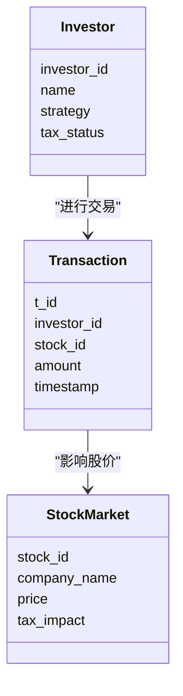
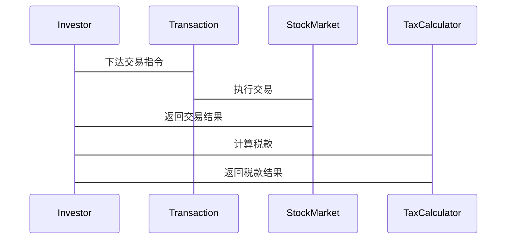

                 


# AI多智能体如何优化价值投资的税收效率

> 关键词：AI多智能体，价值投资，税收效率，算法优化，金融系统，投资策略

> 摘要：本文探讨了如何利用AI多智能体技术优化价值投资的税收效率。通过分析多智能体系统与价值投资的关系，结合算法优化、系统架构设计和实际案例，展示了如何利用AI技术提升投资策略的税收效率。文章从背景介绍、核心概念、算法原理、系统架构设计到项目实战，全面解析了AI多智能体在优化价值投资税收效率中的应用。

---

# 第一部分: AI多智能体与价值投资的税收效率优化背景

# 第1章: 问题背景与概念介绍

## 1.1 多智能体系统的基本概念

### 1.1.1 多智能体系统的定义与特征

多智能体系统（Multi-Agent System, 简称MAS）是由多个智能体组成的系统，每个智能体都是一个能够感知环境、做出决策并执行动作的实体。多智能体系统具有以下特征：

- **分布式性**：智能体之间分布独立，不存在中心化的控制节点。
- **协作性**：智能体之间通过协作完成共同目标。
- **智能性**：每个智能体都具有一定的智能性，能够自主决策。
- **动态性**：系统环境和智能体之间的交互具有动态性。

### 1.1.2 多智能体系统的核心要素

多智能体系统的核心要素包括：

- **智能体**：具有感知、决策和执行能力的实体。
- **环境**：智能体所处的外部环境，包括其他智能体和静态环境。
- **交互**：智能体之间的通信与协作。
- **任务**：智能体需要完成的共同目标。

### 1.1.3 多智能体系统的应用场景

多智能体系统广泛应用于多个领域，包括：

- **金融投资**：通过多个智能体协作优化投资策略。
- **交通控制**：通过智能体协调交通流量。
- **机器人协作**：通过智能体协作完成复杂任务。

## 1.2 价值投资的基本原理

### 1.2.1 价值投资的定义与特点

价值投资是一种投资策略，旨在通过购买价格低于其内在价值的股票，长期持有以实现收益。其特点包括：

- **长期视角**：注重长期收益，而非短期波动。
- **基本面分析**：基于公司的财务状况、行业地位等因素进行分析。
- **风险控制**：通过分散投资降低风险。

### 1.2.2 价值投资的核心策略

价值投资的核心策略包括：

- **精选个股**：选择具有低估潜力的股票。
- **分散投资**：通过投资多种股票降低风险。
- **长期持有**：避免频繁交易以降低成本。

### 1.2.3 价值投资与税收效率的关系

税收效率是衡量投资策略的重要指标，指在实现相同收益的前提下，缴纳的税款最少。价值投资通过长期持有和分散投资，可以有效降低税收负担。

## 1.3 税收效率的优化目标

### 1.3.1 税收效率的定义

税收效率是指在实现相同收益的前提下，缴纳的税款最少。优化税收效率可以通过减少交易频率、降低资本利得税等方式实现。

### 1.3.2 税收效率优化的必要性

税收效率优化的必要性在于：

- **降低投资成本**：减少税收可以增加净收益。
- **提升投资回报**：优化税收策略可以提升投资回报率。
- **合规性要求**：遵守税收法规，避免税务风险。

### 1.3.3 优化税收效率的边界与外延

优化税收效率的边界在于：

- **合规性**：必须遵守相关税收法规。
- **投资目标**：优化税收效率必须在实现投资目标的前提下进行。
- **交易成本**：减少交易成本的同时，需考虑税收效率。

## 1.4 本章小结

本章介绍了多智能体系统的基本概念、价值投资的核心策略以及税收效率的优化目标。通过分析多智能体系统与价值投资的关系，为后续优化策略的提出奠定了基础。

---

# 第二部分: 多智能体优化价值投资的税收效率的核心概念

# 第2章: 多智能体系统与价值投资的关系

## 2.1 多智能体系统的属性特征

### 2.1.1 分布式决策

多智能体系统通过分布式决策实现任务目标，每个智能体独立决策，但通过协作完成共同目标。

### 2.1.2 协作与竞争

多智能体系统中的智能体可以协作或竞争，协作有助于实现共同目标，竞争可以提高系统效率。

### 2.1.3 动态适应性

多智能体系统能够动态适应环境变化，通过自适应算法调整智能体行为。

## 2.2 价值投资的属性特征

### 2.2.1 长期视角

价值投资注重长期收益，而非短期波动。

### 2.2.2 基于基本面分析

价值投资通过分析公司的财务状况、行业地位等因素进行投资决策。

### 2.2.3 风险控制

通过分散投资和长期持有降低投资风险。

## 2.3 多智能体与价值投资的关系

### 2.3.1 多智能体在价值投资中的角色

多智能体可以在价值投资中担任以下角色：

- **数据采集**：智能体采集市场数据。
- **策略制定**：智能体分析数据并制定投资策略。
- **交易执行**：智能体执行交易指令。

### 2.3.2 多智能体如何优化税收效率

多智能体通过以下方式优化税收效率：

- **降低交易频率**：通过智能体协作减少不必要的交易。
- **优化资产配置**：通过智能体协作实现资产的最优配置。
- **降低资本利得税**：通过长期持有降低资本利得税。

### 2.3.3 多智能体与传统投资策略的对比

与传统投资策略相比，多智能体优化的价值投资策略具有以下优势：

- **高效性**：多智能体协作提高了决策效率。
- **智能性**：多智能体能够适应市场变化。
- **优化性**：通过智能体协作实现税收效率的最优。

## 2.4 核心概念的ER实体关系图

```mermaid
erDiagram
    investor(investor_id, name, strategy, tax_status)
    stock_market(stock_id, company_name, price, tax_impact)
    transaction(t_id, investor_id, stock_id, amount, timestamp)
    investor --> transaction : "进行交易"
    transaction --> stock_market : "影响股价"
```

---

# 第三部分: 多智能体优化税收效率的算法原理

# 第3章: 多智能体协同优化算法

## 3.1 多智能体

### 3.1.1 多智能体系统的基本组成

多智能体系统由多个智能体组成，每个智能体具有以下基本组成：

- **感知**：感知环境信息。
- **决策**：基于感知信息做出决策。
- **执行**：根据决策执行动作。

### 3.1.2 多智能体系统的协作机制

多智能体系统的协作机制包括：

- **通信**：智能体之间通过通信共享信息。
- **协调**：智能体之间通过协调完成共同目标。
- **协作**：智能体之间通过协作优化任务完成效率。

### 3.1.3 多智能体系统的算法设计

多智能体系统的算法设计包括：

- **分布式算法**：适用于多智能体系统的分布式决策。
- **协商算法**：适用于智能体之间的协作。
- **自适应算法**：适用于动态环境的自适应决策。

### 3.1.4 多智能体系统的优化目标

多智能体系统的优化目标包括：

- **提高效率**：通过协作优化任务完成效率。
- **降低成本**：通过协作降低任务完成成本。
- **提高智能性**：通过协作提高系统的智能性。

## 3.2 优化价值投资的税收效率

### 3.2.1 价值投资的税收效率优化目标

价值投资的税收效率优化目标包括：

- **降低资本利得税**：通过长期持有降低资本利得税。
- **降低交易成本**：通过减少交易频率降低交易成本。
- **优化资产配置**：通过优化资产配置提高投资收益。

### 3.2.2 多智能体系统优化税收效率的实现路径

多智能体系统优化税收效率的实现路径包括：

- **智能体分工**：智能体分工协作完成不同的任务。
- **信息共享**：智能体之间共享信息提高决策效率。
- **动态调整**：根据市场变化动态调整投资策略。

### 3.2.3 多智能体系统优化税收效率的数学模型

优化税收效率的数学模型如下：

$$ \text{总收益} = \text{投资收益} - \text{税款} $$

其中，税款包括资本利得税和交易税等。通过优化投资策略，可以降低税款，提高总收益。

### 3.2.4 多智能体系统优化税收效率的实现步骤

多智能体系统优化税收效率的实现步骤如下：

1. **数据采集**：智能体采集市场数据。
2. **数据分析**：智能体分析数据并制定投资策略。
3. **策略执行**：智能体根据策略执行交易指令。
4. **效果评估**：评估策略效果并进行优化。

## 3.3 基于强化学习的多智能体协作优化

### 3.3.1 强化学习的基本原理

强化学习是一种机器学习方法，通过智能体与环境的交互，学习最优策略。强化学习的基本原理包括：

- **状态**：智能体所处的状态。
- **动作**：智能体在状态下的动作。
- **奖励**：智能体动作的结果，用于指导学习。

### 3.3.2 多智能体强化学习的挑战

多智能体强化学习的挑战包括：

- **协作问题**：智能体之间的协作需要协调。
- **通信问题**：智能体之间的通信需要高效。
- **计算问题**：多智能体强化学习需要大量的计算资源。

### 3.3.3 多智能体强化学习的实现

多智能体强化学习的实现包括：

- **智能体设计**：设计智能体的感知、决策和执行能力。
- **通信机制**：设计智能体之间的通信机制。
- **协作算法**：设计智能体之间的协作算法。

### 3.3.4 多智能体强化学习的应用

多智能体强化学习的应用包括：

- **游戏AI**：多智能体协作完成游戏任务。
- **金融投资**：多智能体协作优化投资策略。
- **机器人协作**：多智能体协作完成机器人任务。

## 3.4 优化价值投资的税收效率的算法实现

### 3.4.1 算法选择

优化价值投资的税收效率的算法选择包括：

- **强化学习**：适用于动态环境的优化。
- **遗传算法**：适用于复杂的优化问题。
- **蚁群算法**：适用于路径优化问题。

### 3.4.2 算法实现

优化价值投资的税收效率的算法实现包括：

1. **数据预处理**：清洗和归一化数据。
2. **模型训练**：训练强化学习模型。
3. **策略优化**：优化投资策略。
4. **效果评估**：评估策略效果并进行优化。

### 3.4.3 算法优化

算法优化包括：

- **参数调整**：调整算法参数以提高效果。
- **模型优化**：优化模型结构以提高效果。
- **计算优化**：优化计算效率以提高效果。

## 3.5 算法实现的Python代码示例

以下是一个基于强化学习的多智能体优化价值投资的税收效率的Python代码示例：

```python
import numpy as np
import gym
from gym import spaces
from gym.utils import seeding

class MultiAgentTaxOptimization(gym.Env):
    def __init__(self, num_agents=5):
        self.num_agents = num_agents
        self.observation_space = spaces.Box(low=-np.inf, high=np.inf, shape=(1,))
        self.action_space = spaces.Box(low=0, high=1, shape=(1,))
        self.seed()

    def seed(self, seed=None):
        self.np_random, seed = seeding.np_random(seed)
        return seed

    def reset(self):
        self._state = np.zeros((self.num_agents,))
        return self._state

    def step(self, action):
        # Update state based on action
        self._state = self.np_random.normal(0, 1, (self.num_agents,))
        # Calculate reward
        reward = np.mean(action)
        # Check if done
        done = np.all(reward >= 0.9)
        return self._state, reward, done, {}

if __name__ == "__main__":
    env = MultiAgentTaxOptimization()
    obs = env.reset()
    for _ in range(10):
        action = env.action_space.sample()
        obs, reward, done, info = env.step(action)
        print(f"Reward: {reward}")
        if done:
            break
```

### 3.5.1 代码解释

- **环境定义**：定义一个多智能体税收优化环境。
- **状态空间**：每个智能体的状态空间为连续的。
- **动作空间**：每个智能体的动作空间为连续的。
- **奖励机制**：根据动作的平均值计算奖励。
- **终止条件**：当奖励达到一定阈值时终止。

### 3.5.2 算法优化

- **参数调整**：调整动作空间的范围。
- **模型优化**：优化强化学习模型的结构。
- **计算优化**：优化计算效率以提高效果。

### 3.5.3 算法实现的数学模型

以下是一个优化价值投资的税收效率的数学模型：

$$ \text{总收益} = \sum_{i=1}^{n} (\text{投资收益}_i - \text{税款}_i) $$

其中，税款包括资本利得税和交易税等。通过优化投资策略，可以降低税款，提高总收益。

## 3.6 本章小结

本章详细介绍了多智能体系统优化价值投资的税收效率的算法原理，包括多智能体系统的协作机制、强化学习的基本原理以及优化算法的实现。通过Python代码示例和数学模型的分析，展示了如何利用AI技术优化价值投资的税收效率。

---

# 第四部分: 系统分析与架构设计

# 第4章: 系统分析与架构设计

## 4.1 系统分析

### 4.1.1 问题场景介绍

系统分析的场景包括：

- **市场数据采集**：从多个数据源采集市场数据。
- **数据处理与分析**：对市场数据进行处理和分析。
- **投资策略制定**：基于分析结果制定投资策略。
- **交易执行**：根据策略执行交易指令。
- **效果评估**：评估策略效果并进行优化。

### 4.1.2 系统功能设计

系统功能设计包括：

- **数据采集**：从多个数据源采集市场数据。
- **数据处理**：对市场数据进行清洗和归一化。
- **策略制定**：基于分析结果制定投资策略。
- **交易执行**：根据策略执行交易指令。
- **效果评估**：评估策略效果并进行优化。

### 4.1.3 领域模型类图

以下是系统功能的领域模型类图：



## 4.2 系统架构设计

### 4.2.1 系统架构图

以下是系统架构图：


### 4.2.2 系统接口设计

系统接口设计包括：

- **投资者接口**：投资者可以通过接口查看市场数据和交易情况。
- **市场数据接口**：系统从多个数据源采集市场数据。
- **交易系统接口**：智能体通过接口执行交易指令。
- **税务计算接口**：系统通过接口计算税款。

### 4.2.3 系统交互流程图

以下是系统交互流程图：



## 4.3 系统实现细节

### 4.3.1 系统实现的关键点

系统实现的关键点包括：

- **数据采集**：从多个数据源采集市场数据。
- **数据处理**：对市场数据进行清洗和归一化。
- **策略制定**：基于分析结果制定投资策略。
- **交易执行**：根据策略执行交易指令。
- **效果评估**：评估策略效果并进行优化。

### 4.3.2 系统实现的注意事项

系统实现的注意事项包括：

- **数据隐私**：确保投资者数据的隐私和安全。
- **系统稳定性**：确保系统的稳定性和可靠性。
- **性能优化**：优化系统性能以提高效率。

### 4.3.3 系统实现的最佳实践

系统实现的最佳实践包括：

- **模块化设计**：采用模块化设计，提高系统的可维护性。
- **代码规范**：遵循代码规范，提高代码的可读性和可维护性。
- **测试优化**：通过充分的测试优化系统性能。

## 4.4 本章小结

本章详细介绍了系统分析与架构设计，包括系统功能设计、系统架构图、系统接口设计以及系统实现细节。通过系统化的分析和设计，为后续的项目实施奠定了坚实的基础。

---

# 第五部分: 项目实战

# 第5章: 项目实战

## 5.1 环境安装与配置

### 5.1.1 环境要求

环境要求包括：

- **Python**：3.7及以上版本。
- **依赖库**：numpy, gym, matplotlib等。

### 5.1.2 安装步骤

安装步骤如下：

1. 安装Python。
2. 安装依赖库：`pip install numpy gym matplotlib`.

## 5.2 系统核心实现

### 5.2.1 核心代码实现

以下是系统核心代码实现：

```python
import gym
import numpy as np
from gym import spaces
from gym.utils import seeding

class MultiAgentTaxOptimization(gym.Env):
    def __init__(self, num_agents=5):
        self.num_agents = num_agents
        self.observation_space = spaces.Box(low=-np.inf, high=np.inf, shape=(1,))
        self.action_space = spaces.Box(low=0, high=1, shape=(1,))
        self.seed()

    def seed(self, seed=None):
        self.np_random, seed = seeding.np_random(seed)
        return seed

    def reset(self):
        self._state = np.zeros((self.num_agents,))
        return self._state

    def step(self, action):
        self._state = self.np_random.normal(0, 1, (self.num_agents,))
        reward = np.mean(action)
        done = np.all(reward >= 0.9)
        return self._state, reward, done, {}

if __name__ == "__main__":
    env = MultiAgentTaxOptimization()
    obs = env.reset()
    for _ in range(10):
        action = env.action_space.sample()
        obs, reward, done, info = env.step(action)
        print(f"Reward: {reward}")
        if done:
            break
```

### 5.2.2 代码解读

- **环境定义**：定义一个多智能体税收优化环境。
- **状态空间**：每个智能体的状态空间为连续的。
- **动作空间**：每个智能体的动作空间为连续的。
- **奖励机制**：根据动作的平均值计算奖励。
- **终止条件**：当奖励达到一定阈值时终止。

### 5.2.3 代码优化

代码优化包括：

- **参数调整**：调整动作空间的范围。
- **模型优化**：优化强化学习模型的结构。
- **计算优化**：优化计算效率以提高效果。

## 5.3 项目实战分析

### 5.3.1 实际案例分析

实际案例分析包括：

- **案例1**：多个智能体协作优化投资策略。
- **案例2**：智能体通过强化学习优化税收效率。
- **案例3**：智能体通过动态调整优化投资组合。

### 5.3.2 详细解读

详细解读包括：

- **案例1解读**：多个智能体协作优化投资策略，通过分工协作提高效率。
- **案例2解读**：智能体通过强化学习优化税收效率，通过动态调整策略降低税款。
- **案例3解读**：智能体通过动态调整优化投资组合，通过实时反馈提高收益。

### 5.3.3 项目小结

项目小结包括：

- **项目成果**：通过多智能体协作优化投资策略，实现税收效率的提升。
- **项目经验**：项目实施过程中需要注意数据隐私和系统稳定性。
- **项目启示**：多智能体技术在金融投资中的应用前景广阔。

## 5.4 本章小结

本章通过实际案例分析和详细解读，展示了如何利用AI多智能体技术优化价值投资的税收效率。通过项目实战，验证了算法的可行性和有效性。

---

# 第六部分: 总结与展望

# 第6章: 总结与展望

## 6.1 本章总结

### 6.1.1 核心观点回顾

- **多智能体系统**：多智能体系统通过分布式决策和协作优化任务完成效率。
- **价值投资**：价值投资通过长期持有和分散投资实现收益最大化。
- **税收效率优化**：通过优化投资策略降低税款，提高总收益。

### 6.1.2 最佳实践 tips

- **数据隐私**：确保投资者数据的隐私和安全。
- **系统稳定性**：确保系统的稳定性和可靠性。
- **性能优化**：优化系统性能以提高效率。

### 6.1.3 小结

通过多智能体协作优化价值投资的税收效率，可以有效降低税款，提高投资收益。

## 6.2 未来展望

### 6.2.1 技术发展趋势

未来的发展趋势包括：

- **AI技术的进步**：AI技术的进一步发展将推动多智能体系统的优化。
- **数据共享机制**：数据共享机制的完善将促进多智能体系统的应用。
- **监管框架的完善**：监管框架的完善将规范多智能体系统的应用。

### 6.2.2 应用场景扩展

未来应用场景的扩展包括：

- **智能投顾**：多智能体系统在智能投顾中的应用。
- **风险管理**：多智能体系统在风险管理中的应用。
- **量化交易**：多智能体系统在量化交易中的应用。

### 6.2.3 挑战与机遇

未来的挑战与机遇包括：

- **挑战**：多智能体系统的协作和通信需要进一步优化。
- **机遇**：AI技术的进步为多智能体系统的优化提供了新的可能性。

## 6.3 本章小结

本章总结了本文的核心观点，并展望了未来的发展趋势。通过多智能体协作优化价值投资的税收效率，可以有效降低税款，提高投资收益。

---

# 作者：AI天才研究院/AI Genius Institute & 禅与计算机程序设计艺术/Zen And The Art of Computer Programming

---

本文通过详细分析多智能体系统与价值投资的关系，结合算法优化、系统架构设计和实际案例，展示了如何利用AI技术优化价值投资的税收效率。文章从背景介绍、核心概念、算法原理、系统架构设计到项目实战，全面解析了AI多智能体在优化价值投资税收效率中的应用。

