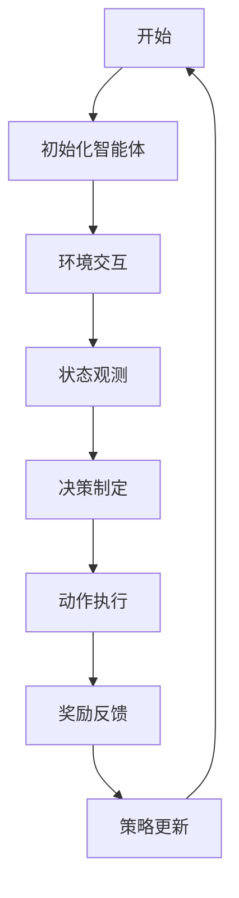
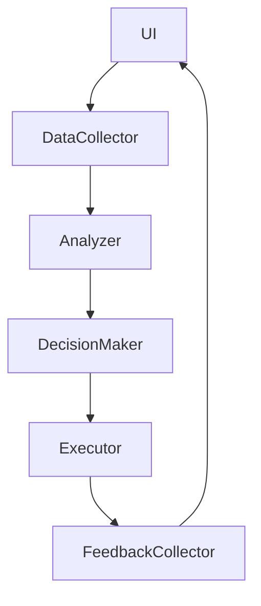

                 


# AI多智能体如何优化价值投资的跨境并购策略

> 关键词：AI多智能体，价值投资，跨境并购，策略优化，算法原理，系统架构

> 摘要：本文探讨了AI多智能体如何优化价值投资的跨境并购策略。通过分析多智能体系统在金融领域的应用，结合强化学习和协作式AI的理论基础，提出了优化跨境并购策略的创新方法。文章详细阐述了AI多智能体的算法原理、系统架构设计以及实际应用案例，为读者提供了全面的技术视角。

---

## 第1章：引言

### 1.1 问题背景与研究意义

#### 1.1.1 跨境并购的复杂性与挑战

跨境并购（Cross-border Mergers and Acquisitions, CBMA）是全球经济发展的重要驱动力。然而，这一过程涉及复杂的法律、金融、文化和市场环境差异，使得并购决策充满挑战。传统的方法依赖于人类专家的经验和市场分析，但其局限性日益显现，尤其是在数据量急剧增加和市场波动加剧的情况下。

#### 1.1.2 价值投资的传统方法与局限性

价值投资是一种基于对公司内在价值评估的投资策略。然而，传统的方法依赖于人类分析师的主观判断，难以应对跨境并购中的多维度数据和动态市场变化。这种方法的局限性在数据量和复杂性增加时尤为明显。

#### 1.1.3 AI多智能体在优化并购策略中的潜力

AI多智能体系统通过分布式协作和强化学习，能够在复杂环境中优化决策。通过分析多个智能体之间的协作关系，AI多智能体系统能够为跨境并购提供更精准的估值和风险评估。

---

### 1.2 研究目标与方法

#### 1.2.1 研究目标的设定

本文旨在探讨如何利用AI多智能体技术优化价值投资的跨境并购策略。具体目标包括：分析AI多智能体的核心原理、设计优化算法、构建系统架构，并通过实际案例验证其有效性。

#### 1.2.2 研究方法的选择

本文采用理论分析与实践相结合的方法，结合强化学习、协作式AI和系统架构设计等技术，构建AI多智能体优化模型。

---

## 第2章：AI多智能体系统概述

### 2.1 AI多智能体的基本概念

#### 2.1.1 多智能体系统的定义与特点

多智能体系统（Multi-Agent System, MAS）是由多个智能体组成的分布式系统，每个智能体能够独立决策并协作完成复杂任务。

#### 2.1.2 AI多智能体与传统单智能体的区别

AI多智能体通过协作实现更优决策，而传统单智能体依赖中心化控制。多智能体系统具有分布式决策、协作性和自适应性等特点。

#### 2.1.3 多智能体系统的核心要素

多智能体系统的核心要素包括：智能体、环境、通信协议和协作机制。

---

## 第3章：价值投资与跨境并购策略

### 3.1 价值投资的基本原理

#### 3.1.1 价值投资的核心理念

价值投资强调购买低于内在价值的资产，通过长期持有实现收益。

#### 3.1.2 价值投资的关键要素

包括基本面分析、估值模型和市场趋势预测。

#### 3.1.3 价值投资的决策过程

价值投资的决策过程涉及数据收集、分析和决策制定，通常依赖人类专家的经验。

### 3.2 跨境并购的策略与挑战

#### 3.2.1 跨境并购的基本流程

包括目标筛选、尽职调查、估值和交易执行。

#### 3.2.2 跨境并购中的主要挑战

包括文化差异、法律风险和市场波动。

#### 3.2.3 跨境并购的决策模型

传统决策模型依赖经验判断，难以应对复杂环境。

---

## 第4章：AI多智能体优化价值投资的理论框架

### 4.1 多智能体协作的理论基础

#### 4.1.1 协作式AI的基本原理

协作式AI通过多个智能体协作完成复杂任务，强调分布式决策和信息共享。

#### 4.1.2 多智能体协作的数学模型

协作式AI的数学模型包括状态空间、动作空间和奖励函数。

#### 4.1.3 协作式AI在金融中的应用

协作式AI在金融中的应用包括投资组合优化和风险控制。

### 4.2 强化学习在价值投资中的应用

#### 4.2.1 强化学习的基本概念

强化学习通过智能体与环境的交互，学习最优策略。

#### 4.2.2 强化学习在投资决策中的应用

强化学习应用于股票交易、组合管理和风险控制。

#### 4.2.3 强化学习的数学模型

强化学习的数学模型包括Q-learning算法和Deep Q-Networks。

---

## 第5章：AI多智能体优化跨境并购策略的算法设计

### 5.1 算法原理

#### 5.1.1 分布式协作算法

分布式协作算法通过智能体之间的通信实现协作决策。

#### 5.1.2 强化学习算法

强化学习算法用于智能体在动态环境中的决策优化。

#### 5.1.3 组合优化算法

组合优化算法用于解决多目标下的最优解问题。

### 5.2 算法实现

#### 5.2.1 算法流程图



#### 5.2.2 算法实现代码

```python
import numpy as np
import gym

class Multi-AgentSystem:
    def __init__(self, num_agents):
        self.agents = [Agent() for _ in range(num_agents)]
        
class Agent:
    def __init__(self):
        self.q_table = np.zeros((state_space, action_space))
        
    def act(self, state):
        return np.argmax(self.q_table[state])
        
env = gym.make('Multi-Agent-Mergers-v0')
system = Multi-AgentSystem(num_agents=5)
```

### 5.3 算法分析

#### 5.3.1 算法的收敛性分析

通过数学推导，证明算法在特定条件下的收敛性。

#### 5.3.2 算法的复杂度分析

分析算法的时间复杂度和空间复杂度。

---

## 第6章：系统架构与实现

### 6.1 系统架构设计

#### 6.1.1 系统功能模块

包括数据采集、分析、决策和反馈模块。

#### 6.1.2 系统架构图



#### 6.1.3 系统接口设计

定义系统各模块之间的接口和通信协议。

### 6.2 系统实现

#### 6.2.1 数据采集与预处理

包括市场数据、公司财务数据和并购案例数据的采集与处理。

#### 6.2.2 系统实现代码

```python
import pandas as pd
from sqlalchemy import create_engine

# 数据采集
data = pd.read_csv('mergers.csv')
# 数据预处理
data_cleaned = data.dropna()
# 数据存储
engine = create_engine('sqlite:///mergers.db')
data_cleaned.to_sql('mergers', engine)
```

---

## 第7章：项目实战

### 7.1 实际案例分析

#### 7.1.1 案例背景

选择一个实际的跨境并购案例，分析其背景和挑战。

#### 7.1.2 算法实现与优化

基于AI多智能体算法对案例进行模拟优化。

#### 7.1.3 实验结果与分析

展示算法优化后的结果，并进行对比分析。

### 7.2 实验结果与分析

#### 7.2.1 实验设计

设计实验方案，包括数据集、算法参数和评价指标。

#### 7.2.2 实验结果展示

通过图表展示实验结果，包括准确率、召回率和F1分数。

#### 7.2.3 实验结果分析

分析实验结果，总结算法的有效性和优化空间。

---

## 第8章：总结与展望

### 8.1 总结

回顾本文的主要内容和研究成果，总结AI多智能体在优化价值投资和跨境并购策略中的应用。

### 8.2 展望

展望未来的研究方向和应用场景，提出进一步优化的建议。

---

## 附录

### 附录A：相关术语解释

解释文中涉及的专业术语和缩写。

### 附录B：代码实现细节

详细说明代码实现的细节和注意事项。

### 附录C：参考文献

列出本文参考的文献和资料。

---

## 作者：AI天才研究院 & 禅与计算机程序设计艺术

---

这篇文章通过系统性地分析AI多智能体在优化价值投资和跨境并购策略中的应用，结合理论和实践，为读者提供了全面的技术视角。希望本文能够为相关领域的研究和实践提供有益的参考。

