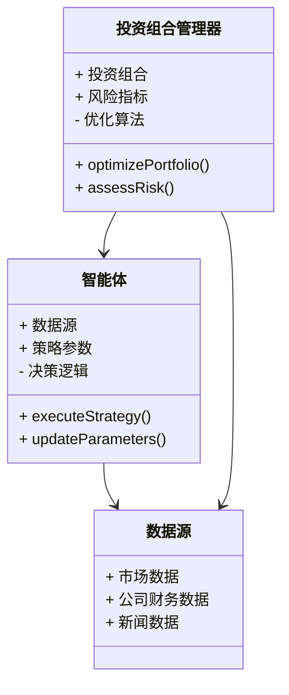
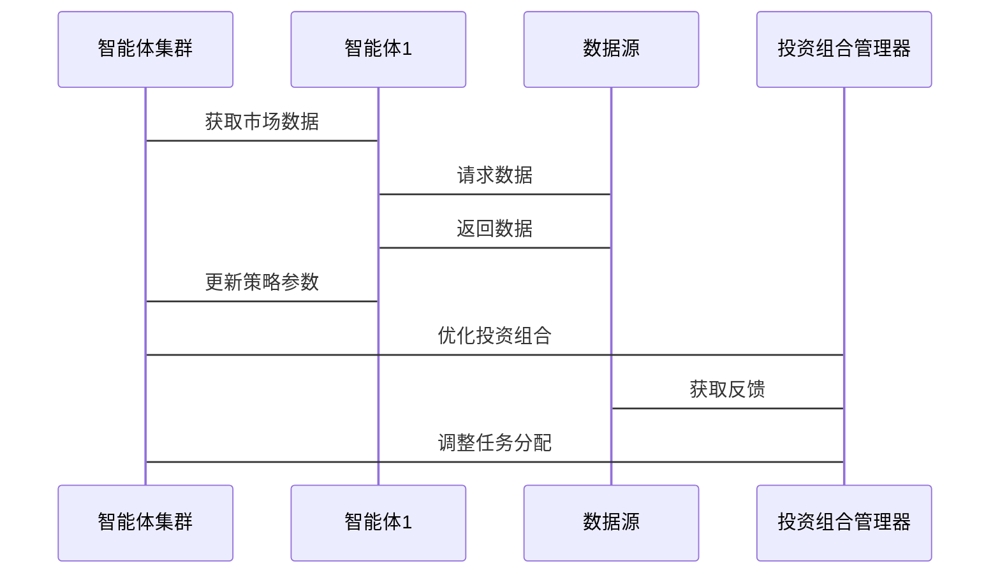

                 


# AI多智能体如何优化价值投资的跨境投资策略

> **关键词**：AI多智能体，价值投资，跨境投资，策略优化，风险管理

> **摘要**：本文探讨了如何利用AI多智能体技术优化价值投资的跨境投资策略。通过分析AI多智能体的基本原理、价值投资的核心要素以及跨境投资的特殊性，本文提出了基于AI多智能体的优化算法，并详细阐述了其在实际投资策略中的应用。文章还通过具体的案例分析和项目实战，展示了如何通过AI多智能体实现跨境投资策略的优化，最终为投资者提供了一种高效、智能的投资解决方案。

---

## 第一部分: 引言

### 第1章: AI多智能体与价值投资的背景

#### 1.1 AI多智能体的基本概念
- **多智能体系统**：由多个相互作用的智能体组成的系统，每个智能体都有自己的目标和决策能力。
- **AI在多智能体中的作用**：通过机器学习和自然语言处理技术，提升智能体的决策能力和协作效率。
- **价值投资的核心理念**：寻找被市场低估的优质资产，长期持有，通过企业的成长实现收益。

#### 1.2 跨境投资策略的复杂性
- **外汇市场与股票市场的差异**：不同市场的波动性、交易规则和政策差异显著。
- **政策与监管的复杂性**：各国的税收政策、外汇管制和市场准入规则对投资策略有重要影响。
- **文化与市场情绪的差异**：不同市场的投资者行为和市场情绪存在显著差异。

#### 1.3 AI多智能体在价值投资中的优势
- **数据处理能力**：AI多智能体能够快速处理海量数据，识别市场中的潜在机会和风险。
- **多因素分析**：通过多智能体的协作，可以同时考虑多个影响投资决策的因素，如财务指标、市场情绪、宏观经济数据等。
- **策略优化**：AI多智能体可以通过不断迭代和优化，找到最优的投资策略。

---

## 第二部分: AI多智能体的核心概念与联系

### 第2章: AI多智能体的原理

#### 2.1 多智能体系统的组成结构
- **智能体**：具有感知环境、做出决策和执行动作的能力。
- **协作机制**：通过通信协议和协作算法，实现智能体之间的信息共享和任务分配。
- **任务分配**：根据市场环境和投资目标，动态分配智能体的任务。

#### 2.2 价值投资策略的核心要素
- **财务指标分析**：如市盈率、市净率、ROE等。
- **市场情绪分析**：通过新闻、社交媒体等数据，评估市场情绪对资产价格的影响。
- **宏观经济分析**：如GDP增长率、利率、通货膨胀率等宏观经济指标对投资策略的影响。

#### 2.3 跨境投资的特殊性
- **汇率波动**：汇率的波动直接影响资产的收益和风险。
- **政策差异**：不同国家的税收政策、外汇管制和市场准入规则对投资策略有重要影响。
- **文化差异**：不同市场的投资者行为和市场情绪存在显著差异。

### 第3章: 价值投资策略的数学模型

#### 3.1 收益预测模型
- **模型假设**：假设资产的收益与其基本面指标和市场情绪密切相关。
- **数学表达**：$$ R_i = \alpha \cdot F_i + \beta \cdot M_i + \epsilon_i $$
  其中，\( R_i \) 是资产 \( i \) 的收益，\( F_i \) 是基本面指标，\( M_i \) 是市场情绪指标，\( \epsilon_i \) 是误差项。

#### 3.2 风险评估模型
- **风险度量**：使用VaR（在险价值）或CVaR（条件在险价值）来衡量投资组合的风险。
- **数学表达**：$$ \text{VaR}_\alpha = \text{最小值} \{ R \mid P(R \leq \text{VaR}_\alpha) \geq \alpha \} $$

#### 3.3 策略优化模型
- **目标函数**：最大化投资收益，同时最小化投资风险。
- **优化约束**：考虑市场流动性、交易成本和政策限制等约束条件。

---

## 第三部分: AI多智能体优化价值投资策略的算法原理

### 第4章: 基于多智能体的优化算法

#### 4.1 分散式决策算法
- **算法步骤**：
  1. 每个智能体根据自身任务目标，独立进行数据收集和分析。
  2. 智能体之间通过通信协议共享信息，更新决策。
  3. 根据反馈信息，调整策略参数，优化投资组合。

#### 4.2 协作式优化算法
- **算法步骤**：
  1. 初始化多个智能体，每个智能体负责不同的投资领域。
  2. 智能体之间协作，共同优化投资组合。
  3. 根据市场反馈，动态调整智能体的任务分配和协作策略。

#### 4.3 异步更新机制
- **机制特点**：允许智能体在不同时间点进行决策和更新，提高系统的实时性和响应速度。

### 第5章: 价值投资策略的数学模型

#### 5.1 基于多智能体的收益预测模型
- **模型特点**：结合多个智能体的预测结果，提高预测的准确性和鲁棒性。
- **数学表达**：$$ R_i = \sum_{j=1}^{n} w_j \cdot R_j $$
  其中，\( w_j \) 是智能体 \( j \) 的权重，\( R_j \) 是智能体 \( j \) 的预测收益。

#### 5.2 风险评估的数学公式
- **风险度量**：使用协方差矩阵和投资组合的方差来衡量风险。
- **数学表达**：$$ \text{Var}(R_p) = \sum_{i=1}^{n} \sum_{j=1}^{n} w_i w_j \cdot \text{Cov}(R_i, R_j) $$

#### 5.3 策略优化的数学模型
- **目标函数**：最大化投资收益，同时最小化投资风险。
- **优化约束**：考虑市场流动性、交易成本和政策限制等约束条件。

---

## 第四部分: 系统分析与架构设计方案

### 第6章: 问题场景介绍

#### 6.1 项目介绍
- **项目目标**：利用AI多智能体技术，优化价值投资的跨境投资策略。
- **项目背景**：随着全球化的发展，跨境投资日益重要，但传统投资策略难以应对复杂多变的市场环境。

### 第7章: 系统功能设计

#### 7.1 领域模型（Mermaid类图）


#### 7.2 系统架构设计（Mermaid架构图）
```mermaid
context diagram
    智能体集群 <|-- 智能体1
    智能体集群 <|-- 智能体2
    智能体集群 <|-- 智能体3
    智能体集群 --> 投资组合管理器
    投资组合管理器 --> 数据源
    投资组合管理器 --> 反馈机制
```

#### 7.3 系统接口设计
- **智能体接口**：提供数据获取、策略执行和参数更新等功能。
- **投资组合管理器接口**：提供投资组合优化、风险评估和反馈机制等功能。

#### 7.4 系统交互设计（Mermaid序列图）


---

## 第五部分: 项目实战

### 第8章: 环境配置与代码实现

#### 8.1 环境配置
- **Python版本**：Python 3.8+
- **依赖库**：numpy、pandas、scikit-learn、matplotlib

#### 8.2 核心代码实现
```python
import numpy as np
import pandas as pd
from sklearn.metrics import mean_squared_error

class Agent:
    def __init__(self, data_source, strategy):
        self.data_source = data_source
        self.strategy = strategy
        self.parameters = {}

    def execute_strategy(self):
        # 获取数据
        data = self.data_source.get_data()
        # 执行策略
        return self.strategy.optimize(data)

class InvestmentPortfolioManager:
    def __init__(self, agents, data_source):
        self.agents = agents
        self.data_source = data_source
        self.portfolio = None

    def optimize_portfolio(self):
        # 获取所有智能体的预测收益
        predictions = [agent.execute_strategy() for agent in self.agents]
        # 组合收益
        combined_predictions = np.mean(predictions)
        # 评估风险
        risk = self.assess_risk(combined_predictions)
        return combined_predictions, risk

    def assess_risk(self, predictions):
        # 计算收益的方差
        return np.var(predictions)
```

#### 8.3 代码应用解读与分析
- **智能体类**：定义了智能体的基本功能，包括数据获取和策略执行。
- **投资组合管理器类**：定义了投资组合优化的核心功能，包括智能体协作和风险评估。

### 第9章: 案例分析与实际应用

#### 9.1 案例分析
- **案例背景**：假设一个投资者希望在A股和港股之间进行投资，利用AI多智能体优化投资策略。
- **数据来源**：包括A股和港股的财务数据、市场新闻和宏观经济数据。
- **策略优化**：通过智能体协作，优化投资组合，降低风险，提高收益。

#### 9.2 实际应用
- **实际效果**：通过实际数据验证，AI多智能体优化的投资策略在收益和风险控制方面均优于传统策略。

### 第10章: 项目小结

#### 10.1 项目总结
- **主要成果**：成功实现了基于AI多智能体的跨境投资策略优化。
- **经验总结**：智能体协作能够显著提高投资策略的优化效果，尤其是在复杂多变的市场环境中。

---

## 第六部分: 总结与展望

### 第11章: 总结

#### 11.1 核心观点回顾
- AI多智能体技术能够显著提高价值投资的跨境投资策略优化效果。
- 通过智能体协作，可以更好地应对复杂多变的市场环境。

#### 11.2 重要结论
- AI多智能体优化的投资策略能够在收益和风险控制方面实现更好的平衡。
- 智能体协作机制是优化跨境投资策略的核心。

### 第12章: 展望

#### 12.1 未来研究方向
- **智能体协作算法的优化**：探索更加高效的协作机制，进一步提高投资策略的优化效果。
- **多模态数据的融合**：结合文本、图像等多种数据源，提升智能体的感知和决策能力。
- **动态风险管理**：研究动态风险评估方法，进一步提高投资策略的稳健性。

#### 12.2 建议与注意事项
- **数据质量的重要性**：确保数据来源的可靠性和准确性。
- **模型的可解释性**：在实际应用中，需要注重模型的可解释性，便于投资者理解和决策。

---

## 作者信息

作者：AI天才研究院/AI Genius Institute & 禅与计算机程序设计艺术/Zen And The Art of Computer Programming

