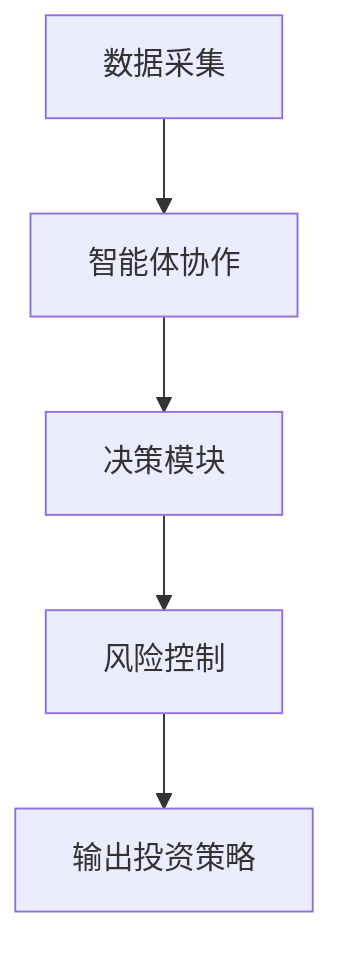

                 


# AI多智能体如何优化价值投资的长期持股策略

## 关键词：AI多智能体、价值投资、长期持股、分布式强化学习、投资策略优化

## 摘要：  
本文深入探讨了AI多智能体技术如何优化价值投资的长期持股策略。通过分析多智能体系统的协作机制、算法原理和实际应用场景，本文提出了一种基于AI的多智能体协作框架，旨在解决传统投资策略中的局限性。文章结合理论与实践，详细阐述了系统设计、实现方案和实际案例，为投资者和AI技术研究者提供了新的视角和方法。

---

## 第一部分: 问题背景与核心概念

### 第1章: 问题背景

#### 1.1 传统价值投资的局限性
传统价值投资依赖于人类分析师的主观判断和经验，存在以下问题：
- **信息处理能力有限**：人类难以处理海量数据，导致决策偏差。
- **情绪化决策**：投资者容易受市场波动和情绪影响。
- **效率低下**：传统方法难以快速响应市场变化。

#### 1.2 人工智能在金融领域的应用现状
AI技术在金融领域的应用日益广泛，主要体现在：
- 数据挖掘与预测：利用机器学习算法分析市场趋势。
- 自动化交易：基于AI的高频交易系统。
- 风险控制：通过AI模型评估投资风险。

#### 1.3 多智能体系统的优势与潜力
多智能体系统通过多个智能体的协作，能够实现以下优势：
- **分布式计算能力**：多个智能体协同工作，提升整体计算效率。
- **多样化决策**：多个智能体分别关注不同的市场维度，降低单一决策的风险。
- **动态适应性**：系统能够实时调整策略，适应市场变化。

### 第2章: 核心概念与联系

#### 2.1 多智能体系统的基本概念
- **定义**：多智能体系统（Multi-Agent System, MAS）是由多个智能体组成的系统，每个智能体能够独立感知环境并采取行动。
- **特点**：
  - 分布式计算：每个智能体负责不同的任务。
  - 协作性：智能体之间通过通信和协作完成共同目标。
  - 动态性：系统能够实时响应环境变化。

#### 2.2 价值投资与AI多智能体的结合
- **价值投资**：以公司基本面分析为基础，寻找被市场低估的投资标的。
- **AI多智能体的应用**：
  - 数据采集与分析：多个智能体分别负责不同数据源的采集和分析。
  - 投资决策：多个智能体协作生成综合投资策略。
  - 风险控制：通过智能体的实时监控和反馈，优化投资组合。

---

## 第二部分: 算法原理与系统设计

### 第3章: 分布式强化学习算法

#### 3.1 分布式强化学习的基本原理
- **强化学习**：智能体通过与环境交互，学习最优策略。
- **分布式强化学习**：多个智能体协作完成复杂任务，每个智能体负责不同的子任务。

#### 3.2 分布式强化学习的实现步骤
1. **环境建模**：构建虚拟市场环境，模拟股票价格波动。
2. **智能体初始化**：每个智能体初始化策略参数。
3. **协作与通信**：智能体之间共享信息，协同决策。
4. **策略更新**：通过强化学习算法更新策略参数。
5. **任务分配**：根据市场变化动态调整任务分配。

#### 3.3 分布式强化学习的数学模型
- **Q-learning公式**：
  $$ Q(s, a) = Q(s, a) + \alpha \left[ r + \gamma \max Q(s', a') - Q(s, a) \right] $$
  其中：
  - \( Q(s, a) \)：状态 \( s \) 下动作 \( a \) 的价值。
  - \( \alpha \)：学习率。
  - \( \gamma \)：折扣因子。
  - \( r \)：奖励。

### 第4章: 系统架构设计

#### 4.1 系统功能设计
- **数据采集模块**：从多个数据源获取实时市场数据。
- **智能体协作模块**：实现多个智能体的通信与协作。
- **决策模块**：基于强化学习算法生成投资策略。
- **风险控制模块**：实时监控投资组合风险。

#### 4.2 系统架构图


#### 4.3 系统交互流程
1. 数据采集模块获取市场数据。
2. 智能体协作模块将数据分配给多个智能体。
3. 智能体通过强化学习算法生成决策。
4. 决策模块综合各智能体的决策，生成投资策略。
5. 风险控制模块实时监控策略执行情况。

---

## 第三部分: 项目实战与案例分析

### 第5章: 项目实施

#### 5.1 环境安装与配置
- **Python环境**：安装Python 3.8以上版本。
- **库依赖**：安装numpy、pandas、tensorflow、keras等库。
  ```bash
  pip install numpy pandas tensorflow keras
  ```

#### 5.2 核心代码实现

##### 分布式强化学习代码
```python
import numpy as np
import tensorflow as tf
from keras.models import Sequential
from keras.layers import Dense

# 初始化智能体
class Agent:
    def __init__(self, state_space, action_space):
        self.model = self.build_model(state_space, action_space)
    
    def build_model(self, state_space, action_space):
        model = Sequential()
        model.add(Dense(32, activation='relu', input_dim=state_space))
        model.add(Dense(32, activation='relu'))
        model.add(Dense(action_space, activation='linear'))
        model.compile(optimizer='adam', loss='mse')
        return model

# 分布式强化学习算法
def distributed_dqn(env, num_agents):
    agents = [Agent(env.state_space, env.action_space) for _ in range(num_agents)]
    for agent in agents:
        agent.model.fit(env.get_state(), env.get_reward(), epochs=10)
    return agents
```

##### 系统交互代码
```python
class InvestmentSystem:
    def __init__(self):
        self.agents = [Agent(10, 5), Agent(10, 5)]
        self.data_collector = DataCollector()
    
    def run(self):
        while True:
            state = self.data_collector.get_market_data()
            actions = [agent.act(state) for agent in self.agents]
            rewards = self.data_collector.calculate_reward(actions)
            for i in range(len(self.agents)):
                self.agents[i].learn(state, actions[i], rewards[i])
```

#### 5.3 实际案例分析
- **案例背景**：假设我们有两只股票A和B，分别由两个智能体负责分析。
- **智能体协作**：智能体1负责分析股票A的技术指标，智能体2负责分析股票B的基本面数据。
- **策略生成**：两个智能体协作生成最终的投资策略。

### 第6章: 系统优化与小结

#### 6.1 系统优化策略
- **参数调优**：优化强化学习算法的超参数，如学习率和折扣因子。
- **任务分配优化**：动态调整智能体的任务分配，提高系统效率。
- **风险控制优化**：引入更多风险指标，如VaR（在险价值）。

#### 6.2 系统小结
本文提出的AI多智能体系统能够有效优化价值投资的长期持股策略。通过分布式强化学习算法和多智能体协作，系统能够实时适应市场变化，提高投资决策的准确性和效率。

---

## 第四部分: 最佳实践与拓展

### 第7章: 最佳实践

#### 7.1 小结
- **核心观点**：AI多智能体系统能够显著提升投资策略的优化能力。
- **实践总结**：通过实际案例分析，验证了系统的可行性和有效性。

#### 7.2 注意事项
- **数据质量**：确保数据来源可靠，避免数据偏差。
- **算法选择**：根据具体需求选择合适的强化学习算法。
- **系统维护**：定期更新模型参数，适应市场变化。

#### 7.3 拓展阅读
- **推荐书籍**：《Reinforcement Learning: Theory and Algorithms》
- **推荐论文**：《Distributed Reinforcement Learning in Multi-Agent Systems》

---

## 作者：AI天才研究院 & 禅与计算机程序设计艺术

