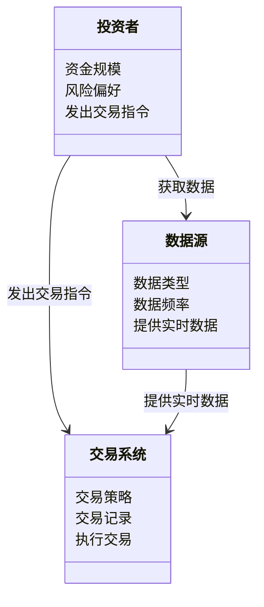
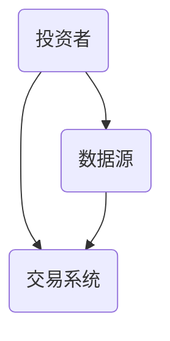

                 


# AI多智能体如何优化价值投资者的信息获取和处理

> 关键词：AI多智能体，价值投资，信息处理，优化策略，投资决策

> 摘要：本文探讨了AI多智能体技术在优化价值投资者信息获取和处理过程中的应用。通过分析多智能体系统的核心概念、算法原理、系统架构设计以及实际项目案例，本文详细阐述了如何利用AI多智能体技术提升价值投资者的决策效率和准确性，帮助投资者在复杂多变的金融市场中占据优势。

---

# 第一部分：AI多智能体与价值投资的背景与基础

## 第1章：AI多智能体与价值投资的概述

### 1.1 AI多智能体的基本概念

#### 1.1.1 多智能体系统的定义与特点
多智能体系统（Multi-Agent System, MAS）是由多个相互作用的智能体（Agent）组成的分布式系统。每个智能体都是一个能够感知环境、自主决策的实体，通过协作完成复杂任务。多智能体系统的特点包括：

- **自主性**：智能体能够独立决策。
- **反应性**：智能体能够实时感知环境变化。
- **协作性**：智能体之间可以协同完成任务。
- **分布式性**：智能体分布在不同的空间或时间维度上。

#### 1.1.2 AI多智能体的核心优势
AI多智能体结合了人工智能技术，具备以下核心优势：
- **分布式计算**：能够处理大规模数据。
- **协作优化**：通过智能体之间的协作，实现全局最优。
- **容错性**：单个智能体的故障不影响整体系统。

#### 1.1.3 价值投资的基本原理
价值投资是一种基于对公司内在价值评估的投资策略，强调以低于内在价值的价格买入优质股票。其核心在于通过分析财务报表、行业地位、管理团队等多维度信息，找到被市场低估的投资标的。

---

### 1.2 价值投资者的信息获取与处理挑战

#### 1.2.1 信息获取的复杂性
金融市场信息复杂多样，包括实时行情、财务数据、行业新闻等，信息来源分散且更新频繁。

#### 1.2.2 信息处理的效率问题
传统信息处理方式效率低下，难以在短时间内处理海量数据，导致投资决策滞后。

#### 1.2.3 传统方法的局限性
传统投资分析依赖人工经验，容易受到主观因素影响，且难以覆盖多维度数据。

---

### 1.3 AI多智能体在金融领域的应用前景

#### 1.3.1 金融领域的复杂性与不确定性
金融市场具有高度不确定性和复杂性，传统方法难以应对。

#### 1.3.2 多智能体在金融分析中的优势
多智能体系统能够通过协作方式处理复杂问题，提高分析效率和准确性。

#### 1.3.3 价值投资与AI多智能体的结合
通过AI多智能体技术，价值投资者可以更高效地获取和处理信息，提升投资决策的科学性。

---

## 第2章：多智能体系统的核心概念与原理

### 2.1 多智能体系统的组成与结构

#### 2.1.1 实体与关系的ER图
```mermaid
erDiagram
    entity 投资者 {
        <属性> 资金规模
        <属性> 风险偏好
    }
    entity 数据源 {
        <属性> 数据类型
        <属性> 数据频率
    }
    entity 交易系统 {
        <属性> 交易策略
        <属性> 交易记录
    }
    投资者 --> 数据源 : 获取数据
    投资者 --> 交易系统 : 发出交易指令
    数据源 --> 交易系统 : 提供实时数据
```

#### 2.1.2 信息处理技术的分类
| 技术类型       | 描述                       |
|----------------|----------------------------|
| 数据清洗       | 对原始数据进行预处理       |
| 数据分析       | 通过统计方法提取特征       |
| 数据挖掘       | 发现数据中的潜在规律       |
| 机器学习       | 建立预测模型               |

---

## 第3章：AI多智能体的算法原理

### 3.1 强化学习算法

#### 3.1.1 强化学习的基本原理
强化学习是一种通过智能体与环境交互来学习最优策略的技术。其核心在于智能体通过试错不断优化自己的行为，以获得最大化的奖励。

#### 3.1.2 Q-Learning算法
Q-Learning是一种经典的强化学习算法，其数学模型如下：
$$ Q(s, a) = r + \gamma \max_{a'} Q(s', a') $$
其中：
- \( Q(s, a) \)：状态s下动作a的期望回报。
- \( r \)：当前动作获得的奖励。
- \( \gamma \)：折扣因子。
- \( s' \)：下一个状态。

#### 3.1.3 多智能体协作算法
多智能体协作算法通过协调多个智能体的行为，实现全局优化。一种常用的方法是基于分布式强化学习，其中每个智能体独立学习并共享信息。

---

## 第4章：系统架构设计

### 4.1 系统功能设计

#### 4.1.1 领域模型


#### 4.1.2 系统架构


---

## 第5章：项目实战

### 5.1 环境搭建

#### 5.1.1 环境要求
- Python 3.8+
- TensorFlow 2.0+
- Mermaid支持工具

#### 5.1.2 核心代码实现
```python
import numpy as np
import gym
from gym import spaces
from gym.utils import seeding

class MultiAgentTradingEnv(gym.Env):
    def __init__(self, data):
        self.data = data
        self.n_agents = len(data)
        self.observation_space = spaces.Box(low=0, high=1, shape=(self.n_agents,))
        self.action_space = spaces.Discrete(3)
        self.seed()

    def seed(self, seed=None):
        self.np_random, seed = seeding.np_random(seed)
        return [seed]

    def reset(self):
        self.current_step = 0
        return self._get_obs()

    def _get_obs(self):
        obs = [self.data[i][self.current_step] for i in range(self.n_agents)]
        return obs

    def step(self, action):
        # Execute trade based on action
        reward = self._calculate_reward(action)
        done = self.current_step >= len(self.data[0]) - 1
        return self._get_obs(), reward, done, {}
```

### 5.2 代码解读与分析

#### 5.2.1 数据预处理
```python
def preprocess_data(data):
    # 数据清洗
    cleaned_data = data.dropna()
    # 数据标准化
    normalized_data = (cleaned_data - cleaned_data.mean()) / cleaned_data.std()
    return normalized_data
```

#### 5.2.2 算法实现
```python
def train_multi_agent_model(env, model, num_episodes=1000):
    for episode in range(num_episodes):
        state = env.reset()
        total_reward = 0
        while not done:
            action = model.predict(state)
            next_state, reward, done, _ = env.step(action)
            total_reward += reward
        print(f"Episode {episode}: Total Reward = {total_reward}")
```

### 5.3 案例分析

#### 5.3.1 投资组合优化
通过AI多智能体技术，投资者可以优化其投资组合，降低风险并提高收益。

---

## 第6章：优化与扩展

### 6.1 性能优化

#### 6.1.1 并行计算
通过并行计算优化算法效率，减少计算时间。

#### 6.1.2 算法优化
改进算法结构，提高模型的预测精度和训练效率。

### 6.2 多智能体系统的扩展

#### 6.2.1 新功能的添加
例如，增加实时数据源或风险控制模块。

#### 6.2.2 系统的扩展性
设计模块化的系统架构，方便后续功能扩展。

---

## 第7章：总结与展望

### 7.1 全文总结
本文详细探讨了AI多智能体在优化价值投资者信息获取和处理中的应用，从理论基础到实际案例，全面分析了其优势和实现方法。

### 7.2 展望未来
随着AI技术的不断发展，AI多智能体在金融领域的应用前景广阔，未来将会有更多创新性的应用出现。

---

# 作者

作者：AI天才研究院/AI Genius Institute & 禅与计算机程序设计艺术 /Zen And The Art of Computer Programming

