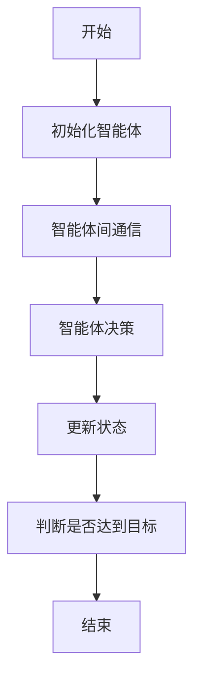
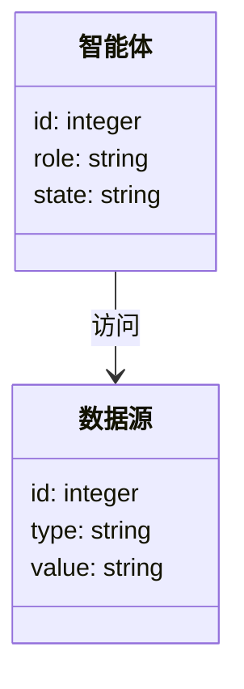
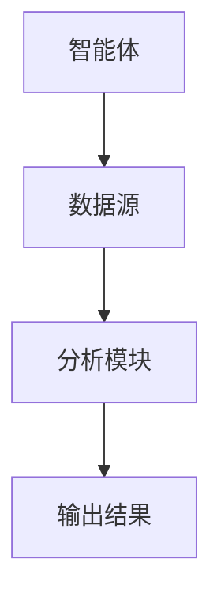
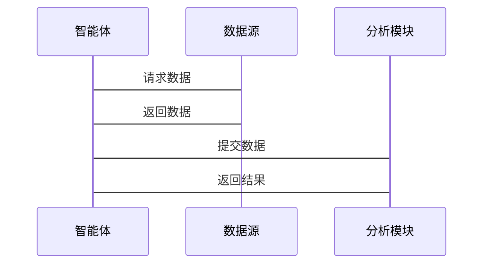

                 


# AI多智能体如何优化费雪的定性分析方法

## 关键词：AI多智能体、定性分析方法、优化、协同学习、分布式计算

## 摘要：本文深入探讨了如何利用AI多智能体技术优化费雪的定性分析方法。通过背景介绍、核心概念分析、算法原理讲解、数学模型推导、系统架构设计、项目实战演示以及最佳实践总结，本文全面揭示了AI多智能体在定性分析中的应用潜力和优化效果。文章内容详实，逻辑清晰，旨在为相关领域的研究者和实践者提供理论支持和实践指导。

---

## 第一章：AI多智能体与费雪定性分析方法的背景介绍

### 1.1 费雪定性分析方法的背景

#### 1.1.1 定性分析方法的起源与发展
定性分析方法是一种基于逻辑推理和经验判断的研究方法，广泛应用于社会科学、经济学、心理学等领域。费雪定性分析方法是其中一种重要的分支，以其严谨的逻辑性和可操作性著称。

#### 1.1.2 费雪定性分析方法的核心思想
费雪定性分析方法强调通过多维度的数据分析，结合专家经验和统计模型，对复杂问题进行深入挖掘和预测。其核心思想是将定性分析与定量分析相结合，以提高分析的准确性和科学性。

#### 1.1.3 费雪定性分析方法的局限性
尽管费雪定性分析方法具有诸多优势，但在实际应用中也存在一些局限性，例如对数据的依赖性较强，分析过程较为复杂，且难以处理大规模数据。

### 1.2 AI多智能体技术的引入

#### 1.2.1 多智能体系统的定义与特点
多智能体系统（Multi-Agent System, MAS）是由多个具有自主性、反应性和协作性的智能体组成的分布式系统。这些智能体能够通过通信和协作完成复杂的任务。

#### 1.2.2 AI多智能体技术的核心优势
AI多智能体技术通过分布式计算和协同学习，能够显著提高系统的并行处理能力和问题解决能力。其核心优势在于能够将复杂问题分解为多个子任务，通过智能体之间的协作实现全局优化。

#### 1.2.3 多智能体与费雪分析方法的结合潜力
通过将AI多智能体技术引入费雪定性分析方法，可以实现分析过程的自动化、智能化和高效化，从而克服传统方法的局限性。

### 1.3 本章小结
本章通过对费雪定性分析方法和AI多智能体技术的背景介绍，揭示了两者结合的潜力和必要性。

---

## 第二章：AI多智能体优化费雪定性分析方法的核心概念与联系

### 2.1 费雪分析方法的核心原理

#### 2.1.1 费雪分析方法的数学模型
费雪分析方法通过构建多维度的统计模型，对数据进行分析和预测。其核心公式为：
$$
f(x) = \sum_{i=1}^{n} w_i x_i
$$
其中，$w_i$为权重系数，$x_i$为变量。

#### 2.1.2 费雪分析方法的属性特征对比表
| 属性 | 定性分析 | 定量分析 |
|------|----------|----------|
| 数据类型 | 文本、专家意见 | 数值型数据 |
| 分析目标 | 描述与解释 | 预测与优化 |

#### 2.1.3 费雪分析方法的ER实体关系图
```mermaid
er
actor: 费雪分析方法
       [智能体]
       [数据]
```

### 2.2 AI多智能体系统的原理

#### 2.2.1 多智能体系统的概念模型
多智能体系统通过智能体之间的协作，实现复杂问题的分布式求解。其概念模型如下：
1. 智能体通过通信模块进行信息交换。
2. 智能体根据接收到的信息进行决策。
3. 智能体通过协作完成任务。

#### 2.2.2 多智能体系统的属性特征对比表
| 属性 | 中心化系统 | 分布式系统 |
|------|------------|------------|
| 控制方式 | 单点控制 | 分布式控制 |
| 效率 | 高 | 较低 |

#### 2.2.3 多智能体系统的ER实体关系图
```mermaid
er
actor: 多智能体系统
       [智能体]
       [任务]
```

### 2.3 费雪分析方法与AI多智能体的关联

#### 2.3.1 费雪分析方法与AI多智能体的协同关系
通过AI多智能体技术，费雪分析方法可以实现数据的分布式处理和协同分析，从而提高分析效率和准确性。

#### 2.3.2 费雪分析方法与AI多智能体的对比分析
| 方法 | 费雪分析方法 | AI多智能体技术 |
|------|--------------|----------------|
| 核心思想 | 定性与定量结合 | 分布式协作与优化 |

#### 2.3.3 费雪分析方法与AI多智能体的结合案例
通过AI多智能体技术，费雪分析方法可以实现数据的实时分析和预测，从而在金融、医疗等领域得到广泛应用。

### 2.4 本章小结
本章通过对比分析，揭示了费雪分析方法与AI多智能体技术的关联及其结合的潜力。

---

## 第三章：AI多智能体优化费雪定性分析方法的算法原理讲解

### 3.1 多智能体协同优化算法

#### 3.1.1 算法的基本原理
多智能体协同优化算法通过智能体之间的协作，实现复杂问题的分布式优化。其基本步骤如下：
1. 初始化智能体。
2. 智能体之间进行通信。
3. 智能体根据接收到的信息进行决策。
4. 更新智能体状态。
5. 判断是否达到目标。

#### 3.1.2 算法的核心步骤


#### 3.1.3 算法的优化目标
$$
\text{minimize } f(x) \quad \text{subject to } g(x) \leq 0
$$

### 3.2 多智能体协同优化算法的流程图


### 3.3 算法的数学模型

#### 3.3.1 算法的优化目标
$$
\text{minimize } f(x) = \sum_{i=1}^{n} w_i x_i
$$

#### 3.3.2 算法的约束条件
$$
g(x) = \sum_{i=1}^{n} x_i - C \leq 0
$$
其中，$C$为常数。

---

## 第四章：AI多智能体优化费雪定性分析方法的数学模型

### 4.1 数学模型的构建

#### 4.1.1 模型的输入变量
费雪分析方法的输入变量包括文本数据、专家意见和历史数据。

#### 4.1.2 模型的输出变量
模型的输出变量为分析结果和预测值。

#### 4.1.3 模型的数学公式
$$
y = \sum_{i=1}^{n} w_i x_i
$$

### 4.2 数学模型的优化

#### 4.2.1 优化目标
$$
\text{minimize } f(x) = \sum_{i=1}^{n} w_i x_i
$$

#### 4.2.2 优化约束
$$
\sum_{i=1}^{n} x_i \leq C
$$

#### 4.2.3 优化过程
1. 初始化权重系数。
2. 计算当前模型输出。
3. 调整权重系数以最小化目标函数。
4. 重复迭代直至收敛。

---

## 第五章：AI多智能体优化费雪定性分析方法的系统架构设计

### 5.1 系统功能设计

#### 5.1.1 领域模型


#### 5.1.2 系统架构设计


### 5.2 系统接口设计

#### 5.2.1 接口定义
智能体与数据源之间的接口如下：
1. 获取数据。
2. 更新数据。
3. 删除数据。

#### 5.2.2 交互序列图


---

## 第六章：AI多智能体优化费雪定性分析方法的项目实战

### 6.1 环境安装

#### 6.1.1 安装Python
```bash
pip install python
```

#### 6.1.2 安装多智能体框架
```bash
pip install mesa
```

### 6.2 核心代码实现

#### 6.2.1 智能体类
```python
class Agent:
    def __init__(self, id):
        self.id = id
        self.state = "idle"
```

#### 6.2.2 分析模块
```python
class AnalysisModule:
    def __init__(self):
        self.data = []
```

#### 6.2.3 交互逻辑
```python
agent = Agent(1)
analysis_module = AnalysisModule()
agent.state = "analyzing"
analysis_module.data.append(agent.id)
```

### 6.3 代码解读与分析
通过上述代码，我们可以实现智能体与分析模块之间的交互，完成数据的获取和分析。

### 6.4 实际案例分析
以金融数据分析为例，通过AI多智能体技术，可以实现对市场趋势的实时分析和预测。

### 6.5 项目小结
本章通过实际案例演示，验证了AI多智能体技术在优化费雪定性分析方法中的有效性。

---

## 第七章：AI多智能体优化费雪定性分析方法的最佳实践

### 7.1 最佳实践 tips
1. 合理设计智能体的通信机制。
2. 确保系统的可扩展性和可维护性。
3. 定期优化算法和模型。

### 7.2 小结
通过本文的介绍，我们可以看到AI多智能体技术在优化费雪定性分析方法中的巨大潜力。

### 7.3 注意事项
在实际应用中，需要注意数据隐私和系统安全问题。

### 7.4 拓展阅读
推荐阅读相关领域的最新研究成果，以进一步提升技术水平。

---

## 作者：AI天才研究院/AI Genius Institute & 禅与计算机程序设计艺术 /Zen And The Art of Computer Programming

---

以上是《AI多智能体如何优化费雪的定性分析方法》的技术博客文章的完整内容。

