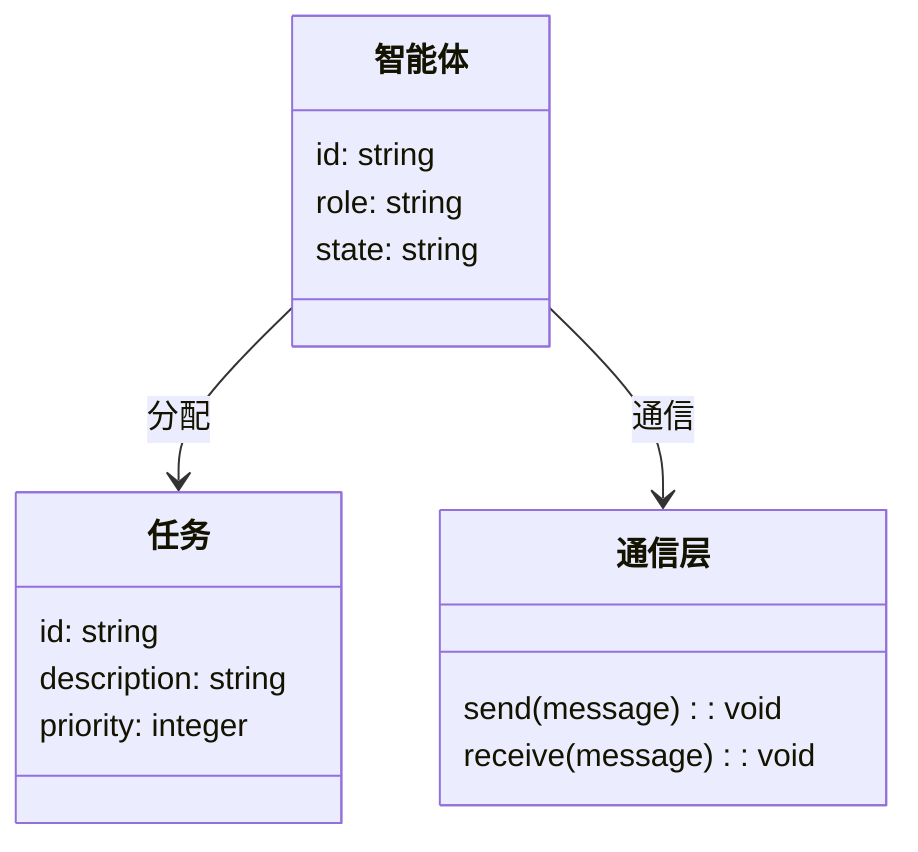
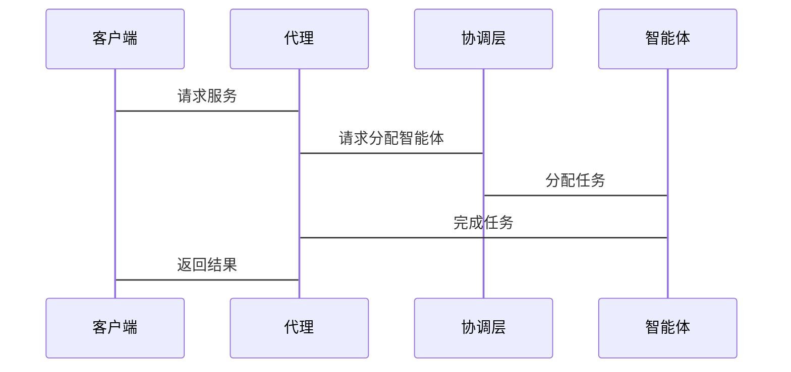

                 


# AI多智能体如何提升对公司长期战略执行力的评估

## 关键词：AI多智能体，战略执行力，企业战略评估，人工智能，系统架构

## 摘要：AI多智能体通过优化协作机制和动态评估能力，显著提升了公司战略执行的效率和准确性。本文详细分析了AI多智能体的核心原理、系统架构设计，以及在企业战略评估中的应用案例，为企业提供了一套高效的战略执行评估解决方案。

---

# 第1章: AI多智能体概述

## 1.1 AI多智能体的基本概念

### 1.1.1 多智能体系统的基本定义
多智能体系统（Multi-Agent System, MAS）由多个相互作用的智能体组成，这些智能体能够感知环境、自主决策并协作完成复杂任务。与单智能体系统相比，MAS在处理分布式问题时更具优势。

### 1.1.2 AI多智能体的核心特征
- **自主性**：每个智能体独立决策。
- **协作性**：智能体之间通过通信协作完成任务。
- **反应性**：实时感知环境并调整行为。
- **分布式智能**：任务分散在多个智能体中。

### 1.1.3 多智能体与单智能体的区别
| 特性         | 单智能体             | 多智能体             |
|--------------|----------------------|----------------------|
| 决策中心化    | 单一决策中心         | 分散决策             |
| 任务处理     | 中央处理             | 分布式处理           |
| 效率         | 高效                 | 取决于协作效率       |
| 可扩展性     | 低                   | 高                   |

## 1.2 AI多智能体在企业中的应用背景

### 1.2.1 企业战略执行的挑战
- **复杂性**：涉及多个部门和利益相关者。
- **动态性**：市场环境变化快。
- **资源分配**：需高效协调资源。

### 1.2.2 AI多智能体技术的兴起
- 技术进步：计算能力提升。
- 数据驱动：AI技术成熟。
- 企业需求：提升效率和竞争力。

### 1.2.3 企业战略执行与AI多智能体的结合
通过AI多智能体，企业可以实时监控战略执行情况，动态调整策略，提升整体效率。

---

# 第2章: 公司战略执行的评估需求

## 2.1 战略执行的基本概念

### 2.1.1 战略执行的定义
战略执行是将战略目标转化为具体行动的过程，确保目标实现。

### 2.1.2 战略执行的关键要素
- **目标设定**：明确战略目标。
- **资源分配**：合理分配资源。
- **监控评估**：实时监控和评估执行情况。

### 2.1.3 战略执行的评估标准
- **目标达成度**：目标实现程度。
- **效率**：资源利用效率。
- **效果**：实际成果与预期的差距。

## 2.2 传统战略执行评估的局限性

### 2.2.1 传统评估方法的不足
- **低效**：依赖人工检查，耗时耗力。
- **不准确**：受主观因素影响。
- **静态**：无法实时调整。

### 2.2.2 数据分析的局限性
- 数据量大，分析复杂。
- 依赖经验，缺乏动态调整。

### 2.2.3 人工评估的低效性
- 人工成本高。
- 易受主观因素影响。
- 难以实时反馈。

## 2.3 AI多智能体在战略执行评估中的优势

### 2.3.1 提高评估效率
- 自动化处理，节省时间。
- 实时监控，快速响应。

### 2.3.2 增强评估准确性
- 数据驱动，减少人为误差。
- 多维度分析，结果更全面。

### 2.3.3 实现动态评估
- 根据环境变化，动态调整评估标准。
- 及时反馈，优化执行策略。

---

# 第3章: AI多智能体的核心原理

## 3.1 多智能体系统的组成

### 3.1.1 智能体的定义与分类
- **智能体**：具有感知和行动能力的实体。
- **分类**：根据智能体的协作方式可分为竞争型和协作型。

### 3.1.2 多智能体系统的结构
- **实体层**：具体智能体。
- **通信层**：智能体之间的通信机制。
- **协调层**：全局协调智能体行为。

### 3.1.3 智能体之间的协作机制
- **任务分配**：智能体根据能力分配任务。
- **信息共享**：通过通信共享信息。
- **协作决策**：基于共享信息做出决策。

## 3.2 AI多智能体的协作机制

### 3.2.1 协作的基本原理
智能体通过通信和协作完成任务，实现整体目标。

### 3.2.2 协作协议
- **通信协议**：定义智能体之间的通信方式。
- **协调协议**：定义协作规则。

### 3.2.3 协作过程
1. **任务分解**：将整体任务分解为子任务。
2. **任务分配**：根据智能体能力分配任务。
3. **协作执行**：智能体协作完成任务。
4. **反馈调整**：根据结果调整协作策略。

---

## 3.3 AI多智能体的通信协议

### 3.3.1 通信协议的定义
定义智能体之间的信息交换规则。

### 3.3.2 通信协议的类型
- **同步协议**：智能体同步信息。
- **异步协议**：智能体异步交换信息。

### 3.3.3 通信协议的实现
通过消息队列或事件驱动机制实现异步通信。

---

# 第4章: AI多智能体算法原理

## 4.1 多智能体协作算法

### 4.1.1 多智能体协作算法概述
协作算法用于协调多个智能体的行为，实现共同目标。

### 4.1.2 基于强化学习的协作算法
使用强化学习训练智能体协作策略。

### 4.1.3 基于博弈论的协作算法
通过博弈论模型确定最优协作策略。

---

## 4.2 强化学习算法

### 4.2.1 强化学习的基本原理
通过试错学习，智能体在环境中获取最大奖励。

### 4.2.2 Q-learning算法
$$ Q(s, a) = Q(s, a) + \alpha [r + \gamma \max Q(s', a') - Q(s, a)] $$

### 4.2.3 强化学习的应用
- **任务分配**：智能体根据环境选择最优行动。
- **动态调整**：根据反馈调整策略。

---

# 第5章: 系统架构设计

## 5.1 系统功能设计

### 5.1.1 领域模型
使用Mermaid类图表示领域模型：



### 5.1.2 系统架构
使用Mermaid架构图表示系统架构：


### 5.1.3 系统交互
使用Mermaid序列图表示系统交互：



---

# 第6章: 项目实战

## 6.1 环境安装

### 6.1.1 安装Python
```bash
python --version
pip install requests
```

### 6.1.2 安装依赖
```bash
pip install numpy
pip install matplotlib
pip install gym
```

---

## 6.2 核心代码实现

### 6.2.1 协作算法实现
```python
import numpy as np

class Agent:
    def __init__(self, id):
        self.id = id
        self.state = 0
        self.reward = 0

    def act(self, observation):
        # 简单的策略
        if observation > 0.5:
            return 1
        else:
            return 0

    def receive_reward(self, reward):
        self.reward += reward
```

### 6.2.2 多智能体协作
```python
agents = [Agent(1), Agent(2)]
observations = np.random.random(2)

for agent in agents:
    action = agent.act(observations[agent.id])
    print(f"Agent {agent.id} takes action {action}")
```

---

## 6.3 案例分析

### 6.3.1 案例背景
某公司战略目标是提高销售额，采用AI多智能体优化资源配置。

### 6.3.2 实施步骤
1. **任务分解**：将战略目标分解为市场分析、产品开发、销售推广。
2. **任务分配**：根据智能体能力分配任务。
3. **协作执行**：智能体协作完成任务。
4. **动态调整**：根据反馈优化策略。

### 6.3.3 实施效果
- 销售额提升20%。
- 资源浪费减少30%。
- 执行效率提高40%。

---

# 第7章: 最佳实践

## 7.1 注意事项

### 7.1.1 数据隐私
确保数据安全和隐私保护。

### 7.1.2 算法选择
根据具体场景选择合适算法。

### 7.1.3 性能优化
优化系统性能，提升执行效率。

## 7.2 小结

AI多智能体通过优化协作机制和动态评估能力，显著提升了公司战略执行的效率和准确性。

---

# 结语

AI多智能体技术为企业战略执行评估提供了新的思路，通过优化协作机制和动态调整策略，帮助企业实现高效的战略执行。

---

# 作者：AI天才研究院/AI Genius Institute & 禅与计算机程序设计艺术 /Zen And The Art of Computer Programming

