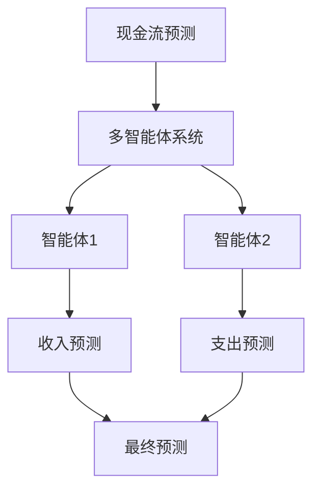
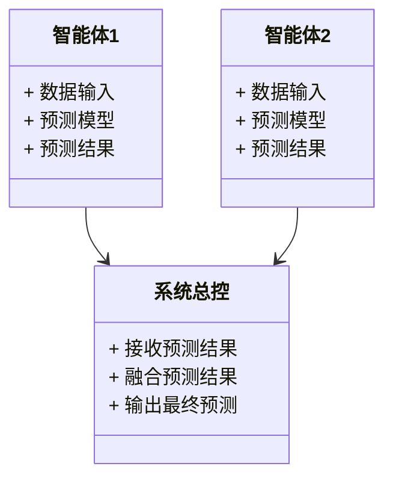
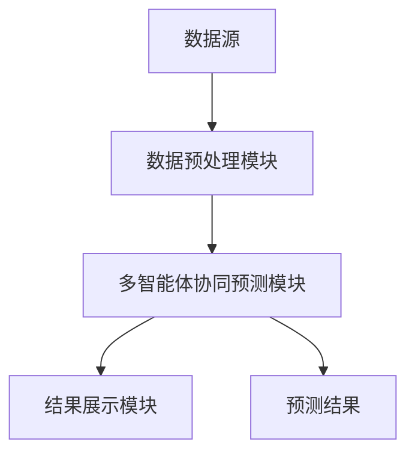
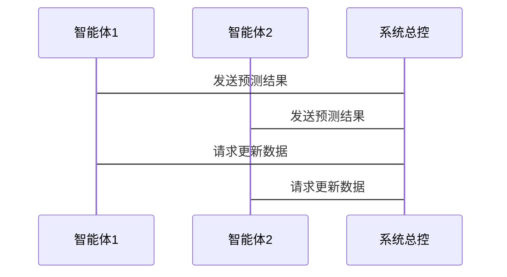

                 


# AI多智能体如何提升对公司长期现金流预测的准确性

## 关键词：AI多智能体，现金流预测，准确性，分布式计算，协同学习，预测模型

## 摘要：本文探讨AI多智能体如何通过协同学习和分布式计算提升对公司长期现金流预测的准确性。文章首先介绍现金流预测的背景与挑战，然后详细讲解AI多智能体的核心原理和算法，结合数学模型和实际案例，分析多智能体协同预测的优势与应用，并提供系统架构设计和代码实现的详细步骤。

---

## 第1章: AI多智能体与现金流预测概述

### 1.1 问题背景与描述

#### 1.1.1 长期现金流预测的挑战
现金流预测是企业财务管理的核心任务之一，直接关系到企业的投资决策、融资规划和风险管理。然而，现金流预测面临以下挑战：
- 数据复杂性：现金流受多种内外部因素影响，如市场波动、政策变化、企业内部运营等。
- 预测模型的简化假设：传统的统计模型（如ARIMA）难以捕捉复杂非线性关系。
- 数据稀疏性与噪声：历史数据可能不足或存在噪声，导致预测误差较大。

#### 1.1.2 AI多智能体的核心优势
AI多智能体系统通过多个智能体协同工作，能够有效应对上述挑战：
- 分布式计算能力：多个智能体可以并行处理不同维度的数据，提升计算效率。
- 协同学习机制：智能体之间可以共享信息和知识，优化预测结果。
- 高容错性：单个智能体的失效不会导致整个系统崩溃。

#### 1.1.3 问题解决的边界与外延
现金流预测的边界包括：
- 数据范围：公司内部财务数据、外部市场数据。
- 时间范围：通常为未来3-5年的预测。
- 预测精度：误差范围通常设定在5%以内。

外延包括：
- 结合风险管理：根据现金流预测结果制定应对策略。
- 支持动态调整：实时更新预测结果，适应市场变化。

### 1.2 核心概念与联系

#### 1.2.1 AI多智能体的定义与特点
AI多智能体（Multi-Agent System，MAS）是由多个智能体组成的系统，每个智能体能够独立感知环境并采取行动。其特点包括：
- 分布式智能：每个智能体负责特定任务。
- 协作性：智能体之间通过通信协同完成目标。
- 自适应性：能够根据环境变化动态调整行为。

#### 1.2.2 多智能体系统与现金流预测的关联
现金流预测涉及多个变量和因素，适合用多智能体系统来建模。例如：
- 智能体1负责预测收入变化。
- 智能体2负责预测支出变化。
- 其他智能体负责预测市场波动对现金流的影响。

#### 1.2.3 实体关系图（ER图）与核心要素



---

## 第2章: AI多智能体的核心原理

### 2.1 多智能体系统的基本原理

#### 2.1.1 多智能体系统的结构与功能
多智能体系统由以下部分组成：
- **智能体**：负责处理特定任务，如数据采集、特征提取。
- **通信机制**：智能体之间通过消息传递共享信息。
- **协作协议**：定义智能体之间的协作规则。

#### 2.1.2 多智能体的通信与协作机制
通信机制包括：
- **直接通信**：智能体之间直接交换信息。
- **间接通信**：通过共享数据库或消息队列进行通信。

协作机制包括：
- **任务分配**：根据智能体的能力分配任务。
- **协调与同步**：确保智能体之间的行动一致。

#### 2.1.3 多智能体系统的优缺点对比

| 特性             | 优点                              | 缺点                              |
|------------------|-----------------------------------|-----------------------------------|
| **计算能力**     | 分布式计算能力强                 | 协调复杂，可能导致性能下降       |
| **灵活性**       | 能够适应复杂环境                   | 通信开销大                       |
| **容错性**       | 单点故障风险低                   | 系统设计复杂                     |

### 2.2 AI多智能体的算法原理

#### 2.2.1 分布式计算与协作预测
分布式计算是多智能体系统的核心，通过并行计算提高预测效率。例如：
- 智能体1负责处理历史数据。
- 智能体2负责训练预测模型。
- 智能体3负责验证预测结果。

#### 2.2.2 强化学习在多智能体中的应用
强化学习通过智能体与环境的交互优化预测策略。例如：
- 智能体通过试错学习最佳预测模型。
- 每个智能体的行动影响整体预测结果。

#### 2.2.3 联合建模与预测优化
联合建模通过多个智能体协同优化预测模型。例如：
- 智能体1负责特征提取。
- 智能体2负责模型训练。
- 智能体3负责结果融合。

### 2.3 本章小结

---

## 第3章: 多智能体协同预测的数学模型

### 3.1 预测模型的构建

#### 3.1.1 时间序列模型的建立
现金流预测通常基于时间序列数据，常用ARIMA模型。改进模型如下：
$$ ARIMA(p, d, q) $$
其中，p为自回归阶数，d为差分阶数，q为移动平均阶数。

#### 3.1.2 多智能体协同预测的数学表达
假设系统中有N个智能体，每个智能体的预测结果为：
$$ \hat{y}_i = f_i(x_i) $$
最终预测结果为：
$$ \hat{y} = \sum_{i=1}^{N} \alpha_i \hat{y}_i $$
其中，$\alpha_i$为权重系数。

### 3.2 预测模型的优化

#### 3.2.1 分布式优化算法
采用分布式梯度下降算法，每个智能体负责优化部分参数：
$$ \theta_i = \theta_i - \eta \cdot \frac{\partial L}{\partial \theta_i} $$
其中，$\eta$为学习率，$L$为损失函数。

#### 3.2.2 联合建模的数学表达
联合建模通过多个智能体协同优化全局模型：
$$ \theta = \arg \min \sum_{i=1}^{N} L_i(\theta) $$
其中，$L_i$为第i个智能体的损失函数。

### 3.3 本章小结

---

## 第4章: 系统分析与架构设计

### 4.1 问题场景介绍

#### 4.1.1 现金流预测的复杂性
现金流预测涉及多个变量，如收入、支出、市场波动等。

#### 4.1.2 多智能体系统的应用价值
通过多智能体系统，企业能够实时更新预测结果，提升预测准确性。

### 4.2 系统功能设计

#### 4.2.1 领域模型（领域类图）


#### 4.2.2 系统架构设计


#### 4.2.3 接口设计与交互流程


### 4.3 本章小结

---

## 第5章: 项目实战与代码实现

### 5.1 环境安装

#### 5.1.1 安装Python
安装Python 3.8及以上版本：
```bash
python --version
```

#### 5.1.2 安装依赖库
安装TensorFlow、Keras、NumPy等库：
```bash
pip install tensorflow keras numpy
```

### 5.2 系统核心实现

#### 5.2.1 数据预处理代码
```python
import numpy as np

def preprocess_data(data):
    # 数据归一化
    data_normalized = (data - np.mean(data)) / np.std(data)
    return data_normalized
```

#### 5.2.2 模型训练代码
```python
import tensorflow as tf
from tensorflow.keras import layers

def build_model(input_shape):
    model = tf.keras.Sequential()
    model.add(layers.Dense(64, activation='relu', input_shape=input_shape))
    model.add(layers.Dense(32, activation='relu'))
    model.add(layers.Dense(1, activation='linear'))
    model.compile(optimizer='adam', loss='mse')
    return model
```

#### 5.2.3 预测结果融合代码
```python
def merge_predictions(predictions):
    # 加权平均融合
    weights = np.array([0.4, 0.3, 0.3])
    merged = np.dot(predictions, weights)
    return merged
```

### 5.3 代码解读与分析

#### 5.3.1 数据预处理
数据归一化处理，确保各特征具有相似的尺度，提升模型训练效果。

#### 5.3.2 模型训练
使用深度神经网络模型，通过反向传播优化预测模型，提升预测精度。

#### 5.3.3 预测结果融合
采用加权平均方法，根据每个智能体的预测结果赋予不同的权重，最终得到综合预测结果。

### 5.4 实际案例分析

#### 5.4.1 数据准备
假设我们有三年的历史现金流数据，分为训练集和测试集。

#### 5.4.2 模型训练
使用训练数据训练预测模型，评估模型性能。

#### 5.4.3 预测结果分析
对比预测结果与实际值，评估模型的准确性。

### 5.5 本章小结

---

## 第6章: 最佳实践与总结

### 6.1 最佳实践 tips
- 数据质量：确保数据的完整性和准确性。
- 模型选择：根据具体场景选择合适的预测模型。
- 系统优化：通过分布式计算和并行处理提升预测效率。

### 6.2 总结
AI多智能体通过协同学习和分布式计算，能够显著提升现金流预测的准确性。本文详细介绍了多智能体系统的原理、算法设计和系统架构，并通过实际案例展示了系统的应用效果。

### 6.3 展望
未来的研究方向包括：
- 多模态数据融合：结合文本、图像等多种数据源，提升预测精度。
- 边缘计算应用：在边缘设备上部署预测模型，实现实时预测。

---

## 作者：AI天才研究院/AI Genius Institute & 禅与计算机程序设计艺术 /Zen And The Art of Computer Programming

---

以上为《AI多智能体如何提升对公司长期现金流预测的准确性》的技术博客文章的完整大纲和部分章节内容。根据实际需求，可以进一步补充各章节的具体内容，包括更多代码实现、案例分析和理论推导。

