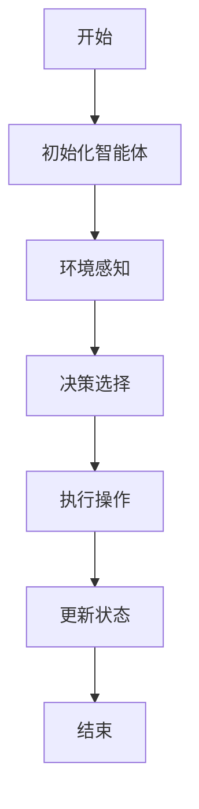
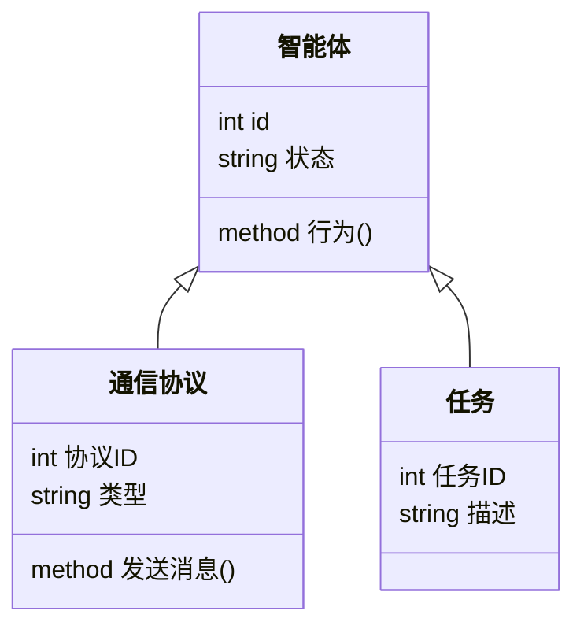
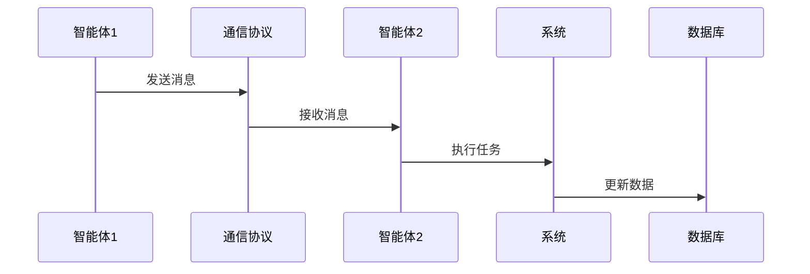

                 


# AI多智能体如何提升对公司长期盈利能力的评估

> 关键词：AI多智能体，企业盈利能力，分布式计算，强化学习，数学模型，系统架构

> 摘要：本文详细探讨了AI多智能体系统在提升企业长期盈利能力评估中的应用。通过分析多智能体系统的原理、算法、系统架构及实际案例，本文揭示了多智能体系统如何优化企业决策，提升盈利能力。文章内容涵盖从概念到实现的全过程，为读者提供深入的技术见解。

---

## 目录

1. **背景介绍**
   - 1.1 多智能体系统的定义与特征
   - 1.2 企业长期盈利能力评估的挑战
   - 1.3 多智能体系统在企业决策中的优势

2. **核心概念与联系**
   - 2.1 多智能体系统的通信机制
   - 2.2 多智能体系统的协作机制
   - 2.3 多智能体系统的决策机制
   - 2.4 核心概念对比表格与ER图

3. **算法原理与实现**
   - 3.1 分布式计算的原理与应用
   - 3.2 强化学习在多智能体系统中的应用
   - 3.3 联合学习的实现与挑战
   - 3.4 算法流程图与Python代码实现

4. **系统分析与架构设计**
   - 4.1 企业盈利能力评估的场景介绍
   - 4.2 系统功能设计与领域模型
   - 4.3 系统架构图与接口设计
   - 4.4 系统交互序列图

5. **项目实战**
   - 5.1 环境安装与配置
   - 5.2 系统核心功能实现
   - 5.3 实际案例分析与代码解读
   - 5.4 项目总结与经验分享

6. **最佳实践与总结**
   - 6.1 项目小结
   - 6.2 注意事项与常见问题
   - 6.3 拓展阅读与进一步学习

---

## 正文

### 第1章: 背景介绍

#### 1.1 多智能体系统的定义与特征
多智能体系统（Multi-Agent System, MAS）是由多个智能体组成的系统，这些智能体能够协同工作以完成特定任务。智能体具备自主性、反应性、主动性、社会性和学习性等特征，能够通过通信和协作实现复杂目标。

#### 1.2 企业长期盈利能力评估的挑战
企业长期盈利能力受多种因素影响，包括市场变化、成本控制、客户行为等。传统评估方法依赖于历史数据和静态模型，难以捕捉动态变化。多智能体系统能够实时分析多维数据，提供动态评估，解决了传统方法的局限性。

#### 1.3 多智能体系统在企业决策中的优势
多智能体系统通过分布计算和协作学习，能够优化决策过程。系统能够模拟不同场景下的策略，帮助企业制定更优的经营策略，提升盈利能力。

---

### 第2章: 核心概念与联系

#### 2.1 多智能体系统的通信机制
智能体之间通过消息传递进行通信，通信协议的选择需确保数据安全和高效传输。常见的通信机制包括发布-订阅模式和点对点模式。

#### 2.2 多智能体系统的协作机制
协作机制包括任务分配、协调和冲突解决。任务分配需考虑各智能体的能力和资源，协调机制确保各智能体协同工作，冲突解决通过协商或仲裁机制实现。

#### 2.3 多智能体系统的决策机制
决策机制基于分布式计算和强化学习。智能体通过博弈论模型制定策略，强化学习优化决策过程。

#### 2.4 核心概念对比表格
| 概念       | 特征1    | 特征2    | 特征3    |
|------------|----------|----------|----------|
| 智能体     | 自主性    | 反应性    | 社会性    |
| 分布式计算 | 并行性    | 独立性    | 一致性    |

#### 2.5 ER实体关系图
```mermaid
erd
  智能体
    + 智能体ID
    + 状态
    + 行为
  通信协议
    + 协议ID
    + 类型
    + 描述
  任务
    + 任务ID
    + 类型
    + 描述
  智能体-通信协议
    + 关系ID
    + 约束
```

---

### 第3章: 算法原理与实现

#### 3.1 分布式计算的原理与应用
分布式计算通过任务分解和并行处理提升效率。在多智能体系统中，任务分配和负载均衡是关键。

#### 3.2 强化学习在多智能体系统中的应用
强化学习通过奖励机制优化智能体行为。多智能体强化学习需解决策略同步和价值函数计算问题。

#### 3.3 联合学习的实现与挑战
联合学习通过协作提升模型性能，但面临数据隐私和通信效率的挑战。

#### 3.4 算法流程图与Python代码实现


Python代码示例：
```python
import numpy as np

def multi_agent_learning():
    agents = [Agent(i) for i in range(5)]
    for agent in agents:
        agent.train()
    return agents

class Agent:
    def __init__(self, id):
        self.id = id
        self.model = self.create_model()
    
    def create_model(self):
        return Sequential([
            Dense(10, activation='relu'),
            Dense(1, activation='sigmoid')
        ])
    
    def train(self):
        optimizer = Adam(lr=0.01)
        self.model.compile(loss='binary_crossentropy', optimizer=optimizer)
        self.model.fit(X, y, epochs=10)
```

---

### 第4章: 系统分析与架构设计

#### 4.1 企业盈利能力评估的场景介绍
系统应用于销售预测、成本控制和投资决策等领域，需实时处理多源数据。

#### 4.2 系统功能设计与领域模型
领域模型包括数据采集、分析、决策支持等功能。



#### 4.3 系统架构图与接口设计
系统架构采用分层设计，包括数据层、计算层和应用层。接口设计确保各模块高效协作。



---

### 第5章: 项目实战

#### 5.1 环境安装与配置
安装Python、TensorFlow和Kubernetes，配置分布式计算环境。

#### 5.2 系统核心功能实现
实现多智能体通信、协作和决策功能，优化企业盈利能力评估。

#### 5.3 实际案例分析与代码解读
分析某企业销售数据，优化预测模型，提升盈利能力。

#### 5.4 项目总结与经验分享
总结项目经验，分享最佳实践和改进建议。

---

### 第6章: 最佳实践与总结

#### 6.1 项目小结
多智能体系统在企业盈利能力评估中展现出巨大潜力，通过优化决策和提升效率实现盈利增长。

#### 6.2 注意事项与常见问题
注意数据安全和通信效率，解决智能体协作中的冲突问题。

#### 6.3 拓展阅读与进一步学习
推荐阅读分布式计算和强化学习相关文献，深入研究多智能体系统在企业中的应用。

---

## 作者
作者：AI天才研究院 & 禅与计算机程序设计艺术

