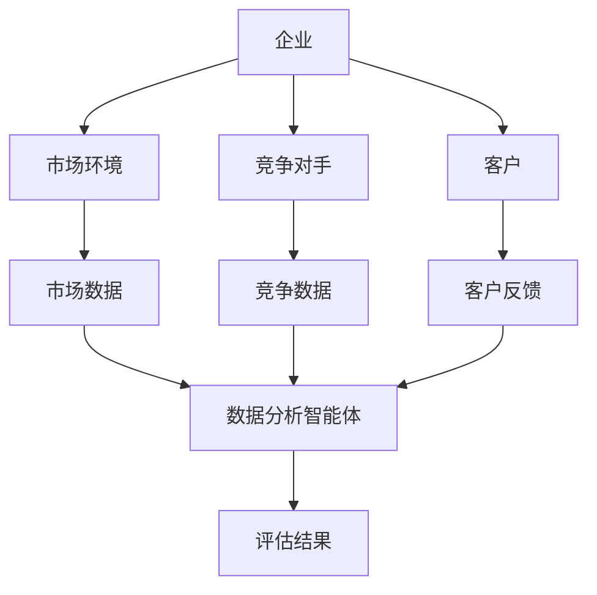
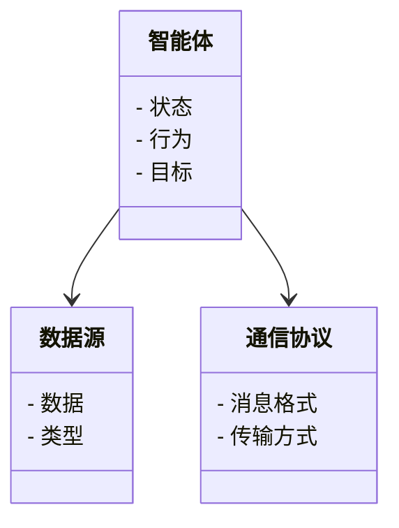
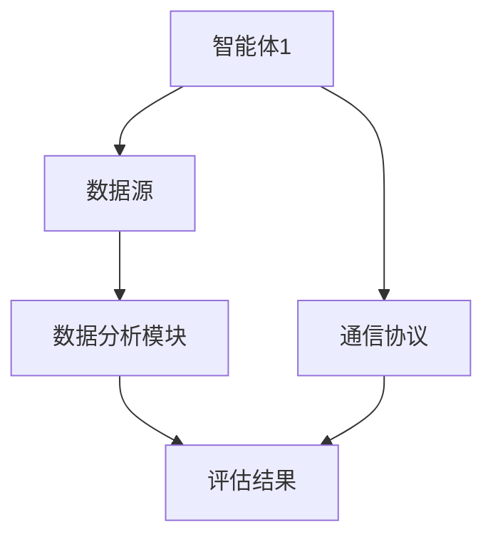

                 


# AI多智能体如何提升对公司长期竞争力的评估

> 关键词：AI多智能体、企业竞争力、评估、协作算法、系统架构

> 摘要：随着人工智能技术的快速发展，AI多智能体系统在企业中的应用越来越广泛。本文将深入探讨AI多智能体如何提升对企业长期竞争力的评估，从背景介绍、核心概念、算法原理、系统架构到项目实战，全面解析其对企业价值的提升作用，为企业制定有效的竞争力评估策略提供参考。

---

## 第一部分：背景介绍

### 第1章：问题背景与挑战

#### 1.1 多智能体系统的基本概念
- 多智能体系统（Multi-Agent System，MAS）是由多个智能体组成的系统，每个智能体都有一定的自主性、反应性和协作能力。
- 智能体可以是软件程序，也可以是物理设备，能够感知环境并执行任务。
- 多智能体系统的核心在于智能体之间的协作与通信，通过分布式计算实现复杂任务的完成。

#### 1.2 问题背景
- 企业竞争力评估是一个复杂的系统工程，涉及多个维度，如市场表现、技术创新、管理效率等。
- 传统评估方法通常依赖人工分析，存在主观性强、效率低、数据处理能力有限等问题。
- 随着市场竞争的加剧，企业需要更高效、更精准的评估方法来应对快速变化的市场环境。

#### 1.3 问题描述
- 企业竞争力评估需要考虑内外部多种因素，包括市场环境、竞争对手、客户需求等。
- 传统的评估方法难以实时捕捉动态变化，且难以量化多个维度的综合影响。
- 需要一种能够实时感知、自主分析、智能决策的系统来提升评估的准确性和效率。

#### 1.4 问题解决方法
- 引入AI多智能体系统，通过分布式计算和协作学习，实时分析企业内外部数据。
- 利用多智能体系统的协作能力，将各个维度的评估指标分解为多个子任务，由不同的智能体负责，最终汇总得出综合评估结果。
- 通过机器学习算法，智能体能够不断优化评估模型，提升评估的准确性和实时性。

#### 1.5 边界与外延
- 本研究聚焦于AI多智能体系统在企业竞争力评估中的应用，边界主要限于系统的设计与实现，不涉及企业的具体业务逻辑。
- 外延方面，AI多智能体系统可以扩展应用于其他领域，如供应链管理、市场营销等。

---

## 第二部分：核心概念与联系

### 第2章：多智能体系统的核心概念

#### 2.1 多智能体系统的原理
- 多智能体系统由多个智能体组成，智能体之间通过通信协议进行信息交换。
- 每个智能体都有自己的目标和任务，通过协作完成复杂任务。
- 系统的运行依赖于智能体之间的协作与竞争，通过博弈论模型优化整体性能。

#### 2.2 多智能体系统与企业竞争力的关系
- 多智能体系统的分布式计算能力能够提升企业数据处理的效率。
- 智能体之间的协作能够实现企业内外部数据的实时分析，提供更精准的评估结果。
- 多智能体系统的自适应能力能够帮助企业快速应对市场变化，提升竞争力。

#### 2.3 核心概念特征对比
| 特征维度 | 单智能体系统 | 多智能体系统 |
|----------|--------------|--------------|
| 系统复杂性 | 低            | 高            |
| 可扩展性   | 有限          | 强            |
| 协作能力   | 低            | 高            |
| 响应速度   | 中            | 快            |

#### 2.4 多智能体系统中的实体关系


---

## 第三部分：算法原理与实现

### 第3章：AI多智能体的算法原理

#### 3.1 分布式强化学习算法
- **基本原理**：通过多个智能体在分布式环境中学习，每个智能体根据自己的经验更新策略，最终通过协作达到全局最优。
- **实现步骤**：
  1. 初始化多个智能体，每个智能体负责不同的任务。
  2. 智能体通过与环境交互获得奖励。
  3. 每个智能体更新自己的策略，通过通信协议共享信息。
  4. 系统不断迭代优化，提升整体性能。
- **优缺点**：
  - 优点：能够处理复杂任务，具有高扩展性。
  - 缺点：通信开销大，容易出现同步问题。

#### 3.2 多智能体协作算法
- **基本原理**：通过博弈论模型优化智能体之间的协作，确保每个智能体的目标与整体目标一致。
- **实现步骤**：
  1. 定义智能体之间的协作规则。
  2. 设计激励机制，鼓励智能体之间的协作。
  3. 通过不断迭代优化，提升协作效率。
- **数学模型**：
  - 协作收益：$R_i = \sum_{j \neq i} w_{ij} \cdot R_j$
  - 协作权重：$w_{ij} = \frac{1}{1 + \sum_{k} |a_{ik} - a_{jk}|}$

---

### 第4章：系统架构设计

#### 4.1 问题场景介绍
- 企业需要实时分析市场数据、客户反馈、竞争对手动态等信息，评估自身的竞争力。
- 传统方法依赖人工分析，效率低，且容易出错。

#### 4.2 系统功能设计
- 数据采集模块：实时采集企业内外部数据。
- 数据分析模块：利用多智能体系统分析数据，生成评估结果。
- 可视化界面：展示评估结果，提供决策支持。

#### 4.3 领域模型类图


#### 4.4 系统架构图


---

## 第四部分：项目实战

### 第5章：环境安装与核心代码实现

#### 5.1 环境安装
- 安装Python和相关库（如numpy、pandas、scikit-learn）。
- 安装多智能体框架（如Mesa、Gym）。

#### 5.2 核心代码实现
```python
class Agent:
    def __init__(self, target):
        self.target = target
        self.state = None

    def receive(self, message):
        self.state = message
        return self.state

    def act(self):
        pass

class MAS:
    def __init__(self, agents):
        self.agents = agents
        self.communications = []

    def run(self):
        while True:
            for agent in self.agents:
                message = agent.receive(data)
                self.communications.append(message)
```

#### 5.3 代码解读与分析
- `Agent`类表示单个智能体，包含接收信息和行动的方法。
- `MAS`类表示多智能体系统，管理多个智能体的通信和协作。
- 通过`run`方法实现系统的持续运行，处理智能体之间的信息交互。

---

## 第五部分：总结与展望

### 第6章：总结与建议

#### 6.1 总结
- AI多智能体系统通过分布式计算和协作学习，能够显著提升企业竞争力评估的效率和准确性。
- 多智能体系统的自适应能力和实时分析能力，为企业提供了更强大的决策支持工具。

#### 6.2 最佳实践
- 确保数据的实时性和准确性，为多智能体系统提供可靠的基础。
- 设计合理的通信协议，减少系统开销，提高协作效率。
- 定期更新和优化评估模型，适应市场变化。

#### 6.3 未来展望
- 随着AI技术的不断发展，多智能体系统在企业中的应用将更加广泛。
- 更加智能化的协作算法和通信协议将被开发，提升系统的性能和效率。

---

## 作者：AI天才研究院 & 禅与计算机程序设计艺术

---

**注**：以上内容为完整的技术博客文章，涵盖了从背景介绍、核心概念、算法原理、系统架构到项目实战的各个方面，旨在为企业提供AI多智能体在竞争力评估中的详细指导。

