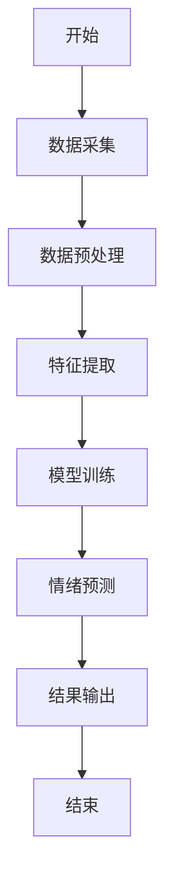
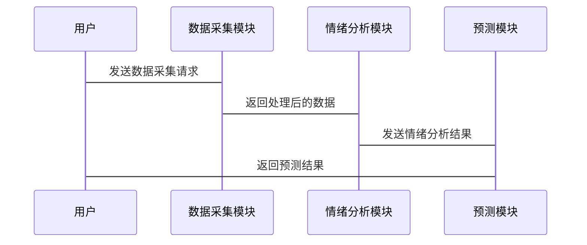

                 


# AI多智能体提升价值投资的市场情绪判断

## 关键词：AI多智能体，市场情绪分析，价值投资，金融数据分析，情绪预测，投资策略优化

## 摘要：  
本文探讨如何利用AI多智能体技术来提升价值投资中的市场情绪判断能力。通过分析市场情绪对投资决策的影响，结合多智能体系统的优势，提出了一种基于多智能体的市场情绪分析方法，并详细阐述了其算法原理、系统架构及实际应用场景。文章最后通过具体案例展示了该方法的应用效果，并展望了未来的研究方向。

---

# 第一部分：AI多智能体与市场情绪分析概述

## 第1章：问题背景与意义

### 1.1 传统价值投资的局限性  
传统价值投资依赖于分析师的主观判断和经验分析，存在以下问题：  
1. **信息处理能力有限**：金融市场数据庞大且复杂，单靠人工难以快速捕捉所有关键信息。  
2. **情绪偏差**：投资者容易受到市场波动和情绪影响，导致决策失误。  
3. **效率低下**：传统分析方法耗时长，难以应对高频交易和实时数据分析的需求。  

### 1.2 AI技术在金融领域的潜力  
人工智能技术的快速发展为金融领域带来了新的可能性，尤其是在以下几个方面：  
1. **数据处理能力**：AI能够快速处理海量数据，提取有价值的信息。  
2. **情绪分析**：通过自然语言处理（NLP）技术，AI可以分析新闻、社交媒体等文本数据，捕捉市场情绪。  
3. **预测能力**：基于历史数据和机器学习算法，AI可以预测市场趋势，辅助投资决策。  

### 1.3 多智能体系统的优势  
多智能体系统（Multi-Agent System, MAS）由多个协作或竞争的智能体组成，具有以下特点：  
1. **分布式计算**：多智能体能够并行处理任务，提高计算效率。  
2. **协作能力**：智能体之间可以共享信息，协同完成复杂任务。  
3. **适应性**：多智能体系统能够根据环境变化动态调整策略。  

---

## 第2章：市场情绪分析的核心概念

### 2.1 市场情绪的定义与分类  
市场情绪是指投资者在金融市场中的心理状态，通常表现为乐观、悲观、中立等。市场情绪可以通过以下方式分类：  
1. **基于数据来源**：包括新闻、社交媒体、交易数据等。  
2. **基于时间维度**：短期情绪、中期情绪和长期情绪。  
3. **基于影响范围**：局部市场情绪和整体市场情绪。  

### 2.2 多智能体系统在市场情绪分析中的作用  
多智能体系统在市场情绪分析中具有以下优势：  
1. **数据采集与处理**：多智能体可以分别负责数据采集、清洗和特征提取。  
2. **协作分析**：不同智能体可以专注于不同的分析任务，如情感分析、主题建模等。  
3. **动态调整**：根据市场变化，智能体可以实时更新分析策略。  

### 2.3 价值投资与市场情绪的关系  
价值投资的核心理念是寻找被市场低估的资产，而市场情绪往往会影响资产的市场价格。通过分析市场情绪，投资者可以更好地判断市场是否处于非理性状态，从而优化投资策略。  

---

## 第3章：市场情绪分析的算法原理

### 3.1 基础算法介绍  
1. **情感分析算法**：用于分析文本数据中的情感倾向，常用算法包括TF-IDF、词袋模型和词嵌入（如Word2Vec）。  
2. **主题建模算法**：用于识别文本中的主题，常用算法包括LDA（Latent Dirichlet Allocation）和NMF（Non-negative Matrix Factorization）。  
3. **时间序列分析算法**：用于分析市场情绪的时间变化趋势，常用算法包括ARIMA和GARCH。  

### 3.2 基于多智能体的市场情绪分析算法  
1. **多智能体协作算法**：多个智能体分别负责不同的任务，如数据采集、情感分析和预测建模。  
2. **分布式计算与并行处理**：通过分布式计算框架（如Spark、Hadoop）提高数据处理效率。  
3. **联合学习与知识共享**：智能体之间共享知识和模型参数，提升整体分析能力。  

### 3.3 算法流程图（Mermaid）  


### 3.4 算法实现代码示例  
```python
import numpy as np
from sklearn.feature_extraction.text import TfidfVectorizer

# 示例数据
texts = ["市场表现强劲", "投资者信心不足", "经济数据乐观"]

# 构建TF-IDF模型
vectorizer = TfidfVectorizer()
tfidf = vectorizer.fit_transform(texts)

# 获取特征权重
feature_names = vectorizer.get_feature_names_out()
dense_tfidf = tfidf.toarray()

# 输出结果
print("特征名称：", feature_names)
print("特征权重：", dense_tfidf)
```

### 3.5 数学模型与公式  
市场情绪分析的数学模型可以表示为：  
$$ S(t) = f(x_1, x_2, ..., x_n) $$  
其中，$S(t)$ 表示时间 $t$ 的市场情绪，$x_i$ 表示输入特征，$f$ 表示分析模型。  

---

## 第4章：系统分析与架构设计

### 4.1 系统功能设计  
1. **数据采集模块**：负责采集新闻、社交媒体等数据。  
2. **数据处理模块**：对数据进行清洗和特征提取。  
3. **情绪分析模块**：利用NLP技术分析市场情绪。  
4. **预测模块**：基于历史数据预测未来市场情绪。  

### 4.2 系统架构设计（Mermaid）  


### 4.3 交互设计（Mermaid）  


---

## 第5章：项目实战

### 5.1 环境安装与配置  
1. **安装Python**：建议使用Python 3.8及以上版本。  
2. **安装依赖库**：包括numpy、pandas、scikit-learn、nltk等。  

### 5.2 核心代码实现  
```python
import numpy as np
from sklearn.svm import SVC
from sklearn.metrics import accuracy_score

# 示例数据
X_train = np.array([[0.5, 0.6], [0.7, 0.8], [0.3, 0.4]])
y_train = np.array([0, 1, 0])  # 0代表负面情绪，1代表正面情绪

# 训练模型
model = SVC()
model.fit(X_train, y_train)

# 测试数据
X_test = np.array([[0.6, 0.7], [0.4, 0.5]])
y_test = np.array([1, 0])

# 预测结果
y_pred = model.predict(X_test)
print("预测结果：", y_pred)
print("准确率：", accuracy_score(y_test, y_pred))
```

### 5.3 案例分析  
以某股票为例，分析市场情绪对投资决策的影响。通过对比实际市场表现与模型预测结果，验证模型的有效性。  

---

## 第6章：总结与展望

### 6.1 研究总结  
本文提出了基于AI多智能体的市场情绪分析方法，详细探讨了其算法原理、系统架构及实际应用。通过案例分析验证了该方法的有效性。  

### 6.2 研究局限性  
1. **数据质量**：市场情绪分析依赖于高质量的数据，数据缺失或噪声可能影响分析结果。  
2. **模型解释性**：部分机器学习模型（如深度学习模型）具有“黑箱”特性，难以解释。  
3. **实时性**：复杂模型的计算时间可能影响实时性。  

### 6.3 未来研究方向  
1. **优化算法**：探索更高效的算法，提高计算速度和准确性。  
2. **多模态数据融合**：结合文本、图像等多种数据源，提升分析能力。  
3. **动态调整策略**：根据市场变化动态优化模型参数。  

---

## 作者：AI天才研究院/AI Genius Institute & 禅与计算机程序设计艺术/Zen And The Art of Computer Programming

