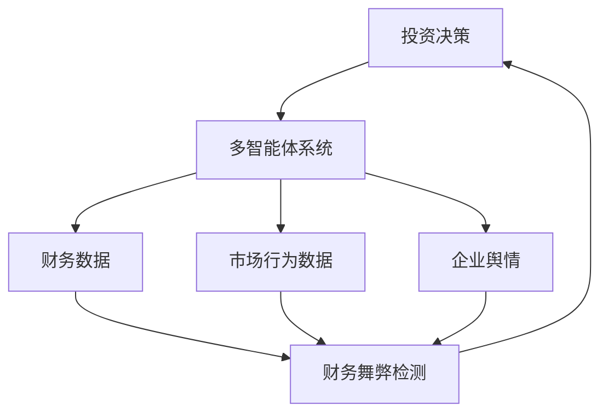
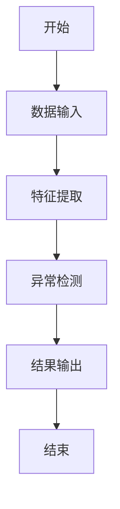
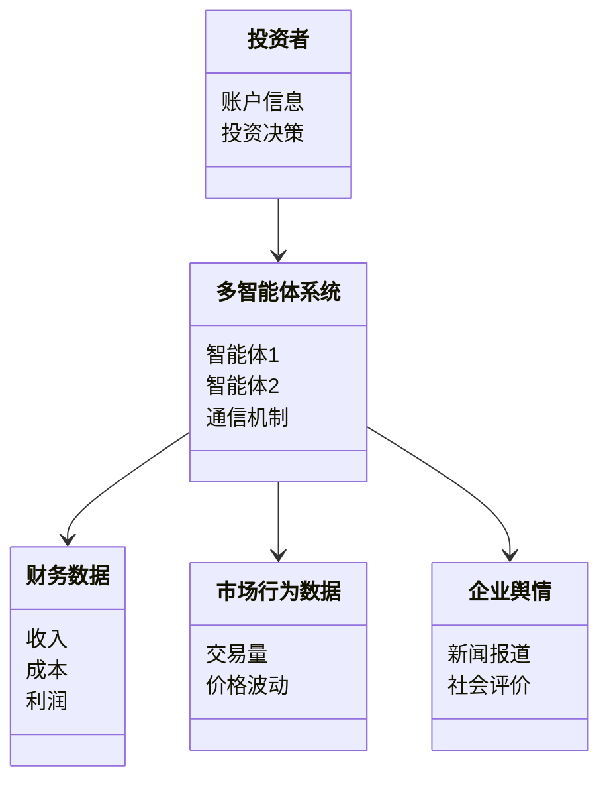
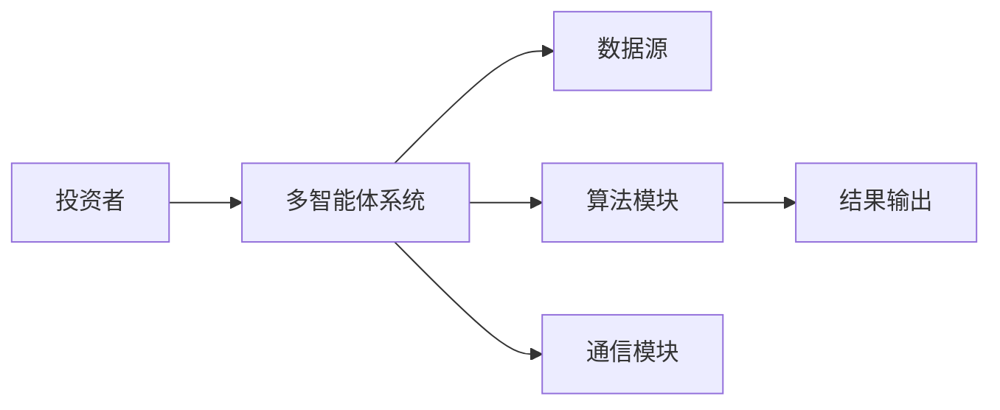
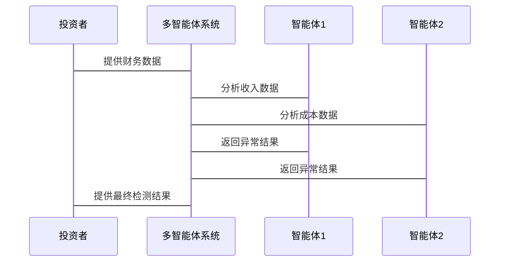

                 


# AI多智能体提升价值投资的财务舞弊检测

**关键词**：AI多智能体、价值投资、财务舞弊检测、异常检测算法、系统架构设计

**摘要**：本文探讨了如何利用AI多智能体技术提升财务舞弊检测的准确性，从而增强价值投资决策的可靠性。通过分析多智能体系统在财务数据中的应用，结合价值投资的核心理念，提出了一种基于多智能体的异常检测算法，并通过实际案例展示了其在价值投资中的优势。

---

## 第1章: 背景介绍

### 1.1 问题背景
#### 1.1.1 价值投资中的财务舞弊问题
- 价值投资的核心在于通过分析企业的财务报表和市场行为，寻找被市场低估的优质企业。
- 财务舞弊行为（如虚构收入、隐藏负债等）会严重扭曲企业的实际价值，误导投资者的决策。
- 传统财务舞弊检测方法（如基于规则的审计方法）效率低下，难以应对复杂的舞弊手段。

#### 1.1.2 财务舞弊对企业价值评估的影响
- 财务舞弊可能导致企业估值偏差，进而影响投资决策的准确性。
- 舞弊行为暴露后，企业声誉受损，投资者信心下降，可能导致投资损失。

#### 1.1.3 传统财务舞弊检测的局限性
- 传统方法依赖人工审计，效率低且成本高。
- 面对海量数据，传统方法难以发现隐藏的舞弊模式。

### 1.2 问题描述
#### 1.2.1 财务舞弊检测的核心目标
- 通过分析财务数据，识别异常交易模式。
- 揭示财务报表中的虚假信息。

#### 1.2.2 价值投资中的财务数据特征
- 数据量大、维度多、关联性强。
- 数据中隐藏的舞弊模式复杂且多样。

#### 1.2.3 财务舞弊检测的边界与外延
- 边界：仅关注财务数据中的异常模式。
- 外延：结合市场行为数据、企业舆情等多源数据。

### 1.3 问题解决
#### 1.3.1 多智能体系统的优势
- 分布式计算能力：多个智能体协同工作，提高计算效率。
- 多维度分析：每个智能体专注于不同的数据维度，提升检测精度。
- 自适应性：智能体之间可以动态调整协作策略。

#### 1.3.2 AI技术在财务舞弊检测中的应用潜力
- 机器学习：用于模式识别和异常检测。
- 自然语言处理：分析企业报告中的语义信息。
- 图神经网络：挖掘数据之间的关联性。

#### 1.3.3 价值投资与财务舞弊检测的结合
- 提高财务数据的准确性，增强投资决策的可靠性。
- 通过识别舞弊企业，优化投资组合。

### 1.4 核心要素与概念结构
#### 1.4.1 多智能体系统的核心要素
- 智能体：负责数据处理、模式识别。
- 通信机制：智能体之间的信息交互。
- 协作策略：智能体协同工作的规则。

#### 1.4.2 价值投资中的关键财务指标
- 营业收入增长率、净利润率、资产负债率等。

#### 1.4.3 财务舞弊检测的特征与维度
- 数据异常性：收入与成本的匹配性。
- 行为异常性：关联交易频繁、账期延长等。

---

## 第2章: 核心概念与联系

### 2.1 多智能体系统原理
#### 2.1.1 多智能体系统的定义与特点
- 定义：由多个智能体组成的分布式系统，通过协作完成复杂任务。
- 特点：分布式、协作性、自主性。

#### 2.1.2 多智能体系统的组成与协作机制
- 组成：智能体、通信机制、协作策略。
- 协作机制：任务分配、信息共享、决策协商。

#### 2.1.3 多智能体系统在财务舞弊检测中的应用
- 数据分析：智能体负责不同数据维度的分析。
- 异常检测：智能体协同识别数据中的异常模式。

### 2.2 价值投资与财务舞弊检测的关系
#### 2.2.1 价值投资的核心理念
- 寻找被市场低估的企业。
- 长期投资，关注企业基本面。

#### 2.2.2 财务舞弊对价值投资的影响
- 虚假财务数据误导企业估值。
- 舞弊行为暴露后引发投资损失。

#### 2.2.3 多智能体系统如何辅助价值投资
- 提供更准确的财务数据。
- 识别潜在的舞弊企业。

### 2.3 实体关系图与协作流程


---

## 第3章: 算法原理与数学模型

### 3.1 多智能体异常检测算法
#### 3.1.1 算法概述
- 基于多智能体的分布式异常检测算法。
- 每个智能体负责部分数据的分析，通过协作完成全局检测。

#### 3.1.2 算法流程图


#### 3.1.3 数学模型
- 异常检测模型：基于概率的异常检测。
  $$ P(x) = \frac{1}{(2\pi)^{d/2}|\Sigma|^{1/2}} \exp\left(-\frac{1}{2}(x-\mu)^T \Sigma^{-1} (x-\mu)\right) $$
- 协作机制：基于分布式计算的加权平均。
  $$ w_i = \frac{1}{n} \sum_{j=1}^{n} w_j $$

#### 3.1.4 代码实现
```python
import numpy as np
from sklearn.mixture import GaussianMixture

def detect_anomalies(data):
    # 初始化高斯混合模型
    gm = GaussianMixture(n_components=2, random_state=0)
    gm.fit(data)
    
    # 预测异常分数
    scores = gm.score_samples(data)
    threshold = np.percentile(scores, 10)
    
    # 标识异常点
    anomalies = np.where(scores <= threshold)[0]
    return anomalies

# 示例数据
data = np.random.randn(100, 2)
anomalies = detect_anomalies(data)
print(anomalies)
```

---

## 第4章: 系统分析与架构设计

### 4.1 系统功能设计
#### 4.1.1 领域模型


### 4.2 系统架构设计
#### 4.2.1 架构图


### 4.3 接口设计
- 数据接口：与财务数据源对接。
- 通信接口：智能体之间的信息交互。
- 输出接口：将检测结果传递给投资决策系统。

### 4.4 交互流程


---

## 第5章: 项目实战

### 5.1 环境安装
- Python 3.8+
- NumPy、Scikit-learn、Mermaid工具。

### 5.2 核心代码实现
```python
import numpy as np
from sklearn.mixture import GaussianMixture

def setup_system():
    # 初始化多智能体系统
    agents = [Agent1(), Agent2(), ...]
    return agents

class Agent:
    def __init__(self):
        self.data = []
    
    def analyze(self, data):
        # 数据分析逻辑
        pass
    
    def communicate(self, other_agent):
        # 与其他智能体通信
        pass
```

### 5.3 案例分析
- 数据准备：收集某企业的财务数据。
- 算法实现：使用上述代码实现异常检测。
- 结果分析：识别出异常的财务数据，并分析其对投资决策的影响。

---

## 第6章: 最佳实践与小结

### 6.1 最佳实践
- 数据质量：确保数据的完整性和准确性。
- 模型优化：根据实际数据调整算法参数。
- 可视化：通过图表直观展示检测结果。

### 6.2 小结
- 本文提出了一种基于多智能体的财务舞弊检测方法，能够有效辅助价值投资决策。
- 通过实际案例展示了算法的高效性和准确性。

### 6.3 注意事项
- 数据隐私保护：避免敏感数据泄露。
- 模型维护：定期更新模型以应对新的舞弊手段。

### 6.4 拓展阅读
- 《机器学习实战》
- 《分布式系统：概念与设计原理》
- 《财务报表分析与舞弊识别》

---

## 作者：AI天才研究院 & 禅与计算机程序设计艺术

---

这篇文章系统地介绍了AI多智能体技术在财务舞弊检测中的应用，并通过实际案例展示了其在价值投资中的潜力。希望对读者有所帮助！

