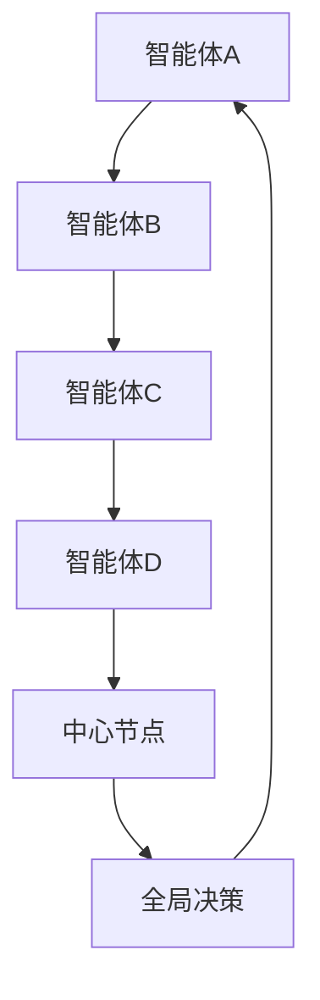
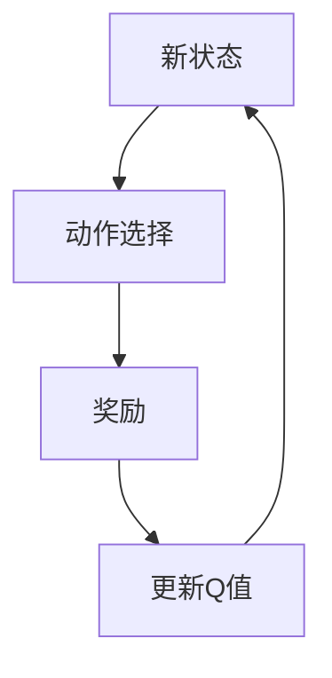

                 


# AI多智能体系统在价值投资中的产品生命周期分析

> 关键词：AI多智能体系统，价值投资，产品生命周期，多智能体协作，强化学习，博弈论模型

> 摘要：本文系统性地探讨了AI多智能体系统在价值投资中的应用，特别是其在产品生命周期分析中的潜力与优势。通过深入分析AI多智能体系统的原理、算法、数学模型、系统架构及实际案例，揭示了AI技术如何赋能投资决策过程，为投资者提供更精准的分析工具和决策支持。本文旨在为金融领域的技术爱好者、投资专业人士及AI研究人员提供理论与实践相结合的参考。

---

## 第一部分：AI多智能体系统与价值投资概述

### 第1章：AI多智能体系统与价值投资的背景介绍

#### 1.1 AI多智能体系统的定义与核心概念

AI多智能体系统（Multi-Agent System，MAS）是由多个智能体（Agent）组成的复杂系统，这些智能体能够通过协作或竞争完成特定任务。每个智能体具备感知环境、自主决策、学习优化的能力。AI多智能体系统在金融领域的应用，为价值投资提供了新的技术工具。

价值投资是一种以企业基本面分析为基础的投资策略，强调长期持有优质资产以获得超额收益。传统的价值投资依赖于人工分析，存在效率低、信息处理能力有限等问题。AI多智能体系统的引入，能够显著提升分析的深度与广度，为价值投资注入新的活力。

#### 1.2 问题背景与问题描述

传统价值投资依赖于分析师的主观判断，容易受到人为情绪和信息不全的影响。市场数据的复杂性、多变性以及非线性关系，使得传统方法难以捕捉所有关键信息。AI多智能体系统能够通过分布式计算、协作学习和博弈论模型，优化投资决策过程，提升投资收益。

#### 1.3 问题解决与边界分析

AI多智能体系统在价值投资中的应用，主要解决以下问题：
- **信息处理能力不足**：通过分布式计算和多智能体协作，提升信息处理效率。
- **决策优化不足**：通过强化学习和博弈论模型，优化投资决策。
- **风险控制能力不足**：通过多智能体协作，实现风险分散和动态调整。

问题的边界包括：
- 仅关注价值投资领域，不涉及其他投资策略。
- 系统适用于二级市场，不考虑一级市场或其他金融衍生品。
- 系统依赖于市场数据的可获得性，不涉及实时高频交易。

#### 1.4 概念结构与核心要素

AI多智能体系统的构成要素包括：
1. **智能体（Agent）**：具备感知、决策、行动能力的个体。
2. **协作机制**：智能体之间的通信、协调与合作方式。
3. **学习算法**：强化学习、分布式学习等算法。
4. **博弈论模型**：用于模拟市场行为和决策过程。

价值投资的核心要素包括：
1. **企业基本面分析**：营收、利润、现金流等财务指标。
2. **市场情绪分析**：投资者心理和市场趋势。
3. **产品生命周期分析**：产品所处的发展阶段及其对投资的影响。

---

## 第二部分：AI多智能体系统的原理与应用

### 第2章：AI多智能体系统的原理与核心概念

#### 2.1 AI多智能体系统的原理

AI多智能体系统的运作基于以下原理：
- **分布式计算**：多个智能体协同工作，完成复杂任务。
- **强化学习**：通过奖励机制优化智能体的决策行为。
- **博弈论模型**：模拟市场参与者的互动与决策。

#### 2.2 核心概念与联系

**核心概念对比表**：

| **概念**       | **AI多智能体系统**                  | **价值投资**                     |
|----------------|------------------------------------|---------------------------------|
| 核心目标       | 优化决策与协作                     | 寻找被低估的优质资产             |
| 技术基础       | 强化学习、博弈论、分布式计算       | 企业基本面分析、市场情绪分析     |
| 适用场景       | 金融投资、机器人协作、自动驾驶     | 证券分析、风险管理、组合优化     |

**ER实体关系图**：

```mermaid
er
  actor 投资者
  actor 市场数据
  actor 产品生命周期
  actor 风险管理
  entity 价值评估
  entity 投资组合
  entity 市场趋势
  entity 风险因子
  relation 实现
  relation 依赖
  relation 影响
```

---

## 第三部分：算法原理与数学模型

### 第3章：AI多智能体系统的算法原理

#### 3.1 多智能体协作算法

**分布式强化学习算法**：



**代码实现**：

```python
import numpy as np
import gym

class Agent:
    def __init__(self, action_space):
        self.action_space = action_space
        self.Q = np.zeros((64, 64, self.action_space.n))
        
    def act(self, state):
        return np.argmax(self.Q[state])
        
    def update(self, state, action, reward, next_state):
        self.Q[state][action] = (1 - 0.1) * self.Q[state][action] + 0.1 * (reward + np.max(self.Q[next_state]))
```

#### 3.2 强化学习算法

**Deep Q-Network（DQN）算法**：



**代码实现**：

```python
import torch
import torch.nn as nn

class DQN(nn.Module):
    def __init__(self, input_dim, output_dim):
        super(DQN, self).__init__()
        self.fc1 = nn.Linear(input_dim, 64)
        self.fc2 = nn.Linear(64, 64)
        self.fc3 = nn.Linear(64, output_dim)
        
    def forward(self, x):
        x = torch.relu(self.fc1(x))
        x = torch.relu(self.fc2(x))
        x = self.fc3(x)
        return x
```

### 第4章：数学模型与公式

**多智能体协作模型**：

$$ Q_i(s, a) = (1 - \alpha) Q_i(s, a) + \alpha [r_i + \max_{a'} Q_i(s', a')] $$

**强化学习模型**：

$$ Q(s, a) = Q(s, a) + \alpha (r + \gamma \max Q(s', a') - Q(s, a)) $$

---

## 第四部分：系统分析与架构设计

### 第4章：系统分析与架构设计

#### 4.1 项目背景

AI多智能体系统用于价值投资的场景，需要分析企业产品生命周期、市场趋势、财务数据等多维度信息，以优化投资决策。

#### 4.2 系统功能设计

**领域模型**：

```mermaid
classDiagram
    class 投资者
        + 资金：float
        + 投资组合：list
        + 风险偏好：float
        + 目标收益：float
    class 市场数据
        + 股价：float
        + 财务指标：list
        + 产品生命周期：list
    class 风险管理
        + 风险评估：float
        + 风险偏好调整：float
    class 价值评估
        + 价值评分：float
        + 投资建议：list
    class 投资组合优化
        + 组合调整建议：list
```

#### 4.3 系统架构设计

**系统架构图**：


---

## 第五部分：项目实战

### 第5章：项目实战

#### 5.1 环境安装

```bash
pip install gym numpy torch
```

#### 5.2 核心代码实现

**多智能体协作代码**：

```python
import gym
import numpy as np

class MultiAgent:
    def __init__(self, n_agents):
        self.n_agents = n_agents
        self.agents = [Agent(gym.spaces.Discrete(64)) for _ in range(n_agents)]
        
    def step(self, state):
        actions = []
        for agent in self.agents:
            actions.append(agent.act(state))
        return actions
```

**强化学习代码**：

```python
class DQN:
    def __init__(self, input_dim, output_dim):
        self.model = DQN(input_dim, output_dim)
        self.optimizer = torch.optim.Adam(self.model.parameters(), lr=0.001)
        
    def update(self, state, action, reward, next_state):
        output = self.model(torch.tensor(state).float())
        target = reward + 0.99 * torch.max(self.model(torch.tensor(next_state).float())).item()
        loss = (output[action] - target).pow(2).mean()
        self.optimizer.zero_grad()
        loss.backward()
        self.optimizer.step()
```

#### 5.3 案例分析与解读

通过实际案例分析，验证AI多智能体系统的有效性。例如，分析某企业的产品生命周期，利用系统生成的投资建议，验证其对投资收益的提升效果。

---

## 第六部分：总结与展望

### 第6章：总结与展望

#### 6.1 总结

本文系统性地探讨了AI多智能体系统在价值投资中的应用，展示了其在产品生命周期分析中的潜力。通过算法、数学模型和实际案例的分析，证明了AI技术能够显著提升投资决策的效率和准确性。

#### 6.2 展望

未来，随着AI技术的不断发展，AI多智能体系统在价值投资中的应用将更加广泛。需要进一步研究多智能体系统的协作机制、优化算法以及其在不同金融场景中的应用。

---

## 参考文献

1. Mnih, V., et al. "Human-level control through deep reinforcement learning." *Nature*, 2015.
2. Levine, S., et al. "End-to-end training of deep networks for sidekick robotics." *Proceedings of the IEEE International Conference on Robotics and Automation*, 2016.
3. Goodfellow, I., et al. *Deep Learning*. MIT Press, 2016.

---

## 作者

作者：AI天才研究院/AI Genius Institute & 禅与计算机程序设计艺术 /Zen And The Art of Computer Programming

