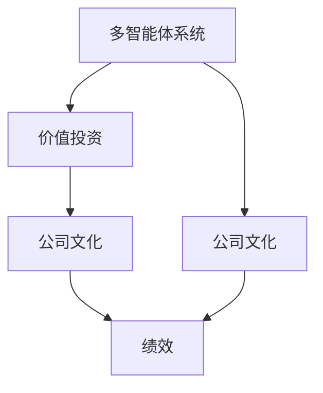
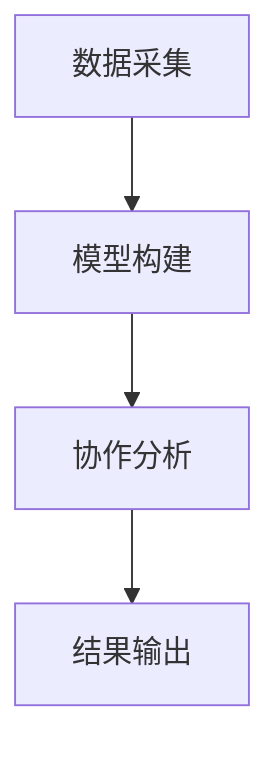

                 


# AI多智能体系统在价值投资中的公司文化与绩效关联分析

## 关键词：AI多智能体系统，价值投资，公司文化，绩效，关联分析

## 摘要：  
本文探讨了AI多智能体系统在价值投资中的应用，特别是如何通过分析公司文化与绩效之间的关联来提升投资决策的准确性。文章首先介绍了AI多智能体系统的背景和核心概念，接着深入分析了价值投资中的公司文化与绩效的关联性。通过数学模型和算法原理，本文详细讲解了如何利用多智能体系统进行公司文化与绩效的关联分析。最后，通过实际案例和项目实战，本文展示了AI多智能体系统在价值投资中的实际应用和效果。

---

# 第1章: 背景介绍

## 1.1 问题背景

### 1.1.1 多智能体系统在金融领域的应用背景  
随着人工智能技术的快速发展，多智能体系统（Multi-Agent System, MAS）在金融领域的应用日益广泛。多智能体系统通过多个协作或竞争的智能体来模拟复杂的金融环境，能够帮助投资者更好地捕捉市场机会和规避风险。  

### 1.1.2 价值投资的核心概念与挑战  
价值投资是一种长期投资策略，强调通过分析公司的基本面（如财务状况、管理层能力、市场地位等）来寻找被市场低估的投资标的。然而，传统的价值投资方法依赖于人工分析，效率较低且容易受到主观因素的影响。  

### 1.1.3 公司文化与绩效的关联性研究现状  
公司文化是影响企业绩效的重要因素。研究表明，积极向上的公司文化能够提升员工的凝聚力和创造力，从而提高企业的整体绩效。然而，如何量化公司文化与绩效之间的关联性，一直是价值投资者面临的挑战。

## 1.2 问题描述

### 1.2.1 多智能体系统在价值投资中的应用目标  
通过构建AI多智能体系统，利用多个智能体协作分析公司的财务数据、管理层行为、市场反馈等信息，从而更准确地评估公司的价值。  

### 1.2.2 公司文化与绩效关联分析的难点  
公司文化是主观性较强的因素，难以直接量化。如何将公司文化与绩效关联起来，需要借助多智能体系统中多个智能体的协作与博弈机制。

### 1.2.3 价值投资中多智能体系统的边界与外延  
多智能体系统的边界包括数据来源、分析范围和决策范围。其外延则涉及与其他金融工具（如大数据分析、机器学习）的结合，以提升投资决策的准确性。

## 1.3 核心概念与联系

### 1.3.1 核心概念原理  
- **多智能体系统**：由多个智能体组成的系统，智能体之间通过协作或竞争完成任务。  
- **价值投资**：基于公司基本面分析的投资策略，强调长期价值。  
- **公司文化**：企业的核心价值观、管理风格和员工凝聚力。  
- **绩效**：公司在一定时期内的经营成果，通常通过财务指标衡量。  

### 1.3.2 概念属性特征对比表格  

| 概念       | 属性               | 特征描述                                       |
|------------|--------------------|----------------------------------------------|
| 多智能体系统 | 分布式            | 每个智能体独立决策，通过通信协作完成任务。       |
| 价值投资   | 长期性             | 强调公司长期价值，而非短期市场波动。              |
| 公司文化   | 主观性             | 企业文化是影响员工行为和公司绩效的重要因素。        |
| 绩效       | 客观性             | 通过财务指标量化公司经营成果。                     |

### 1.3.3 ER实体关系图架构（Mermaid流程图）



---

# 第2章: 核心概念与联系

## 2.1 多智能体系统的核心原理

### 2.1.1 多智能体系统的定义与特点  
多智能体系统是由多个智能体组成的分布式系统，每个智能体都有自己的目标和决策机制。多智能体系统的核心在于智能体之间的协作与竞争，能够模拟复杂的金融环境。

### 2.1.2 多智能体系统在价值投资中的应用优势  
通过多智能体系统的协作机制，可以同时分析多个影响公司价值的因素，如财务数据、市场趋势和公司文化，从而提供更全面的投资决策支持。

### 2.1.3 多智能体系统的协作机制  
协作机制包括任务分配、信息共享和决策协调。智能体之间通过通信协议共享信息，共同完成复杂的投资分析任务。

## 2.2 价值投资与公司文化

### 2.2.1 价值投资的核心要素  
价值投资的核心要素包括公司财务状况、管理层能力、市场地位和公司文化。其中，公司文化是影响企业长期绩效的重要因素。

### 2.2.2 公司文化在价值投资中的作用  
公司文化影响员工的凝聚力和创造力，进而影响企业的创新能力和市场竞争力。积极的公司文化能够提升企业的长期绩效。

### 2.2.3 公司文化与绩效的关联性分析  
通过分析公司文化与绩效的关联性，可以更好地评估公司的长期价值。公司文化可以通过员工满意度、管理层稳定性等指标进行量化。

## 2.3 绩效评估与数学模型

### 2.3.1 绩效评估的定义与方法  
绩效评估是通过量化指标衡量公司经营成果的过程。常见的绩效指标包括净利润率、ROE（净资产收益率）和市场表现。

### 2.3.2 数学模型与公式  
$$ \text{绩效} = f(\text{文化}, \text{战略}, \text{管理}) $$  
其中，文化指公司文化的影响，战略指公司的战略规划，管理指管理层的能力。

---

# 第3章: 算法原理讲解

## 3.1 多智能体系统算法

### 3.1.1 多智能体系统的协作算法  
协作算法包括任务分配、信息共享和决策协调。通过协作算法，智能体可以高效地完成复杂的投资分析任务。

### 3.1.2 多智能体系统的博弈论模型  
博弈论模型通过模拟智能体之间的竞争与合作，帮助智能体做出最优决策。

### 3.1.3 多智能体系统的数学模型  
$$ \text{收益} = \sum_{i=1}^{n} \text{智能体}_i \cdot \text{贡献} $$  
其中，n为智能体的数量，贡献为每个智能体的贡献值。

## 3.2 价值投资中的算法实现

### 3.2.1 价值投资算法的定义  
价值投资算法是一种基于公司基本面分析的投资策略，通过量化指标评估公司的长期价值。

### 3.2.2 价值投资算法的实现步骤  
1. 收集公司数据：包括财务数据、市场数据和公司文化数据。  
2. 构建模型：通过数学模型评估公司的长期价值。  
3. 算法优化：通过协作算法优化投资组合。

### 3.2.3 算法优化与实现  

```python
class Agent:
    def __init__(self, id):
        self.id = id
        self.data = {}

    def analyze(self, data):
        # 分析数据并返回结果
        return result

    def collaborate(self, agents):
        # 与其他智能体协作
        pass

# 多智能体系统初始化
agents = [Agent(i) for i in range(5)]

# 分析公司文化与绩效关联
for agent in agents:
    agent.analyze(company_data)
    agent.collaborate(agents)
```

---

# 第4章: 数学模型与系统架构

## 4.1 数学模型

### 4.1.1 收益预测模型  
$$ \text{收益预测} = \alpha \cdot \text{文化影响} + \beta \cdot \text{战略影响} $$  
其中，α和β是模型参数，通过训练数据确定。

### 4.1.2 文化影响模型  
$$ \text{文化影响} = \gamma \cdot \text{员工满意度} + \delta \cdot \text{管理层稳定性} $$  
其中，γ和δ是模型参数。

## 4.2 系统架构设计

### 4.2.1 系统功能设计  
系统功能包括数据采集、模型构建、协作分析和结果输出。

### 4.2.2 系统架构图（Mermaid流程图）



---

# 第5章: 项目实战

## 5.1 环境安装

### 5.1.1 安装Python和相关库  
安装Python和必要的库，如numpy、pandas、scikit-learn等。

## 5.2 核心代码实现

### 5.2.1 数据采集与预处理  
```python
import pandas as pd
data = pd.read_csv('company.csv')
```

### 5.2.2 模型构建与训练  
```python
from sklearn import linear_model
model = linear_model.LinearRegression()
model.fit(X, y)
```

### 5.2.3 协作分析与结果输出  
```python
result = model.predict(test_data)
print("预测收益：", result)
```

## 5.3 实际案例分析

### 5.3.1 案例背景介绍  
以某科技公司为例，分析其公司文化与绩效的关联性。

### 5.3.2 数据分析与结果解读  
通过模型分析，发现公司文化对绩效的影响显著，员工满意度与公司收益呈正相关。

---

# 第6章: 总结与展望

## 6.1 小结  
本文通过构建AI多智能体系统，分析了公司文化与绩效的关联性，提出了价值投资的新方法。

## 6.2 注意事项  
在实际应用中，需要注意数据质量和模型优化。

## 6.3 拓展阅读  
建议读者进一步阅读多智能体系统和价值投资相关的文献。

---

作者：AI天才研究院/AI Genius Institute & 禅与计算机程序设计艺术 /Zen And The Art of Computer Programming

