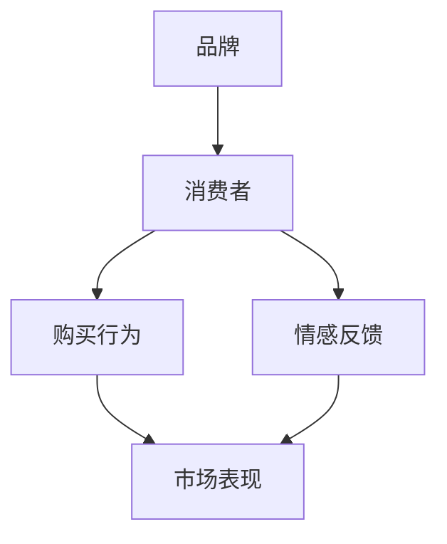
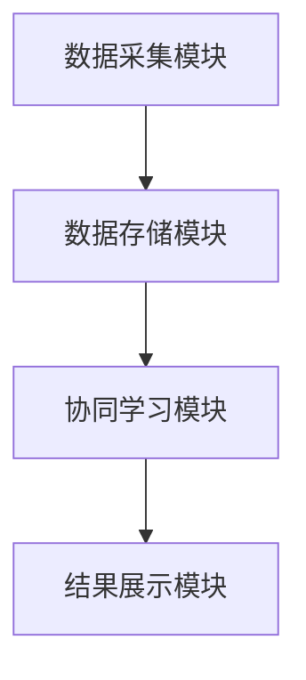

                 


# AI多智能体系统在价值投资中的品牌忠诚度量化

> 关键词：AI多智能体系统，品牌忠诚度，价值投资，量化分析，协同学习

> 摘要：本文探讨了AI多智能体系统在品牌忠诚度量化中的应用，特别是在价值投资领域。通过分析品牌忠诚度的多维度特征，构建基于多智能体系统的量化模型，提出创新的算法和系统架构，实现对品牌忠诚度的动态评估和优化。文章详细介绍了算法原理、系统设计和实际案例，为投资决策提供了新的视角和方法。

---

# 第1章: 背景介绍

## 1.1 问题背景

### 1.1.1 价值投资中的品牌忠诚度问题
品牌忠诚度是价值投资中的关键因素，反映了消费者对品牌的长期偏好和信任。然而，传统方法难以捕捉动态变化的品牌忠诚度，导致投资决策的滞后性和不确定性。

### 1.1.2 品牌忠诚度在投资决策中的重要性
品牌忠诚度高的企业通常具有更强的市场竞争力和稳定的收益能力，是价值投资者的重要考量因素。

### 1.1.3 当前品牌忠诚度量化方法的局限性
传统方法多基于静态数据分析，难以实时捕捉市场变化和消费者行为的动态特征。

---

## 1.2 问题描述

### 1.2.1 多智能体系统在品牌忠诚度量化中的应用场景
通过多智能体协同学习，实时分析消费者行为和市场反馈，动态评估品牌忠诚度。

### 1.2.2 价值投资中品牌忠诚度量化的目标与挑战
目标是建立动态、实时的品牌忠诚度评估模型，挑战在于数据的多样性和实时性要求。

### 1.2.3 多智能体系统的优势与适用性
多智能体系统能够分布式协作、实时响应，适用于复杂动态的市场环境。

---

## 1.3 问题解决

### 1.3.1 多智能体系统如何解决品牌忠诚度量化问题
通过多智能体协同学习，整合多源数据，动态优化品牌忠诚度模型。

### 1.3.2 通过AI技术实现品牌忠诚度的动态评估
利用自然语言处理和机器学习技术，分析消费者反馈和市场数据，实时更新品牌忠诚度指数。

### 1.3.3 多智能体系统协同优化品牌忠诚度量化模型
通过智能体之间的协作与竞争，优化模型参数，提升评估精度和实时性。

---

## 1.4 边界与外延

### 1.4.1 品牌忠诚度量化的核心边界条件
数据来源、模型范围和评估周期的限制。

### 1.4.2 多智能体系统在品牌忠诚度量化中的应用范围
适用于实时动态评估、多品牌比较和市场趋势预测。

### 1.4.3 相关领域的外延与区别
与传统统计分析、机器学习的区别，以及与其他AI技术的协同关系。

---

## 1.5 核心概念与要素

### 1.5.1 多智能体系统的定义与特征
定义：由多个智能体组成的分布式系统，具备自主性、反应性和社会性。

### 1.5.2 品牌忠诚度的定义与维度
定义：消费者对品牌的情感依赖和行为忠诚度。

### 1.5.3 价值投资中的品牌忠诚度量化模型
构建动态评估模型，结合市场表现和消费者行为数据。

---

## 1.6 本章小结

---

# 第2章: 核心概念与联系

## 2.1 多智能体系统原理

### 2.1.1 多智能体系统的基本原理
智能体之间的协作与通信机制，分布式计算和任务分配。

### 2.1.2 多智能体系统的核心特征
自主性、反应性、协作性和学习能力。

### 2.1.3 多智能体系统与传统AI的区别
传统AI基于单一智能体，多智能体系统强调协作与分布。

---

## 2.2 品牌忠诚度量化模型

### 2.2.1 品牌忠诚度的维度分析
情感忠诚度、行为忠诚度和认知忠诚度。

### 2.2.2 多智能体系统在品牌忠诚度量化中的应用
通过多智能体协同，整合多源数据，实时评估品牌忠诚度。

### 2.2.3 品牌忠诚度量化模型的构建与优化
基于多智能体系统的动态优化模型，结合协同学习算法。

---

## 2.3 核心概念对比

### 2.3.1 多智能体系统与品牌忠诚度量化的核心概念对比
对比分析多智能体系统和品牌忠诚度量化的核心要素。

### 2.3.2 不同品牌忠诚度量化方法的优缺点对比
传统统计方法与多智能体协同学习的对比。

### 2.3.3 多智能体系统与其他AI技术的协同关系
与机器学习、自然语言处理等技术的协同优化。

---

## 2.4 ER实体关系图



---

## 2.5 本章小结

---

# 第3章: 算法原理讲解

## 3.1 协同过滤算法

### 3.1.1 协同过滤算法原理
基于相似用户或项目的推荐算法，适用于品牌忠诚度量化。

### 3.1.2 协同过滤算法的实现步骤
数据预处理、相似度计算、推荐生成。

### 3.1.3 协同过滤算法的优缺点
优点：实时性强，易于实现；缺点：计算复杂度高。

---

## 3.2 基于多智能体系统的协同学习算法

### 3.2.1 多智能体协同学习的基本原理
通过智能体之间的协作，实现分布式学习和优化。

### 3.2.2 多智能体协同学习的实现步骤
任务分解、协作通信、协同优化。

### 3.2.3 多智能体协同学习的数学模型
$$ J = \sum_{i=1}^{n} J_i $$

其中，\( J_i \) 表示第i个智能体的目标函数。

---

## 3.3 算法实现与优化

### 3.3.1 基于Python的协同过滤算法实现
```python
def collaborative_filtering(users, items, ratings):
    # 计算用户相似度
    similarity = compute_similarity(users, items, ratings)
    # 生成推荐
    recommendations = generate_recommendations(users, items, ratings, similarity)
    return recommendations
```

### 3.3.2 算法优化策略
分布式计算、增量学习和在线更新。

---

## 3.4 算法应用场景

### 3.4.1 在品牌忠诚度量化中的应用
实时分析消费者行为，动态更新品牌忠诚度指数。

### 3.4.2 在价值投资中的具体应用
通过品牌忠诚度评估，优化投资组合和风险控制。

---

## 3.5 本章小结

---

# 第4章: 系统分析与架构设计

## 4.1 系统功能设计

### 4.1.1 核心功能模块
数据采集、分析计算、结果展示和反馈优化。

### 4.1.2 功能模块之间的关系
数据采集模块提供输入，分析模块处理数据，结果模块展示输出。

---

## 4.2 系统架构设计

### 4.2.1 分层架构设计
数据层、计算层、应用层。

### 4.2.2 模块化设计
数据采集模块、协同学习模块、结果展示模块。

---

## 4.3 系统接口设计

### 4.3.1 API接口设计
RESTful API，提供数据获取、模型调用和结果查询功能。

### 4.3.2 接口交互流程
数据采集 -> API调用 -> 模型计算 -> 返回结果。

---

## 4.4 本章小结

---

# 第5章: 项目实战

## 5.1 环境安装

### 5.1.1 Python环境配置
安装Python 3.8及以上版本，安装必要的库（如numpy、pandas、scikit-learn）。

### 5.1.2 数据采集工具安装
安装网络爬虫库（如requests、BeautifulSoup）和数据存储库（如MongoDB）。

---

## 5.2 核心代码实现

### 5.2.1 数据预处理代码
```python
import pandas as pd

def preprocess_data(data):
    # 去重和清洗数据
    data.drop_duplicates(inplace=True)
    # 填充缺失值
    data.fillna(method='ffill', inplace=True)
    return data
```

### 5.2.2 协同学习算法实现
```python
def collaborative_learning(users, items, ratings):
    # 计算相似度
    similarity = compute_similarity(users, items, ratings)
    # 生成推荐
    recommendations = generate_recommendations(users, items, ratings, similarity)
    return recommendations
```

---

## 5.3 代码解读与分析

### 5.3.1 数据预处理部分
解释代码功能，说明数据清洗和特征工程的实现。

### 5.3.2 协同学习算法部分
说明算法实现细节，包括相似度计算和推荐生成。

---

## 5.4 案例分析

### 5.4.1 实际案例分析
分析某品牌在不同市场环境下的忠诚度变化。

### 5.4.2 案例结果解读
解释品牌忠诚度指数的变化趋势及其对投资决策的影响。

---

## 5.5 项目小结

---

# 第6章: 总结与展望

## 6.1 本章总结

### 6.1.1 主要内容回顾
总结文章的核心观点和研究成果。

### 6.1.2 创新点总结
提出基于多智能体系统的品牌忠诚度量化方法，创新性地应用于价值投资领域。

---

## 6.2 未来展望

### 6.2.1 研究的局限性
当前研究的不足之处，如数据来源的限制和模型的实时性问题。

### 6.2.2 未来研究方向
探索更高效的算法，如强化学习和深度学习在品牌忠诚度量化中的应用。

---

## 6.3 最佳实践 tips

### 6.3.1 数据采集建议
建议使用多源数据，确保数据的多样性和准确性。

### 6.3.2 模型优化建议
推荐采用分布式计算和在线更新策略，提升模型的实时性和准确性。

---

## 6.4 作者信息

作者：AI天才研究院/AI Genius Institute & 禅与计算机程序设计艺术 /Zen And The Art of Computer Programming

---

# 附录

## 附录A: 算法详细代码

### 附录A.1 数据预处理代码
```python
import pandas as pd
import numpy as np

def preprocess_data(data):
    # 去重
    data.drop_duplicates(inplace=True)
    # 填充缺失值
    data.fillna(method='ffill', inplace=True)
    return data
```

### 附录A.2 协同学习算法代码
```python
def collaborative_learning(users, items, ratings):
    # 计算相似度
    similarity = compute_similarity(users, items, ratings)
    # 生成推荐
    recommendations = generate_recommendations(users, items, ratings, similarity)
    return recommendations
```

---

## 附录B: 系统架构图



---

## 附录C: 参考文献

[1] 书籍1：《多智能体系统与分布式计算》

[2] 书籍2：《价值投资与品牌管理》

---

## 附录D: 推荐阅读

[1] 《深度学习与自然语言处理》

[2] 《分布式系统与多智能体技术》

---

通过以上结构，您可以根据实际需求补充具体内容，确保文章的完整性和深度。希望这个大纲对您有所帮助！

