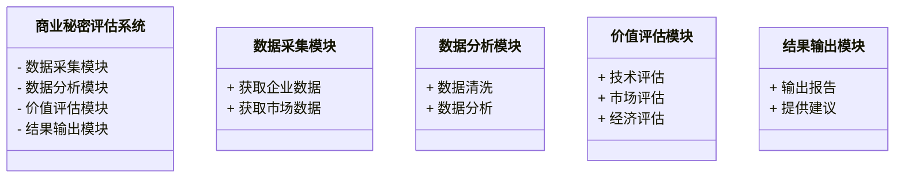
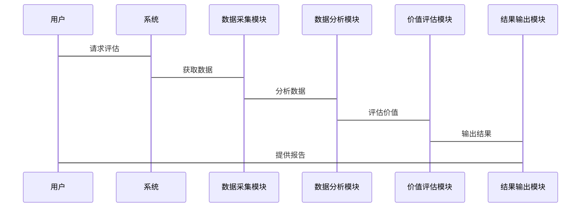

                 


# AI多智能体系统在价值投资中的商业秘密价值评估

## 关键词：AI多智能体系统、价值投资、商业秘密、价值评估、算法原理、系统架构、项目实战

## 摘要：  
本文探讨了AI多智能体系统在价值投资中的应用，特别是如何利用多智能体系统进行商业秘密的价值评估。通过分析多智能体系统的原理、算法设计、系统架构以及实际案例，本文详细阐述了如何利用AI技术提升商业秘密评估的效率和准确性，为价值投资者提供有力的支持。

---

# 第一部分: AI多智能体系统与价值投资概述

## 第1章: AI多智能体系统与价值投资的背景介绍

### 1.1 问题背景与问题描述
商业秘密是企业核心竞争力的重要组成部分，其价值评估对于企业并购、资产定价等领域具有重要意义。然而，传统的商业秘密评估方法往往依赖人工判断，存在主观性强、效率低、难以量化等问题。  

在价值投资中，投资者需要快速、准确地评估目标企业的商业秘密价值，以做出合理的投资决策。传统的评估方法难以满足现代金融市场的复杂需求，因此，如何利用AI技术提升商业秘密价值评估的效率和准确性成为一个重要课题。

### 1.2 多智能体系统的核心概念
多智能体系统（Multi-Agent System, MAS）是由多个具有自主决策能力的智能体组成的系统，这些智能体能够通过通信和协作完成复杂的任务。与传统的单智能体系统相比，多智能体系统具有更强的分布式计算能力和协作能力，能够更好地应对复杂环境中的问题。

在价值投资中，多智能体系统可以模拟市场中的多方参与者（如投资者、企业、分析师等），通过模拟市场行为和信息交互，帮助投资者更准确地评估商业秘密的价值。

### 1.3 商业秘密价值评估的框架
商业秘密的价值评估需要综合考虑多个因素，包括技术先进性、市场竞争力、法律风险、经济价值等。本文提出了一种基于多智能体系统的商业秘密价值评估框架，包括以下几个步骤：
1. **数据采集**：收集企业的财务数据、市场数据、技术专利等信息。
2. **信息分析**：利用多智能体系统对信息进行分析和挖掘。
3. **价值评估**：基于分析结果，评估商业秘密的价值。
4. **结果输出**：将评估结果输出为可读的报告或建议。

---

## 第2章: 多智能体系统与价值投资的核心概念

### 2.1 多智能体系统的原理
多智能体系统的原理可以简单理解为“分布式计算”与“协作智能”的结合。每个智能体都具有一定的自主性，能够独立完成任务，同时通过通信和协作完成更复杂的任务。

#### 2.1.1 多智能体系统的组成与交互
多智能体系统由以下几个核心部分组成：
- **智能体**：具有感知、决策、执行能力的个体。
- **通信机制**：智能体之间进行信息传递的渠道。
- **协作机制**：智能体之间通过协作完成共同目标的规则和策略。

#### 2.1.2 多智能体系统与传统AI的区别
传统的AI系统通常基于单智能体模型，而多智能体系统则强调多个智能体的协作与互动。多智能体系统能够更好地模拟复杂的市场环境，适用于需要多方协作的场景。

#### 2.1.3 价值投资中的多智能体系统应用场景
在价值投资中，多智能体系统可以模拟市场中的多方参与者，包括投资者、企业、分析师等。通过模拟这些参与者的行为和互动，可以帮助投资者更好地理解市场动态，评估商业秘密的价值。

### 2.2 价值投资中的商业秘密评估
#### 2.2.1 商业秘密的定义与分类
商业秘密是指企业拥有的未公开的、具有经济价值的信息，包括技术、数据、策略等。根据其重要性和敏感性，商业秘密可以分为核心秘密、重要秘密和普通秘密。

#### 2.2.2 商业秘密的价值构成
商业秘密的价值取决于以下几个因素：
- **技术先进性**：技术的创新性和领先性。
- **市场竞争力**：技术在市场中的竞争优势。
- **经济价值**：技术对企业利润的贡献能力。
- **法律风险**：技术的法律风险，如专利侵权风险。

#### 2.2.3 价值投资中的商业秘密评估流程
价值投资中的商业秘密评估流程通常包括以下几个步骤：
1. **数据采集**：收集目标企业的财务数据、市场数据、技术专利等信息。
2. **信息分析**：利用多智能体系统对信息进行分析和挖掘。
3. **价值评估**：基于分析结果，评估商业秘密的价值。
4. **结果输出**：将评估结果输出为可读的报告或建议。

---

## 第3章: 多智能体系统的算法原理

### 3.1 多智能体系统的通信与协作算法
#### 3.1.1 通信协议的设计
多智能体系统中的通信协议需要确保智能体之间的信息传递高效且安全。常见的通信协议包括基于消息队列的通信和基于事件驱动的通信。

#### 3.1.2 协作机制的实现
协作机制是多智能体系统的核心，常见的协作机制包括基于博弈论的协作和基于强化学习的协作。在价值投资中，可以利用协作机制模拟市场中的多方参与者，从而更好地评估商业秘密的价值。

#### 3.1.3 算法实现的数学模型
以下是多智能体系统中协作机制的数学模型示例：

$$
V = \sum_{i=1}^{n} v_i
$$

其中，$V$ 表示系统的总价值，$v_i$ 表示第 $i$ 个智能体的价值贡献。

### 3.2 多智能体系统的决策算法
#### 3.2.1 基于博弈论的决策算法
博弈论是多智能体系统中常用的决策方法之一。通过模拟市场中的博弈过程，可以更好地理解商业秘密的价值。

#### 3.2.2 基于强化学习的决策算法
强化学习是一种基于奖励机制的决策方法，适用于复杂环境下的决策问题。

#### 3.2.3 基于深度学习的决策算法
深度学习是一种基于神经网络的决策方法，适用于处理大量非结构化数据。

---

## 第4章: 商业秘密价值评估的数学模型

### 4.1 商业秘密价值评估的数学模型概述
商业秘密价值评估的数学模型需要综合考虑多个因素，包括技术先进性、市场竞争力、经济价值等。

#### 4.1.1 商业秘密价值的定义与度量
商业秘密的价值可以通过以下几个指标进行度量：
- 技术先进性指数（TPI）
- 市场竞争力指数（MCI）
- 经济价值指数（EVI）

#### 4.1.2 商业秘密价值评估的数学公式
以下是商业秘密价值评估的数学公式：

$$
V = \alpha \cdot TPI + \beta \cdot MCI + \gamma \cdot EVI
$$

其中，$\alpha$、$\beta$、$\gamma$ 是权重系数，$TPI$、$MCI$、$EVI$ 是各指标的度量值。

---

## 第5章: 系统分析与架构设计方案

### 5.1 问题场景介绍
在价值投资中，商业秘密价值评估需要解决以下问题：
- 如何高效地收集和处理大量数据？
- 如何利用多智能体系统进行分析和评估？
- 如何将评估结果应用于实际投资决策？

### 5.2 系统功能设计
#### 5.2.1 领域模型
以下是领域模型的Mermaid类图：



#### 5.2.2 系统架构设计
以下是系统架构的Mermaid图：


### 5.3 系统接口设计
系统接口设计需要考虑以下几个方面：
- 数据输入接口
- 数据输出接口
- 用户界面接口
- API接口

### 5.4 系统交互设计
以下是系统交互的Mermaid序列图：



---

## 第6章: 项目实战

### 6.1 环境安装
为了运行本文中的代码，需要安装以下环境：
- Python 3.8 或更高版本
- NumPy 和 Pandas 库
- Mermaid 和 PlantUML 工具

### 6.2 核心代码实现
以下是商业秘密价值评估的核心代码示例：

```python
import numpy as np
import pandas as pd

def calculate_secret_value(data):
    # 技术先进性指数
    tpi = data['技术先进性'].mean()
    # 市场竞争力指数
    mci = data['市场竞争力'].mean()
    # 经济价值指数
    evi = data['经济价值'].mean()
    # 价值评估公式
    value = 0.4 * tpi + 0.3 * mci + 0.3 * evi
    return value

# 数据加载
data = pd.read_csv('商业秘密数据.csv')
# 价值评估
secret_value = calculate_secret_value(data)
print(f"商业秘密价值评估结果：{secret_value}")
```

### 6.3 实际案例分析
以下是某科技企业的商业秘密价值评估案例：

1. **数据采集**：收集该企业的技术专利、市场数据、财务数据等。
2. **信息分析**：利用多智能体系统对数据进行分析。
3. **价值评估**：基于分析结果，评估商业秘密的价值。
4. **结果输出**：将评估结果输出为报告或建议。

---

## 第7章: 总结与展望

### 7.1 本章小结
本文详细探讨了AI多智能体系统在价值投资中的应用，特别是如何利用多智能体系统进行商业秘密的价值评估。通过分析多智能体系统的原理、算法设计、系统架构以及实际案例，本文为价值投资者提供了一种新的评估方法。

### 7.2 展望
未来，随着AI技术的不断发展，多智能体系统在价值投资中的应用将更加广泛。可以通过以下方面进一步研究：
- 提高多智能体系统的协作效率
- 开发更复杂的商业秘密价值评估模型
- 探索多智能体系统在其他金融领域的应用

---

## 作者：AI天才研究院/AI Genius Institute & 禅与计算机程序设计艺术 /Zen And The Art of Computer Programming

---

通过本文的分析，读者可以深入了解AI多智能体系统在价值投资中的应用，特别是如何利用多智能体系统进行商业秘密的价值评估。希望本文能够为价值投资者提供新的思路和方法，帮助他们在复杂多变的市场环境中做出更明智的投资决策。

