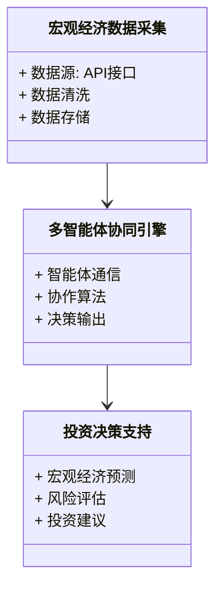
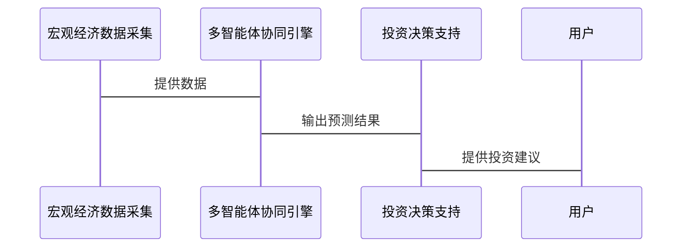

                 


# AI多智能体系统在价值投资中的宏观经济分析应用

## 关键词：
AI多智能体系统, 宏观经济分析, 价值投资, 金融建模, 数据挖掘, 机器学习

## 摘要：
本文探讨了AI多智能体系统在价值投资中的宏观经济分析应用，通过分析宏观经济指标、构建多智能体协同模型，展示了如何利用AI技术提升投资决策的准确性和效率。

---

# 第一部分: 引言

## 1. 引言

### 1.1 问题背景
#### 1.1.1 价值投资与宏观经济分析的结合
价值投资依赖于对宏观经济趋势的准确判断，而AI多智能体系统能够通过协同分析提供更深入的洞察。

#### 1.1.2 AI多智能体系统在金融领域的潜力
AI多智能体系统能够处理海量数据，发现传统方法难以察觉的模式，为投资决策提供支持。

#### 1.1.3 当前宏观经济分析的局限性与AI的解决方案
传统宏观经济分析依赖人工经验，存在主观性和效率低的问题，AI技术可以提供更客观、高效的解决方案。

### 1.2 问题描述
#### 1.2.1 宏观经济分析的核心要素
GDP、失业率、通货膨胀率等指标是宏观经济分析的关键。

#### 1.2.2 价值投资中的宏观经济驱动因素
宏观经济环境直接影响企业盈利能力和股票估值。

#### 1.2.3 AI多智能体系统在宏观经济分析中的应用场景
通过多智能体协同，实现宏观经济数据的深度挖掘和预测。

### 1.3 问题解决
#### 1.3.1 AI多智能体系统的优势
多智能体协同能够提高数据处理效率和准确性。

#### 1.3.2 宏观经济数据的多维度分析
利用AI技术进行多维度数据关联分析，发现潜在的经济趋势。

#### 1.3.3 价值投资中的动态决策支持
AI多智能体系统能够实时分析宏观经济变化，支持动态投资决策。

### 1.4 边界与外延
#### 1.4.1 宏观经济分析的边界条件
分析范围和数据来源的限制。

#### 1.4.2 AI多智能体系统的适用范围
适合处理复杂、多维度的宏观经济问题。

#### 1.4.3 与其他投资策略的结合
AI多智能体系统可以与技术分析等其他策略结合使用。

### 1.5 概念结构与核心要素
#### 1.5.1 宏观经济分析的核心要素
GDP、CPI、失业率等关键指标。

#### 1.5.2 AI多智能体系统的组成
多个协同工作的AI智能体。

#### 1.5.3 价值投资的逻辑框架
基于宏观经济分析的长期价值判断。

---

# 第二部分: AI多智能体系统与宏观经济分析的核心概念

## 2. AI多智能体系统的核心原理

### 2.1 AI多智能体系统的基本概念
#### 2.1.1 多智能体系统的定义
由多个智能体组成的系统，每个智能体能够独立决策并协同工作。

#### 2.1.2 多智能体系统的特点
- 分布式计算
- 协作性
- 自适应性

#### 2.1.3 多智能体系统与单智能体系统的区别
多智能体系统能够处理更复杂的问题，通过协同提高整体性能。

### 2.2 宏观经济分析的核心要素
#### 2.2.1 宏观经济指标的分类
- GDP
- 失业率
- 消费者价格指数（CPI）

#### 2.2.2 宏观经济数据的特征
- 大量性
- 关联性
- 时间性

#### 2.2.3 宏观经济模型的构建
- 时间序列模型
- 回归分析模型

### 2.3 AI多智能体系统与宏观经济分析的结合
#### 2.3.1 多智能体系统在宏观经济预测中的作用
通过协同分析提高预测精度。

#### 2.3.2 多智能体系统在经济政策模拟中的应用
模拟不同政策对经济的影响。

#### 2.3.3 多智能体系统在风险评估中的优势
实时监控和预警经济风险。

---

## 3. 算法原理与数学模型

### 3.1 多智能体系统的通信与协作
#### 3.1.1 多智能体系统中的通信机制
- 消息传递
- 事件驱动

#### 3.1.2 多智能体系统的协作策略
- 分层协作
- 平等协作

#### 3.1.3 多智能体系统的协调与冲突解决
通过协商和仲裁机制解决冲突。

### 3.2 宏观经济分析的数学模型
#### 3.2.1 时间序列分析模型
- ARIMA模型
  $$ ARIMA(p, d, q) $$
  $$ Y_t = \phi Y_{t-1} + \theta \epsilon_t + \epsilon_{t-1} $$

#### 3.2.2 回归分析模型
- 多元线性回归
  $$ Y = \beta_0 + \beta_1 X_1 + \beta_2 X_2 + \epsilon $$

#### 3.2.3 博弈论模型
- Nash均衡分析
  $$ \text{Maximize } U_i \text{ subject to } U_j \text{ not decreasing} $$

---

## 4. 系统分析与架构设计

### 4.1 系统功能设计
#### 4.1.1 领域模型
使用Mermaid类图展示系统模块之间的关系。



#### 4.1.2 系统架构设计
使用Mermaid架构图展示系统整体架构。


#### 4.1.3 系统接口设计
定义系统的主要接口和交互流程。

#### 4.1.4 系统交互设计
使用Mermaid序列图展示系统交互流程。



---

## 5. 项目实战

### 5.1 环境安装
#### 5.1.1 安装Python和相关库
```bash
pip install numpy pandas scikit-learn
```

#### 5.1.2 安装AI框架
```bash
pip install tensorflow keras
```

### 5.2 系统核心实现
#### 5.2.1 数据预处理
```python
import pandas as pd

# 加载数据
data = pd.read_csv('economic_indicators.csv')

# 数据清洗
data.dropna(inplace=True)
data = data[~data['date'].duplicated()]
```

#### 5.2.2 特征提取
```python
from sklearn.preprocessing import MinMaxScaler

scaler = MinMaxScaler()
scaled_data = scaler.fit_transform(data[['GDP', 'CPI', 'unemployment_rate']])
```

#### 5.2.3 模型训练
```python
from sklearn.model_selection import train_test_split
from sklearn.linear_model import LinearRegression

X = scaled_data[:-1]
y = scaled_data[1:]

X_train, X_test, y_train, y_test = train_test_split(X, y, test_size=0.2)

model = LinearRegression()
model.fit(X_train, y_train)
```

#### 5.2.4 模型调优
```python
from sklearn.metrics import mean_squared_error

y_pred = model.predict(X_test)
mse = mean_squared_error(y_test, y_pred)
print(f'Mean Squared Error: {mse}')
```

### 5.3 代码应用解读与分析
通过代码实现宏观经济预测模型，并分析预测结果对投资决策的影响。

### 5.4 实际案例分析
以GDP预测为例，展示如何利用AI多智能体系统进行宏观经济分析。

### 5.5 项目小结
总结项目实现的关键点和经验教训。

---

## 6. 最佳实践 tips、小结、注意事项、拓展阅读

### 6.1 最佳实践 tips
- 数据清洗和特征工程是关键
- 多智能体协同需要良好的通信机制
- 定期更新模型以适应市场变化

### 6.2 小结
AI多智能体系统在价值投资中的宏观经济分析应用前景广阔，能够显著提升投资决策的效率和准确性。

### 6.3 注意事项
- 数据质量和完整性影响模型效果
- 模型需要定期更新和优化
- 风险管理是投资决策的重要组成部分

### 6.4 拓展阅读
- 《机器学习实战》
- 《宏观经济学原理》
- 《分布式系统设计与实现》

---

## 7. 总结

AI多智能体系统通过协同分析宏观经济指标，为价值投资提供了强大的决策支持工具。未来，随着技术的发展，AI在金融领域的应用将更加广泛和深入。

---

## 作者：
AI天才研究院 & 禅与计算机程序设计艺术

