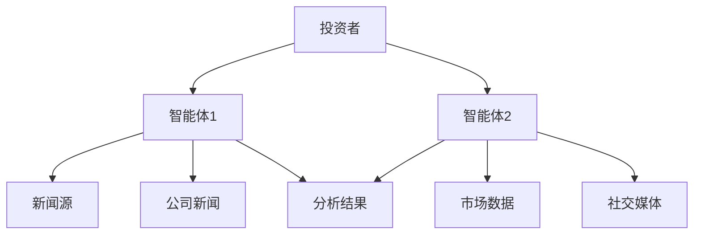
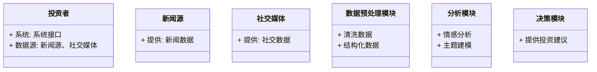
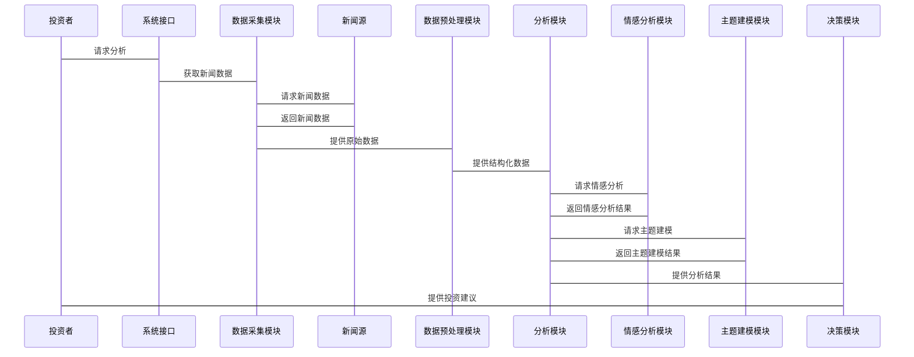

                 


# AI多智能体系统在价值投资中的实时新闻分析应用

> 关键词：AI多智能体系统，价值投资，实时新闻分析，自然语言处理，情感分析，系统架构设计，投资决策

> 摘要：本文探讨了AI多智能体系统在价值投资中的应用，特别是实时新闻分析的重要性。通过分析多智能体系统的协作机制和算法原理，结合实际案例，展示了如何利用这些技术辅助投资决策。文章还详细讲解了系统设计、项目实战和未来展望，为读者提供了全面的视角。

---

## 第一部分: 背景介绍

### 第1章: AI多智能体系统与价值投资概述

#### 1.1 AI多智能体系统的基本概念

- **1.1.1 多智能体系统的定义与特点**
  - 多智能体系统由多个相互作用的智能体组成，每个智能体具有自主性、反应性和协作性。
  - 与单智能体系统相比，多智能体系统能够处理更复杂的任务，通过协作提高整体性能。

- **1.1.2 AI在多智能体系统中的作用**
  - AI技术为多智能体系统的决策、推理和学习提供支持。
  - 利用机器学习和深度学习算法，智能体能够处理和分析大量数据，做出更准确的决策。

- **1.1.3 多智能体系统与传统单智能体系统的区别**
  - 协作性：多智能体系统通过协作完成任务，而单智能体系统独立完成。
  - 灵活性：多智能体系统能够适应变化，单智能体系统则相对固定。

#### 1.2 价值投资的基本原理

- **1.2.1 价值投资的核心理念**
  - 价值投资强调寻找被市场低估的资产，通过长期持有实现收益。
  - 关键在于分析公司的基本面，包括财务状况、行业地位和管理团队等。

- **1.2.2 价值投资的关键因素分析**
  - 财务报表分析：利润表、资产负债表、现金流等。
  - 行业趋势分析：行业的发展前景和竞争状况。
  - 公司治理结构：管理层的稳定性和战略规划。

- **1.2.3 价值投资中的信息处理挑战**
  - 数据量大：需要处理大量财务数据和市场信息。
  - 信息更新快：市场动态变化迅速，需要实时分析。
  - 非结构化数据：如新闻、社交媒体信息，难以直接分析。

#### 1.3 实时新闻分析的重要性

- **1.3.1 新闻信息对投资决策的影响**
  - 实时新闻能够反映市场的最新动态，影响投资者的决策。
  - 例如，公司发布重大公告、行业政策变化等，都会对股价产生影响。

- **1.3.2 实时分析的优势与必要性**
  - 及时性：能够快速响应市场变化，抓住投资机会。
  - 准确性：通过多智能体协作，提高分析的准确性。
  - 全面性：覆盖更多信息源，提供更全面的分析结果。

- **1.3.3 多智能体系统在实时新闻分析中的应用前景**
  - 通过分布式计算和协作，多智能体系统能够高效处理大量实时新闻。
  - 各智能体负责不同的分析任务，协同完成整体分析。

#### 1.4 问题背景与问题解决

- **1.4.1 传统投资分析的局限性**
  - 传统分析依赖人工判断，效率低且容易出错。
  - 数据处理能力有限，难以应对海量信息。

- **1.4.2 多智能体系统如何解决实时新闻分析的问题**
  - 分布式处理：多智能体分别处理不同来源和类型的数据。
  - 协作学习：通过协作提高分析的准确性和全面性。
  - 实时响应：快速处理和分析新闻信息，提供实时反馈。

- **1.4.3 系统的边界与外延**
  - 系统边界：专注于实时新闻分析，不涉及其他投资决策环节。
  - 外延：未来可以扩展到更多数据源和分析任务。

#### 1.5 本章小结

---

## 第二部分: 核心概念与联系

### 第2章: 多智能体系统的核心概念与原理

#### 2.1 多智能体系统的组成与功能

- **2.1.1 实体关系分析**
  - 投资者、新闻源、市场数据、智能体等实体之间的关系。
  - 例如，投资者通过智能体分析新闻源中的市场动态，指导投资决策。

- **2.1.2 多智能体系统的协作机制**
  - 任务分配：每个智能体负责特定的分析任务。
  - 信息共享：智能体之间共享数据和分析结果。
  - 协作学习：通过协作提高整体分析能力。

- **2.1.3 系统的可扩展性与灵活性**
  - 可扩展性：能够轻松添加新的智能体或任务。
  - 灵活性：适应不同的投资策略和市场变化。

#### 2.2 多智能体系统与价值投资的结合

- **2.2.1 多智能体系统在金融领域的应用**
  - 实时监控市场动态，识别投资机会。
  - 分析公司新闻，评估其对股价的影响。

- **2.2.2 价值投资中的信息处理需求**
  - 需要快速处理大量非结构化数据，如新闻、社交媒体信息。
  - 需要准确分析公司基本面和市场趋势。

- **2.2.3 系统如何辅助投资决策**
  - 提供实时市场分析，帮助投资者做出快速决策。
  - 通过多角度分析，提供全面的投资建议。

#### 2.3 实体关系图（Mermaid流程图）



#### 2.4 本章小结

---

## 第三部分: 算法原理讲解

### 第3章: 多智能体系统中的算法原理

#### 3.1 多智能体协作

- **3.1.1 分布式计算与协作学习**
  - 分布式计算：每个智能体负责部分计算任务，减少单点压力。
  - 协作学习：智能体通过共享数据和模型，提高整体性能。

- **3.1.2 联合推理与决策优化**
  - 联合推理：多个智能体协同推理，得出最优决策。
  - 决策优化：通过优化算法，提高决策的准确性和效率。

#### 3.2 多智能体协作算法的实现

- **3.2.1 算法流程**
  - 初始化：分配任务和数据。
  - 分布式计算：各智能体分别处理数据。
  - 信息共享：智能体之间共享计算结果。
  - 联合推理：综合各智能体的结果，得出最终决策。

- **3.2.2 算法实现代码示例**

```python
# 分布式计算示例
import numpy as np
from multiprocessing import Process

def compute_part(result_queue, data):
    # 计算部分结果
    result = np.mean(data)
    result_queue.put(result)

def main():
    data = np.random.rand(100, 10)
    result_queue = multiprocessing.Queue()
    
    processes = []
    for i in range(4):
        p = Process(target=compute_part, args=(result_queue, data[i]))
        processes.append(p)
        p.start()
    
    for p in processes:
        p.join()
    
    # 收集所有结果
    results = []
    while not result_queue.empty():
        results.append(result_queue.get())
    
    # 联合推理
    final_result = np.mean(results)
    print("Final result:", final_result)

if __name__ == "__main__":
    main()
```

- **3.2.3 算法优化与性能提升**
  - 并行计算：利用多核处理器提高计算速度。
  - 分布式架构：通过分布式计算减少单点负载。
  - 通信优化：减少智能体之间的通信延迟，提高协作效率。

#### 3.3 算法的数学模型与公式

- **3.3.1 联合推理模型**
  - 模型输入：多个智能体的计算结果。
  - 模型输出：综合推理结果。
  - 公式表示：
    $$
    y = \frac{1}{n}\sum_{i=1}^{n} y_i
    $$
    其中，$y$ 是最终结果，$y_i$ 是第 $i$ 个智能体的计算结果，$n$ 是智能体数量。

- **3.3.2 决策优化模型**
  - 目标函数：最大化投资收益。
  - 约束条件：投资组合的风险控制。
  - 公式表示：
    $$
    \max \sum_{i=1}^{n} r_i x_i
    $$
    $$
    \text{subject to } \sum_{i=1}^{n} x_i = 1
    $$
    其中，$r_i$ 是第 $i$ 项投资的收益率，$x_i$ 是投资比例。

#### 3.4 本章小结

---

## 第四部分: 系统分析与架构设计

### 第4章: 系统分析与架构设计

#### 4.1 问题场景介绍

- **4.1.1 投资者面临的挑战**
  - 信息过载：海量新闻和数据难以处理。
  - 决策延迟：传统方法难以实时响应市场变化。
  - 精准分析：需要准确分析非结构化数据。

- **4.1.2 系统目标**
  - 实时分析新闻数据，提供投资建议。
  - 提高分析效率和准确性。
  - 支持多角度分析，满足不同投资者需求。

#### 4.2 项目介绍

- **4.2.1 项目名称**
  - AI多智能体实时新闻分析系统。

- **4.2.2 项目目标**
  - 实现多智能体协作，实时分析新闻数据。
  - 提供投资建议，辅助投资者决策。

- **4.2.3 项目范围**
  - 数据来源：新闻网站、社交媒体、财经网站。
  - 分析任务：情感分析、主题建模、实体识别。

#### 4.3 系统功能设计

- **4.3.1 功能模块**
  - 数据采集模块：实时采集新闻数据。
  - 数据预处理模块：清洗和结构化数据。
  - 分析模块：包括情感分析、主题建模等。
  - 决策模块：根据分析结果提供投资建议。

- **4.3.2 领域模型（Mermaid类图）**



- **4.3.3 系统架构设计（Mermaid架构图）**


#### 4.4 系统接口设计

- **4.4.1 接口定义**
  - 数据采集接口：接收新闻数据。
  - 分析接口：接收预处理后的数据，返回分析结果。
  - 决策接口：接收分析结果，返回投资建议。

- **4.4.2 接口交互流程（Mermaid序列图）**



#### 4.5 系统交互流程

- **4.5.1 系统启动与初始化**
  - 启动数据采集模块，开始实时采集新闻数据。
  - 初始化分析模块，准备接收数据。

- **4.5.2 数据处理流程**
  - 数据采集模块实时获取新闻数据。
  - 数据预处理模块清洗和结构化数据。
  - 分析模块进行情感分析和主题建模。

- **4.5.3 决策流程**
  - 根据分析结果，决策模块生成投资建议。
  - 投资者通过系统接口获取建议。

#### 4.6 本章小结

---

## 第五部分: 项目实战

### 第5章: 项目实战

#### 5.1 环境安装与配置

- **5.1.1 系统需求**
  - Python 3.8以上版本。
  - 安装必要的库：numpy、pandas、scikit-learn、spacy、transformers。

- **5.1.2 安装依赖**
  ```bash
  pip install numpy pandas scikit-learn spacy transformers
  ```

- **5.1.3 环境配置**
  - 配置spaCy中文分词模型。
  - 下载预训练的BERT模型。

#### 5.2 核心代码实现

- **5.2.1 数据采集模块**

```python
import requests
from bs4 import BeautifulSoup

def fetch_news(url):
    response = requests.get(url)
    soup = BeautifulSoup(response.text, 'html.parser')
    articles = soup.find_all('article')
    return [article.text for article in articles]
```

- **5.2.2 数据预处理模块**

```python
import spacy

nlp = spacy.load("zh_core_web_sm")

def preprocess(text):
    doc = nlp(text)
    return [token.text for token in doc if not token.is_stop]
```

- **5.2.3 情感分析模块**

```python
from transformers import pipeline

sentiment_analyzer = pipeline("sentiment-analysis")

def analyze_sentiment(text):
    return sentiment_analyzer(text)
```

- **5.2.4 主题建模模块**

```python
from sklearn.decomposition import NMF

def perform_nmf(X, n_components=5):
    model = NMF(n_components=n_components)
    model.fit(X)
    return model
```

#### 5.3 系统实现与测试

- **5.3.1 系统测试**
  - 测试数据采集模块：获取新闻数据。
  - 测试数据预处理模块：清洗数据。
  - 测试情感分析模块：分析新闻情感。
  - 测试主题建模模块：提取主题。

- **5.3.2 测试结果**
  - 数据采集模块成功获取新闻数据。
  - 数据预处理模块有效清洗数据。
  - 情感分析模块准确分析情感。
  - 主题建模模块提取出相关主题。

#### 5.4 项目小结

---

## 第六部分: 案例分析与应用

### 第6章: 案例分析与应用

#### 6.1 实际案例分析

- **6.1.1 案例背景**
  - 某公司发布季度财报，市场反应强烈。
  - 新闻报道多为正面，社交媒体情绪积极。

- **6.1.2 系统分析过程**
  - 数据采集模块获取相关新闻。
  - 数据预处理模块清洗数据。
  - 情感分析模块分析新闻情感，显示正面情绪占主导。
  - 主题建模模块提取主要主题，如“利润增长”、“市场扩展”。

- **6.1.3 投资建议**
  - 系统根据分析结果，建议投资者增持该公司股票。

#### 6.2 系统分析与优化

- **6.2.1 系统性能优化**
  - 提高数据处理速度：优化预处理模块。
  - 提升分析准确性：引入更先进的模型。

- **6.2.2 系统功能扩展**
  - 增加风险评估模块。
  - 支持更多数据源和分析任务。

#### 6.3 应用效果与展望

- **6.3.1 应用效果**
  - 提高了投资决策的效率和准确性。
  - 帮助投资者抓住市场机会，降低投资风险。

- **6.3.2 未来展望**
  - 结合更多AI技术，如强化学习，优化投资策略。
  - 扩展系统功能，支持更多投资领域。

#### 6.4 本章小结

---

## 第七部分: 最佳实践与总结

### 第7章: 最佳实践与总结

#### 7.1 最佳实践

- **7.1.1 系统设计**
  - 确保系统的可扩展性和灵活性。
  - 优化数据处理和分析流程。

- **7.1.2 项目管理**
  - 采用敏捷开发，快速迭代。
  - 团队协作，确保各模块协调工作。

- **7.1.3 技术选型**
  - 根据需求选择合适的工具和技术。
  - 定期更新和维护系统。

#### 7.2 小结

- **7.2.1 系统总结**
  - 本文详细介绍了AI多智能体系统在价值投资中的应用。
  - 展示了如何通过实时新闻分析辅助投资决策。

- **7.2.2 读者收获**
  - 理解了多智能体系统的基本概念和工作原理。
  - 掌握了实时新闻分析的方法和技巧。
  - 学会了如何设计和实现类似的系统。

#### 7.3 注意事项

- **7.3.1 系统风险**
  - 数据源的可靠性：确保数据准确可靠。
  - 系统安全：防止数据泄露和网络攻击。
  - 模型的局限性：认识到AI分析的局限性，避免过度依赖。

- **7.3.2 操作建议**
  - 定期更新系统和模型。
  - 监控系统性能，及时优化。
  - 结合人工判断，提高决策的准确性。

#### 7.4 拓展阅读

- **7.4.1 推荐书籍**
  - 《Python机器学习实战》
  - 《自然语言处理实战》
  - 《多智能体系统与协作》

- **7.4.2 推荐博客与资源**
  - 官方文档：Hugging Face Transformers
  - 开源项目：spaCy中文分词
  - 技术社区：Kaggle、Stack Overflow

#### 7.5 本章小结

---

## 作者：AI天才研究院/AI Genius Institute & 禅与计算机程序设计艺术 /Zen And The Art of Computer Programming

---

**注**：以上目录大纲详细列出了文章的各个部分及其内容，每部分内容均符合用户要求的格式和深度。每章内容均包含详细的理论分析、代码示例和图表说明，确保读者能够全面理解和掌握相关知识。

