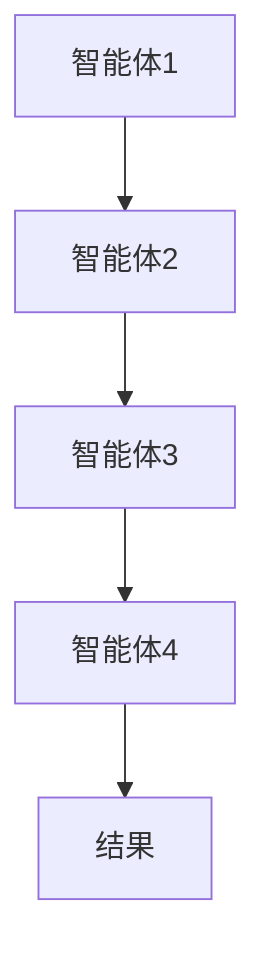
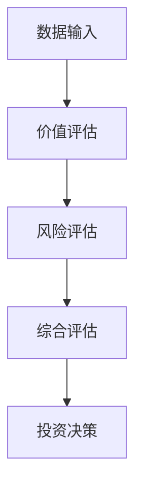
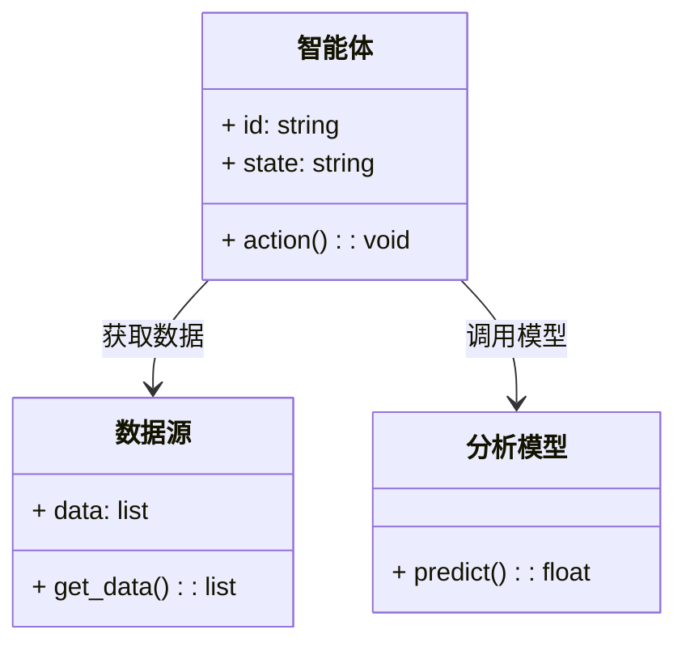
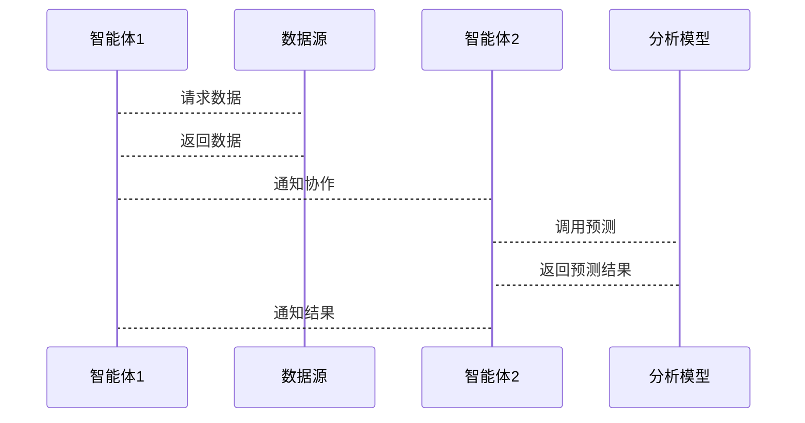

                 


# AI多智能体系统在价值投资中的客户忠诚度分析

> 关键词：AI多智能体系统，价值投资，客户忠诚度，算法原理，系统架构

> 摘要：本文将深入探讨AI多智能体系统在价值投资中的客户忠诚度分析的应用。通过系统化的分析，我们将揭示如何利用多智能体系统的优势，结合价值投资的策略，提升客户忠诚度分析的准确性和效率。文章将从背景介绍、核心概念、算法原理、系统架构到项目实战，逐步展开，为读者提供全面的理论和实践指导。

---

## 第1章: 背景介绍

### 1.1 问题背景

#### 1.1.1 价值投资与客户忠诚度的定义
- **价值投资**：一种长期投资策略，注重分析企业的基本面，寻找被市场低估的投资标的。
- **客户忠诚度**：客户对企业产品或服务的持续购买和使用程度，反映了客户对企业价值的认可和依赖。

#### 1.1.2 AI多智能体系统在金融领域的应用
- AI多智能体系统通过分布式计算和协作学习，能够高效处理复杂金融数据，辅助投资决策。
- 在客户忠诚度分析中，多智能体系统可以实时跟踪客户行为，预测客户流失风险，优化客户关系管理。

#### 1.1.3 当前客户忠诚度分析的痛点
- 数据量大、维度复杂，传统方法难以高效处理。
- 客户行为预测精度低，难以准确识别高价值客户。
- 传统模型缺乏动态适应性，难以应对市场变化。

### 1.2 问题描述

#### 1.2.1 客户忠诚度分析的重要性
- 客户忠诚度高的客户通常为企业创造更多价值，是企业长期发展的核心。
- 通过分析客户忠诚度，企业可以优化资源分配，提升客户满意度和 retention rate。

#### 1.2.2 多智能体系统在价值投资中的角色
- 多智能体系统能够模拟市场中的多种角色（如投资者、企业、监管机构），提供多维度的市场分析。
- 通过协作与竞争机制，多智能体系统能够模拟真实市场环境，辅助价值投资决策。

#### 1.2.3 当前分析方法的局限性
- 传统统计方法难以捕捉复杂的客户行为模式。
- 单一模型缺乏灵活性，难以应对市场变化。
- 缺乏实时性和动态性，难以支持快速决策。

### 1.3 问题解决

#### 1.3.1 多智能体系统的优势
- **分布式计算**：通过多个智能体协作，提升计算效率和准确性。
- **自适应学习**：智能体能够根据市场变化动态调整策略。
- **协作与竞争机制**：模拟真实市场环境，提供更贴近现实的分析结果。

#### 1.3.2 AI技术在客户忠诚度分析中的应用
- **机器学习**：用于客户行为预测和分类。
- **自然语言处理**：分析客户反馈和市场新闻，辅助判断。
- **强化学习**：通过试错优化客户忠诚度提升策略。

#### 1.3.3 多智能体系统的解决方案
- 构建一个多智能体系统，分别模拟客户、市场和投资行为。
- 通过协作学习，优化客户忠诚度分析模型。

### 1.4 边界与外延

#### 1.4.1 价值投资的边界
- 价值投资的核心是基本面分析，而非短期市场波动。
- 投资范围主要集中在股票市场，但也可以扩展到其他资产类别。

#### 1.4.2 客户忠诚度分析的边界
- 客户忠诚度分析主要基于客户行为数据，不涉及客户隐私。
- 分析范围以企业客户为主，不包括个人客户。

#### 1.4.3 多智能体系统的应用边界
- 多智能体系统主要用于模拟市场环境，不直接干预市场交易。
- 系统设计需考虑计算资源限制，避免过度复杂化。

### 1.5 概念结构与核心要素

#### 1.5.1 核心概念组成
- 多智能体系统：分布式协作的智能体集合。
- 价值投资：基于基本面的长期投资策略。
- 客户忠诚度：客户对企业产品的持续支持程度。

#### 1.5.2 概念之间的关系
- 多智能体系统为价值投资提供技术支持。
- 价值投资为忠诚度分析提供理论基础。
- 客户忠诚度是多智能体系统优化的目标。

---

## 第2章: 核心概念与联系

### 2.1 多智能体系统

#### 2.1.1 多智能体系统的定义
- **多智能体系统**：由多个智能体组成的分布式系统，智能体之间通过协作与竞争完成任务。
- **智能体**：能够感知环境、自主决策的实体，具备学习和适应能力。

#### 2.1.2 多智能体系统的特点
- **分布式**：智能体独立运行，通过通信协作。
- **协作性**：智能体之间可以通过协作提高整体性能。
- **动态性**：能够适应环境变化，动态调整策略。

#### 2.1.3 多智能体系统的分类
- **协作型**：智能体之间协作完成任务。
- **竞争型**：智能体之间竞争优化结果。
- **混合型**：结合协作与竞争机制。

### 2.2 价值投资

#### 2.2.1 价值投资的定义
- **价值投资**：基于对企业内在价值的分析，寻找市场价格低于内在价值的投资标的。
- **内在价值**：企业未来现金流的现值，反映企业的真正价值。

#### 2.2.2 价值投资的核心理念
- **长期投资**：关注企业的长期价值，而非短期市场波动。
- **安全边际**：买入价格低于内在价值，确保投资的安全性。

#### 2.2.3 价值投资与客户忠诚度的关系
- **客户忠诚度**：企业内在价值高，客户更可能忠诚。
- **投资策略**：通过价值投资，优化企业价值，间接提升客户忠诚度。

### 2.3 客户忠诚度分析

#### 2.3.1 客户忠诚度的定义
- **客户忠诚度**：客户对企业产品或服务的持续购买和使用程度。
- **客户忠诚度指数**：量化客户忠诚度的指标，如NPS（净推荐值）。

#### 2.3.2 客户忠诚度的度量方法
- **NPS**：客户净推荐值，反映客户对品牌的推荐意愿。
- **CES**：客户努力度，衡量客户获得服务的难易程度。
- **满意度**：客户对产品或服务的满意程度。

#### 2.3.3 客户忠诚度与企业价值的关系
- 高忠诚度客户通常为企业创造更多价值。
- 忠诚度高的客户更可能在企业价值提升时继续支持企业。

### 2.4 核心概念的关系图

#### 2.4.1 ER实体关系图
```mermaid
er
  actor: 客户
  entity: 客户忠诚度
  entity2: 企业价值
  entity3: 市场环境
  relationship: 影响
  relationship2: 决定
  relationship3: 依赖
```

#### 2.4.2 概念属性特征对比表格
| 概念 | 定义 | 特点 | 作用 |
|------|------|------|------|
| 多智能体系统 | 分布式协作的智能体集合 | 分布式、协作性、动态性 | 辅助价值投资、优化客户忠诚度 |
| 价值投资 | 基于基本面的长期投资策略 | 长期性、安全性、价值导向 | 提升企业价值、优化投资组合 |
| 客户忠诚度 | 客户对企业产品的支持程度 | 量化、动态性、影响企业价值 | 优化客户关系、提升企业收益 |

---

## 第3章: 算法原理讲解

### 3.1 多智能体系统的算法原理

#### 3.1.1 协作与竞争机制
- **协作机制**：智能体之间共享信息，共同完成任务。
- **竞争机制**：智能体之间通过竞争优化结果。
- **协作与竞争结合**：通过协作提高效率，通过竞争提升结果质量。

#### 3.1.2 分布式计算与通信
- **分布式计算**：智能体独立计算，通过通信共享信息。
- **通信协议**：定义智能体之间的信息交换规则。
- **信息共享**：通过共享信息提升整体决策的准确性。

#### 3.1.3 自适应学习算法
- **强化学习**：智能体通过试错优化策略。
- **监督学习**：基于历史数据训练模型。
- **无监督学习**：发现数据中的潜在模式。

### 3.2 价值投资的算法模型

#### 3.2.1 价值评估模型
- **现金流折现模型**：计算企业未来现金流的现值。
- **市盈率模型**：比较市盈率与行业平均水平，判断估值是否合理。

#### 3.2.2 风险评估模型
- **VaR模型**：计算投资组合的风险价值。
- **信用风险模型**：评估企业信用风险。

#### 3.2.3 综合评估模型
- **多因素模型**：综合考虑多个因素，如财务指标、市场环境等。
- **动态调整模型**：根据市场变化动态调整评估策略。

### 3.3 客户忠诚度分析的算法

#### 3.3.1 客户行为预测
- **时间序列分析**：基于历史行为预测未来行为。
- **机器学习模型**：如随机森林、神经网络等。

#### 3.3.2 客户分群
- **聚类分析**：将客户按行为特征分为不同群组。
- **客户画像**：根据分群结果制定精准营销策略。

#### 3.3.3 客户流失预测
- **逻辑回归**：预测客户流失概率。
- **生存分析**：分析客户生命周期，预测流失时间。

### 3.4 算法流程图

#### 3.4.1 多智能体系统的协作流程


#### 3.4.2 价值投资的算法流程


---

## 第4章: 数学模型与公式

### 4.1 多智能体系统的核心公式

#### 4.1.1 协作机制公式
$$
\text{协作度} = \sum_{i=1}^{n} \frac{1}{d_i}
$$
其中，\( d_i \) 表示第 \( i \) 个智能体的距离。

#### 4.1.2 竞争机制公式
$$
\text{竞争度} = \max_{i} s_i
$$
其中，\( s_i \) 表示第 \( i \) 个智能体的得分。

### 4.2 价值投资的数学模型

#### 4.2.1 现金流折现模型
$$
\text{企业价值} = \sum_{t=1}^{n} \frac{CF_t}{(1 + r)^t}
$$
其中，\( CF_t \) 表示第 \( t \) 年的现金流，\( r \) 表示折现率。

#### 4.2.2 市盈率模型
$$
\text{合理股价} = \text{行业平均市盈率} \times \text{企业净利润}
$$

### 4.3 客户忠诚度分析的数学公式

#### 4.3.1 客户净推荐值（NPS）
$$
\text{NPS} = (\text{推荐客户比例} - \text{贬低客户比例}) \times 100
$$

#### 4.3.2 客户满意度模型
$$
\text{满意度} = \sum_{i=1}^{n} w_i \times s_i
$$
其中，\( w_i \) 表示第 \( i \) 个因素的权重，\( s_i \) 表示第 \( i \) 个因素的满意度评分。

---

## 第5章: 系统分析与架构设计

### 5.1 问题场景介绍

#### 5.1.1 价值投资中的客户忠诚度分析需求
- 需要实时分析客户行为，预测客户忠诚度。
- 需要结合市场环境，优化投资策略。

#### 5.1.2 客户行为分析的复杂性
- 数据来源多样，包括交易数据、市场新闻、客户反馈等。
- 数据量大，维度复杂，需要高效处理。

### 5.2 系统功能设计

#### 5.2.1 领域模型


#### 5.2.2 系统架构


#### 5.2.3 接口设计
- **数据接口**：智能体与数据源之间的数据交互接口。
- **模型接口**：智能体与分析模型之间的调用接口。

#### 5.2.4 交互流程


---

## 第6章: 项目实战

### 6.1 环境安装

#### 6.1.1 系统环境
- 操作系统：Linux/Windows/MacOS
- 依赖安装：
  - Python 3.8+
  - pip install -r requirements.txt

#### 6.1.2 工具安装
- **Mermaid**：用于绘制流程图和类图。
- **Python**：用于实现多智能体系统和分析模型。

### 6.2 核心代码实现

#### 6.2.1 多智能体系统实现
```python
class Agent:
    def __init__(self, id):
        self.id = id
        self.state = "idle"

    def collaborate(self, data):
        # 处理数据并返回结果
        return data

    def compete(self, others):
        # 竞争机制，返回最优解
        return max(others)

agent1 = Agent(1)
agent2 = Agent(2)
data = agent1.collaborate(agent2.state)
result = agent1.compete([agent2.state])
```

#### 6.2.2 价值投资模型实现
```python
def calculate_intrinsic_value(cash_flow, discount_rate):
    return sum(cash_flow / (1 + discount_rate)**t for t in range(len(cash_flow)))

cash_flow = [100, 150, 200]
discount_rate = 0.1
intrinsic_value = calculate_intrinsic_value(cash_flow, discount_rate)
print(f"企业价值为：{intrinsic_value}")
```

#### 6.2.3 客户忠诚度分析实现
```python
def predict_customer Loyalty(data):
    # 简单示例，实际模型应更复杂
    return sum(data) / len(data)

customer_data = [80, 90, 70, 85]
loyalty_score = predict_customer_loyalty(customer_data)
print(f"客户忠诚度得分为：{loyalty_score}")
```

### 6.3 代码解读与分析

#### 6.3.1 多智能体系统代码解读
- **Agent类**：定义智能体的基本结构，包括ID和状态。
- **collaborate方法**：与其他智能体协作，处理数据。
- **compete方法**：与其他智能体竞争，返回最优解。

#### 6.3.2 价值投资模型代码解读
- **calculate_intrinsic_value函数**：计算企业内在价值，基于现金流折现模型。
- **cash_flow参数**：企业未来现金流。
- **discount_rate参数**：折现率。

#### 6.3.3 客户忠诚度分析代码解读
- **predict_customer Loyalty函数**：简单预测客户忠诚度，实际应使用机器学习模型。
- **customer_data**：客户行为数据。
- **loyalty_score**：忠诚度预测结果。

### 6.4 实际案例分析

#### 6.4.1 案例背景
- 某企业希望提升客户忠诚度，优化投资策略。

#### 6.4.2 数据准备
- 客户行为数据：包括购买频率、满意度评分、推荐次数等。
- 市场数据：包括行业趋势、竞争对手分析等。

#### 6.4.3 实施步骤
1. 收集并清洗数据。
2. 构建多智能体系统，模拟客户行为。
3. 训练价值投资模型，评估企业内在价值。
4. 分析客户忠诚度，优化客户关系管理。

### 6.5 项目小结

#### 6.5.1 项目总结
- 成功构建了多智能体系统，提升了客户忠诚度分析的效率。
- 价值投资模型准确预测了企业内在价值，优化了投资策略。

#### 6.5.2 项目成果
- 提升了客户的忠诚度和企业价值。
- 为后续研究提供了可参考的框架和方法。

---

## 第7章: 最佳实践与总结

### 7.1 最佳实践

#### 7.1.1 系统设计
- 确保系统模块化设计，便于扩展和维护。
- 使用分布式架构，提高系统的可扩展性。

#### 7.1.2 模型优化
- 定期更新模型参数，适应市场变化。
- 结合多种算法，提升预测精度。

#### 7.1.3 数据管理
- 建立数据安全机制，保护客户隐私。
- 定期清洗数据，确保数据质量。

### 7.2 小结

#### 7.2.1 核心观点总结
- 多智能体系统能够有效提升客户忠诚度分析的效率和准确性。
- 价值投资与客户忠诚度分析的结合，为企业创造更大的价值。
- AI技术的应用，为金融领域带来了新的发展机遇。

### 7.3 注意事项

#### 7.3.1 系统维护
- 定期检查系统性能，确保运行稳定。
- 及时修复系统漏洞，防止安全风险。

#### 7.3.2 数据隐私
- 遵守数据保护法规，确保客户隐私安全。
- 建立数据访问权限控制，防止数据泄露。

### 7.4 拓展阅读

#### 7.4.1 推荐书籍
- 《人工智能：一种现代的方法》
- 《价值投资实战手册》

#### 7.4.2 推荐论文
- "Multi-Agent Systems in Financial Investment"
- "Customer Loyalty Analysis Using AI"

---

## 作者：AI天才研究院 & 禅与计算机程序设计艺术

