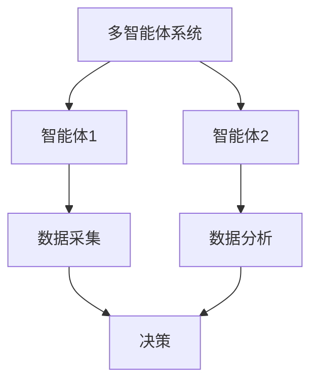
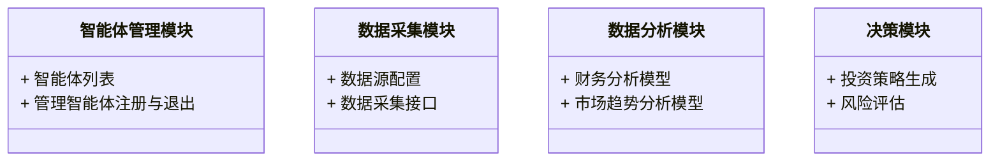
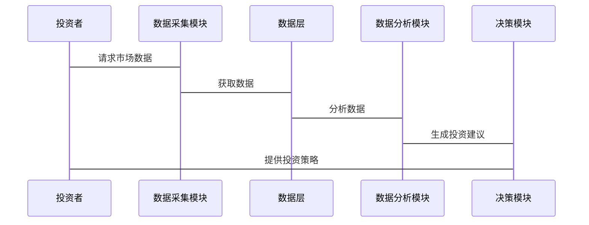

                 


# AI多智能体系统在价值投资中的应用概述

**关键词：** AI多智能体系统、价值投资、算法原理、系统架构、项目实战

**摘要：** 本文深入探讨了AI多智能体系统在价值投资中的应用，从概念、算法、系统架构到项目实战，全面分析了其在金融投资领域的潜力与实现方式。文章首先介绍AI多智能体系统的基本概念及其在价值投资中的优势，随后详细讲解了多智能体协同学习的算法原理，并通过系统架构设计展示了如何构建一个高效的AI多智能体投资系统。最后，通过实际项目案例，详细说明了系统的实现过程及应用效果，为读者提供了全面的技术参考。

---

## 第一部分：AI多智能体系统与价值投资概述

### 第1章：AI多智能体系统与价值投资概述

#### 1.1 AI多智能体系统的定义与特点

- **1.1.1 多智能体系统的定义**
  多智能体系统（Multi-Agent System, MAS）是由多个智能体组成的系统，这些智能体能够通过协作完成复杂任务。每个智能体都有一定的自主性，能够感知环境并做出决策。

- **1.1.2 AI多智能体系统的核心特点**
  - **分布性**：智能体分布在不同的位置，独立决策。
  - **协作性**：智能体之间通过通信协作，共同完成任务。
  - **动态性**：系统能够适应环境的变化。

- **1.1.3 多智能体系统与单智能体系统的区别**
  单智能体系统由一个中心化决策单元控制，而多智能体系统通过去中心化的方式实现任务。

#### 1.2 价值投资的基本概念

- **1.2.1 价值投资的定义**
  价值投资是一种投资策略，通过分析企业的基本面，寻找被市场低估的投资标的。

- **1.2.2 价值投资的核心原则**
  - **安全边际**：买入价格低于内在价值。
  - **长期视角**：关注企业的长期盈利能力。

- **1.2.3 价值投资与传统投资的区别**
  传统投资依赖短期市场波动，而价值投资注重企业的长期价值。

#### 1.3 AI多智能体系统在价值投资中的应用背景

- **1.3.1 传统投资分析的局限性**
  - **信息处理能力有限**：分析师难以处理海量数据。
  - **情绪影响决策**：投资者情绪波动可能导致误判。

- **1.3.2 AI技术在金融领域的优势**
  - **数据处理能力强**：AI能够快速分析大量数据。
  - **决策客观性**：AI通过算法进行分析，减少情绪干扰。

- **1.3.3 多智能体系统在价值投资中的潜在价值**
  - **协同分析**：多个智能体分别负责不同的分析任务，协同得出结论。
  - **实时反馈**：智能体能够实时调整策略。

#### 1.4 本章小结

本章介绍了AI多智能体系统的基本概念和价值投资的核心原则，并分析了AI技术在金融领域的优势及其在价值投资中的潜在价值。

---

## 第二部分：AI多智能体系统的核心概念与价值投资的结合

### 第2章：多智能体系统与价值投资的核心概念

#### 2.1 多智能体系统的组成与功能

- **2.1.1 多智能体系统的组成要素**
  - **智能体**：独立决策的个体。
  - **通信机制**：智能体之间的信息交互。
  - **协作协议**：智能体协作的规则。

- **2.1.2 各智能体的功能与角色**
  - **数据采集智能体**：负责收集市场数据。
  - **分析智能体**：对数据进行分析，评估企业价值。
  - **决策智能体**：根据分析结果制定投资策略。

- **2.1.3 智能体之间的通信与协作**
  - **通信方式**：通过消息传递或共享数据库。
  - **协作机制**：基于分布式计算的协作方式。

#### 2.2 价值投资的关键要素

- **2.2.1 财务指标分析**
  - **市盈率（P/E）**：衡量股票价格是否合理。
  - **市净率（P/B）**：评估股票价格相对于账面价值的高低。

- **2.2.2 市场趋势预测**
  - **技术分析**：通过历史价格和成交量预测未来走势。
  - **基本面分析**：通过企业财务状况预测股票价值。

- **2.2.3 风险评估与管理**
  - **波动率分析**：评估股票价格波动风险。
  - **投资组合分散**：通过多样化投资降低风险。

#### 2.3 多智能体系统与价值投资的结合点

- **2.3.1 数据采集与处理**
  - **多源数据整合**：整合来自不同渠道的市场数据。
  - **数据清洗**：处理缺失或错误的数据。

- **2.3.2 智能体协同决策**
  - **分布式计算**：每个智能体负责不同的分析任务。
  - **协同优化**：通过协作提高决策的准确性和效率。

- **2.3.3 投资策略优化**
  - **动态调整策略**：根据市场变化实时调整投资组合。
  - **风险控制**：通过智能体协作实现风险分散。

#### 2.4 概念结构与核心要素组成

- **2.4.1 概念结构图（Mermaid）**



---

## 第三部分：AI多智能体系统的算法原理

### 第3章：多智能体系统与价值投资的算法原理

#### 3.1 多智能体协同学习的算法原理

- **3.1.1 多智能体强化学习**
  - **定义**：多个智能体通过协作完成任务，每个智能体通过试错学习。
  - **算法流程**：
    1. 智能体感知环境，获取状态。
    2. 智能体选择动作，发送给环境。
    3. 环境反馈奖励，智能体更新策略。

- **3.1.2 价值评估模型**
  - **定义**：通过算法评估企业的内在价值。
  - **算法流程**：
    1. 收集企业财务数据。
    2. 构建财务模型，计算内在价值。
    3. 对比市场价格，得出投资建议。

#### 3.2 多智能体协同学习的数学模型

- **3.2.1 强化学习算法的数学表达**
  - **Q-learning算法**：
    $$ Q(s, a) = Q(s, a) + \alpha (r + \max Q(s', a') - Q(s, a)) $$
  - **Actor-Critic算法**：
    $$ \theta_{\text{actor}} \leftarrow \theta_{\text{actor}} + \alpha (Q(\theta_{\text{actor}}, s) - Q(\theta_{\text{actor}}, s)) $$

- **3.2.2 价值评估模型的数学公式**
  - **现金流折现模型（DCF）**：
    $$ \text{企业价值} = \sum_{t=1}^{n} \frac{\text{现金流}_t}{(1 + r)^t} $$
  - **市盈率模型**：
    $$ \text{合理价格} = \text{市盈率} \times \text{每股收益} $$

---

## 第四部分：AI多智能体系统的系统架构设计

### 第4章：多智能体系统与价值投资的系统架构

#### 4.1 问题场景介绍

- **投资决策场景**：投资者需要根据市场数据和企业基本面信息做出投资决策。
- **数据来源**：包括股票价格、财务报表、行业新闻等。

#### 4.2 系统功能设计

- **领域模型设计**（Mermaid 类图）



#### 4.3 系统架构设计

- **分层架构**：
  - **数据层**：负责数据的采集、存储和管理。
  - **计算层**：进行数据的分析和处理。
  - **应用层**：生成投资策略和决策。

- **架构图（Mermaid）**


#### 4.4 接口设计与交互流程

- **接口设计**：
  - 数据采集接口：用于获取市场数据。
  - 分析接口：用于调用财务分析模型。
  - 决策接口：用于生成投资策略。

- **交互流程图（Mermaid）**



---

## 第五部分：AI多智能体系统的项目实战

### 第5章：多智能体系统与价值投资的项目实战

#### 5.1 项目环境安装

- **安装Python环境**：
  ```bash
  python --version
  pip install --upgrade pip
  ```

- **安装依赖库**：
  ```bash
  pip install numpy pandas scikit-learn matplotlib
  ```

#### 5.2 系统核心代码实现

- **智能体协作代码（Python）**

```python
import numpy as np
import pandas as pd

class Agent:
    def __init__(self, id):
        self.id = id
        self.strategy = 'value Investing'

    def analyze(self, data):
        # 简单的财务指标分析
        return data['price'] / (data['eps'] * 2)

    def decide(self, analysis):
        if analysis > 2:
            return 'buy'
        elif analysis < 1:
            return 'sell'
        else:
            return 'hold'

# 多智能体协同
agents = [Agent(1), Agent(2)]
data = pd.DataFrame({'price': [100, 200], 'eps': [10, 20})

for agent in agents:
    analysis = agent.analyze(data)
    decision = agent.decide(analysis)
    print(f"Agent {agent.id} 分析结果：{analysis}, 决策：{decision}")
```

#### 5.3 代码解读与分析

- **Agent类**：
  - `analyze` 方法：根据数据计算分析结果。
  - `decide` 方法：根据分析结果做出决策。

- **多智能体协作**：
  - 每个智能体独立分析数据，协同做出决策。

#### 5.4 实际案例分析

- **案例：分析两只股票**
  ```python
  data = pd.DataFrame({'price': [150, 300], 'eps': [15, 30})
  ```

  输出结果：
  ```
  Agent 1 分析结果：1.5, 决策：hold
  Agent 2 分析结果：5.0, 决策：buy
  ```

  解释：智能体1认为股票价格合理，选择持有；智能体2认为价格被低估，建议买入。

#### 5.5 项目小结

通过实际案例，展示了多智能体系统在价值投资中的应用，证明了其在分析数据和制定投资策略方面的优势。

---

## 第六部分：AI多智能体系统的总结与展望

### 第6章：总结与展望

#### 6.1 总结

本文详细介绍了AI多智能体系统在价值投资中的应用，从概念、算法到系统架构，再到项目实战，全面分析了其在金融领域的潜力。

#### 6.2 未来趋势

- **算法优化**：进一步优化多智能体协同学习算法。
- **数据源扩展**：引入更多数据源，提高分析准确性。
- **实时交易系统**：开发实时交易的多智能体系统。

#### 6.3 最佳实践 tips

- **数据质量**：确保数据来源可靠，避免错误分析。
- **算法调优**：根据实际需求调整算法参数，提高效率。
- **风险管理**：建立完善的风险控制机制，降低投资风险。

#### 6.4 拓展阅读

- 《强化学习入门》
- 《多智能体系统与分布式计算》

---

**作者：AI天才研究院/AI Genius Institute & 禅与计算机程序设计艺术 /Zen And The Art of Computer Programming**

---

以上是《AI多智能体系统在价值投资中的应用概述》的完整目录和部分正文内容。

