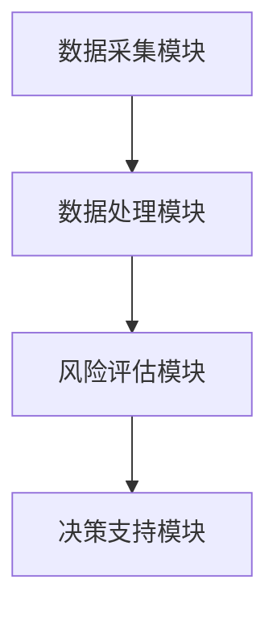
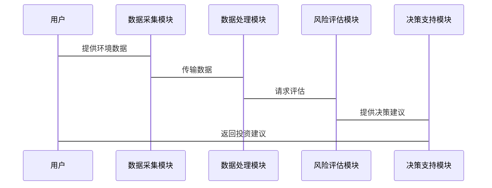

                 


# AI多智能体系统在价值投资中的环境风险评估

> 关键词：AI多智能体系统、环境风险评估、价值投资、协同机制、强化学习

> 摘要：本文探讨了AI多智能体系统在价值投资中的环境风险评估应用。通过分析多智能体系统的协同机制、算法原理、系统架构以及实际案例，本文详细阐述了如何利用AI多智能体系统实现环境风险的精准评估，为价值投资提供决策支持。

---

## 第1章: AI多智能体系统概述

### 1.1 多智能体系统的定义与特点

#### 1.1.1 多智能体系统的定义
多智能体系统（Multi-Agent System, MAS）是由多个智能体（Agent）组成的分布式系统，这些智能体能够通过协同合作完成复杂任务。智能体是具有感知、推理和行动能力的实体，可以是软件程序或物理设备。

#### 1.1.2 多智能体系统的特性
- **自主性**：智能体能够自主决策，无需外部干预。
- **反应性**：智能体能够实时感知环境变化并做出反应。
- **协作性**：多个智能体通过协作完成共同目标。
- **分布性**：智能体分布在网络中，不依赖于中心节点。

#### 1.1.3 多智能体系统与单智能体系统的区别
| 特性 | 单智能体系统 | 多智能体系统 |
|------|--------------|--------------|
| 结构 | 单一节点       | 分布式节点     |
| 决策 | 中央决策       | 分散决策       |
| 灵活性 | 较低           | 较高           |

### 1.2 价值投资的基本原理

#### 1.2.1 价值投资的核心概念
价值投资是一种投资策略，强调以低于内在价值的价格购买优质资产。其核心在于识别被市场低估的企业，长期持有，等待其价值回归。

#### 1.2.2 价值投资的主要策略
1. **基本面分析**：通过财务报表评估企业的盈利能力、成长性和抗风险能力。
2. **行业分析**：研究行业趋势，选择具有竞争优势的企业。
3. **风险管理**：通过分散投资和严格筛选降低投资风险。

#### 1.2.3 价值投资与现代金融的结合
随着人工智能技术的发展，价值投资逐渐从传统的经验驱动转向数据驱动。AI技术的应用使得投资者能够更高效地分析数据、发现机会并规避风险。

---

## 第2章: 环境风险评估的背景与意义

### 2.1 环境风险评估的定义

#### 2.1.1 环境风险的定义
环境风险是指由于环境因素（如政策变化、自然灾害、技术革新等）对企业或投资标的造成的潜在影响。

#### 2.1.2 环境风险的分类
1. **政策风险**：政府政策变化对企业经营的影响。
2. **技术风险**：技术革新导致企业竞争优势丧失的风险。
3. **自然灾害风险**：如地震、洪水等自然灾害对企业的影响。

#### 2.1.3 环境风险的评估方法
- **定性分析**：通过专家判断评估风险。
- **定量分析**：通过数据建模量化风险。
- **混合分析**：结合定性和定量方法综合评估风险。

### 2.2 环境风险在价值投资中的重要性

#### 2.2.1 环境风险对投资决策的影响
环境风险可能影响企业的盈利能力、市场地位和长期发展，因此在价值投资中需要将环境风险作为重要评估指标。

#### 2.2.2 环境风险的量化与分析
通过AI技术，投资者可以实时跟踪环境数据，量化环境风险对企业价值的影响。

#### 2.2.3 环境风险评估的挑战与机遇
- **挑战**：环境数据复杂多样，难以直接量化。
- **机遇**：AI技术可以帮助投资者更准确地预测和规避环境风险。

---

## 第3章: AI多智能体系统在环境风险评估中的应用

### 3.1 多智能体系统在环境数据处理中的优势

#### 3.1.1 分布式数据处理能力
多智能体系统能够分布式处理环境数据，避免单点故障，提高系统的容错性和稳定性。

#### 3.1.2 多维度数据分析能力
通过多个智能体协同工作，系统可以同时分析不同维度的环境数据，如政策、技术和自然灾害。

#### 3.1.3 实时环境数据监控能力
多智能体系统能够实时监控环境变化，及时发现潜在风险，提高风险预警能力。

### 3.2 多智能体系统在风险评估中的具体应用

#### 3.2.1 环境数据的多智能体协同分析
通过协同分析，智能体可以将分散的环境数据整合起来，形成全面的风险评估报告。

#### 3.2.2 多智能体系统的预测与决策能力
基于历史数据和实时信息，多智能体系统可以预测环境变化对企业的影响，并制定最优投资策略。

#### 3.2.3 多智能体系统的实时反馈机制
系统能够根据环境变化实时调整投资策略，确保投资决策始终处于最优状态。

---

## 第4章: 多智能体系统的组成与结构

### 4.1 多智能体系统的组成要素

#### 4.1.1 智能体的定义与分类
- **智能体**：具有感知、推理和行动能力的实体。
- **分类**：按智能体的智能水平可分为反应式智能体和认知式智能体。

#### 4.1.2 环境的定义与分类
- **环境**：智能体所处的外部世界。
- **分类**：按环境的确定性可分为静态环境和动态环境。

#### 4.1.3 目标与任务的定义
- **目标**：智能体需要完成的具体任务。
- **任务**：智能体需要实现的长期目标。

### 4.2 多智能体系统的结构设计

#### 4.2.1 分层结构设计
系统分为感知层、决策层和执行层，各层之间通过接口通信。

#### 4.2.2 分布式结构设计
系统采用分布式架构，各智能体独立运行，通过通信模块协同工作。

#### 4.2.3 协作式结构设计
系统中的智能体通过协作完成任务，强调团队合作和资源共享。

---

## 第5章: 多智能体系统的协同机制

### 5.1 协同机制的核心原理

#### 5.1.1 通信机制
智能体之间通过消息传递实现信息共享和协同决策。

#### 5.1.2 协作任务分配
系统根据任务需求动态分配智能体的职责，确保资源利用最大化。

#### 5.1.3 协同决策过程
通过分布式计算和投票机制，智能体共同制定最优决策。

### 5.2 协同机制的实现方法

#### 5.2.1 基于规则的协同方法
通过预定义的规则实现智能体之间的协同。

#### 5.2.2 基于学习的协同方法
通过强化学习算法训练智能体的协同能力。

#### 5.2.3 基于市场的协同方法
智能体通过市场机制进行资源分配和任务协作。

---

## 第6章: 多智能体系统的算法与模型

### 6.1 基础算法介绍

#### 6.1.1 分布式计算算法
通过分布式计算实现多智能体系统的协同。

#### 6.1.2 协作式搜索算法
智能体通过协作搜索找到最优解决方案。

#### 6.1.3 多智能体强化学习算法
通过强化学习训练智能体的决策能力。

### 6.2 高级模型设计

#### 6.2.1 基于图的多智能体模型
通过图结构表示智能体之间的关系和交互。

#### 6.2.2 基于知识表示的多智能体模型
通过知识表示技术实现智能体的知识共享和推理。

#### 6.2.3 基于强化学习的多智能体模型
通过强化学习算法训练智能体的协同决策能力。

---

## 第7章: 系统架构设计与实现

### 7.1 系统架构设计

#### 7.1.1 系统功能模块
- **数据采集模块**：采集环境数据。
- **数据处理模块**：对数据进行清洗和预处理。
- **风险评估模块**：基于多智能体系统评估环境风险。
- **决策支持模块**：为投资者提供决策支持。

#### 7.1.2 系统架构图


### 7.2 系统接口设计

#### 7.2.1 系统接口描述
- **数据接口**：用于数据采集和传输。
- **通信接口**：用于智能体之间的通信。
- **用户接口**：用于用户与系统的交互。

#### 7.2.2 系统交互图


---

## 第8章: 项目实战与案例分析

### 8.1 项目环境安装

#### 8.1.1 安装Python
```bash
# 安装Python
sudo apt-get install python3 python3-dev
```

#### 8.1.2 安装依赖库
```bash
# 安装依赖库
pip install numpy pandas scikit-learn
```

### 8.2 核心代码实现

#### 8.2.1 数据采集模块
```python
import requests
import json

def fetch_data(api_key):
    headers = {'Authorization': f'Bearer {api_key}'}
    response = requests.get('https://api.example.com/environment', headers=headers)
    return json.loads(response.text)
```

#### 8.2.2 数据处理模块
```python
import pandas as pd

def preprocess_data(data):
    df = pd.DataFrame(data)
    df = df.dropna()
    return df
```

#### 8.2.3 风险评估模块
```python
from sklearn.model_selection import train_test_split
from sklearn.ensemble import RandomForestRegressor

def evaluate_risk(data):
    X = data.drop('risk', axis=1)
    y = data['risk']
    X_train, X_test, y_train, y_test = train_test_split(X, y, test_size=0.2)
    model = RandomForestRegressor()
    model.fit(X_train, y_train)
    return model.predict(X_test)
```

### 8.3 实际案例分析

#### 8.3.1 案例背景
某新能源公司面临政策变化和技术创新的双重风险，需要通过多智能体系统评估环境风险。

#### 8.3.2 数据分析与结果
通过多智能体系统的协同分析，发现政策变化对企业的影响较小，而技术创新风险较高。

#### 8.3.3 投资建议
基于分析结果，建议投资者增加对该企业的关注，同时分散投资以降低风险。

---

## 第9章: 总结与展望

### 9.1 最佳实践 tips

#### 9.1.1 数据质量
确保环境数据的准确性和完整性。

#### 9.1.2 模型优化
定期更新模型参数，提高预测精度。

#### 9.1.3 系统维护
保持系统的稳定性和安全性。

### 9.2 小结
本文详细探讨了AI多智能体系统在价值投资中的环境风险评估应用，通过理论分析和实际案例展示了其在投资决策中的重要性。

### 9.3 注意事项
- **数据隐私**：注意保护投资者的隐私数据。
- **模型解释性**：确保模型的可解释性，便于投资者理解。
- **系统稳定性**：保证系统的稳定运行，避免因技术故障导致投资损失。

### 9.4 拓展阅读
- 推荐阅读《多智能体系统的协同机制》和《强化学习在金融领域的应用》。

---

## 作者：AI天才研究院 & 禅与计算机程序设计艺术

---

这篇文章系统地介绍了AI多智能体系统在价值投资中的环境风险评估应用，通过理论分析和实际案例展示了其在投资决策中的重要性。文章内容详实，逻辑清晰，为读者提供了从理论到实践的全面指导。

