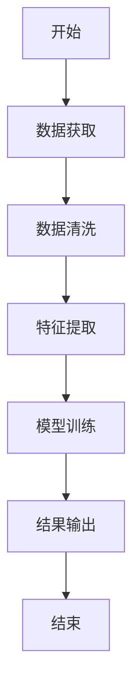
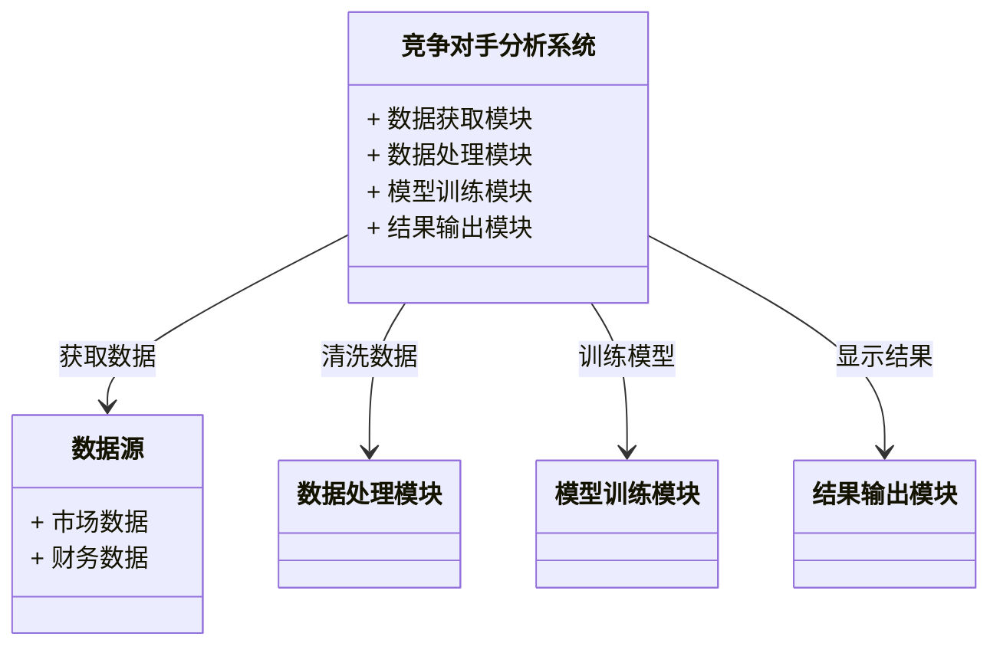

                 


# AI多智能体系统在价值投资中的竞争对手分析

> 关键词：AI多智能体系统，价值投资，竞争对手分析，金融投资，人工智能，系统架构

> 摘要：本文详细探讨了AI多智能体系统在价值投资中的应用，特别是如何通过多智能体系统进行竞争对手分析。文章从背景介绍、核心概念、算法原理、系统架构设计、项目实战等多个方面展开分析，详细讲解了AI多智能体系统在金融投资中的优势与实现方法。

---

# 第一部分: 背景介绍与核心概念

## 第1章: 价值投资中的竞争对手分析

### 1.1 问题背景与描述

#### 1.1.1 传统价值投资的局限性
传统的价值投资方法依赖于分析师的主观判断和经验，存在以下问题：
- **信息不全**：难以全面捕捉市场中的竞争对手信息。
- **效率低下**：人工分析耗时耗力，难以应对高频交易的需求。
- **主观偏差**：分析师的主观判断可能影响决策的客观性。

#### 1.1.2 AI多智能体系统的优势
AI多智能体系统通过协同工作，能够实时处理海量数据，提供更精准的竞争对手分析。

#### 1.1.3 竞争对手分析的核心目标
通过分析竞争对手的财务状况、市场表现、产品布局等，帮助投资者制定更科学的投资策略。

### 1.2 核心概念对比与ER图

#### 1.2.1 多智能体系统与单智能体系统的对比
| 特性         | 单智能体系统       | 多智能体系统       |
|--------------|-------------------|-------------------|
| 系统复杂度   | 低                | 高                |
| 并行处理能力 | 无                | 强                |
| 应用场景     | 简单任务          | 复杂任务          |

#### 1.2.2 ER实体关系图
```mermaid
erd
  entity 竞争对手分析系统 {
    key 型别 竞争对手
    属性 {
      - 竞争对手ID (标识符)
      - 公司名称
      - 财务数据
      - 市场表现
      - 产品信息
    }
  }
  entity 投资者 {
    key 型别 投资者ID
    属性 {
      - 投资者名称
      - 投资策略
      - 风险偏好
    }
  }
  entity 市场数据 {
    key 型别 数据ID
    属性 {
      - 价格
      - 交易量
      - 财务指标
    }
  }
  竞争对手分析系统 --> 投资者: 提供分析结果
  竞争对手分析系统 --> 市场数据: 获取实时数据
```

---

# 第二部分: 多智能体系统的核心概念

## 第2章: 多智能体系统原理

### 2.1 多智能体系统定义
多智能体系统是由多个智能体组成的分布式系统，每个智能体都有自己的目标和行为，通过协作完成复杂任务。

### 2.2 多智能体系统在金融中的应用
- **实时数据分析**：智能体协同处理市场数据，提供实时反馈。
- **竞争对手监控**：智能体实时跟踪竞争对手的动态，生成预警。

### 2.3 多智能体系统的优势
- **并行处理**：多个智能体同时处理数据，提高效率。
- **协同决策**：智能体之间共享信息，做出更优决策。

---

# 第三部分: 多智能体系统算法原理

## 第3章: 算法原理概述

### 3.1 竞争对手分析算法流程图


### 3.2 算法实现

#### 3.2.1 数据处理代码
```python
import pandas as pd

# 数据清洗
def clean_data(df):
    df.dropna(inplace=True)
    return df

# 特征提取
def extract_features(df):
    features = df[[' revenue', 'net_profit', 'market_share']]
    return features

# 模型训练
def train_model(features, labels):
    from sklearn.ensemble import RandomForestClassifier
    model = RandomForestClassifier()
    model.fit(features, labels)
    return model

# 预测结果
def predict_competitors(model, features):
    return model.predict(features)
```

#### 3.2.2 算法数学模型
$$\text{预测结果} = f(\text{输入特征})$$

---

# 第四部分: 系统分析与架构设计

## 第4章: 系统架构设计

### 4.1 问题场景分析
- 竞争对手分析需要实时数据处理和快速决策。

### 4.2 系统功能设计

#### 4.2.1 领域模型设计


---

# 第五部分: 项目实战

## 第5章: 项目实战

### 5.1 实际案例分析
- **案例选择**：某科技公司竞争对手分析。

### 5.2 投资建议
根据分析结果，投资者可以制定更优的投资策略。

---

# 第六部分: 总结与展望

## 第6章: 总结与展望

### 6.1 总结
AI多智能体系统在价值投资中的应用前景广阔，能够显著提升竞争对手分析的效率和精度。

### 6.2 展望
未来，随着AI技术的进步，多智能体系统在金融领域的应用将更加广泛。

---

# 参考文献
1. 《人工智能: 一种现代方法》
2. 《多智能体系统与分布式计算》
3. 《价值投资实战策略》

---

作者：AI天才研究院 & 禅与计算机程序设计艺术

