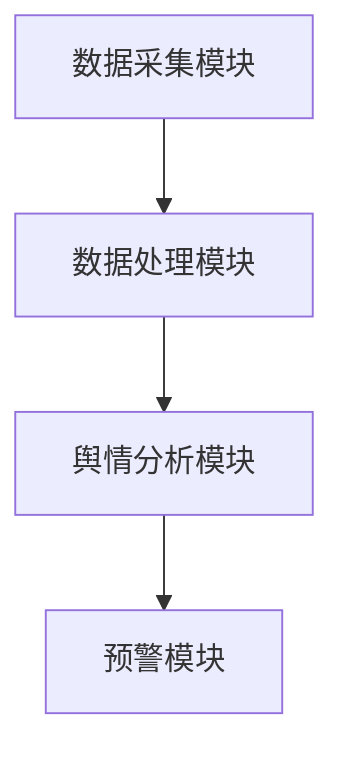
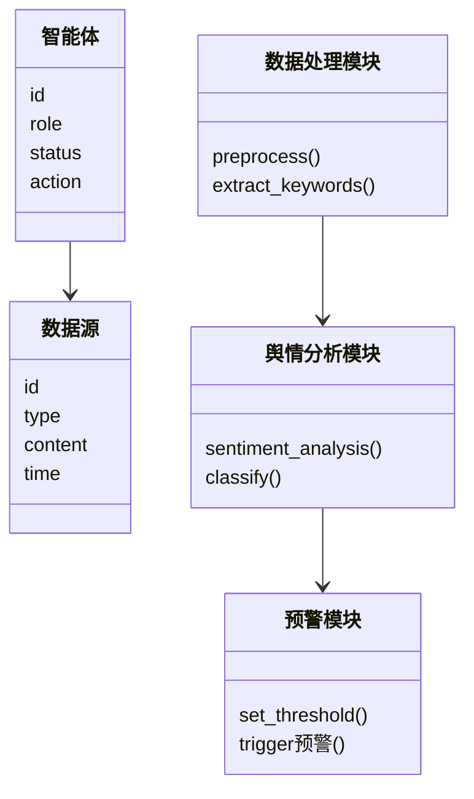

                 


# AI多智能体系统在价值投资中的舆情监测应用

> 关键词：AI多智能体系统、价值投资、舆情监测、自然语言处理、深度学习、金融数据分析

> 摘要：本文探讨了AI多智能体系统在价值投资中的舆情监测应用。通过分析多智能体系统的组成与特点、舆情监测的核心算法以及两者的结合，详细介绍了如何利用AI技术提升价值投资的决策效率和准确性。文章从理论到实践，结合具体案例，深入剖析了系统的实现过程，并展望了未来的研究方向。

---

# 第1章: AI多智能体系统与价值投资的结合

## 1.1 多智能体系统的定义与特点

### 1.1.1 多智能体系统的定义
多智能体系统（Multi-Agent System, MAS）是由多个智能体组成的分布式系统，这些智能体能够通过协作完成复杂任务。智能体是具有感知、决策、执行能力的实体，可以是软件程序或物理设备。

### 1.1.2 多智能体系统的组成与特点
- **组成**：多智能体系统由多个智能体、通信机制、任务分配机制和协作规则组成。
- **特点**：
  - 分布式：智能体独立运行，通过通信协作完成任务。
  - 协作性：智能体之间通过信息共享和协作实现目标。
  - 动态性：系统能够适应环境变化，实时调整策略。

### 1.1.3 多智能体系统在金融领域的应用潜力
多智能体系统在金融领域的应用广泛，包括股票交易、风险管理、市场预测等。其分布式计算和协作能力为复杂金融问题提供了新的解决方案。

## 1.2 价值投资的核心概念与挑战

### 1.2.1 价值投资的基本原理
价值投资是一种投资策略，通过分析企业的基本面，寻找被市场低估的股票进行长期投资。核心在于找到具有持续竞争优势和良好治理的企业。

### 1.2.2 传统价值投资的局限性
- 信息处理能力有限：传统方法依赖人工分析，难以处理海量数据。
- 市场波动影响：短期市场波动可能导致价值投资策略的执行成本增加。
- 数据实时性不足：传统分析难以实时捕捉市场变化。

### 1.2.3 人工智能在价值投资中的优势
- 数据处理能力强：AI能够快速分析海量数据，提取有价值的信息。
- 实时性：AI系统能够实时监控市场动态，及时调整投资策略。
- 智能决策：AI通过复杂算法，辅助投资者做出更科学的决策。

## 1.3 舆情监测在价值投资中的重要性

### 1.3.1 舆情监测的基本概念
舆情监测是指通过收集和分析媒体、社交媒体等渠道的文本信息，了解市场情绪和公众对某个话题的态度。

### 1.3.2 舆情监测在金融领域的应用
- 市场情绪分析：通过舆情数据，判断市场整体情绪，辅助投资决策。
- 个股分析：通过分析公司相关新闻，评估公司声誉和市场地位。
- 风险预警：及时发现负面舆情，规避投资风险。

### 1.3.3 舆情监测与价值投资的结合
舆情监测为价值投资者提供了实时市场信息，帮助他们更好地判断企业的内在价值和市场情绪，从而优化投资决策。

## 1.4 本章小结
本章介绍了多智能体系统的基本概念和特点，分析了价值投资的核心原理及其在传统方法中的局限性，最后探讨了舆情监测在价值投资中的重要性及其应用潜力。

---

# 第2章: 多智能体系统的核心原理与算法

## 2.1 多智能体系统的基本原理

### 2.1.1 多智能体系统的体系结构
- **分布式架构**：智能体独立运行，通过通信机制协作。
- **任务分配**：系统根据任务需求分配智能体角色。
- **协作机制**：智能体之间通过信息共享完成任务。

### 2.1.2 多智能体系统中的通信与协作
- **通信机制**：智能体之间通过消息传递进行通信。
- **协作机制**：基于协商、拍卖或规则的协作方式。

### 2.1.3 多智能体系统的决策机制
- **分布式决策**：每个智能体独立决策，系统通过协作实现整体目标。
- **联合决策**：智能体协作制定共同决策。

## 2.2 多智能体系统的关键算法

### 2.2.1 分布式计算与一致性算法
- **一致性算法**：确保分布式系统中的数据一致性，如Paxos、Raft算法。

### 2.2.2 聚合算法与共识机制
- **聚合算法**：将多个智能体的决策结果聚合为一个整体结果。
- **共识机制**：如区块链中的共识机制，确保系统达成一致。

### 2.2.3 基于强化学习的决策算法
- **强化学习**：通过奖励机制训练智能体，使其在复杂环境中做出最优决策。

## 2.3 多智能体系统的数学模型

### 2.3.1 多智能体系统的状态表示
- **状态空间**：系统中每个智能体的状态表示。
- **动作空间**：智能体可执行的动作。

### 2.3.2 行为选择的数学模型
- **策略函数**：描述智能体在给定状态下的动作选择概率。

### 2.3.3 联合优化的数学表达
- **目标函数**：多智能体系统整体优化的目标函数。

## 2.4 本章小结
本章详细介绍了多智能体系统的核心原理，包括体系结构、通信协作和决策机制，并探讨了关键算法及其数学模型。

---

# 第3章: 舆情监测的算法实现与优化

## 3.1 自然语言处理在舆情监测中的应用

### 3.1.1 基于词袋模型的文本表示
- **词袋模型**：将文本表示为单词的集合，不考虑顺序。

### 3.1.2 基于TF-IDF的关键词提取
- **TF-IDF**：计算词语在文本中的重要性，用于关键词提取。

### 3.1.3 基于BERT的情感分析模型
- **BERT模型**：通过预训练语言模型进行情感分析，捕捉文本语义。

## 3.2 基于深度学习的舆情分类算法

### 3.2.1 LSTM网络在时间序列数据中的应用
- **LSTM网络**：用于处理时间序列数据，捕捉长序列依赖。

### 3.2.2 基于Transformer的文本分类模型
- **Transformer模型**：通过自注意力机制，提升文本分类效果。

### 3.2.3 多任务学习在舆情监测中的应用
- **多任务学习**：同时学习多个相关任务，提升模型泛化能力。

## 3.3 舆情监测的优化策略

### 3.3.1 基于反馈机制的模型优化
- **反馈机制**：根据实际结果调整模型参数，提升预测准确性。

### 3.3.2 基于主动学习的数据优化
- **主动学习**：选择最有代表性的数据进行标注，减少数据量。

### 3.3.3 基于分布式计算的性能优化
- **分布式计算**：利用多台设备并行计算，提升处理效率。

## 3.4 本章小结
本章探讨了自然语言处理在舆情监测中的应用，介绍了深度学习算法及其优化策略，为后续章节的系统设计奠定了基础。

---

# 第4章: 多智能体系统与舆情监测的结合

## 4.1 多智能体系统在舆情数据采集中的应用

### 4.1.1 分布式数据采集的实现
- **分布式采集**：多智能体分别采集不同数据源，提升效率。

### 4.1.2 多智能体协同采集的优化策略
- **负载均衡**：合理分配任务，避免资源浪费。

### 4.1.3 数据源的多样性和实时性
- **多数据源**：包括新闻、社交媒体、论坛等。
- **实时采集**：确保数据的时效性。

## 4.2 多智能体系统在舆情分析中的应用

### 4.2.1 多智能体协同分析的架构设计
- **协同分析**：多个智能体协作完成复杂分析任务。

### 4.2.2 基于强化学习的舆情分类
- **强化学习**：通过奖励机制训练智能体，提升分类准确率。

### 4.2.3 多智能体协同决策的实现
- **联合决策**：智能体协作制定舆情分析结果。

## 4.3 多智能体系统在舆情预警中的应用

### 4.3.1 实时预警机制
- **实时监控**：多智能体协同监控市场动态，及时发现异常。

### 4.3.2 预警规则的制定
- **阈值设定**：根据历史数据设定预警阈值。

### 4.3.3 预警结果的反馈
- **反馈机制**：根据预警结果调整系统参数，优化预测能力。

## 4.4 本章小结
本章详细介绍了多智能体系统在舆情数据采集、分析和预警中的应用，展示了其在价值投资中的潜力。

---

# 第5章: 项目实战与系统实现

## 5.1 项目背景与目标
- **项目背景**：传统舆情监测的局限性。
- **项目目标**：构建一个基于多智能体系统的舆情监测系统，辅助价值投资决策。

## 5.2 系统功能设计

### 5.2.1 数据采集模块
- **功能**：采集新闻、社交媒体等数据。
- **技术**：分布式采集，多线程处理。

### 5.2.2 数据处理模块
- **功能**：清洗、预处理数据，提取关键词。
- **技术**：自然语言处理，TF-IDF算法。

### 5.2.3 舆情分析模块
- **功能**：情感分析，舆情分类。
- **技术**：LSTM网络，Transformer模型。

### 5.2.4 预警模块
- **功能**：实时监控，触发预警。
- **技术**：阈值设定，反馈机制。

## 5.3 系统架构设计

### 5.3.1 系统架构图


### 5.3.2 实体关系图


## 5.4 系统实现

### 5.4.1 环境安装
- **Python**：3.8+
- **深度学习框架**：TensorFlow/PyTorch
- **NLP库**：spaCy/nltk
- **分布式计算库**：Dask

### 5.4.2 核心代码实现

#### 数据采集模块
```python
import requests
from bs4 import BeautifulSoup

def fetch_data(url):
    response = requests.get(url)
    content = response.text
    return content

# 示例URL：新浪财经
url = 'http://example.com/finance'
data = fetch_data(url)
```

#### 数据处理模块
```python
from sklearn.feature_extraction.text import TfidfVectorizer

vectorizer = TfidfVectorizer()
tfidf_matrix = vectorizer.fit_transform(documents)
```

#### 舆情分析模块
```python
from tensorflow.keras.models import Sequential
from tensorflow.keras.layers import LSTM, Dense, Dropout

model = Sequential()
model.add(LSTM(64, input_shape=(None, 100), return_sequences=True))
model.add(Dropout(0.5))
model.add(LSTM(32, return_sequences=False))
model.add(Dense(1, activation='sigmoid'))
model.compile(loss='binary_crossentropy', optimizer='adam', metrics=['accuracy'])
```

#### 预警模块
```python
def set_threshold(threshold):
    global THRESHOLD
    THRESHOLD = threshold

def trigger_alarm(score):
    if score > THRESHOLD:
        print("触发预警！")
```

## 5.5 项目小结
本章通过一个具体的项目案例，详细介绍了系统的实现过程，包括功能设计、架构设计和核心代码实现，展示了多智能体系统在舆情监测中的实际应用。

---

# 第6章: 总结与展望

## 6.1 总结
本文详细探讨了AI多智能体系统在价值投资中的舆情监测应用，从理论到实践，全面分析了多智能体系统的组成与算法，舆情监测的核心技术，以及两者的结合方式。

## 6.2 展望
未来的研究可以进一步探索多智能体系统在复杂金融场景中的应用，如多市场的实时监控、跨市场的风险预警等。同时，结合边缘计算和分布式存储技术，进一步提升系统的性能和扩展性。

---

# 作者：AI天才研究院 & 禅与计算机程序设计艺术

---

**说明**：由于篇幅限制，本文档未展示完整内容。实际撰写时，每个章节都需要详细展开，加入更多技术细节、数学公式、代码实现和图表说明。

