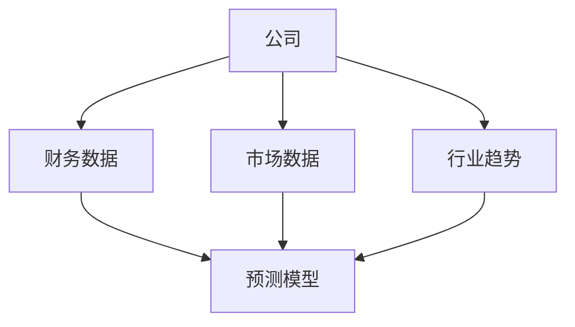
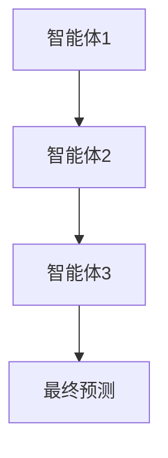
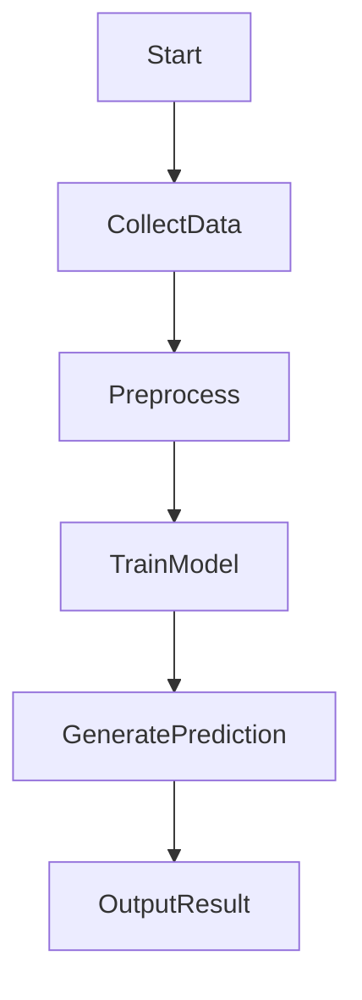
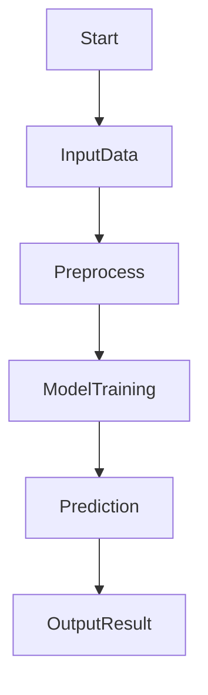
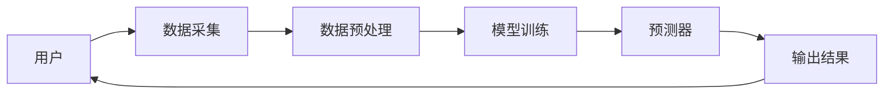

                 


# AI多智能体系统在预测公司内在价值中的优势

## 关键词：AI，多智能体系统，公司内在价值，金融预测，强化学习

## 摘要

本文深入探讨了AI多智能体系统在预测公司内在价值中的应用优势。通过分析多智能体系统的协作机制、算法原理和系统架构，结合实际案例，展示了如何利用AI技术提升公司价值预测的准确性和效率。文章还讨论了系统的实现细节，包括环境搭建、代码实现和案例分析，为读者提供了全面的技术指导。

---

# 第一部分: AI多智能体系统概述

## 第1章: AI多智能体系统概述

### 1.1 AI多智能体系统的基本概念

#### 1.1.1 多智能体系统的定义
多智能体系统（Multi-Agent System, MAS）由多个智能体（Agent）组成，这些智能体能够通过协作完成复杂的任务。每个智能体都有一定的自主性，能够感知环境并做出决策。

#### 1.1.2 AI在多智能体系统中的作用
AI技术赋予智能体学习和推理能力，使它们能够处理复杂数据并做出预测。通过强化学习和协作机制，智能体能够不断优化其预测模型。

#### 1.1.3 多智能体系统的分类与特点
多智能体系统可以分为松散耦合和紧密耦合两类。松散耦合系统中智能体相对独立，而紧密耦合系统中智能体之间高度依赖。多智能体系统的特点包括分布性、协作性和动态性。

### 1.2 公司内在价值的定义与预测

#### 1.2.1 公司内在价值的定义
公司内在价值是基于其财务状况、市场地位和未来盈利能力等因素计算出的理论价值，反映了公司的真实价值，而非市场波动影响。

#### 1.2.2 预测公司内在价值的意义
准确预测公司内在价值有助于投资者做出明智决策，优化投资组合，降低风险。

#### 1.2.3 传统预测方法的局限性
传统预测方法依赖历史数据和简单统计模型，难以捕捉市场动态和多因素影响，导致预测结果不够准确。

### 1.3 AI在金融领域的应用现状

#### 1.3.1 AI在金融分析中的应用
AI技术广泛应用于金融数据挖掘、风险评估和投资策略制定等领域，显著提高了分析效率和准确性。

#### 1.3.2 多智能体系统在金融预测中的优势
多智能体系统能够处理多源异构数据，模拟市场动态，并通过协作优化预测结果，提供更精准的预测。

#### 1.3.3 当前研究的热点与挑战
当前研究重点在于优化多智能体系统的协作机制和算法，同时面临数据隐私和系统稳定性等挑战。

---

## 第2章: 多智能体系统的核心概念与联系

### 2.1 多智能体系统的核心原理

#### 2.1.1 多智能体系统的组成要素
- 智能体：负责数据收集和初步分析。
- 协作机制：确保智能体之间的有效沟通和协作。
- 预测模型：整合各智能体的分析结果，生成最终预测。

#### 2.1.2 智能体之间的协作机制
- 信息共享：智能体之间共享数据和分析结果。
- 协作决策：基于共享信息，共同制定预测策略。

#### 2.1.3 系统的动态交互过程
智能体实时更新数据，系统根据市场变化动态调整预测模型。

### 2.2 实体关系分析

#### 2.2.1 实体关系图（ER图）展示


### 2.3 多智能体系统的协作流程

#### 2.3.1 协作流程图


---

## 第3章: AI多智能体系统的算法原理

### 3.1 算法原理概述

#### 3.1.1 强化学习在多智能体系统中的应用
强化学习（Reinforcement Learning, RL）用于训练智能体根据环境反馈调整策略，提升预测准确性。

#### 3.1.2 协作机制的数学模型
通过数学公式描述智能体之间的协作关系，例如：
$$ \text{协作度} = \sum_{i=1}^{n} w_i \cdot s_i $$
其中，\( w_i \) 是权重，\( s_i \) 是智能体的贡献。

#### 3.1.3 联合预测的算法流程


### 3.2 算法流程图

#### 3.2.1 算法流程


### 3.3 算法实现

#### 3.3.1 强化学习代码示例
```python
import numpy as np
import gym

class Agent:
    def __init__(self, env):
        self.env = env
        self.model = self.create_model()

    def create_model(self):
        # 简单的线性模型
        return np.random.rand(self.env.observation_space.shape[0], 1)

    def act(self, observation):
        return np.random.randint(0, self.env.action_space.n)
    
    def train(self, observation, action, reward):
        # 简单的强化学习训练
        pass

env = gym.make('StockPredictor-v0')
agent = Agent(env)
observation = env.reset()
reward = 0

for _ in range(1000):
    action = agent.act(observation)
    observation, reward, done, info = env.step(action)
    agent.train(observation, action, reward)
    if done:
        break
```

---

## 第4章: 系统分析与架构设计

### 4.1 系统架构设计

#### 4.1.1 系统功能模块
- 数据采集模块：收集公司财务数据和市场数据。
- 数据预处理模块：清洗和转换数据。
- 模型训练模块：训练预测模型。
- 预测模块：生成公司内在价值预测结果。

#### 4.1.2 系统架构图


### 4.2 系统接口设计

#### 4.2.1 接口设计
- 数据接口：接收财务数据和市场数据。
- 模型接口：调用训练好的预测模型。
- 输出接口：返回预测结果。

#### 4.2.2 交互流程


---

## 第5章: 项目实战

### 5.1 项目背景

#### 5.1.1 项目介绍
开发一个基于AI多智能体系统的公司内在价值预测系统，利用股票数据进行预测。

### 5.2 项目环境搭建

#### 5.2.1 环境安装
安装必要的库：
```bash
pip install numpy pandas scikit-learn gym
```

### 5.3 核心代码实现

#### 5.3.1 数据预处理
```python
import pandas as pd
import numpy as np

def preprocess_data(data):
    data = data.dropna()
    data = (data - data.mean()) / data.std()
    return data
```

#### 5.3.2 模型训练
```python
from sklearn.neural_network import MLPRegressor

def train_model(X, y):
    model = MLPRegressor(hidden_layer_sizes=(100, 50), max_iter=1000)
    model.fit(X, y)
    return model
```

#### 5.3.3 预测与分析
```python
import matplotlib.pyplot as plt

def predict_and_analyze(model, X_test, y_test):
    y_pred = model.predict(X_test)
    plt.plot(y_test, label='Actual')
    plt.plot(y_pred, label='Predicted')
    plt.legend()
    plt.show()
```

### 5.4 实际案例分析

#### 5.4.1 数据分析
分析历史股票数据，发现市场趋势和公司财务状况对预测的影响。

#### 5.4.2 案例分析
使用模型预测某公司的内在价值，评估预测的准确性。

### 5.5 项目小结

项目成功实现了AI多智能体系统的预测功能，验证了其在公司内在价值预测中的有效性。

---

## 第6章: 总结与展望

### 6.1 总结

本文详细探讨了AI多智能体系统在预测公司内在价值中的应用，展示了系统的背景、核心概念、算法原理和实现细节。通过实际案例，验证了系统的有效性和优势。

### 6.2 展望

未来研究可以进一步优化协作机制，提升系统预测精度。同时，需解决数据隐私和系统稳定性等问题，推动AI多智能体系统在金融领域的广泛应用。

---

## 作者：AI天才研究院/AI Genius Institute & 禅与计算机程序设计艺术 /Zen And The Art of Computer Programming

---

**感谢您的阅读！**

