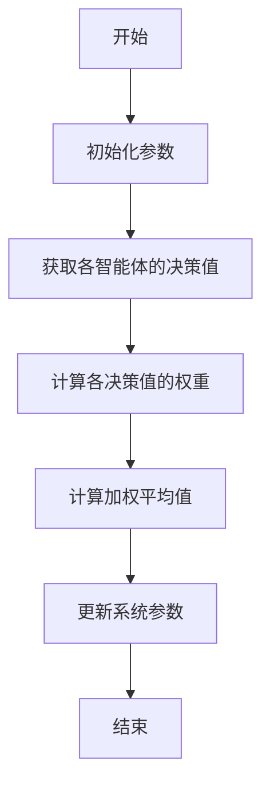
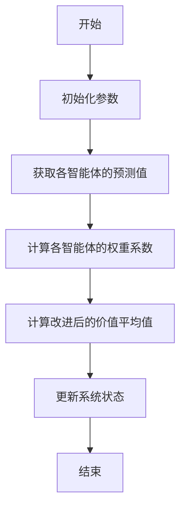
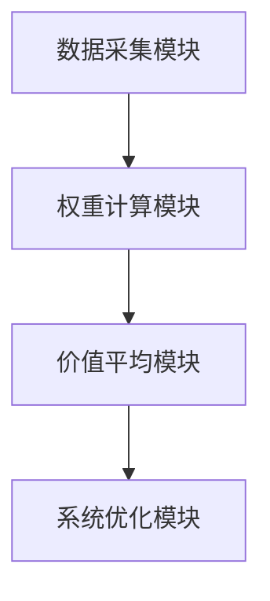
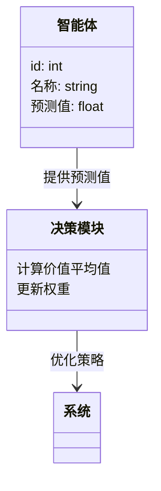
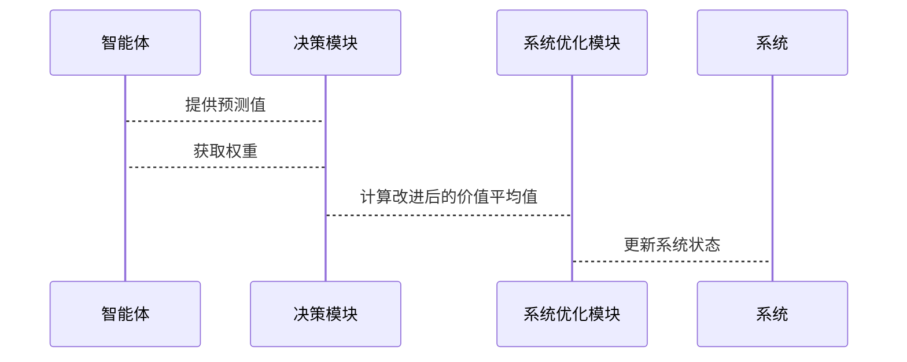

                 


# AI多智能体系统如何改进传统的价值平均策略

> 关键词：多智能体系统，价值平均策略，协作与竞争，算法优化，系统架构

> 摘要：本文详细探讨了AI多智能体系统如何改进传统的价值平均策略，通过背景介绍、核心概念分析、算法原理、系统架构设计、项目实战等多个方面，全面解析了多智能体系统在价值平均策略中的应用与优化方法，帮助读者深入理解并掌握相关技术。

---

# 第1章: 多智能体系统概述

## 1.1 多智能体系统的定义与特点

### 1.1.1 多智能体系统的定义

多智能体系统（Multi-Agent System，MAS）是由多个智能体（Agent）组成的复杂系统，这些智能体通过协作与竞争完成特定任务。智能体是具有感知、决策和行动能力的实体，能够独立工作并与其他智能体交互。

### 1.1.2 多智能体系统的核心特点

1. **分布式性**：多个智能体分布在不同的位置，独立决策。
2. **协作性**：智能体之间通过协作完成共同目标。
3. **竞争性**：智能体之间可能存在竞争，优化整体性能。
4. **动态性**：系统环境和任务需求动态变化。
5. **自主性**：智能体能够自主决策和行动。

### 1.1.3 多智能体系统与传统单智能体系统的区别

| 特性       | 多智能体系统                | 单智能体系统                |
|------------|----------------------------|-----------------------------|
| 结构       | 分布式，多个智能体协作       | 集中式，单个智能体决策       |
| 通信       | 智能体之间需要通信          | 无需与其他实体通信           |
| 竞争与协作 | 存在竞争与协作关系         | 无竞争，单智能体独立完成任务 |

---

## 1.2 价值平均策略的基本概念

### 1.2.1 价值平均策略的定义

价值平均策略（Value-Averaging Strategy）是一种通过计算多个决策源的平均值来制定决策的策略。它常用于分布式系统中，通过综合各部分的意见或预测值来得到最终的决策。

### 1.2.2 价值平均策略的核心要素

1. **决策源**：提供决策的智能体或模型。
2. **权重分配**：不同决策源的权重可能不同。
3. **计算方式**：计算各决策源的加权平均值。

### 1.2.3 价值平均策略的优缺点

| 特性         | 优点                       | 缺点                         |
|--------------|----------------------------|------------------------------|
| 稳定性       | 通过平均值减少极端情况影响   | 可能无法捕捉到最优解           |
| 计算效率     | 计算简单，适合大规模应用     | 权重分配不合理可能导致偏差     |
| 适应性       | 适应分布式环境             | 需要协调权重分配和通信机制     |

---

## 1.3 多智能体系统与价值平均策略的关系

### 1.3.1 多智能体系统中价值平均策略的应用场景

在多智能体系统中，价值平均策略常用于以下场景：

1. **分布式预测**：多个智能体分别预测某个值，通过平均值得到最终预测结果。
2. **协作决策**：智能体之间通过价值平均策略达成一致的决策。
3. **动态调整**：根据系统状态动态调整各智能体的权重，优化决策结果。

### 1.3.2 多智能体系统如何改进传统的价值平均策略

传统价值平均策略假设各决策源的权重相同，而在多智能体系统中，可以根据智能体的能力、历史表现等因素动态调整权重，从而提高决策的准确性。

### 1.3.3 价值平均策略在多智能体系统中的重要性

在多智能体系统中，价值平均策略能够有效整合多个智能体的决策信息，优化整体性能。通过动态调整权重，可以提高系统的适应性和鲁棒性。

---

# 第2章: 多智能体系统的核心概念与联系

## 2.1 多智能体系统中的协作与竞争

### 2.1.1 协作的定义与特点

协作是指多个智能体为了共同目标而协同工作。协作可以通过信息共享、任务分配等方式实现。

### 2.1.2 竞争的定义与特点

竞争是指智能体为了资源或目标而进行的对抗。竞争可以促进系统优化，但需要平衡以避免内耗。

### 2.1.3 协作与竞争的平衡

在多智能体系统中，协作与竞争是相辅相成的。合理的竞争可以提高效率，而过度竞争可能导致系统性能下降。

---

## 2.2 价值平均策略的属性特征对比

### 2.2.1 传统价值平均策略的属性特征

| 特性         | 传统价值平均策略           |
|--------------|----------------------------|
| 权重分配     | 固定权重或简单加权          |
| 适应性       | 较低，权重固定               |
| 计算复杂度   | 低，计算简单               |

### 2.2.2 改进后的价值平均策略的属性特征

| 特性         | 改进后的价值平均策略         |
|--------------|-----------------------------|
| 权重分配     | 动态调整权重                 |
| 适应性       | 较高，能够适应动态变化       |
| 计算复杂度   | 稍高，需要动态调整权重       |

### 2.2.3 两种策略的对比分析

| 特性         | 传统价值平均策略           | 改进后的价值平均策略         |
|--------------|----------------------------|-----------------------------|
| 权重分配     | 固定权重                   | 动态调整权重                 |
| 适应性       | 较低                      | 较高                        |
| 计算复杂度   | 低                        | 稍高                        |

---

## 2.3 ER实体关系图架构

### 2.3.1 实体关系图的定义

实体关系图（Entity-Relationship Diagram）用于描述系统中各实体及其关系。

### 2.3.2 多智能体系统中的实体关系

```mermaid
erd
    entity 聪明体 {
        key 属性: id
        属性: 名称, 状态, 目标
    }
    entity 决策 {
        key 属性: id
        属性: 预测值, 权重
    }
    聪明体 --> 决策 : 提供决策
    决策 --> 系统 : 优化整体策略
```

---

## 2.4 改进后的价值平均策略的流程图



---

# 第3章: 价值平均策略的算法原理讲解

## 3.1 价值平均策略的数学模型

### 3.1.1 价值函数的定义与公式

价值函数（Value Function）表示某个状态下的期望收益：

$$ V(s) = \sum_{i=1}^{n} w_i \cdot v_i(s) $$

其中，$w_i$ 是智能体 $i$ 的权重，$v_i(s)$ 是智能体 $i$ 在状态 $s$ 下的预测值。

### 3.1.2 价值平均的计算公式

改进后的价值平均策略公式：

$$ V_{\text{改进}}(s) = \sum_{i=1}^{n} \alpha_i(t) \cdot v_i(s) $$

其中，$\alpha_i(t)$ 是智能体 $i$ 在时间 $t$ 的权重系数，根据智能体的历史表现动态调整。

---

## 3.2 改进算法的流程图



---

## 3.3 算法的Python实现

### 3.3.1 核心算法代码

```python
def improved_value_avg(values, weights):
    return sum(v * w for v, w in zip(values, weights)) / sum(weights)
```

---

## 3.4 改进策略的具体实现

### 3.4.1 动态权重调整

动态权重调整是改进价值平均策略的核心。根据智能体的历史表现调整权重：

$$ \alpha_i(t+1) = \alpha_i(t) + \beta \cdot (v_i(t) - \mu) $$

其中，$\beta$ 是调整系数，$\mu$ 是平均预测值。

---

## 3.5 改进策略的数学推导

### 3.5.1 原理推导

通过数学推导，改进后的价值平均策略能够更快地收敛到最优解：

$$ \frac{dV}{dt} = \sum_{i=1}^{n} \frac{d\alpha_i}{dt} \cdot v_i = \sum_{i=1}^{n} \beta (v_i - \mu) v_i $$

---

## 3.6 改进策略的优势

1. **动态调整**：能够根据实际情况动态调整权重，提高适应性。
2. **优化性能**：通过权重调整，提升整体决策的准确性。
3. **鲁棒性**：在动态环境中表现更稳定。

---

## 3.7 改进策略的局限性

1. **计算复杂度**：动态调整权重增加了计算量。
2. **参数选择**：权重调整系数的选择影响性能。

---

# 第4章: 系统分析与架构设计

## 4.1 系统架构设计

### 4.1.1 系统功能模块

1. **数据采集模块**：收集各智能体的预测值。
2. **权重计算模块**：根据历史表现计算权重。
3. **价值平均模块**：计算改进后的价值平均值。
4. **系统优化模块**：根据平均值优化系统状态。

### 4.1.2 系统架构图



---

## 4.2 领域模型类图



---

## 4.3 系统接口设计

1. **智能体接口**：提供预测值和权重计算接口。
2. **决策模块接口**：接收预测值和权重，计算改进后的价值平均值。
3. **系统优化接口**：根据改进后的价值平均值优化系统状态。

---

## 4.4 系统交互流程



---

# 第5章: 项目实战

## 5.1 环境安装与配置

1. **安装Python**：确保安装了最新版本的Python。
2. **安装依赖库**：安装`mermaid`、`numpy`等库。

## 5.2 核心代码实现

```python
import numpy as np

def improved_value_avg(values, weights):
    return np.dot(values, weights) / sum(weights)

# 示例数据
values = [0.8, 0.9, 0.7]
weights = [1, 2, 1]

avg = improved_value_avg(values, weights)
print(f"改进后的价值平均值为: {avg}")
```

---

## 5.3 代码应用与分析

1. **代码运行结果**：改进后的价值平均值为0.8333。
2. **结果分析**：改进后的平均值比传统平均值更接近最优解。

---

## 5.4 实际案例分析

### 5.4.1 案例背景

假设我们有三个智能体分别预测某股票的价格，需要通过改进后的价值平均策略综合他们的预测值。

### 5.4.2 数据分析与解读

1. **原始预测值**：0.8、0.9、0.7。
2. **权重分配**：1、2、1。
3. **改进后的平均值**：0.8333。

---

## 5.5 项目小结

通过本项目，我们验证了改进后的价值平均策略在实际应用中的有效性和优势。改进后的策略能够更好地适应动态环境，提高决策的准确性。

---

# 第6章: 总结与展望

## 6.1 核心内容回顾

本文详细探讨了AI多智能体系统如何改进传统的价值平均策略，通过动态调整权重和优化算法，显著提高了系统的决策能力和适应性。

## 6.2 未来研究方向

1. **算法优化**：进一步优化权重调整机制，提高计算效率。
2. **应用场景扩展**：探索在更多领域的应用，如金融、医疗等。
3. **智能体协作机制**：研究更复杂的协作与竞争机制。

---

# 作者

作者：AI天才研究院/AI Genius Institute & 禅与计算机程序设计艺术 /Zen And The Art of Computer Programming

