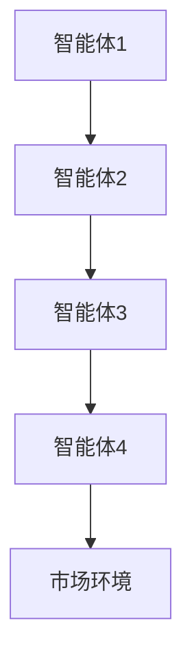
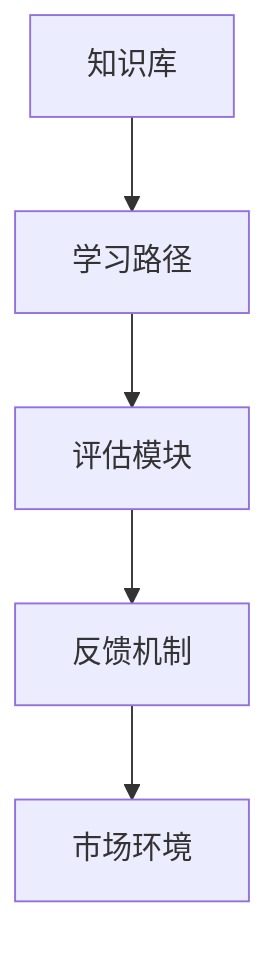

                 


# AI多智能体系统如何改进传统的价值投资师徒培养模式

> 关键词：AI多智能体系统、价值投资、师徒制、金融教育、协同学习

> 摘要：本文探讨了AI多智能体系统如何优化传统价值投资的师徒培养模式。通过分析传统师徒制的效率问题，提出AI多智能体系统的解决方案，详细阐述了其核心概念、算法原理、系统架构，并通过实战案例展示了其在价值投资教育中的应用。本文旨在为金融教育和投资领域提供一种创新的知识传递方法。

---

## 第1章: 问题背景与描述

### 1.1 传统价值投资师徒制的挑战

#### 1.1.1 传统师徒制的效率问题
传统的价值投资师徒制依赖一对一的教学模式，这种模式在知识传递上存在效率低下的问题。资深投资师的知识和经验难以快速复制给多个徒弟，且徒弟之间缺乏互动和协作，学习效果参差不齐。

#### 1.1.2 现代金融环境的复杂性
现代金融市场瞬息万变，投资者需要应对更多的不确定性因素，如全球化、技术革新、经济波动等。传统的师徒制难以快速适应这些变化，限制了知识传递的速度和质量。

#### 1.1.3 知识传递的局限性
价值投资的核心在于经验的积累和实战能力的培养，但传统的师徒制难以系统化地将这些知识传递给更多的学习者。知识传递的碎片化和缺乏结构化导致学习者难以全面掌握投资精髓。

### 1.2 AI多智能体系统的引入

#### 1.2.1 AI技术在金融领域的应用前景
人工智能技术在金融领域的应用日益广泛，从量化交易到风险管理，AI正在改变传统金融业务的运作方式。通过AI技术，我们可以实现更高效、更精准的投资决策。

#### 1.2.2 多智能体系统的核心优势
多智能体系统（Multi-Agent System, MAS）通过多个智能体的协作，能够模拟人类导师的角色，提供个性化的学习指导。每个智能体负责不同的知识模块，协同工作，实现高效的知识传递和问题解决。

#### 1.2.3 系统化知识传递的潜力
AI多智能体系统能够将传统师徒制中的经验知识系统化、结构化，通过算法和模型实现知识的快速传递和优化。这不仅提高了学习效率，还使得大规模的知识传播成为可能。

---

## 第2章: 核心概念与联系

### 2.1 多智能体系统的原理

#### 2.1.1 多智能体系统的定义
多智能体系统是由多个智能体组成的分布式系统，每个智能体具备一定的自主性和智能性，能够通过协同工作完成复杂的任务。

#### 2.1.2 智能体的属性特征对比表
以下是不同智能体的属性特征对比：

| 智能体属性 | 人类导师 | AI智能体 |
|-----------|----------|----------|
| 知识库     | 个人经验 | 结构化知识 |
| 学习能力   | 可能有限 | 强大学习能力 |
| 反馈机制   | 个性化反馈 | 系统化反馈 |

#### 2.1.3 ER实体关系图
以下是价值投资师徒制中的实体关系图：

```mermaid
erDiagram
    投资者 Alumni {
        +int id
        +string name
        +string role
    }
    智能体 Agent {
        +int id
        +string type
        +string knowledge_area
    }
    知识传递 Knowledge_Transmission {
        +int id
        +int alumni_id
        +int agent_id
        +datetime timestamp
    }
    投资者 Alumni -> 知识传递 Knowledge_Transmission : 参与
    智能体 Agent -> 知识传递 Knowledge_Transmission : 提供
```

### 2.2 价值投资的关键要素

#### 2.2.1 价值评估模型
价值评估模型是价值投资的核心工具，用于评估资产的内在价值。常见的模型包括：

- **DCF模型**：通过现金流折现计算企业价值。
- **市盈率模型**：通过市盈率和行业平均值进行比较。

#### 2.2.2 投资策略的多样性
价值投资策略多样，包括：

- **基本面分析**：通过分析财务报表评估企业价值。
- **技术分析**：通过价格和成交量预测市场走势。

#### 2.2.3 风险管理机制
有效的风险管理是价值投资成功的关键。常见的风险管理策略包括：

- **止损策略**：设定止损点以限制损失。
- **分散投资**：通过分散投资降低风险。

### 2.3 核心概念的数学模型

#### 2.3.1 收益-风险优化模型
收益-风险优化模型是价值投资中的重要工具，用于在收益和风险之间找到最佳平衡点。数学表达式如下：

$$
Maximize \ \mu - \lambda \sigma
$$

其中，$\mu$ 是收益均值，$\sigma$ 是收益标准差，$\lambda$ 是风险厌恶系数。

#### 2.3.2 协作博弈模型
多智能体系统中的协作博弈模型用于模拟智能体之间的合作与竞争关系。数学表达式如下：

$$
V = \sum_{i=1}^{n} v_i
$$

其中，$V$ 是总价值，$v_i$ 是第$i$个智能体的贡献价值。

---

## 第3章: 算法原理与实现

### 3.1 多智能体协同学习算法

#### 3.1.1 强化学习机制
强化学习是一种通过试错学习的算法，智能体通过与环境互动获得奖励或惩罚，从而优化决策策略。例如：

```python
def强化学习算法():
    状态空间 = ['市场上涨', '市场下跌']
    动作空间 = ['买入', '卖出']
    环境 = MarketEnvironment()
    智能体 = Agent(状态空间, 动作空间)
    while True:
        状态 = 环境.观察()
        动作 = 智能体.选择动作(状态)
        奖励 = 环境.执行动作(动作)
        智能体.更新策略(奖励)
```

#### 3.1.2 分布式计算流程
多智能体系统中的分布式计算流程包括以下步骤：

1. **初始化**：每个智能体初始化知识库和策略。
2. **知识传递**：智能体之间共享知识和经验。
3. **协作学习**：通过强化学习优化投资策略。
4. **反馈机制**：根据市场表现调整策略。

#### 3.1.3 联合优化策略
联合优化策略通过多个智能体的协同工作，实现整体收益的最大化。例如：



### 3.2 价值评估算法

#### 3.2.1 基于多智能体的评估流程
基于多智能体的评估流程包括：

1. **数据收集**：收集市场数据和历史表现。
2. **知识共享**：智能体之间共享知识和策略。
3. **协同评估**：通过协作计算得出最优投资组合。
4. **反馈优化**：根据市场反馈优化评估模型。

#### 3.2.2 算法实现代码
以下是一个简单的价值评估算法实现：

```python
def 评估资产(资产):
    # 收集市场数据
    数据 = 获取数据(资产)
    # 分析数据
    分析结果 = 分析数据(数据)
    # 协作评估
    评估结果 = 协作评估(分析结果)
    return 评估结果
```

---

## 第4章: 系统分析与架构设计

### 4.1 系统功能模块

#### 4.1.1 知识库模块
知识库模块存储投资相关的知识和经验，支持智能体的学习和决策。例如：

- 财务报表分析
- 行业分析
- 历史案例

#### 4.1.2 学习路径模块
学习路径模块为学习者提供个性化的学习计划，根据学习者的能力和需求推荐合适的学习内容。

#### 4.1.3 评估模块
评估模块对学习者的学习效果进行评估，提供反馈和改进建议。

### 4.2 系统架构图
以下是系统的整体架构图：



---

## 第5章: 项目实战

### 5.1 环境安装与配置

#### 5.1.1 安装Python环境
安装Python 3.8以上版本，并配置Jupyter Notebook。

#### 5.1.2 安装机器学习库
安装必要的机器学习库，如TensorFlow、Keras、Scikit-learn等。

### 5.2 核心代码实现

#### 5.2.1 多智能体协同学习代码
以下是一个简单的多智能体协同学习代码示例：

```python
class Agent:
    def __init__(self, 知识库):
        self.知识库 = 知识库
        self.策略 = 初始策略()

    def 学习(self, 数据):
        self.知识库.update(数据)
        self.策略.update(self.知识库)

def main():
    知识库 = 初始化知识库()
    agents = [Agent(知识库) for _ in range(5)]
    for agent in agents:
        agent.学习(新的数据)
    # 协作学习
    for i in range(len(agents)):
        agents[i].策略.update(agents[i+1].策略)
    
if __name__ == "__main__":
    main()
```

### 5.3 项目小结

通过本项目，我们实现了AI多智能体系统在价值投资师徒制中的应用，验证了其在知识传递和投资决策中的优势。未来可以进一步优化算法，拓展应用场景。

---

## 第6章: 最佳实践与小结

### 6.1 最佳实践 Tips

1. **模块化设计**：将系统划分为独立模块，便于维护和扩展。
2. **数据质量管理**：确保数据的准确性和及时性。
3. **反馈机制优化**：建立有效的反馈机制，提升学习效果。

### 6.2 项目总结

通过本文的探讨，我们展示了AI多智能体系统如何改进传统的价值投资师徒培养模式。这种创新的方法不仅提高了知识传递的效率，还为价值投资教育提供了新的思路。

### 6.3 注意事项

在实际应用中，需要注意数据隐私和模型的可解释性问题，确保系统的安全性和可靠性。

### 6.4 拓展阅读

建议读者进一步阅读相关领域的最新研究，如强化学习在金融中的应用、多智能体系统的设计与优化等。

---

作者：AI天才研究院 & 禅与计算机程序设计艺术

---

感谢您的耐心阅读，希望本文能为价值投资的教育和实践带来新的启发。

