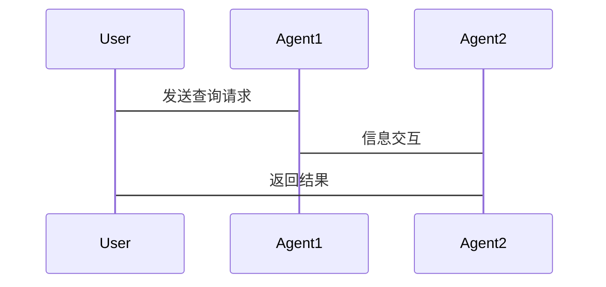

                 


# AI多智能体系统如何改进传统的价值投资师徒培养模式

> 关键词：AI多智能体系统，价值投资，师徒培养模式，知识传递，智能体协作

> 摘要：本文探讨了AI多智能体系统在价值投资师徒培养模式中的应用，分析了传统模式的局限性，并详细阐述了多智能体系统的核心原理、数学模型、系统架构以及实际应用案例。通过系统分析与实战演示，展示了AI多智能体系统如何提升投资教育的效率与效果。

---

## 第1章: 背景介绍

### 1.1 传统价值投资师徒培养模式的现状与问题

#### 1.1.1 传统价值投资的定义与特点
价值投资是一种以基本面分析为基础的投资策略，强调长期持有优质资产，通过深入研究公司基本面（如财务状况、行业地位、管理团队等）来寻找被市场低估的投资机会。传统价值投资的师徒培养模式通常依赖于一对一的传授，师父通过经验分享和案例分析，向徒弟传授投资理念、方法和技巧。

#### 1.1.2 师徒制在投资培养中的优势与局限性
- **优势**：师徒制能够通过个性化指导，帮助徒弟快速掌握投资的核心理念和实战经验。
- **局限性**：
  1. **效率低下**：一对一的传授模式难以实现知识的快速复制和大规模传播。
  2. **知识传递不系统**：师父的经验和知识可能存在断层，难以形成完整的知识体系。
  3. **难以量化与优化**：传统的师徒制缺乏数据支持，难以对学习效果进行量化评估和持续优化。

#### 1.1.3 当前传统模式面临的挑战
随着金融市场的复杂化和投资者需求的多样化，传统师徒制在知识传递效率、系统性和可扩展性方面逐渐暴露出不足。如何利用现代技术手段，提升价值投资教育的效率与效果，成为亟待解决的问题。

---

### 1.2 AI多智能体系统的核心概念

#### 1.2.1 多智能体系统的定义与特点
多智能体系统（Multi-Agent System, MAS）是由多个智能体（Agent）组成的分布式系统，这些智能体能够通过协作完成复杂的任务。智能体具有以下特点：
- **自主性**：智能体能够独立决策。
- **反应性**：能够感知环境并做出实时反应。
- **协作性**：智能体之间可以协同工作，完成共同目标。

#### 1.2.2 AI在投资领域的应用现状
AI技术在投资领域的应用日益广泛，包括量化交易、风险评估、市场预测等领域。然而，传统的AI应用通常基于单点智能体，难以实现多智能体之间的高效协作。

#### 1.2.3 多智能体系统在投资中的优势
多智能体系统能够模拟多个投资者的行为，通过协作完成复杂的投资决策。例如：
- **信息共享**：多个智能体可以共享市场数据和分析结果。
- **决策优化**：通过智能体之间的协作，可以实现更优的投资决策。
- **模拟真实市场环境**：多智能体系统可以模拟真实市场中的复杂互动，为投资者提供更贴近实际的训练环境。

---

### 1.3 多智能体系统与价值投资的结合

#### 1.3.1 多智能体系统在投资决策中的作用
通过多智能体系统，投资者可以模拟不同市场条件下的投资决策，帮助新手投资者快速掌握投资技巧。例如：
- 智能体可以模拟不同风格的投资者（如价值投资者、成长投资者等），帮助新手理解不同策略的特点。
- 智能体之间的互动可以模拟市场波动，帮助投资者理解市场动态。

#### 1.3.2 价值投资中的知识传递与经验复制
传统的师徒制依赖于经验的个人传授，而多智能体系统可以通过知识库和协作机制，实现知识的系统化传递。例如：
- 知识库可以存储价值投资的核心理念、经典案例和分析方法。
- 智能体可以通过协作，将师父的经验转化为可复制的知识模块，供徒弟学习和实践。

#### 1.3.3 AI多智能体系统对传统师徒制的改进
AI多智能体系统可以弥补传统师徒制的不足，通过以下方式：
- **提升知识传递效率**：通过系统化的知识库和智能体协作，实现知识的快速复制和传播。
- **增强实践能力**：通过模拟真实市场环境，帮助徒弟积累实践经验。
- **个性化学习**：根据徒弟的学习进度和特点，提供个性化的学习建议和训练计划。

---

## 第2章: 多智能体系统的核心原理与数学模型

### 2.1 多智能体系统的原理与机制

#### 2.1.1 实体关系图（ER图）展示多智能体系统的核心要素
```mermaid
entity User {
  id: int
  name: string
  role: string
}
entity Agent {
  id: int
  type: string
  knowledge: string
}
entity Interaction {
  id: int
  user_id: int
  agent_id: int
  timestamp: datetime
}
```

#### 2.1.2 智能体之间的信息传递流程


### 2.2 多智能体系统的数学模型与算法

#### 2.2.1 基于强化学习的智能体协作模型
$$ V(s) = \max_{a} [ r(s,a) + \gamma V(s') ] $$
其中：
- \( V(s) \) 表示状态 \( s \) 的价值函数。
- \( r(s,a) \) 表示在状态 \( s \) 下采取动作 \( a \) 的奖励。
- \( \gamma \) 表示折扣因子。
- \( s' \) 表示下一状态。

#### 2.2.2 博弈论视角下的智能体决策模型
$$ \text{纳什均衡} \text{：} \forall i, u_i(a_i, a_{-i}) \geq u_i(a_i', a_{-i}) $$
其中：
- \( u_i(a_i, a_{-i}) \) 表示第 \( i \) 个智能体在其他智能体采取策略 \( a_{-i} \) 时，采取策略 \( a_i \) 的效用。

---

## 第3章: 价值投资中的知识传递与经验复制

### 3.1 传统师徒制的知识传递模式

#### 3.1.1 知识传递的路径与特点
传统师徒制的知识传递通常依赖于师父的个人经验，知识传递的路径较为单一，难以形成系统化的知识体系。

### 3.2 AI多智能体系统在知识传递中的应用

#### 3.2.1 知识库的构建与管理
通过多智能体系统，可以构建一个包含价值投资核心理念、经典案例和分析方法的知识库。知识库可以通过自然语言处理技术，对海量投资文献进行自动分类和整理。

#### 3.2.2 智能体之间的知识共享机制
智能体可以通过协作，将知识库中的内容转化为可执行的策略。例如：
- 智能体可以根据不同的市场环境，自动调整投资策略。
- 智能体之间可以共享实时市场数据和分析结果，帮助新手投资者快速掌握市场动态。

#### 3.2.3 知识传递的效率提升
通过多智能体系统的知识共享机制，可以实现知识的快速复制和传播。例如：
- 知识库可以存储师父的宝贵经验，供徒弟随时查阅和学习。
- 智能体可以通过协作，将知识库中的内容转化为个性化的学习计划，帮助徒弟高效学习。

### 3.3 多智能体系统在经验复制中的优势

#### 3.3.1 模拟真实市场环境
通过多智能体系统的模拟，可以为徒弟提供一个接近真实市场的训练环境。例如：
- 智能体可以模拟不同风格的投资者，帮助徒弟理解不同策略的特点。
- 智能体之间的互动可以模拟市场波动，帮助徒弟理解市场动态。

#### 3.3.2 提供个性化学习建议
通过分析徒弟的学习进度和特点，智能体可以提供个性化的学习建议。例如：
- 根据徒弟的学习情况，智能体可以推荐适合的学习材料和训练计划。
- 智能体可以通过实时反馈，帮助徒弟快速纠正错误。

---

## 第4章: 项目实战与系统实现

### 4.1 系统安装与环境配置

#### 4.1.1 安装Python环境
```bash
# 安装Python和pip
python --version
pip install --upgrade pip
```

#### 4.1.2 安装依赖库
```bash
pip install numpy pandas scikit-learn matplotlib
```

### 4.2 系统核心代码实现

#### 4.2.1 知识库构建
```python
import pandas as pd
from sklearn.feature_extraction.text import TfidfVectorizer

# 加载投资文献
literature = pd.read_csv('investment_literature.csv')

# 构建知识库
vectorizer = TfidfVectorizer()
tfidf_matrix = vectorizer.fit_transform(literature['content'])
```

#### 4.2.2 智能体协作
```python
from sklearn.cluster import KMeans

# 初始化智能体
class Agent:
    def __init__(self, knowledge_base):
        self.knowledge_base = knowledge_base
        self.strategy = 'value_investing'

# 智能体协作
agents = [Agent(tfidf_matrix) for _ in range(5)]
strategies = [agent.strategy for agent in agents]
from collections import Counter
most_common_strategy = Counter(strategies).most_common(1)[0][0]
```

#### 4.2.3 投资策略模拟
```python
import numpy as np

# 模拟市场数据
market_data = np.random.rand(100, 5)

# 智能体协作决策
def decide_strategy(agent_strategies):
    return 'value_investing' if 'value_investing' in agent_strategies else 'growth_investing'

decision = decide_strategy(strategies)
```

### 4.3 实际案例分析

#### 4.3.1 案例背景
假设我们希望训练一名新手投资者，掌握价值投资的核心理念。通过多智能体系统的知识库和协作机制，我们可以为新手提供个性化的学习计划和实践机会。

#### 4.3.2 系统实现
```python
# 根据学习进度推荐学习材料
def recommend_materials(progress):
    if progress < 30:
        return '基础投资理论'
    elif 30 <= progress < 70:
        return '价值投资经典案例'
    else:
        return '高级投资策略'

# 实际案例分析
progress = 40
recommend_materials(progress)  # 输出：'价值投资经典案例'
```

---

## 第5章: 总结与展望

### 5.1 本章小结
通过本文的分析与实践，我们展示了AI多智能体系统如何改进传统的价值投资师徒培养模式。多智能体系统通过知识共享、协作决策和模拟市场环境，能够显著提升投资教育的效率与效果。

### 5.2 未来展望
未来，随着AI技术的不断发展，多智能体系统在价值投资中的应用将更加广泛和深入。例如：
- **更智能的知识传递**：通过自然语言处理和机器学习技术，实现更智能的知识传递。
- **更复杂的市场模拟**：通过强化学习和博弈论，模拟更复杂的市场环境。
- **更个性化的学习体验**：通过用户行为分析，提供更个性化的学习建议和训练计划。

---

## 作者：AI天才研究院 & 禅与计算机程序设计艺术

---

通过本文的系统分析与实战演示，我们展示了AI多智能体系统如何改进传统的价值投资师徒培养模式。希望本文能够为投资教育的未来发展提供新的思路和方向。

