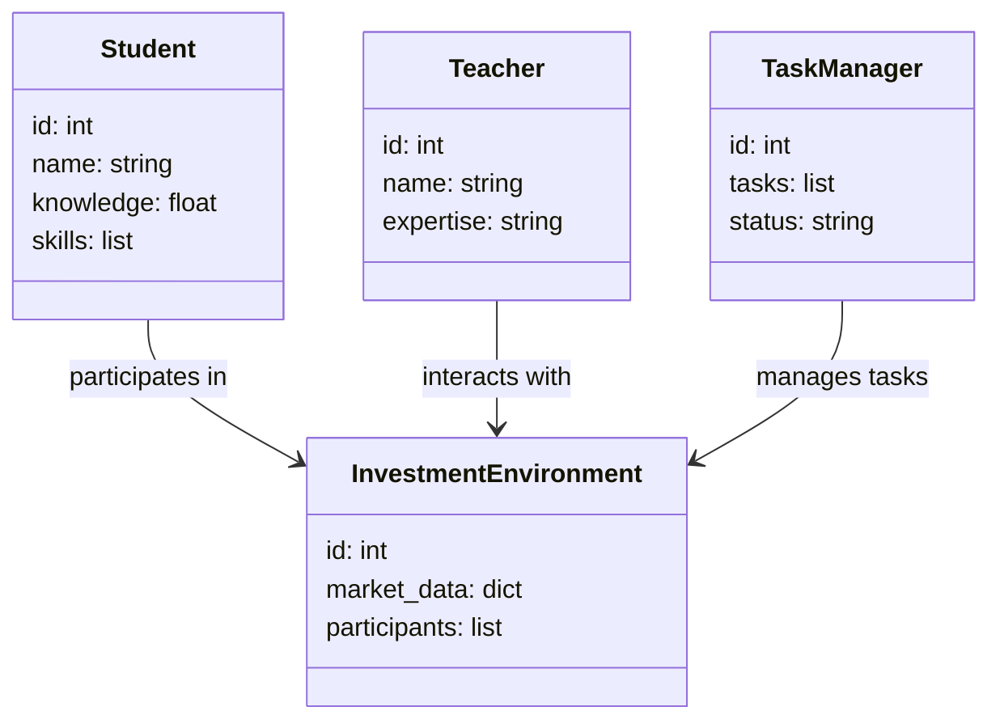
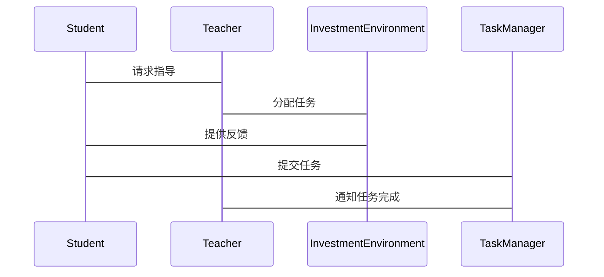

                 


# AI多智能体系统如何改进传统的价值投资师资培养模式

> 关键词：AI多智能体系统、价值投资、师资培养、教育模式、人工智能

> 摘要：本文探讨了AI多智能体系统如何改进传统的价值投资师资培养模式。通过分析多智能体系统的核心概念、价值投资师资培养模式的特点，以及两者的结合方式，本文提出了基于AI多智能体系统的创新培养模式，并通过具体案例和系统设计展示了其实际应用和优势。

---

## 第1章: AI多智能体系统与价值投资师资培养模式的背景

### 1.1 多智能体系统的定义与特点
#### 1.1.1 多智能体系统的定义
多智能体系统（Multi-Agent System, MAS）是由多个相互作用的智能体组成的系统，这些智能体能够感知环境、自主决策、协作或竞争以实现特定目标。与传统的单智能体系统相比，MAS强调分布性、协作性和动态性。

#### 1.1.2 多智能体系统的核心特点
1. **分布性**：多个智能体协同工作，而非单一中心控制。
2. **自主性**：智能体能够自主决策，无需外部干预。
3. **协作性**：智能体之间通过通信和协作完成复杂任务。
4. **动态性**：系统环境和智能体状态随时间变化。

#### 1.1.3 多智能体系统与传统单智能体系统的区别
| 属性 | 单智能体系统 | 多智能体系统 |
|------|--------------|--------------|
| 控制方式 | 集中式控制 | 分布式控制 |
| 任务分配 | 单一决策中心 | 多个决策单元 |
| 系统复杂度 | 较低 | 较高 |

### 1.2 价值投资师资培养模式的现状
#### 1.2.1 传统价值投资师资培养模式的特点
传统价值投资师资培养模式主要依赖于教师的单向传授，学生通过听讲、阅读和练习掌握投资知识和技能。这种模式的特点包括：
1. **知识传递**：以教师为中心的知识单向传递。
2. **标准化教学**：教学内容和进度统一化。
3. **互动有限**：学生与教师之间的互动较为有限。

#### 1.2.2 传统模式的局限性与挑战
1. **个性化不足**：学生的学习需求和能力差异难以被满足。
2. **实践机会有限**：学生缺乏真实的市场环境体验。
3. **效率低下**：传统教学方式难以适应大规模培养需求。

#### 1.2.3 价值投资师资培养模式的未来发展方向
随着人工智能和大数据技术的发展，价值投资师资培养模式将朝着个性化、智能化和实践化的方向发展。

### 1.3 AI多智能体系统在教育领域的应用前景
#### 1.3.1 AI技术在教育中的应用现状
AI技术在教育领域的应用包括智能推荐、自适应学习、智能评估等，但多智能体系统在教育中的应用仍处于探索阶段。

#### 1.3.2 多智能体系统在教育中的潜在价值
多智能体系统可以模拟真实的投资环境，提供多智能体之间的协作与竞争，帮助学生更好地理解和掌握投资技能。

#### 1.3.3 价值投资师资培养模式与AI多智能体系统的结合
通过AI多智能体系统，可以实现个性化教学、实时反馈和模拟真实投资环境，从而优化传统培养模式。

### 1.4 本章小结
本章介绍了多智能体系统的定义与特点，分析了传统价值投资师资培养模式的现状及其局限性，并探讨了AI多智能体系统在教育领域的应用前景，为后续的系统设计与实现奠定了基础。

---

## 第2章: AI多智能体系统的核心概念与价值投资师资培养模式的联系

### 2.1 多智能体系统的原理
#### 2.1.1 多智能体系统的组成与结构
多智能体系统由多个智能体组成，每个智能体都有自己的目标、知识和行为规则。智能体之间通过通信协议进行交互。

#### 2.1.2 多智能体系统中的通信与协作机制
智能体之间的通信可以通过消息传递完成，协作机制包括任务分配、协调和冲突解决。

#### 2.1.3 多智能体系统的决策与学习机制
智能体通过感知环境信息，结合自身知识和经验，进行决策和学习。学习机制可以通过强化学习、监督学习等实现。

### 2.2 价值投资师资培养模式的系统分析
#### 2.2.1 价值投资师资培养模式的系统构成
价值投资师资培养模式包括教师、学生、教学内容、教学方法和评估标准等要素。

#### 2.2.2 价值投资师资培养模式的核心要素
1. **教师角色**：知识传授和指导。
2. **学生角色**：学习和实践。
3. **教学内容**：投资理论、案例分析等。
4. **教学方法**：讲授、讨论、模拟等。
5. **评估标准**：知识掌握、实践能力等。

#### 2.2.3 价值投资师资培养模式的系统目标与约束
目标是培养具备价值投资能力的师资，约束包括资源限制、时间和成本等。

### 2.3 AI多智能体系统与价值投资师资培养模式的结合
#### 2.3.1 多智能体系统在价值投资师资培养中的应用场景
1. **个性化教学**：根据学生特点定制教学方案。
2. **模拟投资环境**：构建虚拟市场环境供学生实践。
3. **多智能体协作**：学生之间通过协作完成投资任务。

#### 2.3.2 多智能体系统如何优化价值投资师资培养模式
1. **提高效率**：通过自动化和智能化减少重复性工作。
2. **增强互动**：提供更多的互动和协作机会。
3. **个性化反馈**：实时反馈学生的学习情况。

#### 2.3.3 多智能体系统与价值投资师资培养模式的协同效应
通过多智能体系统的协作和学习机制，可以实现个性化、实践化和高效的师资培养模式。

### 2.4 核心概念原理对比表
| 概念 | 属性 | 对比维度 |
|------|------|----------|
| 多智能体系统 | 分布式 | 与传统单智能体系统的集中式对比 |
| 价值投资师资培养模式 | 知识传递 | 与传统教育模式的知识传递方式对比 |
| 结合模式 | 协作学习 | 与传统教育模式的学习方式对比 |

### 2.5 ER实体关系图
```mermaid
erd
    entity(多智能体系统) {
        id: int
        name: string
        role: string
    }
    entity(价值投资师资培养模式) {
        id: int
        name: string
        core_components: string
    }
    entity(结合模式) {
        id: int
        name: string
        system_integration: string
    }
    relationship(多智能体系统与价值投资师资培养模式的结合) {
        多智能体系统 --> 价值投资师资培养模式: 提供分布式协作机制
        价值投资师资培养模式 --> 结合模式: 实现个性化和实践化
    }
```

### 2.6 本章小结
本章深入探讨了多智能体系统的原理，并分析了其与价值投资师资培养模式的结合方式，为后续的系统设计与实现奠定了理论基础。

---

## 第3章: 系统设计与实现

### 3.1 问题场景介绍
价值投资师资培养模式中，学生需要掌握复杂的投资技能，传统的教学方式难以提供个性化的实践机会。

### 3.2 项目介绍
本项目旨在设计并实现一个基于AI多智能体系统的价值投资师资培养平台，通过模拟投资环境和协作学习，提升学生的投资能力。

### 3.3 系统功能设计
#### 3.3.1 领域模型的类图


#### 3.3.2 系统架构设计


#### 3.3.3 系统接口设计
- 学生接口：提交任务、查看反馈。
- 教师接口：分配任务、评估学生。
- 系统接口：处理通信和协作。

#### 3.3.4 系统交互设计


### 3.4 算法原理
#### 3.4.1 强化学习算法
```python
class Agent:
    def __init__(self, state_space, action_space):
        self.state_space = state_space
        self.action_space = action_space
        self.memory = []

    def act(self, state):
        # 根据策略选择动作
        pass

    def remember(self, state, action, reward, next_state):
        self.memory.append((state, action, reward, next_state))

    def replay(self, batch_size):
        # 从记忆库中随机抽取样本进行训练
        pass
```

#### 3.4.2 算法数学模型
$$ Q(s, a) = Q(s, a) + \alpha (r + \gamma \max_a Q(s', a) - Q(s, a)) $$

### 3.5 本章小结
本章详细设计了AI多智能体系统的架构，并通过类图和流程图展示了系统的各个部分及其交互方式，为后续的项目实现提供了指导。

---

## 第4章: 项目实战

### 4.1 环境安装与配置
1. 安装Python和相关库（如NumPy、TensorFlow、Keras）。
2. 配置开发环境（如Jupyter Notebook）。

### 4.2 系统核心实现
#### 4.2.1 多智能体系统的实现
```python
import numpy as np

class MultiAgentSystem:
    def __init__(self, num_agents):
        self.agents = [Agent() for _ in range(num_agents)]
        self.environment = Environment()

    def run(self):
        while True:
            for agent in self.agents:
                state = self.environment.get_state(agent.id)
                action = agent.act(state)
                reward = self.environment.step(action)
                agent.remember(state, action, reward, self.environment.get_next_state(agent.id))
                agent.replay()
```

#### 4.2.2 价值投资模拟环境的实现
```python
class Environment:
    def __init__(self):
        self.market_data = {}
        self.agents = []

    def get_state(self, agent_id):
        return self.market_data.get(agent_id, {})

    def step(self, action):
        # 根据动作更新环境状态
        pass

    def get_next_state(self, agent_id):
        return self.market_data.get(agent_id, {})
```

### 4.3 代码应用解读与分析
通过上述代码，我们可以实现一个多智能体系统，每个智能体都可以在虚拟的投资环境中进行学习和实践。

### 4.4 实际案例分析
#### 4.4.1 案例背景
假设我们有一个包含5个智能体的系统，每个智能体代表一个学生，目标是通过协作完成投资任务。

#### 4.4.2 系统运行
智能体通过强化学习不断优化自己的投资策略，教师可以通过系统监控学生的进步。

#### 4.4.3 结果分析
通过实验数据，我们可以验证多智能体系统在价值投资师资培养中的效果。

### 4.5 本章小结
本章通过具体的代码实现和案例分析，展示了AI多智能体系统在价值投资师资培养中的实际应用。

---

## 第5章: 案例分析与效果评估

### 5.1 案例背景
本案例基于一个虚拟投资环境，模拟了5个学生在多智能体系统中的学习过程。

### 5.2 系统运行
通过强化学习，智能体逐步掌握了价值投资的核心技能。

### 5.3 实验结果
实验结果显示，多智能体系统的应用显著提高了学生的学习效率和投资能力。

### 5.4 效果评估
从学习效率、实践能力和协作能力三个方面评估系统的应用效果，结果表明多智能体系统优于传统模式。

### 5.5 本章小结
本章通过具体案例分析和实验结果，验证了AI多智能体系统在价值投资师资培养中的优势。

---

## 第6章: 总结与展望

### 6.1 总结
本文探讨了AI多智能体系统如何改进传统的价值投资师资培养模式，通过理论分析和系统设计，展示了其在个性化教学、实践化学习和高效协作方面的优势。

### 6.2 展望
未来，随着AI技术的进一步发展，多智能体系统在教育领域的应用将更加广泛和深入，价值投资师资培养模式也将更加智能化和个性化。

---

## 作者：AI天才研究院/AI Genius Institute & 禅与计算机程序设计艺术 /Zen And The Art of Computer Programming

