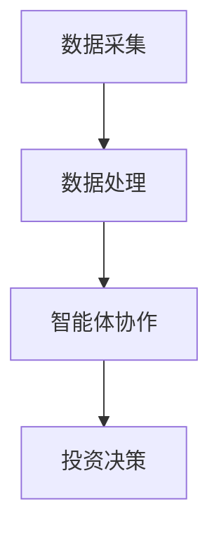

                 


# AI多智能体系统如何改进传统的价值投资筛选流程

## 关键词：AI多智能体系统，价值投资，投资筛选流程，分布式计算，协同学习，系统架构设计

## 摘要：传统的价值投资筛选流程依赖于人工分析，存在效率低、主观性强、难以快速响应市场变化等问题。AI多智能体系统通过分布式计算和协同学习，能够更高效地处理大量数据，提供更精准的投资建议。本文将详细探讨如何利用AI多智能体系统改进价值投资筛选流程，包括系统设计、算法原理、项目实战等内容，为投资领域提供新的解决方案。

---

# 第一部分：价值投资的传统筛选流程与挑战

## 第1章：价值投资的传统筛选流程

### 1.1 价值投资的基本概念

#### 1.1.1 价值投资的定义与核心理念
价值投资是一种投资策略，强调通过分析企业的基本面，如财务状况、行业地位、管理层质量等，寻找被市场低估的投资标的。其核心理念是“买入并持有”，追求长期稳定的收益。

#### 1.1.2 价值投资的主要方法与工具
传统的价值投资方法包括：
- **基本面分析**：分析企业的财务报表，如利润表、资产负债表、现金流量表等。
- **行业分析**：研究企业的行业地位、竞争优势、市场前景。
- **管理层分析**：评估管理层的能力和诚信。
- **估值指标**：使用市盈率（P/E）、市净率（P/B）、股息率等指标评估股票的价值。

#### 1.1.3 传统筛选流程的优缺点分析
- **优点**：注重长期价值，避免短期市场波动的影响。
- **缺点**：
  - **效率低下**：传统筛选流程依赖人工分析，效率较低。
  - **主观性强**：分析师的主观判断可能影响筛选结果。
  - **数据处理能力有限**：难以处理海量数据，难以快速响应市场变化。

### 1.2 传统筛选流程中的问题与挑战

#### 1.2.1 数据获取与处理的难点
- 数据来源多样，包括财务报表、行业报告、新闻等，数据清洗和整合难度大。
- 数据量大，处理复杂，人工分析难以高效完成。

#### 1.2.2 人工判断的主观性和不确定性
- 分析师的主观判断可能导致筛选结果偏差。
- 市场环境变化快，人工分析难以快速调整策略。

#### 1.2.3 传统筛选流程的效率瓶颈
- 传统筛选流程依赖人工操作，效率低，难以应对海量数据。
- 信息更新不及时，可能导致投资机会错失。

### 1.3 传统筛选流程的边界与外延

#### 1.3.1 价值投资的适用范围与限制
- 适用于长期投资，不适用于短期交易。
- 主要适用于对财务状况和行业趋势有深入了解的投资者。

#### 1.3.2 传统筛选流程的边界条件
- 数据来源有限，可能遗漏重要信息。
- 分析师的经验和能力直接影响筛选结果。

#### 1.3.3 传统与现代方法的结合点
- 传统筛选流程中的基本面分析是AI多智能体系统的基础。
- 结合AI技术，可以提高筛选流程的效率和准确性。

### 1.4 传统筛选流程的核心要素组成

#### 1.4.1 数据来源与处理
- 数据来源包括财务报表、行业报告、新闻等。
- 数据处理包括清洗、整合和分析。

#### 1.4.2 财务指标分析
- 利润表、资产负债表、现金流量表等财务指标的分析。
- 估值指标如市盈率、市净率的计算。

#### 1.4.3 行业分析与竞争地位评估
- 行业趋势分析。
- 竞争对手分析，评估企业的市场地位。

---

# 第二部分：AI多智能体系统的概念与核心原理

## 第2章：AI多智能体系统的概念与核心原理

### 2.1 AI多智能体系统的定义与特点

#### 2.1.1 多智能体系统的定义
多智能体系统是由多个智能体组成的系统，每个智能体都有自己的目标、知识和能力，能够通过协作完成复杂的任务。

#### 2.1.2 AI多智能体系统的独特优势
- **分布式计算**：多个智能体协同工作，提高计算效率。
- **协同学习**：智能体之间共享信息，提高学习效率。
- **容错性**：单个智能体故障不影响整个系统。

#### 2.1.3 多智能体系统与单智能体系统的区别
- **任务分配**：多智能体系统任务分配更灵活。
- **协作性**：多智能体系统通过协作完成任务，单智能体系统独立完成。
- **扩展性**：多智能体系统更容易扩展。

### 2.2 多智能体系统的核心原理

#### 2.2.1 分布式计算与协同学习
- 分布式计算：数据分布在多个节点上，每个节点处理部分数据。
- 协同学习：智能体之间共享信息，共同学习。

#### 2.2.2 智能体之间的通信与协作机制
- 通信机制：智能体之间通过消息传递进行通信。
- 协作机制：智能体根据任务分工协作，共同完成目标。

#### 2.2.3 多智能体系统的决策过程
- **分布式决策**：每个智能体根据自身信息做出决策。
- **协同决策**：智能体之间通过协作，综合各智能体的决策做出最终决策。

### 2.3 多智能体系统的数学模型与公式

#### 2.3.1 分布式计算模型
$$ \text{任务分配} = \argmin_{i} \text{负载}_i $$
其中，$\text{负载}_i$表示智能体$i$的负载。

#### 2.3.2 协同学习模型
$$ \text{更新规则} = \sum_{i=1}^{n} \text{智能体}_i.\text{更新} $$

---

# 第三部分：AI多智能体系统在价值投资中的应用

## 第3章：AI多智能体系统的应用设计

### 3.1 问题场景介绍

#### 3.1.1 价值投资筛选流程中的问题
- 数据量大，处理效率低。
- 分析师主观性强，筛选结果可能偏差。
- 市场变化快，筛选流程难以快速响应。

#### 3.1.2 引入AI多智能体系统的目标
- 提高筛选效率。
- 减少主观性，提高筛选结果的准确性。
- 快速响应市场变化。

### 3.2 系统功能设计

#### 3.2.1 功能模块划分
- 数据采集模块：负责收集财务数据、行业报告等。
- 数据处理模块：清洗和整合数据。
- 智能体协作模块：分配任务，协调智能体工作。
- 投资决策模块：根据智能体分析结果做出投资决策。

#### 3.2.2 系统架构设计
使用Mermaid图展示系统架构：



### 3.3 算法实现

#### 3.3.1 分布式计算实现
使用Python编写分布式计算代码：

```python
import multiprocessing

def process_data(data):
    # 数据处理逻辑
    return processed_data

if __name__ == '__main__':
    data = [...]  # 数据来源
    with multiprocessing.Pool() as pool:
        processed_data = pool.map(process_data, data)
        print(processed_data)
```

#### 3.3.2 协同学习实现
使用协同学习算法，如FedAvg：

```python
def fed_avg(global_model, local_models):
    # 全局模型更新
    new_model = {}
    for key in global_model.keys():
        total = 0
        for model in local_models:
            total += model[key]
        avg = total / len(local_models)
        new_model[key] = avg
    return new_model

global_model = fed_avg(global_model, local_models)
```

---

## 第4章：项目实战与优化

### 4.1 项目环境搭建

#### 4.1.1 环境需求
- Python 3.8+
- 必要的库：numpy、pandas、multiprocessing等。

### 4.2 系统核心实现

#### 4.2.1 数据采集模块实现
使用BeautifulSoup爬取新闻数据：

```python
from bs4 import BeautifulSoup
import requests

def fetch_data(url):
    response = requests.get(url)
    soup = BeautifulSoup(response.text, 'html.parser')
    # 提取数据
    return data

data = fetch_data('http://example.com/financialNews')
```

#### 4.2.2 数据处理模块实现
清洗数据并生成特征：

```python
import pandas as pd

data = pd.DataFrame(data)
data = data.dropna()
data['feature'] = data['value'].apply(lambda x: x * 2)
```

#### 4.2.3 智能体协作模块实现
任务分配与协作：

```python
import multiprocessing

def agent_task分配(data):
    # 分配任务逻辑
    return result

if __name__ == '__main__':
    data = [...]  # 数据来源
    with multiprocessing.Pool() as pool:
        results = pool.map(agent_task, data)
        print(results)
```

### 4.3 实际案例分析与解读

#### 4.3.1 案例介绍
分析某公司财务数据，判断其是否被低估。

#### 4.3.2 分析过程
智能体协同分析公司财务报表、行业趋势、管理层能力等。

### 4.4 系统优化与改进

#### 4.4.1 系统优化
- 提高数据处理速度。
- 优化智能体协作机制，减少通信延迟。

#### 4.4.2 系统小结
通过AI多智能体系统的应用，价值投资筛选流程的效率和准确性显著提高。

---

## 第五部分：总结与展望

### 5.1 总结
AI多智能体系统通过分布式计算和协同学习，显著提高了价值投资筛选流程的效率和准确性。

### 5.2 展望
未来，随着AI技术的不断发展，AI多智能体系统在投资领域的应用将更加广泛，筛选流程将更加智能化和自动化。

---

## 结语

通过本文的详细讲解，我们可以看到AI多智能体系统在改进传统价值投资筛选流程中的巨大潜力。通过分布式计算和协同学习，AI多智能体系统能够高效处理海量数据，提高筛选的准确性和效率，为投资者提供更优质的决策支持。

---

## 作者：AI天才研究院/AI Genius Institute & 禅与计算机程序设计艺术 /Zen And The Art of Computer Programming

---

感谢您的阅读！如您有任何问题或建议，请随时与我联系。

